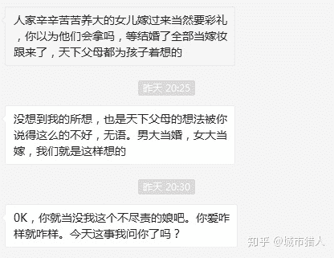
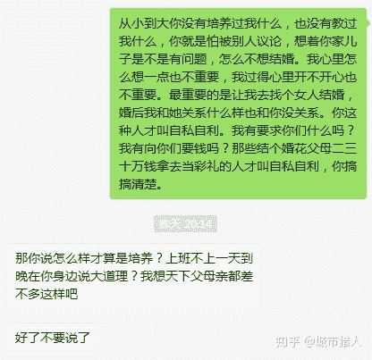
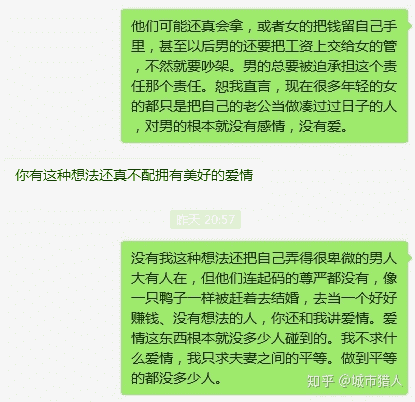

# 中国男方父母的结婚欲太强是目前两性局势的重要成因——一个案例

> 原文：<https://zhuanlan.zhihu.com/p/163126573>

<figure data-size="normal"></figure>

<figure data-size="normal"></figure>

<figure data-size="normal"></figure>

<figure data-size="normal"></figure>

————————————————————————————

以上是我的一位大学毕业两年的男性读者与他妈妈的聊天记录（他本人同意我发出来）。他毕业后没有向父母伸手要钱了，就是不大想结婚。但是他的妈妈觉得他不结婚的想法很不对、很没有担当。

**提醒一下，这位读者是今天给我发的私信，下面的文章是2018年写的。**

