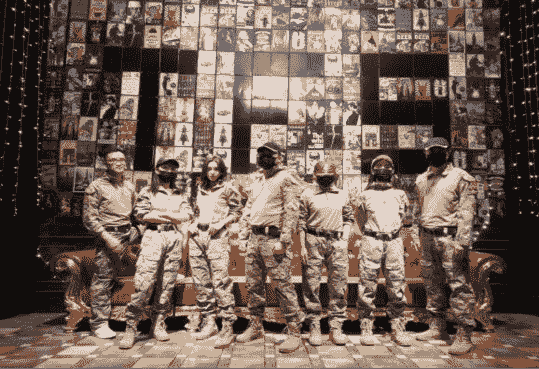
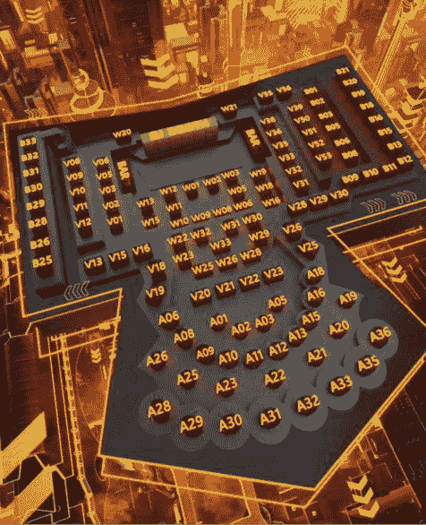
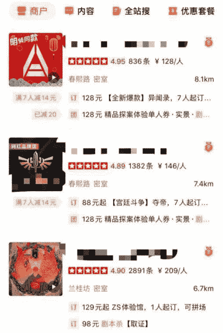
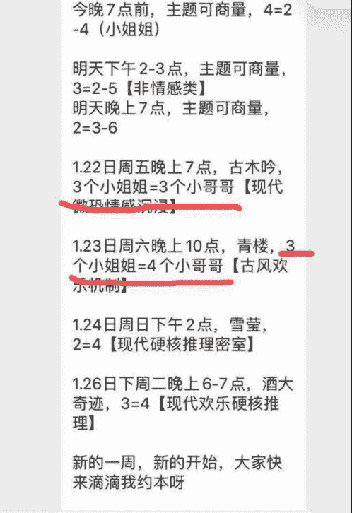
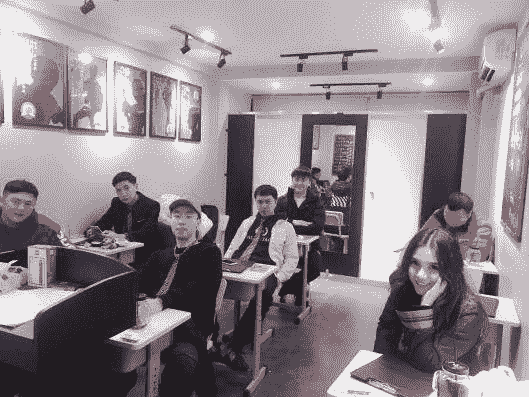

# 被抖音快手封禁后，我们如何撩妹？

> 作者：小宇恋爱联合创始人（饺子）

大家好， 我又回来了。

这一次回来的原因， 也是非常值得吹牛逼的一件事儿。

一位在某音负责审核的朋友突然发来信息说， 有件事情不方便打字说， 必须打电话， 然后告知了我一件非常搞笑的事。

据说在某音， 有一个名单发放给各个审核， 上面有各种网黑的头像， 都是**【危险人物】**， 看到就要马上处理掉。

很酷的是， 我的同学王环宇位列其中。

因此， 他无论拍什么， 即使是在上面找个沙发， 翘着二郎腿扭屁股， 这样的视频也发不出来。

某音和某手是一个非常有趣的地方， 我做的视频、 写的文章， 至少养活了五个以上的抄袭账号。

比较逗的是， 每天还有一大堆大号守在直播间， 等着抄我的直播内容去做视频。 有一段时间， 有个小傻逼， 每天守着我直播听， 我就是随口跟大家胡扯几句， 他一晚上能抄到一周的文案。

有的时候我会讲一下自己的情感经历， 然后这小傻逼原封不动的抄过去， 我非常不爽， 这种感觉就好像， 他和我的妹子爱的死去活来， 然后送了我一顶绿帽子。

魔幻的是， 现在他们都在上面做知名情感博主， 我的同学王环宇却被称为危险人物。

于是我就回来给大家写文章了。

经常有兄弟问我， **2021 年， 恋爱市场上有什么变化？**

我会陆续给大家写出来， 今天先说一个， 从 2019 年至今，谈恋爱性价比最高的活动， 不是夜店， 不是音乐节， 不是滑雪， 不是社交软件， 而是— — 剧本杀和密室。

男孩子出去玩， 无非就是想多认识几个好看妹子， 随着时代的变化， 曾经的娱乐活动都已经变味了， 比如说夜店蹦迪， 每周我大概都会去一个场子， 说说变化吧， 首先是越来越贵。

近三个月去了几次， 每个卡座人数大概十来人， 最后一结账， 消费好几万。如果是 AA 制， 人均差不多需要两千。

而且卡座上的体验特别不舒服， 有一次去了成都市中心一家较有名的夜店， 不点名了， 服务员鸡贼得很， 倒一版酒，没喝几杯， 就悄悄帮你全换完了， 结果就是， 没喝几口，一瓶酒就见底了。

还有几次， 我想着疫情刚结束， 夜店是不是得打个折， 发个信息给销售， 一来就是保底消费两万， 这让我感觉非常不舒适， 成都还算是二线城市， 人均工资五六千， 这个价格就是离谱。

其次是性质变了， 我们公司和一个夜店销售妹子关系很好，每次都是拜托她帮忙订位， 可以便宜不少， 重点来了： **这个妹子的销售绝招竟然是， 可以帮忙叫女孩子。**

每一次去蹦迪， 这个销售妹子， 都会陆续叫来好几个浓妆艳抹的女生， 这种销售叫发菜型销售， 要是客人需要妹子，她负责帮忙叫。

有一次她问我， 饺子哥， 你喜欢成熟一点的， 还是清纯一点的。虽然我觉得这是一种侮辱！

但抱着来都来了的心态， 我说， 我喜欢清纯的。

不一会儿， 她叫来三四个一看就涉世未深的女孩子， 一一介绍给我， 还非拉着这些女孩子， 坐在我身边， 又是敬酒，又是让我俩加微信互相认识。

那一瞬间， 夜店 DJ 放什么歌我已经没感觉了， 我仿佛看着自己的啤酒肚逐渐长大， 发际线逐渐后退， 终于活成了自己最讨厌的样子。

现在的夜店， 你一进去， 最显眼的几个貌美如花撑场面的，是安排的模特组， 旁边几桌蹦的最厉害的， 是安排的气氛组， 然后坐到卡座上， 销售问我， 要不要安排几个妹子，仿佛我就是个被安排的二百五。

## 夜店逐渐商务 KTV 化， 所以我不愿意去夜店了。

但是剧本杀和密室就不一样了， 密室大概人均两百多， 剧本杀就更便宜了， 很多地方， 人均还不到一百。

你可以设想一下， 每周抽两天时间， 约上自己心爱的姑娘，去玩一次剧本杀， 一晚上四五个小时， 也就花费两三百块钱而已。**每次结束后， 深夜带着姑娘轧马路， 找家火锅店小酌两杯， 我认为， 这才是正常男生的交友方式。**

曾经我在夜店里认识了很多朋友， 他们的生活方式很让人羡慕， 经常全国到处旅游， 比如这个冬天， 不是在三亚晒太阳， 就是在张家口滑雪。

过去我刷朋友圈的时候， 看到这些男男女女， 都有一个极大的困惑， 他们究竟是靠什么在养活自己。

后来知道了， 他们有的靠偏门生意， 有的靠行情， 有的靠编着谎话借钱， 有的靠把你当菜发来发去。

除开这些人， 毕竟你我都是上班下班偶尔还 996 的普通人，**二三十岁的年轻人， 一个月薪水能有多少？**

假设月薪一万， 每月能在约会上投入两千块， 已经是极限了。 两千块如果你拿去蹦迪， 一晚上 A 个卡就没了， 但是你拿去玩剧本杀密室， 每周都可以玩两次。

关键是剧本杀密室认识的女孩子， 质量不仅高， 数量还多。

我有个朋友叫罗宾， 外号叫成都发菜机器， 每次去夜店蹦迪， 他至少能叫上两打妹子， 他告诉我， 夜店最大的优势，就是你能很容易约来女孩子， 毕竟夜店就是个名利场。

但是他不知道的是， 这些爱在夜店玩的女孩子， 每天下午起床之后， 化了妆吃了外卖， 然后就开始找人约密室或者剧本杀， 很多时候， 我们认识的人， 是同一拨人， 但是人和人相处的模式， 是取决于你们在什么地方相遇。

## 如果是在夜店认识， 她可能把你当凯子， 但如果是在剧本杀认识， 你可能就是另一个圈子的正经人了。

经常有玩剧本杀的女孩子约我去夜店， 我都拒绝了， 每次我都这么说： 戒酒了， 不想大半夜的， 还在外面浪， 明天还上班搬砖呢。那一刻， 仿佛我浑身都闪耀着正道的光。

玩剧本杀， 认识女孩子的效率高多了。

每一场剧本杀， 大概是 6-10 个人不等， 如果是我负责组局的话， 我会叫女孩子带上闺蜜， 或者是我朋友也会叫女孩子， 一场玩下来， 差不多能新认识四五个女孩子。

剧本杀比较好的是， 这项活动很有心的安排了一个拍照环节， 大家会被主持人拉进同一个群， 此时此刻， 你连去问别人要微信的过程都省去了， 直接群里添加就好。

工作人员会把你拉入很多爱好者的群， 这些群里面， 又是一个大家方便互相认识的地方。

如果你玩社交软件， 滑一整天加几个苦瓜脸， 还经常遇到几个 P 得花里胡哨的女孩子， 资料里写， 不见面不约， 那你上这些软件是来做慈善的啊。

而 **在剧本杀密室的社群里， 你只需要稍稍表现得积极点，偶尔在群里发表下意见， 说说话， 一个小时能加三十个漂亮小姐姐。**

另外， 每天工作人员会在群里发拼场信息， 毕竟很多人社交圈太窄， 不好组局， 参加一些陌生人的局也特别有意思。

我有个女性好友， 曾经有一段时间， 非拉着我跟她一起去跟陌生人拼场， 刚开始， 我还以为她是剧本杀爱好者， 结果不到半个月， 就扒拉个帅哥谈起了恋爱， 我问， 你明明就冲着小哥哥去的， 为啥非拉着我？

她回答说： 要是自己一个人去， 显得多没行情啊， 你要去了， 不就是个很好的背景版吗。

这是个高手。

我表妹也是个高手， 她经常有喜欢的小哥哥， 然后就直接组队大家玩密室。 她跟我说， 如果是单独约出来吃饭， 像是送上门的， 太主动； 如果约 KTV 酒吧， 目的性又太强，而且显得自己不是很正经；

但是约密室就不一样了，**密室一般都会组 CP，一对一对的**，如果你组局的时候， 稍微动点心思， 约几对情侣， 剩下就你和小哥哥组一起， 局势不就明朗了吗？

来说说密室， 密室现在一般恐怖题材比较受欢迎， 市场上大多是这个。

## 把妹理论里有个著名的心理学效应， 叫吊桥效应。 意思大略是， 人会混淆自己的感受， 在惊险刺激的地方， 能同样感受到爱情的错觉。

有一次在玩密室的时候， 按照游戏规定， 为了躲避装成鬼的 NPC，我和心仪的妹子必须躲在一个狭小的衣柜里。那一瞬间， 我和她面对面贴着， 她紧张地在我耳边一直喘气，送分题啊！

这就好像是段誉和王语嫣掉进了同一口枯井， 杨过和小龙女在野外练起了玉女心经， 最后， 也不知道为什么， 妹子自然而然地投入了怀中。

我有个朋友叫 Sick， 我经常叫他陪我去玩密室， 他每次都去打酱油， 去的次数多了， 后来突然有一天他跟我说， 我表妹的闺蜜还可以， 两人已经谈起了恋爱。

我当时都要裂开了， 你啥时候撩的妹啊， 完全不露痕迹。

毕竟每一次密室活动结束， 已经是深夜了， Sick 都会很有绅士风度要送妹子回家， 也不知道是在哪一天晚上， 两人就在车里互诉衷肠了。

之前有兄弟问我， 约女生吃什么最适合谈恋爱， 我说吃小龙虾， 因为吃小龙虾的时候， 大家都没法玩手机， 行情俱无， 专心聊天。

玩密室的时候也一样， 大家的手机都被收起来， 只能专心体验游戏。

如果你带个心仪的妹子去玩， 整整两个小时， 你和她， 手牵手， 心连心。

之前看过一个研究， 人为什么在夜店会显得好看？ 是因为人在灯光昏暗的地方， 瞳孔会放大， 生理上都会认为这样

更有魅力。 所以， **约会的时候， 安排去昏暗的小酒吧， 或者看个电影， 两人的关系会更暧昧。**

可是在电影院的时候， 虽然两人坐在一起， 但是都各看各的， 毫无互动。 玩密室就不一样了， 全程互动交流， 在伸手不见五指的黑暗环境下， 一不小心就跟女孩子十指相扣了， 基本上一个女孩子愿意跟着你多玩几次密室， 这件事很容易就水到渠成了。

那么， 如何玩好剧本杀或密室？第一：学会邀约

我拿到的，通常都是这个剧本：

这段时间在忙啥呢？（通用开场白）

还那样啊。

最近迷上了密室。（描述自己的状态，开启话题）

好玩吗？

还行，改天一起。（模糊邀约）

好。

然后到了要玩的时候，提前一天，开始约人：明天晚上密室呗。

像是一个群发助手，又像是一个邀约机器人。

这么聊天，**进可攻退可守**，如果邀约成功，提前多聊聊最近的生活，拉拉家常，如果对方拒绝，也绅士的表示下次也可以，既显得有面子，也不影响双方关系。

如果对方答应了一起去玩，马上立刻跟一句，那我交定金了，人齐了千万别水哦，少一个人都不好玩。（把事情从模糊变确定）

第二：勇于表达

在玩剧本杀的时候，其实就是给大家一个表现的舞台。你永远要记得，你来玩的目的是什么？你的目的是找出凶手吗？你的目的是解密

吗？

你要是喜欢找凶手，这篇文章不用继续看下去了，赶紧回去看柯南，你的目的是泡妞。

所以，事实对错不重要，游戏环节不重要，你的目的是：如何在游戏过程中展现自己的魅力。

那么，你要珍惜每一次的发言机会，我见过很多男的玩这个游戏，羞于发言，全场透明，全场跟风。能引人注目的，永远是那个雄辩的人。

发言的时候，描述自己的角色，千万不要照着剧本介绍，非常无趣，一定要加入自己幽默的解读。

举个例子：

角色是一个有作风问题的领导，你就要说，我这个人物非常就厉害了，在座的女孩子，很多都跟我有说不清楚的关系，他应该是一个时间管理大师，你们哪个女孩子被我潜规则了，可以举下手。（某个女生举手）微笑道：品位还可以。

在讨论剧情的时候，千万不要随意怀疑人。你的目的不是找出凶手，而是在演讲过程中，展现你的幽默和逻辑能力，什么是逻辑能力，就是推理正确。

一般剧本杀里面，只有一个凶手，也就是说，你推理正确的概率是比较小的，胡乱指认，只会显示出你莽撞且愚蠢。

第三：做好雄性领袖

大家都知道，群体游戏中，雄性领袖都会占有巨大的优势。

比如说夜场局里面，为什么我的同学王环宇特别喜欢去参加，很简单，他到了这样的局里面，天然就是雄性领袖。

首先是员工，给他纷纷敬酒，毕竟老板来了，饭碗赶紧捧好；

然后是兄弟们，也纷纷给他敬酒，毕竟是浪哥。

你说这个局里面，女孩子怎么想？恒大许老板篮球赛，一场比赛怒砍五十分，然后他说自己篮球水平突破天际了。

但**在陌生的剧本杀局里，没人给你面子，你得自己去抢占雄性领袖的位子。你需要做两件事：**

1，第一轮发言非常重要，千万别略过，一定要侃侃而谈，说话的时候，沉稳幽默且坚定，需要一定的演技，所以选位子就特别重要了。经验是，千万不要选主持人旁边的位置，因为主持人一般都会说，那从你先开始发言吧，这样如果让你第一个发言，就很难给人留下深刻的印象，越往后，大家对你的印象越深，你拿雄性领袖就越容易，这和辩论赛，后发有优势是一个道理。

2，做归拢线索的人。每一局剧本杀，大家都会找到很多线索，普通的玩家都会采用大家各自念的方式。教大家一个小技巧：这个时候，

你只需要淡淡说一句，大家把搜索到的线索都给我吧，我来统一帮大家读一下。这个时候，你悄无声息的，就当上了雄性领袖。

第四：承担责任

这个主要是在玩密室的时候，你会遇到很多单线任务，千万千万不要怂，该去就要去，你一怂，就会大大减分，所以你如果胆子小，就不要去玩恐怖密室了，万一进去之后，还需要妹子照顾你，就比较尴尬了。

如果妹子拿到单线任务，不敢去怎么办，很多人会说，这是一个机会啊，替妹子去完成单线任务，这不是显得很牛逼吗？

大错特错了，你带女孩子来玩，说白了，就是带她来体验一些刺激的项目，刺激的项目都你自个儿体验了，你带她来干嘛？

此时此刻，你只需要耐心地鼓励她，然后在她完成任务之后，拍拍她头，然后疯狂拍彩虹屁，没想到你胆子这么大啊。

最后，**剧本杀密室把妹也不是适合所有人。比较适合口才出色，演技较好的朋友，需要你具备基本的当众说话的能力。**

如果你是白天约会的高手，你在这里能混的如鱼得水。当然如果你空有颜值，表达能力比较差的话，玩剧本杀，还不如去夜店刷脸。

如果你是抱着快速满分的想法来玩剧本杀，也不太合适，毕竟这是个兴趣交友的地方，和夜店那种名利场还不同，在夜店，大家都明白各取所需的道理，但如果是正常社交的地方，你的朋友圈充斥着高价值的照片，你出来全身大Logo，反而会引起别人的反感。

毕竟绝大多数人，是来娱乐的，而不是来比拼三六九等的。

夜店可能是一个靠着酒精和音乐上头的地方，但密室和剧本杀，绝对是需要优雅的谈吐和体面的举止的。

说白了，剧本杀也好，密室也好，夜店也好，街角的咖啡店也好，公司的茶水间也好，上下班的地铁上也好，隔壁的夜总会也好，只是一个让大家相识的地方。

但是如果谈起了恋爱，将来别人问，你们怎么认识的？

你说，我隔了两个卡座看到了她，她在灯光下喝醉的样子真美。也是一种生活。

可是我更喜欢她拿着剧本，一字一句读剧本的样子。那天夜里，一起走出商厦，已经是深冬了，寒风吹来，你拉着她的手放在了同一个衣兜里，不需要酒精或音乐。

倘若你爱上了一个人，连风都会变得温柔。

