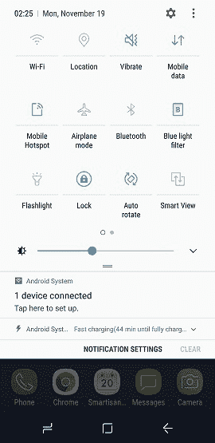
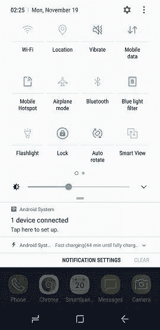
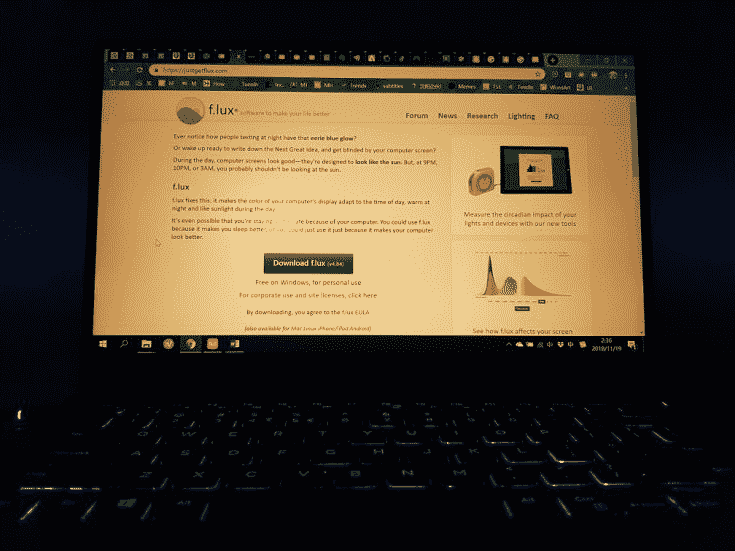

# 睡眠的重要性以及如何拥有更好的睡眠

> 原文：[https://piaohanshenghuo.com/sleep-matters/](https://piaohanshenghuo.com/sleep-matters/)

你有没有体会过因为睡眠不足，整个人整天像行尸走肉一样消沉、痛苦、无精打采，整个脑袋沉甸甸、隐隐作痛。我体会过很多次，这是我最讨厌的感觉之一。

如今，绝大多数人都缺乏睡眠。我们喝茶、咖啡、能量饮料来维持我们疲劳的、昏昏欲睡身体的“正常工作“。我们不想睡觉，因为我们不想浪费宝贵的时间。我们都希望活得更好，花更多的时间在我们认为有用的事情上。但我们忽略了最重要的事情之一——睡眠。

相信你有在社交媒体上看到一些成功人士如何熬夜、放弃睡眠的成功故事，一些文章大势鼓吹某某牛人每天只睡4个小时，他们没有告诉你这些缺乏睡眠的人所需承受的代价。

我们绝大多数人都忽略了睡眠的重要性。我们和所有的动物都需要做的三件事是**吃饭、性交和睡眠**，睡眠和吃饭和性交平起平坐，可见其重要性。睡眠是最重要的影响健康的因素之一，很多人花了很多时间精力在饮食和健身上，却忽略了睡眠。还在抱怨，明明自己努力健身，注意饮食，为什么不见效果。少了睡眠，我们很难增肌减脂。

我们的身体通过睡眠修复无数问题，增长肌肉，确保第二天的充足精力。

我来简单列举一下睡眠的好处（都有科学依据，这里就不写依据了）：

**降低压力。**

**有助好心情。**

**帮助减肥、增肌。**

**保持精神充沛、清醒。**

**提升工作效率，泡妞成功率。**

**提高毅力、免疫力、记忆力。**

**保持身体的整体健康，帮助身体进行自我修复。**

尤其是在你没有找到人生目标、不知道应该花大把的时间集中注意力做什么的时候，花更多的时间来确保充足的睡眠绝对是一个好主意。

**当你缺觉，整个人不在状态时，很容易放弃努力工作、健身等重要的、困难的、需要大量精力的事情。**

如何拥有更好的睡眠？

★戴眼罩、耳塞

眼睛对光极其敏感，即使是在闭眼的情况下，任何光亮都会影响睡眠。如果你没法保证你的房间是一片漆黑，戴眼罩是一个很好的主意。如果你的住处有噪音，戴耳塞是一个很好的主意，注意要保持耳塞的清洁，否则你的耳朵容易发炎。

★尽量让卧室越黑越好

如果你和绝大部分现代人一样，太阳升起的时候，你还在睡觉，你房间的亮度会提高很多，即使你带眼罩，看不到光，你的身体还是能感受到光，这同样会影响睡眠。保持房间的黑暗可以确保你不会过早醒来。

★保持卧室的凉爽

研究表明，最适合睡眠的温度是18.5度。超过24度或低于12度都对睡眠有害。

★睡觉时穿袜子，尽量少穿衣服

我个人选择**裸睡**，这样可以避免你在睡觉时体温过高，从而影响睡眠质量。内裤让生殖器更潮湿、温暖，有助于细菌的繁殖。而且你的蛋喜欢干燥、凉爽的环境，有助于生产活力更高的精子。

如果你不得不穿衣服，确保穿宽松、透气的睡衣。

穿袜子有助于舒张血管、从而有助于体温调节、帮助你更快入睡。详情请见链接：

https://www.tuck.com/benefits-sleeping-socks/

★白天摄取足够的阳光

**缺乏维生素****D****可以导致失眠、睡眠障碍**。如今，将近一半的人都缺乏维生素D，这和我们缺乏阳光照射有关，**阳光是帮助我们身体合成维生素****D****最好的原料**。光吃维生素D的药丸永远也取代不了阳光的照射。我们的身体在中午的时候最善于生产维生素D，每天中午出门接受10分钟左右的阳光照射非常有助健康（穿得越少越好，如果穿得多，需要更长的光照时间，如果你的皮肤很黑，也需要更长的光照时间）。

**★睡前尽量避免盯着明亮的屏幕**

你的眼睛和身体在睡前都需要放松。你花越长的时间盯着明亮的屏幕，你就需要花越长的时间入睡。明亮的屏幕影响褪黑素的分泌，褪黑素给我们身体传达睡觉的信号。更少的褪黑素意味着更难入睡，也更难保持睡眠的状态。

蓝光比其他波长的光对褪黑素的抑制能力至少大2倍，所以避免蓝光很重要。手机、电脑都可以下载屏蔽蓝光的软件（比如f.lux），让你的屏幕在夜晚的光亮更柔和。很多手机都自带了这个功能，像我的手机就自带了一个“Bluelight filter”。

用了f.lux之后的电脑屏幕

★别摄入咖啡因，尤其是晚上

至少在睡前6小时停止摄入含咖啡因的食物，比如咖啡、茶、能量饮料、巧克力、可口可乐等。你的身体需要10小时才能把咖啡因完全从血液中清除，所以最好是睡前10小时。

★日出而作、日落而息，最好晚上10点睡觉

我不得不惭愧地说这点我做不到，因为我经常晚上出门泡妞。如果你没有必须要在晚上做的事情，那就尽早睡觉吧。

我们的祖先都是日出而作、日落而息，我们的身体最适宜这样的作息时间。现代的人类依靠电灯在夜晚从事大量过去我们只在白天才会做的事情。睡眠需要黑暗，但我们的文明让我们可以彻底驱除黑暗，再加上网络给了我们无数新鲜的信息，我们需要一定的自律来确保尽早的睡眠。

睡前别进行剧烈运动，做爱除外，睡前适合做一些放松的伸展运动。

**★每天在固定的时间睡觉**

这样你可以养成习惯，很容易在固定的时间入睡，不容易失眠，你的生物钟不会被打乱，确保你身体处于最佳的运行状态。

★睡前别抽烟、喝酒

尼古丁也是一个影响睡眠的物质，喝酒也许会让你更快入睡，但是会降低你的睡眠质量，而且你更容易在睡觉中途醒来。

★让卧室只起两个作用——睡觉和做爱

这样你就不会把其他无关睡眠的活动和卧室关联起来，进卧室后你的身体会有睡觉的习惯，更容易入睡。

如果你有条件，可以把所有的电子产品都移出卧室，所有的电子产品都或多或少影响睡眠。

★别用闹钟

闹钟非常烦人，唯一的作用就是让你准时到达你讨厌的工作岗位。

如果可以，睡到自然醒，你的身体知道它需要多少睡眠，如果你强行提前醒来，你的身体肯定得不到它想要的休息，它肯定会想办法报复你。

如果你坚持早睡、在同一个时间睡，那么你同样会早起、在同一个时间起。可以设一个9小时的以防万一的闹钟，确保你不会迟到。

★最佳睡眠姿势

**面朝上睡觉时最佳的睡眠姿势**，面朝上睡觉可以确保脊椎健康，身体可以以最大面积接触床，给身体的压力最小，不会给任何部位额外的压力。还能防止女性胸部下垂，还会看起来更年青，因为你的脸不会整晚压在枕头上。但如果你有睡眠呼吸暂停症，或者打呼噜很严重，侧睡也许更适合你。

如果你习惯于侧睡，睡在左侧更健康，在双腿之间放一个枕头，可以帮助腰椎保持水平。侧睡可以会给一些器官过大压力，比如你的肺，而且会阻碍你胳膊的血液循环。

★10-3-2-1睡眠配方：

睡前10小时：不摄入含咖啡因的物质。

睡前3小时：不吃食物、酒精。

睡前2小时：别工作、别想着工作，放松（冥想、读书、听放松的音乐）。

睡前1小时：不看电视、电脑、手机。我个人喜欢闭目听有声读物、podcast。

**黑暗、凉爽和安静**是确保高质睡眠最重要的因素。

打盹对身体健康、提升精力都有很大的好处。午休时是打盹的最佳时机，别在晚上打盹，容易失眠。打盹最好控制在20分钟内，如果超过30分钟，你容易进入更深度的睡眠，如果半道被吵醒，容易觉得昏昏沉沉。如果你严重缺觉，可以选择打盹90分钟，90分钟是一个完整的睡眠循环。即使是打10分钟的盹也会很大程度上地帮助你补充精力，我经常在健身之前打个盹。

* * *

剽悍生活(Unbeaten Lifestyle)帮你从**健康、两性关系、生活方式**三个方面全面提高自己，打造理想的生活（尤其是性生活）。

官网：www.www.piaohanshenghuo.com

**长按下图扫码关注**

