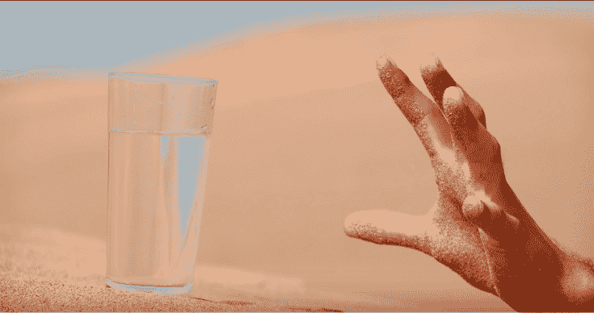

# 如何不对美女跪舔

> 原文：[https://piaohanshenghuo.com/how-not-to-put-women-on-a-pedestal/](https://piaohanshenghuo.com/how-not-to-put-women-on-a-pedestal/)

想象一下你在炎热干燥的沙漠了步行了两小时，你很渴，但是身上没有水，于是你继续前进，希望能找到水喝。又过了两个小时，你终于看到了在不远处有一个桌子，上边有一杯清澈的冰水。你会怎么想？你会像平时一样不是很珍惜你身边的水吗？还是把那杯水看得极其宝贵，拼命赶过去喝掉这杯水？

你肯定会选择后者，你会确保你舔干净杯子里所剩的每一滴水。当你喝完水之后，你还需要继续赶路，你还会对水有极大的渴望和需求。

假设你喝完了这杯水，抬头，发现100米之外还有一个桌子，上边有100杯水。现在你怎么想？你还会不会极其珍视其中的某一杯水，确保你舔干净杯里的每一滴水？还是会放松很多，不检查是不是喝光了最后的一点水。你会先尽可能多的多喝，喝到喝不动为止，并想办法多带几杯水和你一起赶路。

现在想象一下，当你抱起尽可能多的水杯，提起头，准备继续赶路的时候，你发现每隔100米都有一个桌子，每个桌子上都摆着100杯水，一直延续到你视线所能达到的地平线。现在你对水的需求会变成什么样？你说不定直接就把好不容易尽可能多地背在身上的水杯全扔到地上，不在乎杯子会不会碎，水会不会洒。你很可能会欢呼，并感觉无比的庆幸、放松、自由，因为你知道，你可以轻松地继续你的旅程，水随时都能喝到，再也不用担心口渴了。

同样的道理适用于你和女人的关系。**如果你像大多数挫男一样，不擅长吸引美女。你的感觉会口渴的人在沙漠里找不到水一样绝望，对水的需求和渴望极大。你也许偶尔会走狗屎运，在几十、上百公里的苦苦搜寻后终于找到一杯水，并愿意付出几乎任何代价得到这杯水**，即使这意味着你需要跨过100多米长的用粑粑堆成的障碍物，当你浑身是屎地终于走到水杯的面前，发现水杯里有一块屎，你也基本会咬着牙，一口气把水喝了。喝完水后你又傻眼了，不知道什么时候才能喝到下一杯水，会不会就此断子绝孙了。

如果你像大多数挫男一样，不擅长吸引美女。**你知道你不会有稳定的美女供给**，所以你必须对面前的美女百依百顺、跪舔，希望这么做她就不会离开自己。因为离开她，你不知道什么时候才能找到下一个愿意和你睡的美女，这种感觉很绝望，很可怕。**其实这样反而更容易失去她，即使你能暂时保留住她，她迟早也会离开，即使她不离开，也会降低对你的尊重。**

你永远不会体会到泡妞高手的自由，他可以过他想要的生活，继续他的旅程，任何他需要女人的时候，他都能找到女人，睡她们，然后继续他的旅程，或者决定带她一起上路。他不会为了眼前满桌子的水而忽视自己的目标，停滞不前。他可以看到前方路上为他准备好了的喝不完的水。

光有一个“[充足的心理](https://www.piaohanshenghuo.com/abundance-mindset/)”还不够，因为如果你知道前方还有很多水，但是你不知道怎么得到这些水，碰到一杯你可以得到的水，你还是会跪舔这杯水。所以你得知道你有能得到水的本事（泡妞的本事），当你知道你能泡到妞后（比如每周出个几次门就能确保带姑娘回家），你会变得很自由，不太患得患失，不needy。这样反而更吸引女人。

如何提升泡妞的本事？除了学习、练习泡妞技术之外，更重要的是变得更优秀。因为睡一个姑娘容易，继续不断地睡一个姑娘难，把自己变得很优秀，让姑娘清楚地意识到：离开你，她会失去很多。

每个人都可以努力变得更优秀，变得更优秀包括但不局限于：

更帅：头型、衣服。

更有钱：更努力地工作或最好创业。

更加幽默：多看stand up comedy，平时多注意开玩笑。

更多的技能：比如可以做一手好菜，拍好照片，唱好歌等等。

更健康、健美的身体：坚持健康饮食、健身，保证充足的睡眠。

更多的知识、智慧：多读书、听电子书、听讲座、看纪录片等等。

更好的床上功夫：学习知识并加以实践，推荐读物：“Sex God Method”。

有明确的人生目标：如果还没有，多尝试新鲜的事物，多读书，汲取信息。

即使你不优秀，也照样能泡妞，相信你一定看到过很多一朵鲜花插在牛粪上的情况，所以别用你要先提高自己再泡妞为借口，推迟泡妞这个行动，现在就开始搭讪陌生美女。越早开始，你越不后悔。

* * *

剽悍生活(Unbeaten Lifestyle)帮你从**健康、两性关系、生活方式**三个方面全面提高自己，打造理想的生活（尤其是性生活）。

