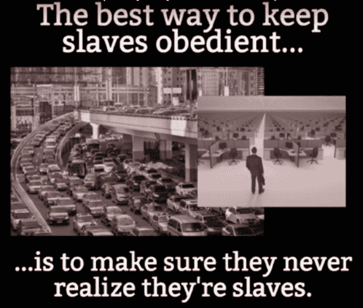

# 最糟糕的投资

> 原文：[https://piaohanshenghuo.com/the-worst-investment/](https://piaohanshenghuo.com/the-worst-investment/)

一天下午，你的一个朋友问你：“愿不愿意投资5万元，只需要投资5天的时间，5天过后，你就会得到投资的回报。”你说：“好吧，我试试。”于是你给了你朋友5万元，5天后，他回来了，给了你一打现金，告诉你这是你这五天投资的回报。你查了一下，一共2万元，你问他这是纯利润？他告诉你5万元就剩2万元了。你问他这算什么破投资啊？不但没有红利，还整整赔了60%。他说，没错，你还想继续投资吗？于是你想绝交。

很明显，投资5万元，5天后，只剩2万元，是非常糟糕的投资。**但当涉及到对时间（我们最宝贵的资产）的投资时，绝大多数人都毫无疑问地愿意接受这亏60%的投资。**当你周一到周五工作，周六周日休息的时候，你就在做这样的投资。

如果你说你一天只工作8小时，你没有真正用5天换2天，你是在欺骗自己。实际的情况是：你要早早起床、忍受早高峰拥堵的交通、工作一整天、忍受晚高峰拥堵的交通，回家后你身心俱疲，躺在沙发上看一两个小时电视来放松自己，你一眨眼发现到了睡觉的时间。尤其在中国，大多数公司都要无报酬地加班，大城市的交通极其拥堵，而且午休的1小时还不算。你工作日的生活质量和你的周末可以自由支配时间的生活质量完全没法比。

周一到周五，朝九晚五的生活方式是社会、文化制造出来的一个虚假现实（false reality），让我们只有在周末、节假日、每年一两周的假期、退休后才能完全地自由。虚假现实常常让你陷入平庸、债务、依赖和屈从，你无知觉地接受虚假现实，仅仅因为基本每个人都这么做。

你有没有意识到周一到周五完全是一个人为的概念？Henry Ford（福特汽车的创始人）当年把这个概念普及化了。他当时说：“每周工作五天的人会比每周工作六天的人消费更多商品。有更多休闲时间的人会有更多的衣服，更多食物，更多的交通工具，更多各种各样的服务。这个提高的消费水平会要求更多生产，生意不但不会因为人们休息更多而减缓，反而会加速。因为人们在休闲的时候会消费更多。这将会导致更多的工作，更多的利润”。

**我们生下来就被社会期望周一到周五上学上18年（幼儿园到大学毕业），毕业后周一到周五再工作四五十年。** **在这个星球上，只有人类这一个物种能区分出周六和周一。**这种作息完全是一个虚假现实，对于世界经济、企业、政府非常有利，对于工作的个人来说非常不利，但我们并不非得遵守这个规则。时间是我们最宝贵的财富，拿5天换2天实在是我们能做的最糟糕的投资。世界上货币的流动每天超过上万亿，但一个人的平均寿命还不到3万天。

人们说“时间就是金钱”，想赚金钱，同样要投资时间，唯一可以逃脱“朝九晚五，周一周五”这种生活方式的方法就是放弃“正常”的职业生涯，自己创业。刚开始会很辛苦，一周工作七天还可能会赔钱，但如果你坚持不懈，慢慢取得成功，你可以逐渐每周工作3天，2天，1天，甚至一天都不用工作。

**你可以在任何年纪退休，只要你的被动收入可以超过你生活的所有支出。**

当今社会的工作时间是一个虚拟现实，逃脱它并不容易，但周一到周五起个大早，挤早高峰、晚高峰的交通，重复四五十年更不容易。反正我选择逃脱，你呢？

* * *

剽悍生活(Unbeaten Lifestyle)帮你从**健康、两性关系、生活方式**三个方面全面提高自己，打造理想的生活（尤其是性生活）。

官网：www.www.piaohanshenghuo.com

**长按下图扫码关注**

