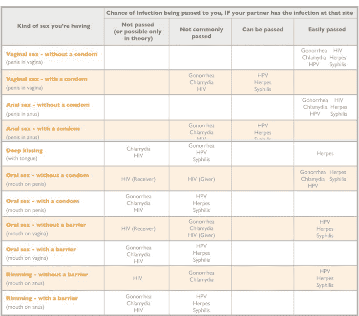

# 性病的真相

> 原文：[https://piaohanshenghuo.com/the-truth-of-std/](https://piaohanshenghuo.com/the-truth-of-std/)

很多人都谈“性病”色变，觉得性病是非常非常糟糕的疾病，而且很容易得病，那是因为我们大多数人对性病的不了解加上社会的误导，还有以讹传讹。但实际上，只有3种性病是不可治愈的，而且其中的HPV基本会在一两年后自己消失，所以其实只有2种性病不可治愈，herpes和HIV。

有人看到我泡了很多妞，就嫉妒地说“不怕得艾滋啊？”我还真不怕，在美国，你平均需要和1250个人不带套地性交才能得艾滋，这还是不带套的情况，带套可以非常有效地防止艾滋病毒的传播，戴套得艾滋的几率堪比中彩票头奖的几率。得了herpes，绝大部分人都不会有任何症状，有症状也不严重，过一阵子就会消失。大部分其他性病，发现后，吃几片药就可以治愈。

接下来我们来看看常见的性病（以美国为例）：

**Chlamydia：**

可治愈性：可治愈（2-4周）

美国普遍性（每年新感染人数）：286万人

RAW SCORE（不带套的性交传染此病所需人数）：36人

安全套能否防止疾病的传播：能

得了会有点儿难受，但吃几粒药就好了。男性得了，会有不适，但基本没什么伤害。女性得了，如果没有及时治愈的话，有可能导致盆腔炎，从而导致不孕不育。症状为撒尿时疼，蛋痒。25%的男性没有任何症状，70%的女性没有任何症状，医生建议女性至少一年检查一遍。

**Gonorrhea：**

可治愈性：可治愈（一个月内）

美国普遍性：57万人

RAW SCORE: 179人

安全套能否防止疾病的传播：能

症状为撒尿时疼，蛋痒，尿道肿胀，嗓子疼，私处化脓。作为细菌感染，抗生素就可以治愈，吃几粒药就好了。

**Syphilis：**

可治愈性：可治愈

美国普遍性：5万5人

RAW SCORE: 1841人

安全套能否防止疾病的传播：不能

不带套平均需要和1841个人性交才能患病，可见患病率是很低的。得病后的几周你会有不痛不痒的溃疡，再过几个月，你会开始起疙瘩，疙瘩持续几周或几个月后消失。再过15到20年（如果你一直没治的话），你内部的器官开始出血，你开始发疯，逐渐死亡。所以你应该至少每15年检查一下。

**HPV:**

可治愈性：不可治愈，但基本会在几年后自动消失。

美国普遍性：8000万人

RAW SCORE: 4人

安全套能否防止疾病的传播：不能完全防止，HPV可以通过皮肤传染。

绝大部分人都得过HPV，但完全没感觉，没有症状，之后HPV自己就消失了。HPV极其普遍，基本所有性活跃的人都会在他们人生的某个阶段获得HPV，但病毒基本都会在一两年内自行消失，尤其是当你的免疫系统很强的时候。得HPV的男性不会得任何癌症，超过99%的得HPV的女人都不会得宫颈癌，如果不幸得了的话，也要花至少10年的时间。

**Herpes:**

可治愈性：不可治愈

美国普遍性：2410万

RAW SCORE: 13人

安全套能否防止疾病的传播：不能防止

我有好消息和坏消息，坏消息是很多人都有这种性病，好消息是绝大多数人（超过90%）永远不会有症状。有两种herpes，HSV-1和HSV-2，HSV-1导致嘴边起泡，HSV-2会在私处爆发。

超过80%的人拥有HSV-1，但症状非常少见，会在患者面对大量压力，免疫力低下的时候爆发。Herpes不可治愈，但基本无毒无害，大部分人会在herpes爆发的一两年后再也不遇见任何症状。即使你始终有症状，也可以用药物压抑症状。

**HIV:**

可治愈性：不可治愈

美国普遍性：110万人

RAW SCORE: 1250人

安全套能否防止疾病的传播：能

艾滋病并没有你想象的那么可怕，早在2011年，得了艾滋病后你平均可以再活40年，看看魔术师约翰逊是不是还活得好好的？和艾滋病患者不带套阴道性交的患病几率为0.08%，肛交患病几率为1.4%**，**平均要和1250人不带套地性交才能得艾滋，可见想得艾滋并不容易。

部分人更容易得艾滋病，他们是男同性恋和吸毒者（使用肮脏的针管），超过80%的艾滋病患者都是他们。阴道性交的话，男人基本不可能从女人身上获取艾滋病毒，女人倒是可以从男人身上获取。肛交的艾滋病患病率会更高。艾滋病只能通过血液、精液、直肠液、阴道液、母乳传播，口交基本不可能得艾滋。

不同的性爱姿势可能会感染的不同常见性病列表

如果你对最近的一次性活动心存疑虑，想做个检查，最好等一个月再检查，因为很多性病要在得了几周后才能查出来。

如果你性生活比较活跃，有不同的性伴侣，最好每半年检查一次性病，至少要每年查一次。查出问题后对症下药，大部分性病很快就能治好。

如果你口腔有溃疡或破损，最好避免口交。带上套更安心、安全地性交，防性病又防怀孕，对自己和自己的性伴侣负责。

敬请期待下一篇文章，**熬夜码字不易，如果本文对你有帮助，想免费表示支持，不妨多花几秒钟的时间，[在公众号文章](https://mp.weixin.qq.com/s?__biz=MzIwNjgyMzMzOQ==&mid=2247484835&idx=1&sn=df3412880df74ae6e6eadada92d8235d&chksm=971a8f67a06d0671d5407ce95f334246aaed525179b6425bc756a087e2d99914a211fedc543b&token=474145557&lang=zh_CN#rd)底部的广告上点一下，我就能有大概一块钱的收入。**

**当然也欢迎你分享本文，更欢迎你打赏，谢谢支持**。

**你的支持可以鼓励我创作出更多有价值的文章供你阅读。**

* * *

剽悍生活UL(微信公众号)分享关于**两性关系**、**自我提升**、**数字游民的生活方式**的原创内容，帮你过上更理想的生活（尤其是性生活）。

剽悍生活的个人微信号：ycf3721，[一对一视频教学](https://piaohanshenghuo.com/1on1_coaching/)，或拉你进入[剽悍生活泡妞讨论群](https://piaohanshenghuo.com/ul-wechat-group/)，请注明加我的目的。

