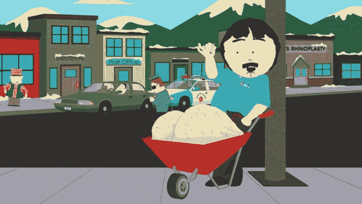
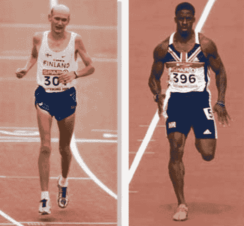
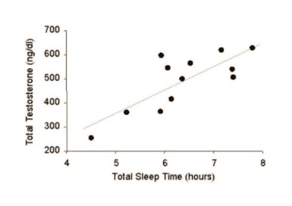

# 为何、如何提高雄性激素（睾丸激素）水平

> 原文：[https://piaohanshenghuo.com/how-to-increase-testosterone-level/](https://piaohanshenghuo.com/how-to-increase-testosterone-level/)

健康的睾丸激素水平的好处：**提升整体健康（预防疾病及癌症）、骨密度、性欲、勃起强度、肌肉密度，还有助于有一个好心情、精力充沛、自信、减肥**。不止对男人，对女人来说也很重要。上述好处都是有科学依据的，这里就不具体列举科学的依据了。

如果你的睾丸激素水平过低，你会体验所有上述好处相反的坏处：容易生病、低骨密度、性欲低、阳痿、肌肉萎缩、心情不好、无精打采、肥胖。

显然睾丸激素对我们很重要。

有很多人试图用外源的睾丸激素（exogenous testosterone）如药丸、药膏、注射来快速增加睾丸激素水平，但这种方法很容易有很多副作用，可能会导致相反的结果。

用自然的方法增加睾丸激素水平是最好的办法，因为没有副作用，而且可以长期保持所有的益处。接下来我们看看如何自然地提高睾丸激素水平。

*   食物方面：

你的饮食需要至少包括25%的健康脂肪，比如牛油果、椰子油、橄榄油、各种坚果、鸡蛋等。**笨鸡蛋**是提高睾丸激素水平最好的食物之一，每天2-5个，别完全做熟，尽量不让蛋黄凝固。不需要担心蛋黄的胆固醇，吃蛋黄的胆固醇只会增加你体内的HDL胆固醇（好的胆固醇），睾丸激素是要靠胆固醇生产的。

其他提高睾丸激素水平的食物有：**葱姜蒜、生蚝、菠菜、燕麦、柠檬、石榴、香蕉、坚果、豆类（黄豆除外）、土豆、金枪鱼、三文鱼**。

**避免豆制品（黄豆）**，豆制品会提高你的雌性激素、降低你的睾丸激素，适当吃一点儿可以，千万别多吃。

*   锻炼：

锻炼身体是提高睾丸激素水平最好的、最简单的方式之一。但并不是所有的锻炼都会提高睾丸激素水平，我们要做的是**高强度的无氧运动**（举起很重的物体，无论是铁还是你自己的身体），比如卧推、引体向上、俯卧撑等，最好把重量或难度调到你只能重复6到12次效果最佳。像慢跑这种有氧运动反而会降低睾丸激素水平，你想要马拉松运动员的体格还是短跑运动员的体格？

*   睡眠：

保证充足的睡眠（7到8小时），白天困的时候可以打个20到30分钟的盹。睡眠极其重要，睡眠时间从4小时到8小时，每多一个小时，睾丸激素水平就会增高15%。

*   性爱：

性爱是非常自然的刺激你内分泌系统、提高你的睾丸激素水平的方式。每一次勃起都会提高你的睾丸激素水平。

知道如何提高睾丸激素水平的同时，我们还需要知道如何避免减低睾丸激素水平。

被证实的会降低睾丸激素水平的杀手：

1. 压力：压力是最能降低睾丸激素水平的杀手之一，如果你一整晚不睡觉，第二天早上抽血化验你的睾丸激素水平，你的睾丸激素水平至少会降低50%。当面对很大压力的时候，你的身体会释放很多皮质醇（cortisol，压力荷尔蒙），皮质醇会拦截住睾丸激素的积极作用。

2\. 糟糕的饮食：饮食明显对你的健康很重要，饮食会改变你体内的荷尔蒙，包括睾丸激素。你需要避免糖、酒精、精加工的食物、大豆、乳制品、低脂肪饮食。

3. 肥胖：你的脂肪细胞生产雌性激素，雌性激素降低睾丸激素。

4\. 酒精：你的肝脏处理酒精时，会产生影响睾丸激素释放的化合物。即使是一两杯酒，就会导致睾丸激素的降低，及雌性激素和皮质醇的升高。啤酒最不好，啤酒内的啤酒花比世界上任何其他植物中的雌性激素含量都高。如果你非得喝酒，尽量别喝啤酒。

5\. 吸烟：吸烟一点儿好处都没有，谁都知道。

6\. 药物：大部分处方药，如血压药、抗抑郁药、抗焦虑药等都会降低睾丸激素水平。能不吃药就别吃药。

7\. 年龄：男人在25岁后，每年会降低1-3%的睾丸激素水平。当你到40多岁的时候，你很可能只生产50%你还是20岁小伙时所生产的睾丸激素。60多岁的时候，这个数字会降低到3分之1。80多岁的时候，只有15%到20%。你无法避免逐渐变老的事实，但无论你多大岁数，你都可以提高你的睾丸激素水平。

敬请期待下一篇文章，连夜码字不易，**别忘了通过点赞、分享、打赏、点页面右下角的“在看”和“点赞”等方式以示支持，鼓励我更快地发表下一篇文章。谢谢！**

* * *

剽悍生活UL(博客/微信公众号)分享关于**两性关系**、**自我提升**、**数字游民的生活方式**的原创内容，帮你过上更理想的生活（尤其是性生活）。

官方博客：piaohanshenghuo.com

**可以在官网的搜索框里直接搜索你感兴趣的内容**。

付费内容有：[**一对一视频教学**](https://mp.weixin.qq.com/s?__biz=MzU5NDgxNjI2Nw==&mid=2247485005&idx=3&sn=90921756abbf4f2d3df570a34d4412c0&chksm=fe7a3a29c90db33fa3d31a082f139f3b0a13062b3d594469aad53918a4d84fce706e2e29a9d1&scene=21#wechat_redirect)，[**剽悍生活讨论群**](https://mp.weixin.qq.com/s?__biz=MzU5NDgxNjI2Nw==&mid=2247484865&idx=1&sn=77c36b4014d6c1948879043442f768cf&chksm=fe7a39a5c90db0b39ebff280e3b8b406d41d45b546e8bc22c977a3a9a56ff7256d53e8bf5793&scene=21#wechat_redirect)。

还有内容可以沉淀的剽悍生活读者论坛——[剽悍星球（点此看详情）](https://mp.weixin.qq.com/s?__biz=MzU5NDgxNjI2Nw==&mid=2247484958&idx=1&sn=6873fdf5968922b143e9fe93901ed8ce&chksm=fe7a3a7ac90db36ce1a6ba7f337d7d857342c1904c8605480ad2b5050a2eb9b519e36c09be6e&scene=21#wechat_redirect)。

