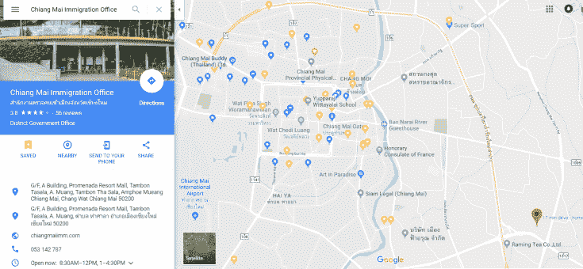
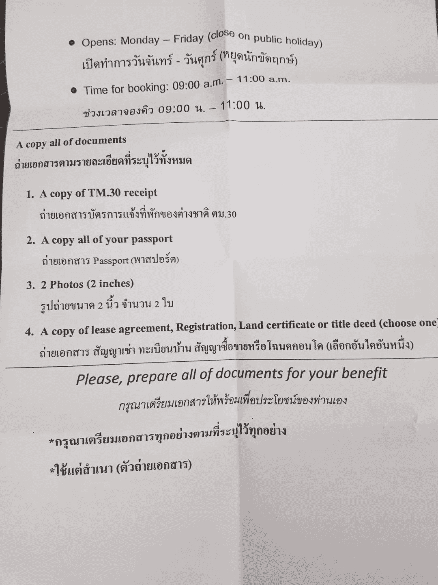

# 如何在泰国把二手摩托车转到自己名下

> 原文：[https://piaohanshenghuo.com/how_to_change_the_ownership_of_a_that_vehicle/](https://piaohanshenghuo.com/how_to_change_the_ownership_of_a_that_vehicle/)

长期住在泰国，买个（二手）摩托车非常有必要，否则要一直交租车的钱。

机动车过户需要去陆地交通局办手续，还算方便，只需要跑两次，而且第二次很快就可以结束。以清迈为例，清迈有两个交通局，需要去东南方的那个，在谷歌地图上搜“Land Transport Department”。

* * *

所需的材料：

*   二手摩托车
*   护照
*   护照首页、签证页的签名复印件
*   居住证明（Residence certificate）或者工作证明（work permit）
*   Green book（证明车归你所有，上边应该是卖家的名字，由卖家提供）
*   卖家签名的申请表（表在交通局）
*   卖家签名的卖家身份证（如果卖家是泰国人）或者卖家签名的护照（如果卖家是外国人）

卖家不需要出面，只要能提供所需材料就可以。

* * *

程序：

去交通局办公室的information信息台上交材料，工作人员会在检查好你的材料后叫你去隔壁给摩托做一个检查，检查好后如果你的摩托还没有保险，需要买个保险，很便宜，大概300泰铢。

再进移民局办公室，去information信息台拿一个排队号，去相应的柜台上交所有资料，并交大概200泰铢，工作人员会给你一个纸条，并让你第二天下午来取新的green book，每年需要交大概100泰铢的税，如果你的卖家还欠税没交的话，你需要补足。

第二天取好green book就大功告成了，你终于合法地拥有了你的二手摩托车。

* * *

如何获得居住证明（residence certificate）：

去当地移民局，我在清迈办的，我们就为清迈为例，移民局在清迈的东南方，一个商场（Promenada shopping mall）里，相关的部门在二楼。

所需材料：

*   2张两寸照片。
*   一个租房合同的复印件或者你所住的旅馆的地址证明（proof of address）。
*   护照原件及首页和签证页的复印件。
*   一个有房主签名或盖章的TM30表格的复印件（你租的房子或住的旅馆可以提供）。

**必须得上午去办，上午工作时间****8:30-11:00****，最好早一点去，省着还得第二天再跑一趟。一般周一最忙，尽量避免周一。**

提交好材料后，他们会告诉你来取居住证明的时间，一般需要一两周的时间，我的是在8天后的下午3点。