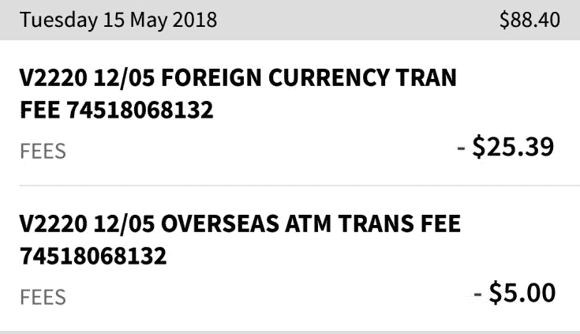

# 为何、如何取得泰国银行账户（最划算的泰铢换汇方式）

> 原文：[https://piaohanshenghuo.com/how_to_open_a_thai_bank_account/](https://piaohanshenghuo.com/how_to_open_a_thai_bank_account/)

在泰国的ATM上用非泰国的卡取款不但汇率不好，还会被ATM收取额外的至少150泰铢的费用，而且你的银行还可能会收取你跨国取款的手续费，非常不划算。我第一次用我澳大利亚的NAB卡在泰国的ATM上取2万泰铢，不但汇率不好，还被ATM收取了200泰铢（40人民币）的手续费，又被NAB收取了30.39澳元！！！

申请一个泰国的银行账号，再利用[TransferWise](https://www.piaohanshenghuo.com/best_way_to_transfer_money_internationally/)以更划算的汇率转账到泰国银行账号，再免费在ATM上提现，可以最大程度地减少换汇的损失。

大部分银行需要你有工作许可“work permit”才可以开户，但是Bangkok Bank（曼谷银行）用旅游签证就可以开户，理论上只有护照就可以，你还需要一个泰国手机号（手机银行、短信银行），有可能要residence certificate（居住证明，去移民局免费开），不同的分行、不同的工作人员的要求都有可能不太一样，要求满足不了可以换个分行试试。

我去的第一家就要去我去移民局开个居住证明，我又试了第二家，没有要求我去移民局开居住证明，我开户的时候带了我的护照和泰国驾照，总之你能带的材料越全越好，穿着整洁有礼貌也能增加开户成功的概率。

工作人员会给你一个存折，银行卡，并为你开通手机银行，指导你下载、注册银行APP，你可以在上边转账、查询余额等。

我的曼谷银行卡不但可以在所有的曼谷银行ATM上免手续费取款，一个月还有5次免费在所有其他ATM免手续费取款的机会，而且每次余额有变动我都会收到短信通知，很方便。