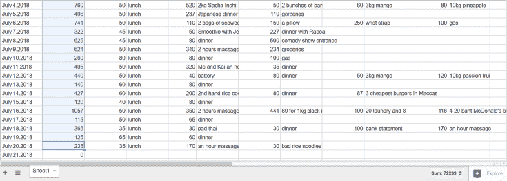

# 来清迈两个半月的花销、总结以及签证的选择

> 原文：[https://piaohanshenghuo.com/cost_of_living_in_chiang_mai_and_visa_options/](https://piaohanshenghuo.com/cost_of_living_in_chiang_mai_and_visa_options/)

我的泰国单次旅游签证快到期了，必须回国办理新的签证，我在清迈的生活不得不暂时告一段落，就此总结一下。

我在清迈生活的两个月零十天大概花了72300泰铢，减去23000泰铢的二手摩托车钱，再减去4400泰铢的住房押金，再减去3300泰铢的手机SIM卡无限数据流量包年（一年3600，一个月前办的），等于46000泰铢，9200人民币。包含了我在清迈所需的所有费用，食住行，没买过任何一件衣服。

其中还包含以后基本不需要再花的费用，比如考驾照、没驾照骑摩托被罚款、租了一个月摩托车、性病检查（没查出毛病）、新枕头、毛巾、拖布等居家用品。再加上我最近买了电饭锅，经常自己做点儿五谷杂粮，花在饮食上的费用会更少。如果我减少按摩的次数，费用也可以更低。

推倒了19个姑娘（2个泰国，其他全部来自欧美），大部分是晚上出门打猎推倒的，基本不需要花钱，除了我骑摩托用的油钱。如果是白天约会，请姑娘喝一杯25泰铢（5块钱人民币）的smoothie，成本极低。最便宜的杜蕾斯避孕套要180泰铢12个。

我舒适的清迈生活的实际费用大概一个月要4000人民币出头，和我的预期相符。具体生活费用请看《[我为什么对目前在清迈的生活很满意](https://www.piaohanshenghuo.com/why_am_i_happy_with_my_life_in_chiang_mai/)》。

很气人的是作为中国公民，不像大部分外国人可以就近去邻国比如老挝、柬埔寨的泰国领事馆再办一个旅游签证，中国公民必须得回中国办，往返机票就得一两千人民币，麻烦又贵。我不但得回国办，还不能去最近的昆明泰国领事馆，因为我户籍是辽宁，归北京的泰国领事馆管辖。**所以如果你打算自己去办泰国的签证，一定得先确认好你所对应的泰国领事馆。**

★如果你办的是单次旅游签，大概250人民币左右，可以在淘宝上办（[这家就不错](https://s.click.taobao.com/t?e=m%3D2%26s%3DXGO3v4im20ocQipKwQzePOeEDrYVVa64K7Vc7tFgwiHjf2vlNIV67gv3bpWzf87zJ%2BAVY%2F4wKC3G6RQugPIHaiHoWeVYt1XVOEWRD3es9Te2Kx1YoWdXy9SjHtrn2rzaxEDzzg6bKGp5ArodCWjzvxnv74E1jigPeBRCY%2BtjljI%3D&pvid=10_59.109.117.54_9954_1557142730234)），会方便很多，快递就可以，不会被国内的区域限制。

缺点很明显，每三个月必须得回国一次（2个月+1个月延期（去移民局交1900泰铢））。

★如果是半年多次旅游签（METV，1200人民币，**必须本人办**，单次入境最多60天），可以每2个月或3个月（去移民局延期一个月）去边界“离开泰国”一下，再回来（aka.border run），在半年期限快到期的时候再做最后一次border run，这样你可以在泰国再待两个月，快到期的时候去移民局再花1900泰铢延期一个月。

所以理论上你可以通过半年多次旅游签最多在泰国待将近9个月的时间。这是最便宜的选择，也是我这次要办的签证，缺点是要至少跑到边境两回，不过我不在意，自己骑摩托，完全就当旅行了。

★也可以选择一年期的教育签证，价格从4千到1万人民币不等，可以学习泰语、英语、自我防卫等，学习泰拳会更贵。需要泰国学校方面准备资料（大概一个月），邮寄给你（几天），你亲自去泰国领事馆递交资料，再等个一个多月。前前后后大概得3个月的时间，你的教育签证才能下来。

优点就是你可以在泰国待整整一年，缺点是等待时间长，还得费时间上课，有的学校要求上课，或者他们不要求你必须上课，但比如你学习泰语，移民局可能会抽查你的泰语水平，如果你明显不行，他们可以遣返你。

之后我会具体写一篇关于泰国签证的攻略。

* * *

剽悍生活UL(微信公众号)分享关于**两性关系**、**自我提升**、**数字游民的生活方式**的原创内容，帮你过上更理想的生活（尤其是性生活）。

剽悍生活的个人微信号：ycf3721，[一对一视频教学](https://piaohanshenghuo.com/1on1_coaching/)，或拉你进入[剽悍生活泡妞讨论群](https://piaohanshenghuo.com/ul-wechat-group/)，请注明加我的目的。

