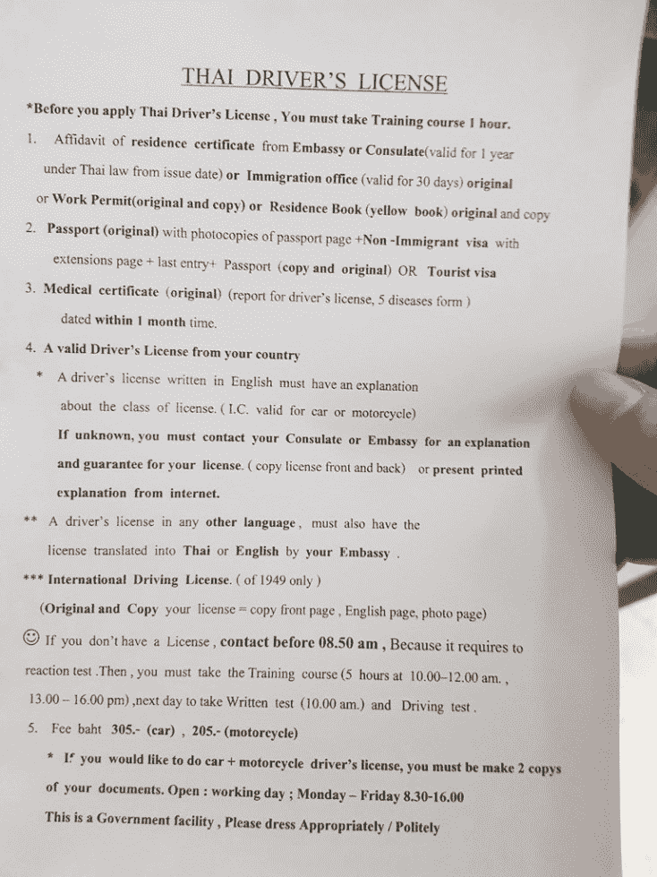
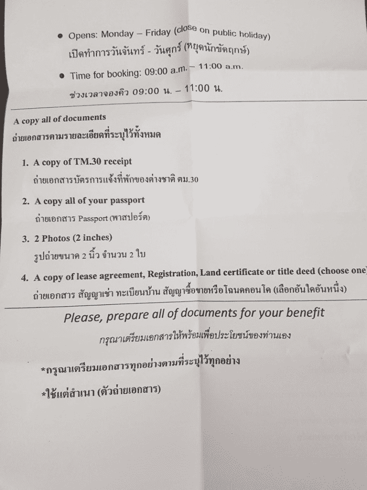
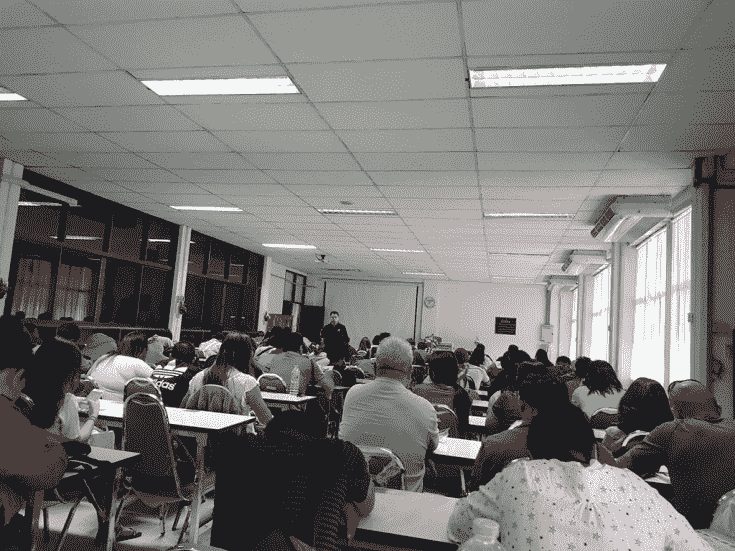

# 如何获得泰国驾照

> 原文：[https://piaohanshenghuo.com/how_to_get_a_thai_driving_license/](https://piaohanshenghuo.com/how_to_get_a_thai_driving_license/)

我在泰国最喜欢的事情之一就是骑摩托在大街小巷自由穿行，游览各种风景，方便又便宜，还方便带姑娘回家。

如果你打算在泰国待较长的时间，花时间取得一个泰国驾照是很有必要的，比如清迈偶尔有交通警察设置关卡查驾照，如果没有的话会被罚500泰铢（3个小时的泰式按摩）。而且整个东南亚（ASEAN: 缅甸、老挝、柬埔寨、越南、马来西亚、印尼、新加坡，菲律宾、文莱）都通用，去邻国也不用担心了。泰国驾照很好考，只不过需要反复在不同的政府部门跑几次。

接下来我们看看获取泰国驾照所需的材料和具体的步骤：

1\. Residence Certificate（居住证明）

2\. 护照（原件+护照首页、签证页复印件）

3\. Medical certificate（医学证明）

4\. 本国驾照（可有可无）：如果有本国护照的话，必须去中国大使馆把驾照翻译成泰文或英文，也挺麻烦的，不过可以免除在教室坐6个小时的痛苦，只需要坐1个小时。

5\. 钱：我只交了150泰铢。

* * *

如何获得居住证明（residence certificate）：

去当地移民局，我在清迈办的，我们就为清迈为例，移民局在清迈的东南方，一个商场（Promenada shopping mall）里，相关的部门在二楼。

所需材料：

*   2张两寸照片。
*   护照原件及首页和签证页的复印件。
*   一个租房合同的复印件或者你所住的旅馆的地址证明（proof of address）。（你租的房子或住的旅馆可以提供）。
*   一个有房主签名或盖章的TM30表格的复印件（你租的房子或住的旅馆可以提供）。

**必须得上午去办，上午工作时间****8:30-11:00****，最好早一点去，省着还得第二天再跑一趟。一般周一最忙，尽量避免周一。**

提交好材料后，他们会告诉你来取材料的时间，一般需要一两周的时间，我的是在8天后的下午3点。

* * *

如果取得医学证明（medical certificate）：

非常简单，随便去一家医院，告诉他们你要开一个medical certificate，一般要100到300泰铢，我去的医院是Ratchavej Hospital，离immigration office（移民局）不远，交了100泰铢。

很简单，量身高、体重、血压、心跳，问问你抽烟喝酒不。当时医院应该比较忙，花了我将近一个小时，如果医院不忙的话，10分钟足够了。

* * *

材料准备齐了就可以申请驾照了，请在周一到周五早上8:50前在交通局（谷歌地图搜索Chiang Mai Provincial Land Transport Office，靠近机场）报道，最好可以提前一点儿，至少八点半就到，去二楼的Information柜台填写资料。

工作人员会叫你去28号窗口提交资料，你的资料和护照会被扣留，你会得到一个座位卡，按号入座。带好你的充电宝，因为你要在无聊教室里坐6个小时（上午下午各3小时），别耍小聪明，在课程快结束时再回来，因为老师不一定什么时候会发签到表，你没签到就完了。

卡上说是9点开始，实际9点半才开始。可以先出门吃个饭。建议带个外套和长裤(驾驶测试要求必须穿长裤)，教室内空调吹时间长了很冷。

12pm-1pm 是午休时间，然后还要在教室待到4pm 。

第二天10am到4号房在电脑上考试，考试顺序为第一天报名的顺序，所以第一天去早一点还是有好处的。如果你第一天也像我一天拿到了100多号，10点半之后到就足够了。一共50道题，要至少答对45道才能通过考试。

可以至少在考试之前一个小时在这个网站上练习考题，一共大概90道，基本涵盖所有考题，网址： http://thaidriving.info/

**注意**，因为你是中国的护照，考官会默认给你中文的考试题。但是中文考题有很多错误，翻译得驴唇不对马嘴，**向考官要英文的试题**，英文试题和上述网址上的英文试题是一致的，考试前看一遍就可以通过。

如果考试没过，需要下午1点补考。还没通过的话，就得等第二天了。

考试通过之后自己去楼下进行实际的驾驶测试，这里要注意的是”**一定要穿长裤**“，否则不让考。考试非常简单，一分钟就能通过。通过后去2楼的information柜台拿一个排队的号码，在大厅等待自己的号码。交150泰铢，排队拍照。大概一个小时左右就可以拿到驾照了。

再也不用担心被交警罚款了。

