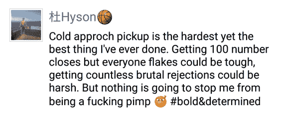
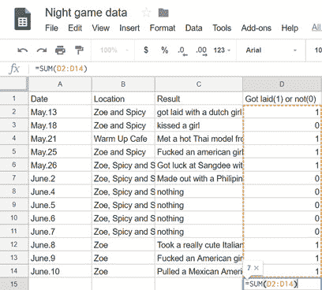

# 给泡妞新手的12条建议

> 原文：[https://piaohanshenghuo.com/12_advices_for_newbies_in_pickup/](https://piaohanshenghuo.com/12_advices_for_newbies_in_pickup/)

1.**要有合理的预期，****接受你刚开始会很笨的事实：**搞砸每一个对话很正常，丢人很正常，你很可能会花大量时间和精力，得不到任何实质的结果（get laid）。但一定要坚持住，不气馁。

还记得我当年刚开始在墨尔本搭讪美女的时候，**我搭讪了上千个姑娘，要到了上百个电话号码，结果没有一个姑娘愿意再和我见面**。我就这样坚持不懈了3个多月，我不但好好地活着，还终于碰到了一个喜欢我的墨尔本当地的姑娘，我们5分钟之内就接吻了，她半小时内被我带回家了。

又比如上周我天天晚上出门打猎，前四天一个姑娘也没带回家，但我相信自己，坚持打猎，结果周五周六周日连续三天分别推倒了一个意大利妞，两个美国妞，而且她们都在我们刚见面的半小时内就同意和我回家了。

在你出门搭讪的时候，一切姑娘都是随机出现的，你的成功率随着你的硬件（外在仪表）和软件（内在综合素质、泡妞水平）的提高而提高。有时没有结果只是因为你运气不佳，没碰到对的人。

**2.****设定更现实的小目标**：如果你还没办法搭讪姑娘，紧张得要命，你可以把目标调小到今天我要朝3个美女微笑并说hi，然后马上离开。下一步你可以简单地问个路，然后离开。下一步，你可以在问路之后试图打开其他话题。下一步，你可以尝试直接告诉她你觉得她很漂亮。下一步……

设定渐进的小目标，让你更容易发现自己的进步，不轻易灰心气馁。

3.搭讪也可以热身：你出门搭讪的时候，第一次搭讪往往是你最紧张的时候，你完全可以先搭讪你完全不感兴趣的人，男女都无所谓，这样有助于进入搭讪状态。如果你一天也没和人说话，你也可以在出门搭讪的路上给好朋友打个电话，把话匣子打开。

4.**你说的内容远没有你说的方式（语音、语调、语气、肢体语言）重要，不存在可以把姑娘双腿打开的咒语**：你可以背诵全世界的把妹台词（pick up lines），并同时保持和背诵之前同样的泡妞水平。Pick up lines可以帮你在实在不知道说什么的时候救你一命，但帮不了你把姑娘推倒。任何告诉你有“秘诀”的人，都是在骗你，或者他们本身就傻。唯一的秘诀就是：**学习正确的方法，并****不断地实践**。和任何其他技术一样，泡妞也需要练习，你现在最应该做的就是现在就[**开始行动**](https://www.piaohanshenghuo.com/the_most_important_thing_to_do_to_improve_your_game/)，不是不停地在网上读文章，也不是花大量时间在约会软件上撩骚，而是真正地**和现实世界中的姑娘接触**。

5.尽量提高你的[**外表**](https://www.piaohanshenghuo.com/appearance/)：外表虽然不是最重要的，但绝对是非常必要的，而且是**很容易迅速改善**的。买套帅气的衣服，弄个帅气的头型（或者像我一样寸头配个帽子），尽量别带眼镜（戴隐形眼镜），除非你带眼镜更好看，总之找到适合自己的造型。保持良好的个人卫生，坚持健康饮食、锻炼身体。至少要保持你的外表优于平均水平。

6.不知道刚开始应该和姑娘说什么？怎么说？刚开始你可能很难根据实时的周围环境想出完美的切入话题，其实完美地展开对话并不是特别重要，只是给了你一个和姑娘开始对话的机会，接下来你还需要说成百上千句话。如果你丢出一个老掉牙的、姑娘也许已经听过很多次的pick up line，你反而更容易失败。

为什么不能**真诚**地告诉她“我刚刚看到你，觉得你很漂亮/可爱，我不得不过来认识你一下。”？你也可以根据她的穿着给她一个赞美，甚至都可以告诉她你很紧张。任何一个心地善良的姑娘看到你这么诚恳，即使不喜欢你，也很可能会礼貌地感谢你的赞美并告诉你她不感兴趣。任何可能对你有兴趣的姑娘都不会因为这句话而拒绝你。

真诚地说出你的想法，但没有必要直接到告诉她你想上她，因为大部分姑娘还没有酷到那种地步，如果她有那么“酷”的话，也很有可能是人妖或变性人。你说的内容并不是很重要，关键你要说得理直气壮，而不是扭扭捏捏、畏畏缩缩，真诚地表示你对她的兴趣有助于你说得更理直气壮。

如果她没有明显地拒绝你，你要赶紧引导话题，别冷场，先避免像面试一样地问问题，最好先抛出一个冷读（cold reading），说出你对她的判断，比如我最喜欢通过她的口音和长相猜她是哪里的人，因为你的猜测完全是和她有关的，会获得她的注意力，她基本上肯定是会回复你的，而且万一你猜对了，她又会很佩服你。尽量多鼓励她说话，透露更多信息，她透露的信息越多，你可以联想到的话题越多。**充分利用你对她的好奇心问问题，****试图把对话保持得越久越好**，因为刚开始你很可能很紧张，随时有想离开对话的冲动。你要强迫自己适应这种紧张。说话的同时别忘了适当的肢体接触。

7.集中注意力阅读姑娘的**肢体语言**：还记得[David X最重要的把妹准则](https://www.piaohanshenghuo.com/2-ruels/)吗？**Who cares what they say?** 姑娘们经常口是心非、甚至说谎，而且还很善变，但她们的身体往往是很诚实的。

她是全神贯注于你们的对话，还是东张西望？她的肢体语言是放松、开放的还是紧张、关闭的？她有没有不断撩自己的头发？她看你的眼神是什么样的？她说不要的同时有没有强硬地把你推开？你完全可以谈论天气等无关紧要的事情，但同时你把手放在她身体的不同部位上，看她有什么反应，会说明很多问题。

8.**别对你已经搞砸的关系过分自责，把精力放在新的目标上**：这个世界上美女实在太多了，她并不特殊，尤其是在她已经没戏了的情况下。世界上不但现存的美女很多，每天还有大量美女被生产出来，20年后，40多岁的你还可以泡20岁的妞，所以保持身体健康很重要。相信资源是很充足的是很重要和健康的想法，详情请看文章《[**充足****vs.****稀缺**](https://www.piaohanshenghuo.com/abundace_vs_scarcity/)》。

9.**别在意别人怎么想**。说起来容易做起来难。拿我举例子，我搭讪了成千上万的姑娘，有过无数次尴尬的情况，但我还活得好好的，从来没挨揍、被警察抓起来。而且我已经很难回想起来那些尴尬的情况了，更何况其他当时在场的我根本就不认识的人。回想一下你自己从小到大做过的很尴尬的事，你还能想起来几件？这些事对你的负面影响大吗？

10. 找个比你强或和你同等水平的wingman和你一起出门泡妞：wingman可以让你看起来更酷（而不是一个人傻站着），可以帮你应对多人的组合（尤其是很常见的两人组合），还可以帮你加油打气，找出你自己看不到的不足之处。

11. 把你泡妞的进展记录下来：可以用录音笔或者手机的录音功能把整个对话录下来，之后总结分析问题所在，想办法改进出现问题的地方，非常有助于你的进步。

你可以记录任何你觉得有用的数据，比如上图为自从我来清迈之后晚上出门打猎的数据，可以看出来，我出门13次，当晚带回来了7个姑娘，还有两个姑娘是当晚没带回来，第二天才推倒的，我可以通过很直观的数据来观察我是否有进步，而且做到心里有数。

现在我清楚地知道，如果我晚上出门打猎两次，至少会推倒一个姑娘。你觉得我在知道了这个信息后，还会对眼前的美女跪舔吗？我同时知道我每次出门打猎要花大概1到3小时的时间，这段时间大部分是很愉快的、很锻炼人的，你觉得我在知道了这个信息后，还会牺牲大把宝贵的时间在网上和一大群饥渴的男人争抢那几个本来就不一定有戏的被捧得高高在上的美女吗？

12\. Have fun! It’s called the “**game**”, not the “work”, so be playful, have fun with it. 别那么严肃，放松，多开玩笑。不仅仅是上床，泡妞的过程也是充满有乐趣的。姑娘又不会打你，即使打也打不过你，你怕什么？

多亏你制造一个机会，姑娘才能和你共度一段非常愉快、美好又难忘的时光。

加油！

