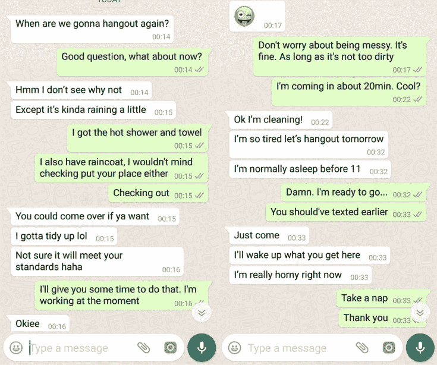
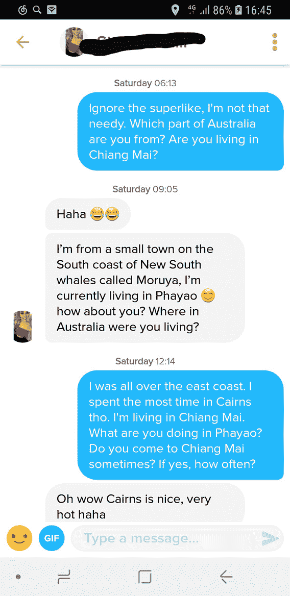

# Tinder怎么用？Tinder网上约会攻略

> 原文：[https://piaohanshenghuo.com/tinder_guide/](https://piaohanshenghuo.com/tinder_guide/)

我在《[提升把妹水平最需要做的一件事情》](https://www.piaohanshenghuo.com/the_most_important_thing_to_do_to_improve_your_game/)这篇文章中并没有推荐online game（网上约会），因为效率远没有晚上出门打猎高，但晚上出门打猎只能在晚上进行，我们不一定都有时间，而且比如昨晚清迈下雨，也不方便我出门打猎。而online game可以在任何时间地点进行，这是online game最大的优势，而且又多了一个接触美女的窗口，有多余时间的可以尝试。今天我就来介绍一下Tinder这款约会软件，其中的很多心得也适用于其他约会软件。

(昨晚我在TInder认识的美国ginger姑娘给我发来booty call, 我欣然应约。）

Tinder是国际最流行的约会APP，国内的抄袭版叫“探探”，如果你还不知道Tinder是怎么用的，我就简单说一下，你把自己的照片和资料写好后系统会把附近的姑娘一个一个推送给你，你向左滑表示你不喜欢、不感性趣，向右滑代表喜欢、感性趣。如果你喜欢的人也喜欢你，APP就会告诉你，It’s a Match！你就可以开始对话了。

**BTW, 国内的网络普遍是无法使用Tinder的（部分人反映可以直接正常使用），**[**需要用V.P.N才能上Tinder（这有详情）**](https://piaohanshenghuo.com/ke-xue-shang-wang/)，如果你生活在北上广深等大城市，会在上边看到很多洋妞。

像我之前在《[如何免费、高效、不无聊地自学英语](https://www.piaohanshenghuo.com/how_to_learn_english/)》这篇文章里说的一样，**V.P.N是你在国内可以对自己做的最划算的投资之一**，国内的网不是真正的互联网，只有有了V.P.N之后才能称作真正的互联网。

回到正题，在Tinder上每天姑娘可以免费向右滑大概100次，小伙儿大概50次，每天还有一个免费的Superlike表示你特别喜欢某人。如果你生活在一个国外的大城市，可以花钱买个TinderPlus，可以有无限向右滑的权限，还可以提前认识你即将到达的城市的姑娘们。

* * *

Photos（照片）：

**照片是最重要的**，有好的高价值的照片比你说得天花乱坠有用一百倍。

你首先展示给姑娘的是你的第一张照片和名字，很多人只看第一张照片来决定喜不喜欢，所以**第一张照片显得极其重要**。第一张照片需要**完整清晰地显示出你的整个脸，包括你的双眼****（别带墨镜），****别用自拍**。避免合影，别人都不知道你是谁。我在Tinder上看到了无数弱智姑娘把合影放在了第一张照片上，在智商方面我想左滑，但我往往还是耐心地看看她的别的照片，看她够不够性感再决定。

**避免自拍**，自拍显示出你没有朋友（除非是和动物的自拍），有一张和动物的合影是个不错的主意，可以显示出你有爱心。

**厕所镜子前的半裸自拍是非常低俗的，千万别用**，可以光膀子，但不要自拍，最好是自然的光膀子，比如在沙滩上的照片，户外运动的照片或者如下图。

照片要尽量“**不经意地**”展示高价值，别故意跑豪车边上拍照片，即使你是车主的话。最好是你**“不小心”被别人抓拍到的生活瞬间**。避免try hard.

有一张和漂亮姑娘的合影是不错的主意，代表你有市场。

Tinder可以连接Instagram, 如果你能展示更多的高价值的话就连接。

如果你有很多照片，难以抉择的话，可以去www.photofeeler.com实验自己照片的吸引力程度。

* * *

Bio（自我介绍）：

避免长篇大论，要短小精干，给姑娘留下想象的空间，最好可以幽默。避免写你特别讨厌什么，有可能因此失去一些姑娘（除非你写”Don’t be fat in real life.”这样可以过滤掉胖子）。你真的很在意和姑娘有很多共同点吗？我本身很讨厌抽烟，但我会拒绝喜欢抽烟的性感姑娘吗？显然不会！

* * *

Tinder Algorithm （算法）：

**千万别一直向右滑**，我过去为了节省时间，连看都不看就滑，后来才知道，Tinder的算法会惩罚这种行为，如果你大量右滑，Tinder会把你的排名放在最后，导致大部分姑娘都不会看到你的Tinder资料，反而浪费时间。

Tinder是连接Facebook的，你如果在Facebook上和美女有共同喜欢的东西会帮助你们更早地在Tinder上看到对方的资料，所以你可以尝试在Facebook上喜欢一些美女会喜欢的东西，比如：MAC Cosmetics, Michael Kors, Victoria’s Secret, Marc Jacobs等等。

**一天多用几回**，会提高你的出镜率，从而得到更多matches.

* * *

Text game:

开场白：

如果姑娘明显很漂亮，别刚开始就赞美她，因为其他的小伙儿都会那么做，她早就听腻了。

开场白要简短，别发一大段话。No cheesy/fancy pickup lines. 提一个简单的问题，让她好接话。可以简单普通到”How’s your day going?”，如果她真的对你感兴趣（通过**你的照片**），肯定会回复你。

在matches不多的情况下，可以根据她的个人资料写有针对性的开场白，提高回复率。Matches多的话复制粘贴同样的开场白就可以，影响不大。

补充一下，**Tinder已经在2020年末添加了视频聊天的功能**，需要双方都同意后才可以视频，**一定要充分利用这个功能，可以帮你从姑娘几十上百​的匹配中脱颖而出！​**

Superlike超级喜欢：

每天会有一个免费的Superlike，你超级喜欢某人不代表某人会喜欢你，反而让你显得更needy，不过superlike可以让姑娘很快就看到你的资料，否则你的资料很可能在很靠后的位置，姑娘很可能会先喜欢别人。所以superlike还是有用的，我用superlike配对成功后喜欢说“Ignore the superlike, I’m not that needy.”。

对话：

**如果姑娘慢吞吞地回复你，你也慢吞吞地回复她**，别每次都秒回，很闲也要假装很忙。而且要避免明显比姑娘发更多的字。

别发一些sexual的东西，网上creeps很多，你容易把她吓跑，见面后再be sexual也来得及。

别乱开玩笑，打字不像说话，没有语气和音调，更容易误解。

邀约：

**尽快把姑娘约出来，如果约不出来，要电话号码，打电话聊，聊好了再约**。

但是别刚开始（前一两句）就约，争取在10句话内约出来。别来来回回聊好几十、上百句话，你不是她的笔友。先交换几句small talk, 然后再邀约，这里有一句我会用的经典邀约语句免费送给你 “Hey look, I’ll cut the BS, I think you’re really cute. Do you wanna hang out and grab some drinks/smoothies/coffee/ice cream?”

* * *

心态：

记住，出现”It’s a Match”代表姑娘已经“喜欢”你了，或者你至少应该**默认姑娘已经喜欢你了**，别试图让姑娘喜欢你。

要有一个[充足的心态](https://piaohanshenghuo.com/abundance-mindset/)(abundance mentality详情请看《[充足vs.稀缺](https://mp.weixin.qq.com/s?__biz=MzIwNjgyMzMzOQ==&mid=2247483845&idx=1&sn=92227a78a6d1a39e4c184d95349f7c08&chksm=971a8b01a06d02172c2176fe2f1a17aecd318ca676d6b331cfd27128982c9b89d291ee372a16&scene=21#wechat_redirect)》），姑娘有无限多，而且很多姑娘在约会软件上只是想证明自己有魅力、有市场，享受一帮饥渴男的跪舔。她们并不想真正见任何人。

所以无论什么时候她停止回复你信息了，别不停地给她发信息，move on！去找别的姑娘。但是为了以防万一，你可以在多天之后尝试再发一条消息，我喜欢发一句“I feel like we’re growing apart.” 发完后就把她忘了，别再发任何消息，直到她回复。

要有现实的预期，如果你在像澳大利亚这样发达的西方国家，亚洲男性面孔在两性市场上是不受欢迎的，尤其在你是土生土长(fresh off the boat)的亚洲人的情况下，你的性市场价值是非常低的。你可能会用了很久都没有match, 或者好不容易有一个match也约不出来，这都很正常，别灰心。

用了一段时间后发现在时间投资和收益上不划算大可不用，还是出门打猎效率更高，而且更锻炼人，你在网上约了见面也同样要落实到面对面的约会。所以**你最重要的任务是把面对面的约会水平提高了**，如果你有多余的时间，再花在online game上。

最后，我再推荐一下我最近付费使用了的一款靠谱的约会软件——[Seeking Arrangement（这有我写的具体的文章）](https://piaohanshenghuo.com/seeking-arrangement-guide/)，这个“约会软件”是世界上最大的用来找Sugar Daddy/Baby的（有钱人找年轻貌美的姑娘），通常需要金钱支持（包养），但也不一定，也有可能就是美女想找个事业有成的“成功人士”。

你可以在上边找到全世界的美女，只要你有钱，你都可以花钱让她们打个飞机过来。但是这个约会软件的会费非常高，一个月要90美金！不充值是没法读美女发来的消息的，也没法发消息。你可以免费注册个账号上去看一眼你的城市内有没有很多用户再考虑要不要充值。上边的个人资料需要填写“净资产”（10万美元起）和“年收入”（“低于10万美元”起，其次是”10万美元”，”20万美元”….），明显并不适合所有人。

但上边的姑娘真的平均更漂亮，而且男女比例基本是1：1，而且姑娘的态度明显比那些免费的约会软件要好，有很多美女都很认真地写很长段的自我介绍（很罕见，我基本看不到在其他约会软件上有这种情况）。有一定事业的男士非常值得尝试，[这有Seeking Arrangement的注册地址](http://reflexmedia.clqtrk.com/ZPNHT4/6JHXF/)，不妨免费注册一下，看看你所在的城市的资源如何，很好的话​再考虑付费，买一个月就够了。

本攻略暂时写到这里，有问题请留言，我再补充。

敬请期待下一篇文章，**熬夜码字不易，如果本文对你有帮助，想免费表示支持，不妨多花几秒钟的时间，[在公众号文章](https://mp.weixin.qq.com/s?__biz=MzIwNjgyMzMzOQ==&mid=2247484835&idx=1&sn=df3412880df74ae6e6eadada92d8235d&chksm=971a8f67a06d0671d5407ce95f334246aaed525179b6425bc756a087e2d99914a211fedc543b&token=474145557&lang=zh_CN#rd)底部的广告上点一下，我就能有大概一块钱的收入。**

**当然也欢迎你分享本文，更欢迎你打赏，谢谢支持**。

**你的支持可以鼓励我创作出更多有价值的文章供你阅读。**

* * *

剽悍生活UL(微信公众号)分享关于**两性关系**、**自我提升**、**数字游民的生活方式**的原创内容，帮你过上更理想的生活（尤其是性生活）。

剽悍生活的个人微信号：ycf3721，[一对一视频教学](https://piaohanshenghuo.com/1on1_coaching/)，或拉你进入[剽悍生活泡妞讨论群](https://piaohanshenghuo.com/ul-wechat-group/)，请注明加我的目的。

