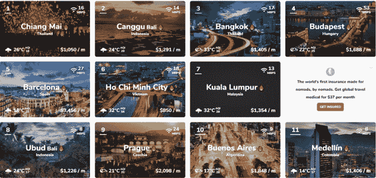
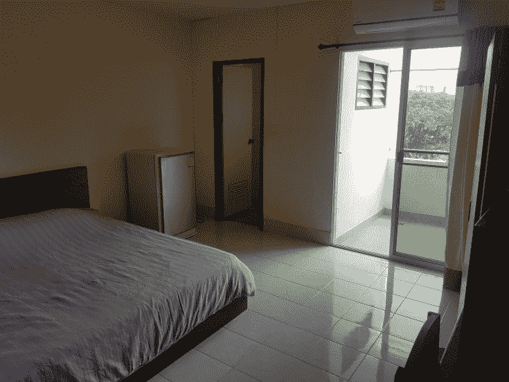
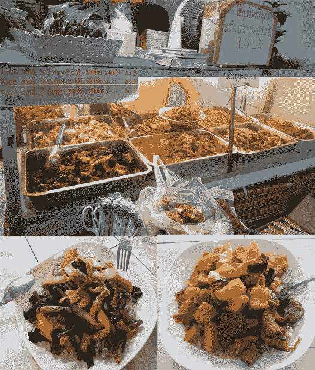
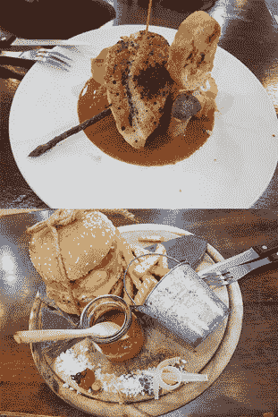
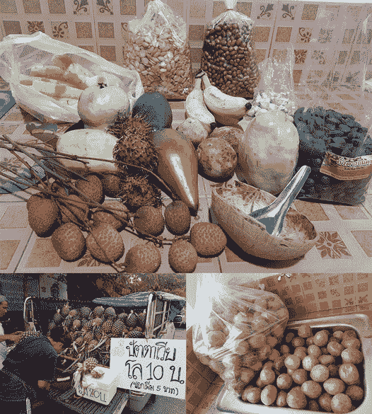
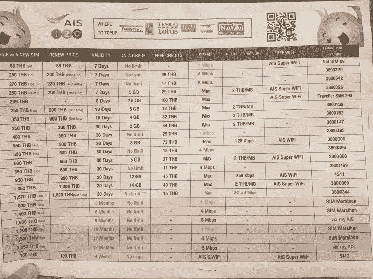
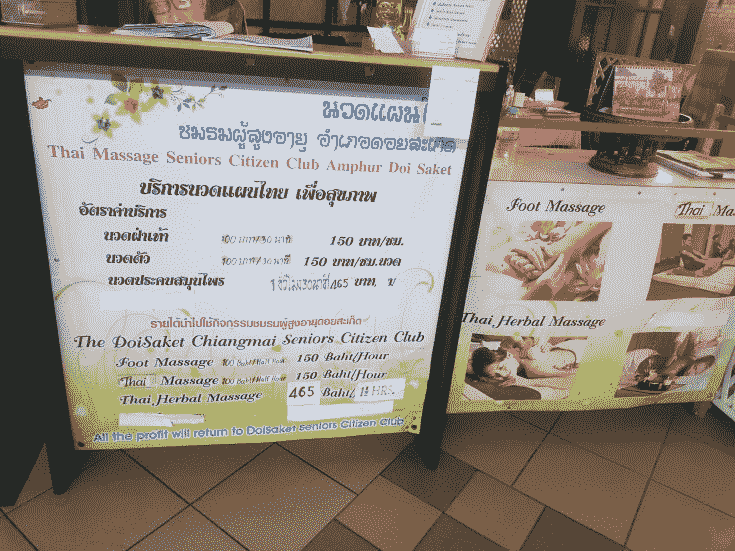
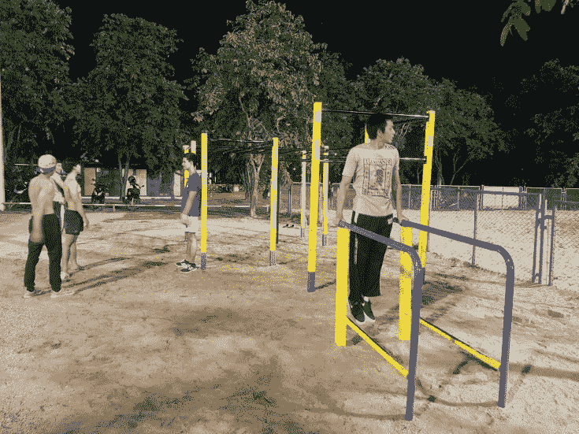
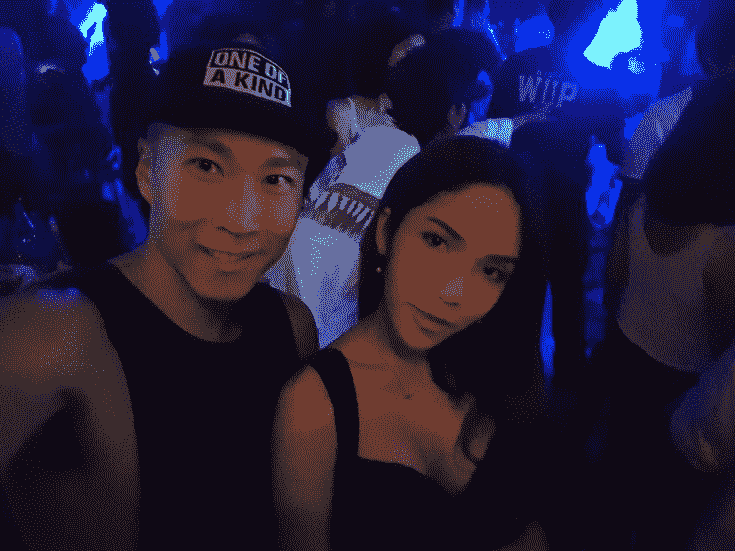
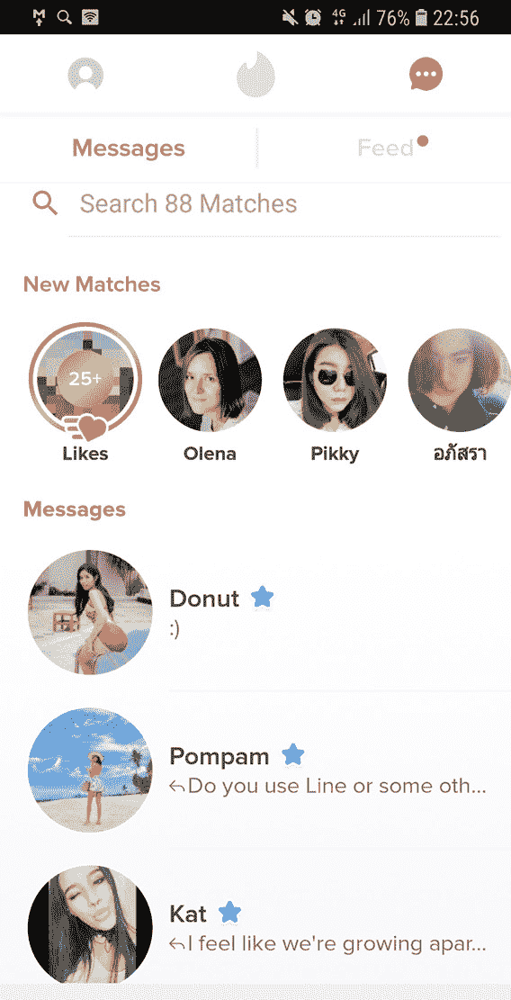

# 我为什么对目前在清迈的生活很满意

> 原文：[https://piaohanshenghuo.com/why_am_i_happy_with_my_life_in_chiang_mai/](https://piaohanshenghuo.com/why_am_i_happy_with_my_life_in_chiang_mai/)

我目前在清迈（2018年），清迈是一个让人非常舒适的城市，既可以享受城市的繁华热闹，又可以享受乡村的悠闲宁静。清迈十分国际化，不但充满了各国的游客，还有很多来自世界各地的人选择在这里用电脑远程工作，清迈被称为digital nomad capital。

清迈在Nomad List上长期排名世界第一，是一个性价比极高的城市，基础设施健全，又非常安全。

我在澳大利亚打工攒下的钱让我在泰国成了“百万富翁”，但我还是过着俭朴但舒适的生活。

来说一下我每月开销的估算（以人民币为单位）：

房租：算上水电费大概每月1000块，干净、安静又舒适的房间，靠近清迈大学，地理位置佳。

食物：我基本只吃价格实惠、干净卫生又健康的食物，除了菜，我还会吃大量的水果和坚果，喝大量的纯净水。我对食物的要求相对较高，因为健康很重要，但平均每天的花销肯定不会超过50块，一个月的开销在1000到1500块之间。

这里有几张图片来说明这里食物的价格有多便宜：

我最喜欢的素食餐厅，7块钱可以自选3个菜。

价格实惠的“高档”西餐厅，第一个鸡排89泰铢，合人民币18块，第二个汉堡+薯条69泰铢，合人民币12块。

上图中菠萝2块钱一公斤，剥皮另收1块钱，右下角的百香果一大袋一共才20块钱，荔枝8块一公斤，芒果4块一公斤。

交通：租摩托的话，Honda Click 125i，一个月2500泰铢（500人民币），可以考虑花1到3万泰铢买个二手车。我的3万公里的2013年的Honda Click 125i花了我2万3泰铢。油钱每百公里大概10块钱。交通极其方便，骑摩托想去哪就去哪，5分钟之内就可以开始上山。

网络：选择AIS 6Mbps无限流量的套餐，一年要3550泰铢，合人民币710块，每月合60块。

按摩：我最喜欢的按摩店，每小时30块，我再给20泰铢（4块钱人民币）小费，合每小时34块，一周大概3次，合100块，一个月400块。

健身房：免费，我去清迈大学里的Yellow-bar Street Workout，这里有各种单杆和一组双杠，因为我只用身体自重训练，所以这里足够我玩耍了。

另外推荐Chiang Mai Stadium，同样免费，这里的健身氛围极佳，高手如云，但离我家更远，所以平时不去。视频：https://v.qq.com/x/page/i1340dspdos.html

签证+机票：办一年的教育签证最划算，最低大概要4000人民币，把往返的机票算2000块，一年要6000块，一个月500块。

其他乱七八糟的花销：牙膏牙刷、手纸、避孕套、约会开销等等，一个月500到1000块。

总开销：一个月保守的花销大概为4000到5000块。再俭朴一点，3000块钱一个月是绝对可行的。在YouTube上搜“Thrifty Steve”，他极其俭朴，一个月居然可以只花2000块人民币，值得学习。

我用澳大利亚打工攒下的钱，完全可以在没有任何收入的情况下俭朴但舒适地过上至少5年，这让我有足够的时间在网上创业。

性生活：极其舒爽。在这个世界上平均来说亚洲姑娘是唯一一个更喜欢亚洲小伙儿的物种，泰国有很多亚洲姑娘，而且泰国小伙儿人数不足，因为很多都去当人妖或者变性了。女多男少，而且中国作为一个相对更富裕的国家，在泰国面前也能抬得起头，这让我作为一个中国小伙在两性市场上的地位得到了提高。而且我这英语一开口，泰国姑娘马上就被比下去了，处于极其被动的地位。

另外，来这的很多外国小伙儿都是奔着泰国妞来的”sex tourists”，他们有的更喜欢亚洲姑娘，有的觉得亚洲姑娘更容易搞定，所以对白人姑娘的需求就下降了，白人姑娘的身价也相对下降，而且很多在亚洲生活的白人姑娘也喜欢亚洲小伙儿，这一系列原因，让我在泰国如鱼得水。

夜生活很丰富，一周七天，每天都很热闹。上周我晚上出门打猎3次，每次都带回家了一个姑娘，她们分别来自爱尔兰、美国、德国。更重要的是，我在和一个特别性感的泰国模特的第二次约会时成功把她推倒。一周推倒了4个妞，外加一些电话号码，这对我的自信有了极大的帮助，更强的自信，意味着更强的泡妞能力，两者互利互助，形成upward spiral。相信用不了多久，我就可以成功组建我的harem，减少花在打猎上的时间，把更多精力投入在赚钱上。

<video controls="controls" width="600" height="300"><source src="https://www.piaohanshenghuo.com/wp-content/uploads/2018/08/20180809_004039_1.mp4" type="video/mp4"></video>

网上约会也很不错，原来在澳大利亚，我用Tinder很难找到match，来这之后比澳大利亚强了几十倍。

暂时分享到这里，如果你觉得这样的生活也不错的话，就赶紧行动吧。

还有疑问可以留言，我好补充。

敬请期待下一篇文章，**熬夜码字不易，别忘了通过点赞、分享、打赏等方法鼓励我更快地发表下一篇文章**。

**另外，还可以点击公众号文章底部的广告来支持我（每个成功的点击量可以帮我赚几毛钱）**。

**谢谢！**

* * *

剽悍生活UL（微信公众号)帮你从**健康、两性关系、生活方式**三个方面全面提高自己，打造理想的生活（尤其是性生活）。还可以带你看看真实的国外，长长见识。

剽悍生活的个人微信号：ycf3721，[一对一视频教学](https://piaohanshenghuo.com/1on1_coaching/)，或拉你进入[剽悍生活泡妞讨论群](https://piaohanshenghuo.com/ul-group-chat/)，请注明加我的目的。

