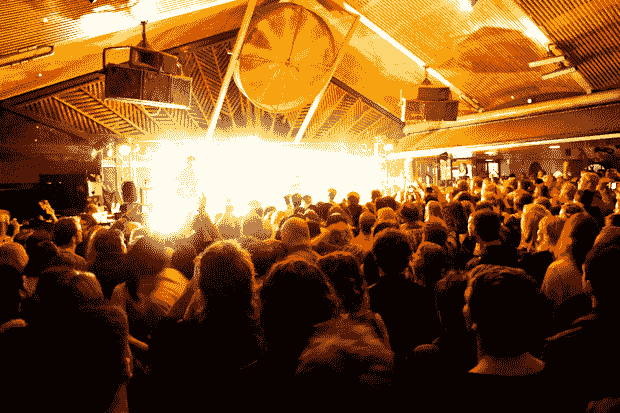
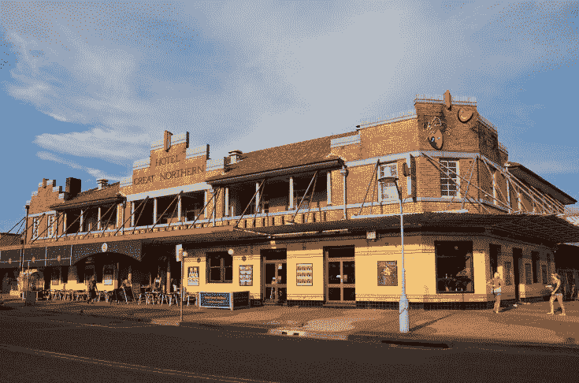
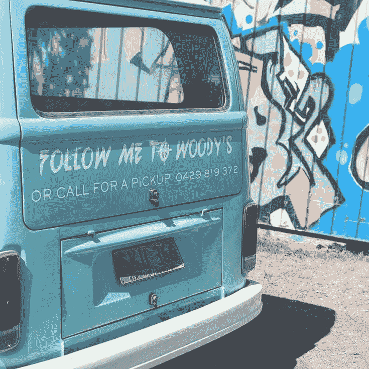
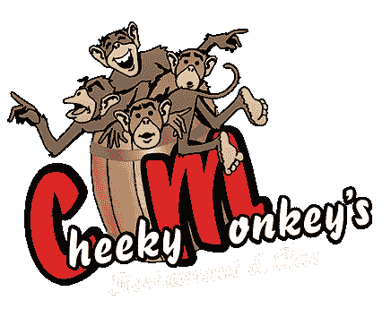
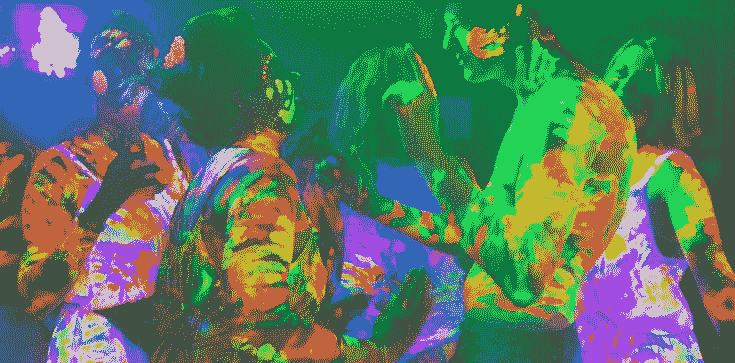
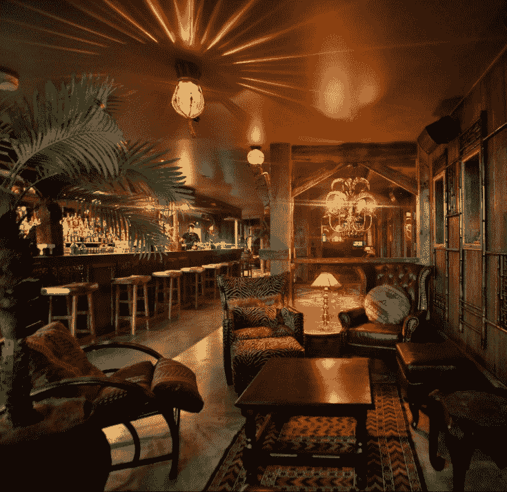
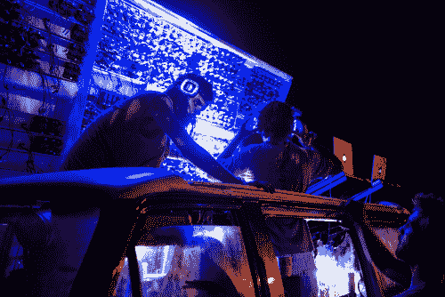
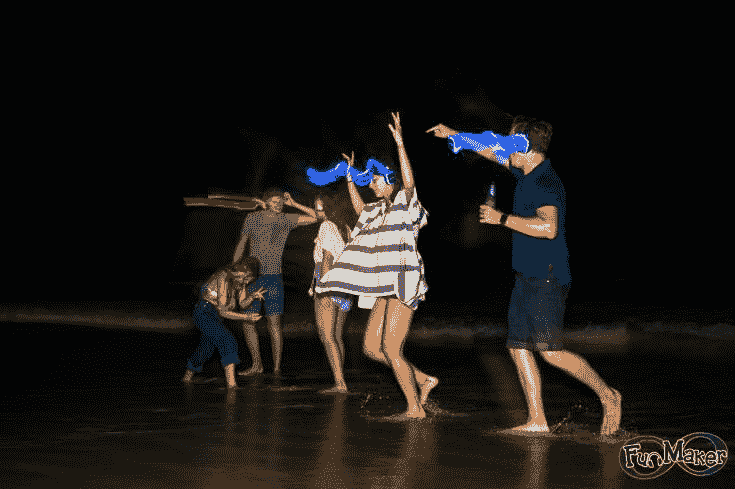
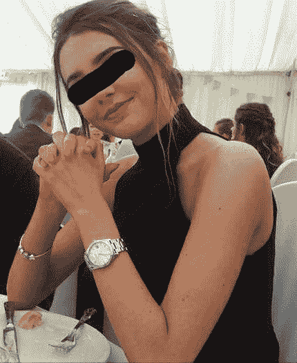

# Byron Bay拜伦湾夜生活攻略

> 原文：[https://piaohanshenghuo.com/byron_bay_night_life/](https://piaohanshenghuo.com/byron_bay_night_life/)

我在Byron Bay大概生活了2个月，Byron Bay的夜生活总体来说比Carins差很多，不但人更少，关门的时间也更早，而且很多地方关门前1小时就不可以再进去了，周日夜店关门。但是整体来说也还是很不错的，而且有自己的特色。

最主要的夜场有4个，分别为Beach Hotel, Great Northern Hotel, Woody’s和Cheeky Monkeys

** 酒吧**

**Beach Hotel（aka Beachy）**

最热闹的酒吧，半室外场地，由于没有空调，有时会比较热，舞台上有巨大的风扇。周一至周日全天开放，9PM开始热闹，凌晨12点关门。周一必去的地方，Reggae Night，5刀或10刀门票，非常热闹，很大的场地上会挤满了人。

**Great Northern Hotel**

很热闹的一个酒吧，经常有现场音乐，很多人会在门口跟着跳。外边看起来不大，里边别有洞天，经常有乐队演出。免费入场，半夜一两点关门（不固定）。

夜店：

**Woody’s**

营业时间周一到周六9PM-1PM，12AM之后就不让进了，周日休息。

10 PM 之前入场免费。是我去过的最小的夜店之一，周末会挤得水泄不通。

周三买任何酒就可以抽奖赢冲浪板。

另外晚上会有免费班车到各个青旅接人，班车还会在大概半夜12点左右在Beach Hotel等人，跟着免费班车可以免费入场。免费班车是一个teal色（又蓝又绿的亮色）的VW的KOMBI小面包，后屁股写着“FOLLOWME TO WOODY’S”。还可以打电话叫车，电话号码请见下图。

**Cheeky Monekys**

营业时间周一到周六9PM-2PM，1AM之后就不让进了，周日休息。10 PM 之前入场免费，或者在青旅搭乘免费的面包车也可以免费入场，还赠送一杯酒。

比起Woody‘s，我明显更喜欢Cheeky，地方宽敞多了，舞池设计得很有特点，活动更多，而且还晚一个小时关门。’

周一到周五具体活动请见：

> [Home](http://cheekymonkeys.com.au/)

<iframe class="wp-embedded-content" sandbox="allow-scripts" security="restricted" style="position: absolute; clip: rect(1px, 1px, 1px, 1px);" src="https://cheekymonkeys.com.au/embed/#?secret=98727zr3P6" data-secret="98727zr3P6" width="600" height="338" title="“Home” — Cheeky Monkey's Restaurant &amp; Bar" frameborder="0" marginwidth="0" marginheight="0" scrolling="no"></iframe>

需要注意的是周五有paint party，大家互相往身上抹颜料，最好不要穿好衣服，以免被误伤。

**其他夜场：**

**Railway Friendly Bar**

其实也经常是很热闹的，有好几个台球桌，3刀打一桌台球。不过party气息不浓，半夜12点关门，路过时可以去看一眼。

**Sticky Wicket**

一楼是sports bar, 二楼的夜店开的时间很不固定，人也不是很多。就在Great Northern Hotel对面，可以顺便去看看。

**La La Land**

地理位置稍微偏了一点，导致大部分时间人都不多，内部装修很不错，比其他的地方都要好，适合两人约会。

**Arts Factory Lodge**

我住的青旅，全Byron Bay hippies最多的地方，每周二晚8点开始有talent show才艺展示，会有很多现场的表演，演出结束后还会有很多人表演乐器，唱歌，大家围着跳舞，氛围非常好。画风是这样的（我在树上拍的）：

视频：https://v.qq.com/x/page/s07113g7h2d.html

**Main Beach**

别忽视了沙滩，晚上经常有很多玩火的hippies，还会有人演奏乐器或带音箱在海边开party。

视频：https://v.qq.com/x/page/x0711ynibgd.html

周末有silent disco，DJ在一个小面包车的车顶打碟，没有音响，需要租他们的耳机，耳机有三个频道，人们在沙滩上随着耳机里的节奏摇摆。

沙滩是个好地方，等夜店都关门了，还想party的人都会去海边。海边黑黑的，很容易带姑娘去隐蔽的地方。沙滩是我的风水宝地，我不但在此推到了一个日本妞，还带回家了一个苏格兰妞：）

本攻略暂时就写这么多，如果有其他疑问，欢迎留言，我可以日后继续补充。

