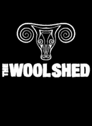
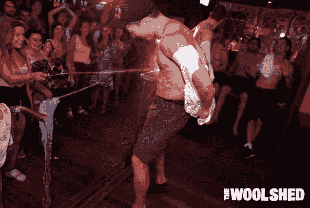
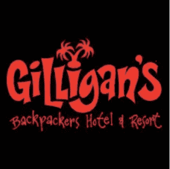
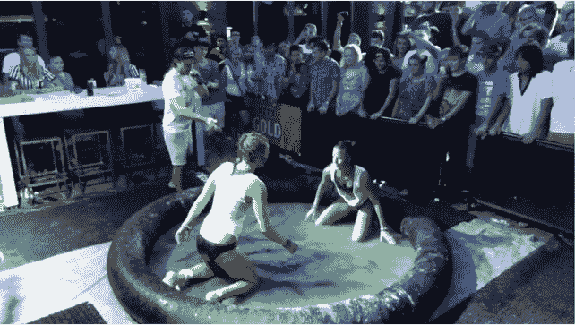
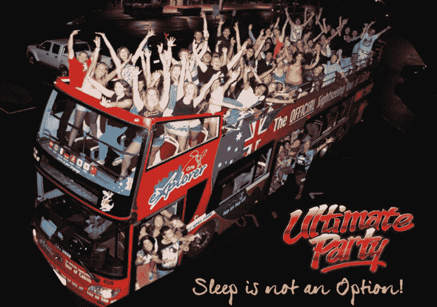
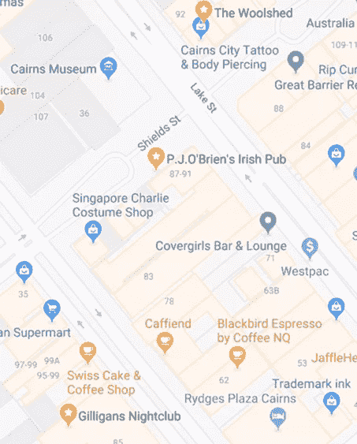
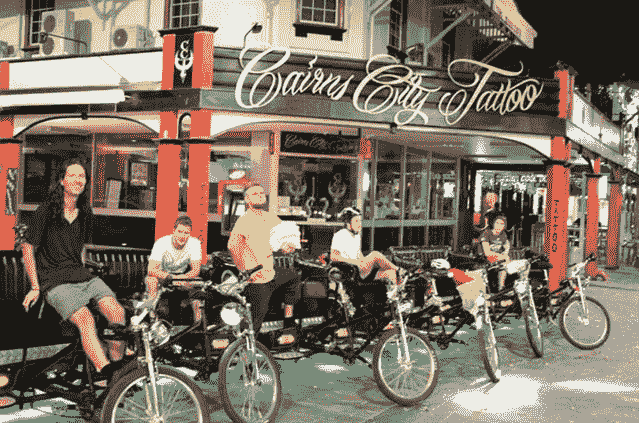
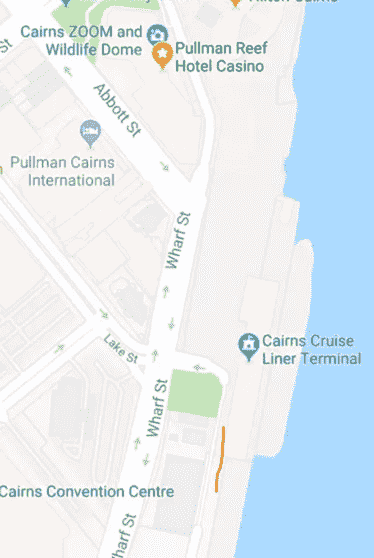

# Cairns凯恩斯夜生活终极攻略

> 原文：[https://piaohanshenghuo.com/cairns_night_life/](https://piaohanshenghuo.com/cairns_night_life/)

Cairns的夜生活在全澳大利亚都是有名的。我在Cairns前前后后生活了大概一年的时间，本身就做夜生活的工作，不工作的晚上也经常出门泡妞，所以可以说是非常了解Cairns的夜生活。

为了节约你的阅读时间，如果你出门的目的和我一样只有泡妞，又想节约用钱，只需要去Woolshed，Giligan’s和P.J. O’Brien，另外周一要去Salt House，可以不需要考虑其他地方。前三个地方也是本文将重点讲的地方。

注意，澳大利亚几乎所有的夜场入场时都要查ID，所以出门别忘了带护照和安全套。

**夜店：**

主要的夜店就两家：Woolshed (又称Cotton Club)和Giligan’s (简称Gili’s)。名叫Empire (Heritage)的夜店已经关门，不知道会不会再开。

**Woolshed**

Woolshed是其中比较小的一家夜店，一共两层，二楼更大一点，大部分人也都在二楼。营业时间是每天9PM-3AM。

需要交5刀入场费，但如果你经常去，和保安处好关系，可以免费进，我就都是免费进。否则你还可以去靠近Esplanade的麦当劳附近卖didgeridoo的那家店附近，每天下午基本都会有个姑娘发纸手环，凭手环就可以当晚免费入场。或者如果你住在青旅，晚上会经常有人来发纸手环。入场时保安会在你手背上盖个章，这样你今晚就可以自由出入这家夜店了。

周一是Industry Night.从事服务业的，尤其是bartender们一般周一都放假。Woolshed明显比Gili人多，因为周一所有的人都会去Salt House，Salt House离Woolshed更近，所以人们自然就都来Woolshed了。

周二半夜12点有Male Wet T-shirt Competition，据说整个澳大利亚就这一家夜店有男生的比赛。

一等奖是价值200刀的一日游，二三等奖都是50刀现金，我很遗憾地和冠军擦肩而过，不过我已经赚了100刀了，我的亚洲面孔几乎第一次帮到了我。这里本来亚洲人就少，我从来没见过其他亚洲人上过台。所以如果你有勇气上台，你的亚洲脸本身就能加分。

比赛主要比谁更不要脸，一共分两轮，第一轮是淘汰赛，从所有的参赛者中选出三位观众呼声最高的进入第二轮决赛，决赛再通过观众的呼声和裁判的偏向选出冠亚季军。

周三半夜12点是姑娘的Wet T-shirt Competition，经常有光膀子的姑娘。

周四是Ladies Night，姑娘有免费的酒喝。

周五周六自然是最热闹的时候，即使没有任何节目都是人满为患。

周日也算是Ladies Night，姑娘有免费的酒喝。

周一到周日的具体主题请见[官网](http://www.thewoolshed.com.au/party-seven-nights-a-week/)。

**Giligan’s:**

Giligan’s是最大的夜店，同时又是青旅和旅馆。酒吧区域白天就一直开放，所以晚上没有正式开业时间，9,10点开始慢慢热闹，同样是每天凌晨3点关门。

周日到周三免费入场，周四5刀，周五周六10刀，大概9点还是10点之前去可以免费入场，不过你再出来再进去就得收费了。有特殊活动一般至少20刀入场费。同样交钱入场后保安会给你盖章，当晚可以自由出入。但一般2.30AM之后就不让再进了。周日到周四可以自己接水喝，不需要麻烦bartender，非常方便。

二楼是叫Attic的夜店，和Giligan’s是一家，可以自由通行，相对来说更fancy一点儿，dress code要求更高一点，不过其实穿拖鞋都可以进，就是不可以戴帽子，只有周五周六开门。

如果你要住青旅又想泡妞，Gili是最好的地方。住这里的大部分人都是来party的，我一位阿根廷的朋友在这里做House Keeping，他说每天基本每两三个房间就能发现地上的避孕套。由于我都是住民宅里的单间，没有亲身住过。

周一门可罗雀，因为基本所有人都去Salt House，然后去Woolshed。

周二有Wildlife Show，可以亲身拿着小鳄鱼和蛇，还有姑娘的Wet T-shirt Competition，半夜12点开始。

周三是姑娘的Jelly Wrestling，半夜十二点，参赛的两个姑娘在一个充满jelly（像果冻一样滑不唧溜的东西）的小型充气游泳池里摔跤，先拿到对方脚踝上绳子的人获胜，失败方可以脱一件衣服继续战斗，脱下胸罩是经常发生的。

周四同样是Ladies night，有Pole Dancing Competition（钢管舞比赛）。

周五周六人满为患，需要注意的一点是**男生周五周六穿砍袖的衣服会被拒绝入场**，记住这一点，省着你到时候进不去。因为地方大，周五周六这里的人是最多的。

周日是最大型的姑娘的Wet T-shirt Competition，周日一般Giligan’s会比Woolshed热闹。另外周日下午Gili的泳池边会有DJ打碟，会有一群美女在泳池边。我周日下午在隔壁的Rusty’s Market买水果蔬菜时，总是能听到Giligan’s传来的音乐。

我虽然在Woolshed泡到了更多的妞，但还是更喜欢Giligan’s。

**酒吧：**

主要的酒吧有三家：Salt House, Pier Bar和 P.J. O’brien’s，其他的酒吧没太大必要去，比如Rattle N Hum, The Jack(偶尔有人开个小型的演唱会，会很热闹, 有live music), Downunder Bar(台球酒吧), Kezz Bar（在倒闭的名叫Liquid的夜店基础上重新开的半酒吧半夜店的一个地方，人很少，没必要去），Cock & Bull (太远，不用去)。

**Salt House：**

周一必去的地方，免费入场，酒水特价，人满为患，半夜一点关门之后去Woolshed。

**Pier Bar:**

最有名的酒吧之一，免费入场，价格相对贵一点，姑娘相对也能好看一点，不过离中心地段的夜店远一点（大概10分钟步行），大概半夜1点就没人了。

**P.J. O’Brien:**

最热闹的爱尔兰酒吧，免费入场，位置好，就在两大夜店中间，从一个夜店到另一个夜店时正好路过，顺便进去看看有没有猎物。

周二有钢管舞比赛。

周三是Karaoke Night，可以去唱卡拉OK，唱得好还能得奖。

**唯一的一家赌场：****Reef Casino**

凌晨5点关门。在夜店三点关门后还不想回家的，可以去这个唯一继续营业的娱乐场所。周末酒吧区域人满为患，有live music，现场的乐队。唯一一个不需要ID，只要看起来够老就可以进去的地方。

**唯一的一家Strip Club**** ： Cover Girls**

贼贵，从来没进去过，我在街上倒是搭讪过至少5位里边跳脱衣舞的姑娘。

**Party Bus**

每周三、周六，有一个double-decker party bus，把一群party people从一个夜场送到另一个，价格40刀，包含大巴接送的费用，刚开始还有披萨可以吃，还可以免费进入很多夜场，每个夜场还可以免费喝一杯入门级的酒，还有机会中奖。

介绍的视频在这里（在中国需要VPN才能看）：

<iframe src="//www.youtube.com/embed/sgI9oucy-W0" width="560" height="314" allowfullscreen="allowfullscreen"></iframe>

网上订票地址：

> [Parties](http://www.ultimatepartycairns.com/parties/)

<iframe class="wp-embedded-content" sandbox="allow-scripts" security="restricted" style="position: absolute; clip: rect(1px, 1px, 1px, 1px);" src="https://www.ultimatepartycairns.com/parties/embed/#?secret=UwoSZe6dRd" data-secret="UwoSZe6dRd" width="600" height="338" title="“Parties” — Ultimate Party" frameborder="0" marginwidth="0" marginheight="0" scrolling="no"></iframe>

我一般都是只去Woolshed，Giligan’s和P.J. Obrien’s，因为大部分人都会集中在这里，而且它们互相离得都不远，完全在5分钟的步行之内。

交通方面，如果不想走路，骑车或需要带姑娘回家，可以选择Uber，计程车或者pedicab（带音乐的人力三轮车），三者的价格依次递增。带姑娘回家不建议用Uber，需要等车，以免把姑娘的热情等没，最好还是马上打个车。计程车有专门的侯车点，主要的点分别为赌场正门、Giligan’s门口，主公交站旁边（Lake St，这是最大的计程车候车点）。

如果你特别浪漫又不差钱，而且明显生米煮成熟饭，可以选择人力三轮车，播放情歌回家。价格：10刀一位（如果不远的话），可以讨价还价。

如果你和姑娘都没有自己的房间，想找一个室外僻静又浪漫的地方，我强烈推荐下图中红线的位置（赌场后门Abbott St向东一直走，走到轮船码头右拐再走一点点）。那边晚上基本没人，又有一面大概一米多一点高的小墙，你和姑娘在小墙后边会很隐蔽，而且附近还有个可以免费喝水的water fountain，让你可以进行持久战。别问我是怎么知道的。

最后送上一段土著妇女的舞蹈：https://v.qq.com/x/page/z0711jpl0al.html

本攻略暂时就写这么多，如果有其他疑问，欢迎留言，我可以日后继续补充。

