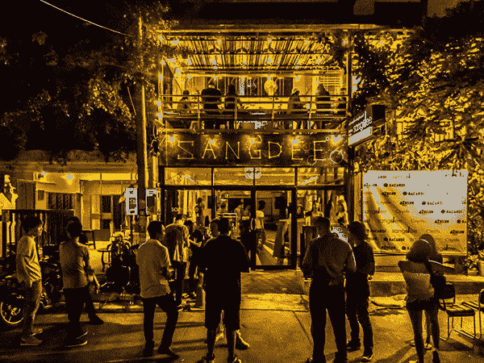

# 清迈夜生活攻略

> 原文：[https://piaohanshenghuo.com/chiangmai_night_life/](https://piaohanshenghuo.com/chiangmai_night_life/)

我来清迈有一个半月的时间，通过晚上出门打猎推倒了9个姑娘，下面来介绍一下我经常去的地方。我只去几个固定的地方，因为只有在这些地方才能遇到大量洋妞。

9PM-12AM去Zoe in Yellow:

免费入场，整个区域有很多酒吧，Zoe是其中最热闹的地方，Zoe有两个场地，场地中间的过道也经常人满为患，而且过道是我最喜欢搭讪姑娘的地方。Zoe就本身硬件配置来说应该是我最讨厌的夜店，因为音乐声音特别大，没法聊天，而且有不断闪烁的刺眼的白光，我一般在里边待一分钟就难受，我只会在中间过道看不到美女的时候进去找，找到后我会努力把美女带到过道聊天。

整个区域开到半夜12点就关门了。

视频地址：

https://v.qq.com/x/page/u0702zw8qoc.html

* * *

12AM-1AM去Spicy:

大部分在Zoe还没玩够的人都会去Spicy, 步行5-10分钟的距离。

入场费：100泰铢，你可以花100泰铢现场买一杯酒或者100泰铢买一张入场券，凭酒或入场券入场，入场后可以用入场券再换一杯酒。

我经常免费入场，我的做法是：买完入场券后留着不用（入场券有两种颜色，每天交替使用不同的颜色，上边有日期，过期作废）。我事先弄清楚当天入场券的颜色，拿出我相应颜色的入场券，用拇指盖住日期，自然地出示入场券并微笑，保安随便扫一眼就让我过去了。

Spicy的音乐音量不大，可以聊天，地方也不大，周末会很拥挤。里边大概的样子请看我拍的短视频：

https://v.qq.com/x/page/b0702zb0u3g.html

https://v.qq.com/x/page/r0702s1msd1.html

Spicy在半夜1点到1点1刻左右关门。

* * *

半夜1点之后有两个选择，一是Sangdee，二是Las Vegas:

我更喜欢Sangdee, 因为首先Sangdee离Spicy有5分钟车程，大部分Spicy的人都不会去Sangdee，我在Zoe和Spicy基本会把所有我感兴趣的美女搭讪遍，去Sangdee可以遇到不同的美女，而且这里有很多长期住在清迈的洋妞。而且Sangdee免费入场，音乐声音小，容易聊天，又有安静隐蔽的二楼，方便把美女和她的朋友隔离，好下手。

Las Vegas离Spicy很近，大概要步行5分钟，100泰铢入场券，入场后凭券换一杯酒。你会遇到很多在Spicy还没玩够的人。

另外值得一提的是北门的The North Gate Jazz Co-Op, 现场爵士乐，每天一直开到半夜12点，周二晚上open mic, 因为没有Zoe洋妞多，所以我一般不去。

另外如果你会泰语又对泰国妞很感兴趣，可以选择去Warm Up Café，免费入场，99%的泰国人，场地大，人非常多，半夜1点关门。关门后很多泰国人会去街对面的小吃一条街继续聚会。

再列举几个你会遇到大量泰国本地人的夜场：Infinity, Sound up, Differ Inc, Take It Club, Living Machine.

本攻略到此为止。

**连夜码字不易，如果本文对你有帮助，想免费表示支持，不妨多花几秒钟的时间，在公众号文章底部的广告上点一下，我就能有大概一块钱的收入。**

**当然也欢迎你分享本文，更欢迎你打赏，谢谢支持**。

**你的支持可以鼓励我创作出更多有价值的文章供你阅读。**

* * *

剽悍生活UL(微信公众号)分享关于**两性关系**、**自我提升**、**数字游民的生活方式**的原创内容，帮你过上更理想的生活（尤其是性生活）。

剽悍生活的个人微信号：ycf3721，[一对一视频教学](https://piaohanshenghuo.com/1on1_coaching/)，或拉你进入[剽悍生活泡妞讨论群](https://piaohanshenghuo.com/ul-wechat-group/)，请注明加我的目的。

