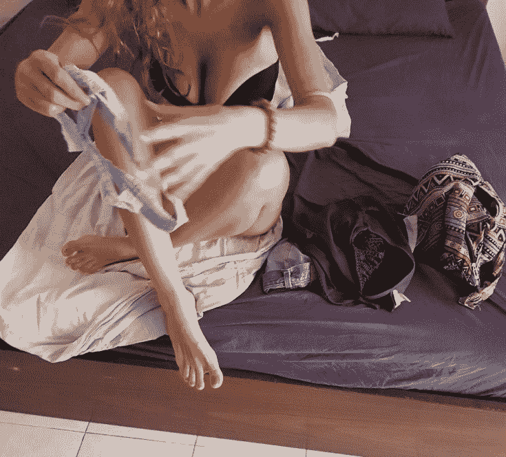

# 提升把妹水平最需要做的一件事情

> 原文：[https://piaohanshenghuo.com/the_most_important_thing_to_do_to_improve_your_game/](https://piaohanshenghuo.com/the_most_important_thing_to_do_to_improve_your_game/)

四个字：**行动起来**。

行动起来实践意味着你要抓住各个生活中的小机会和姑娘聊天。意味着你要真正开始接触姑娘，而不是光在家里学习理论（大部分人都不付出行动）。你以为理论学多了你就不会丢人了？实际上刚开始你肯定会犯很多错，丢很多人，但who他妈cares? 你会成长很多。

接触姑娘基本上有4个途径：day game, night game, online game, social circle.

**Day game**是指在日常生活中搭讪你所遇见的任何吸引你的姑娘，可以在任何场所：购物中心、音乐节、菜市场、超市、马路上等等。我一般都会比较直接，告诉她们我为什么要和她们说话。或者通过当下的情景打开话题，但我很快会让她知道她有吸引到我。我不喜欢拐弯抹角地问路之类的bullshit。别想着等完美的时机，往往你等一等就没时机了。

不建议到处溜达几小时就为了搭讪美女，这样效率不高，建议你在日常生活中顺便搭讪，这样一举两得。

**Night game**是指晚上在夜店、酒吧等场所搭讪姑娘。是我最喜欢的也成功率最高的途径，原因有几点：

1.绝大部分姑娘都打扮好了等着遇到合适的人，其中不乏很多当晚就DTF(down to fuck)的姑娘，也许她在等的不是你，但她在等某个人，你不搭讪她怎么会知道？

2.姑娘体内的酒精帮助你降低难度，又给了姑娘一个和你上床的借口（我喝多了，他乘人之危）。

3.夜场的美女密度高，寻找美女的时间成本低，效率高。

很多人对夜场有偏见，像我们父母那一辈的人告诉我们只有坏孩子才去夜场。不过在欧美基本所有人都去，亚洲也普及得很快。夜场是很正常的社交场所，你可以遇到素质很高的姑娘。刚去夜场时你可能会感到很害怕、很不自在，这是很正常的，关键在于坚持和调整心态，慢慢建立起自信和强大的内心。

去夜场不非得等和朋友一起去，你可能会害怕自己去像傻子一样，但自己去更锻炼人，我就大部分时间都是自己出门打猎，灵活又机动。

另外去夜场不一定要花钱，像我就基本从来不喝酒，省钱、健康、又不会降低记忆力（有助于反思当晚的得失），我顶多在个别夜店花个入场费、给明显有戏的姑娘买杯酒。

大多数人是以玩儿的心态去的，你要偏重学习的心态，花点儿钱就当交学费了也是值得的。

**Online game**指网上约会，国际流行的主要有**[Tinder](https://www.piaohanshenghuo.com/tinder_guide/)**和Bumble，如果你在国外的大城市，还可以尝试POF, OK CUPID, Hapend, Hinge，国内是陌陌和探探（Tinder中国剽窃版）。不推荐花过多时间在这上，除非你的照片特别出众。即使那样，你也在和成百上千的人争抢一个姑娘的注意力。如果你看过一个漂亮姑娘的手机约会软件，你就知道了。你发一个消息，最有可能的发生的就是石沉大海，第二有可能发生的是要等很久很久才得到回复。我建议不要花几个小时用在和一个姑娘发文字信息上，真的不划算。建议在收到回复的瞬间立刻给姑娘打电话，争取把她约出来。

**Social circle**指社交圈子，朋友的朋友，通过和朋友的聚会认识。我个人不用这种方法，因为我不喜欢花很多时间在乱七八糟的聚会上。而且如果在一个姑娘身上搞砸了的话，会造成不必要的尴尬，会波及到整个朋友圈子。不过这是一个最常见的、普遍的男女朋友认识的方式。通过朋友的朋友，姑娘无形之中对你多了一层信任，还可以让朋友帮忙说好话。

在实践的基础上再学习必要的理论才是正确的学习方式，理论实在太多。网上的资料五花八门，鱼龙混杂，大部分都是经不起实践考验的。

David X说过一句话”Opinions are like assholes, everybody got one.”（观点就像屁眼儿一样，每个人都有。）把妹建议有很多，就像饮食计划一样，如果你谁都听，都试的话，肯定是没有效果的。先抓住一个你认为合理的、喜欢的（比如我的），真正地去实践。记住，一定要去实践，我就很后悔当初学了一堆乱七八糟的理论而没有实践，结果实际的泡妞水平基本一点儿都没有提高，直到我开始行动。泡妞不是开卷考试，需要你实时的机智应答，只有不断实践、反省、纠正错误才能不断进步。

现在是周末，是最好的行动时间，吃完晚饭就出门打猎吧。

下图是我昨晚的战果，23岁的意大利妞，她说她13岁时胸就这么大了，男老师经常盯着她的胸。

与你共勉，加油！

