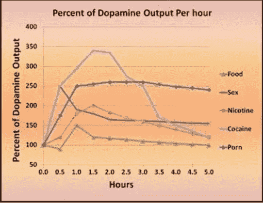
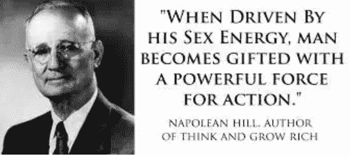
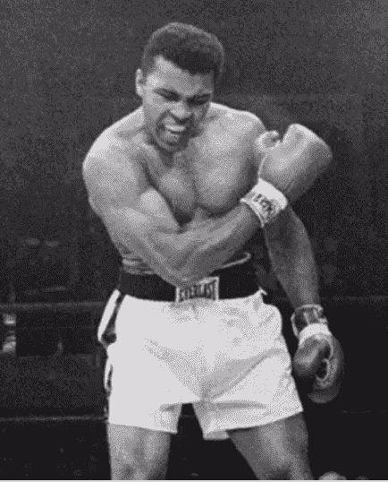
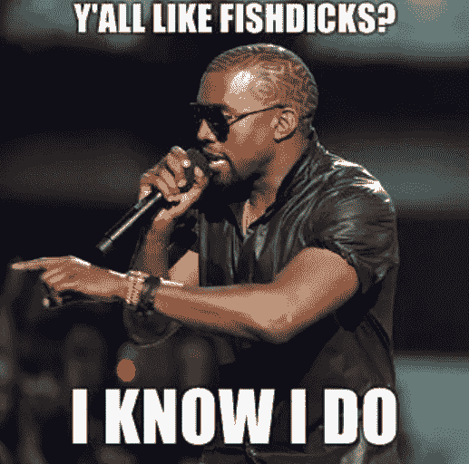
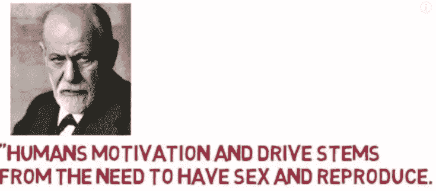

# 我为什么终于决定要少看黄片少手淫（如何戒撸）

> 原文：[https://piaohanshenghuo.com/why_nofap/](https://piaohanshenghuo.com/why_nofap/)

记得我第一次看黄片大概是在小学的后期，家里有个VCD播放机，一天爸妈把黄片落在播放机里了，我意外地发现了宝藏。趁他俩不在家赶紧如饥似渴地开看，小弟弟反应很快，但我连什么是撸管都不知道，只知道黄片很好看，我很兴奋。刚爽了不到10分钟，我就听到了爸妈开门的声音，我心脏跳得飞快，紧张得不行，感觉自己犯了自出生以来最大的错。在大概僵住了1秒之后，我赶紧拿遥控器把电视调回了正常的频道。可是我还是露出了马脚，爸妈马上讨论我是不是看了，倒也没有逼问我，这件事就这么过去了。

后来因为我学习成绩还不错，作为奖励，我拥有了自己的电脑，刚开始我只是单纯地用来玩游戏。后来我自然地学会了用电脑看黄片。

作为一个黄片爱好者，我硬盘里有几百个GB经过精挑细选的黄片，印象中，多年来我好像从来没有超过一周不看黄片加撸管的时候，有时候一天要撸2次或更多。以前还要用种子下载很久，现如今如果有[V.P.N](https://fanguoweiqiang.com/fq/)或者在国外，瞬间就可以去PornHub之类的网站在线看，真是越来越方便了。期间我也有看到了很多关于撸管伤身之类的骗人的文章，完全没有让我停止看黄片加撸管的想法。

国外有个主张叫做“NO FAP”，就是不看黄片不撸管的意思，通常人们会开始做一个“No fap challenge”，就是在一定时间内不看黄片不撸管的挑战，一周、两周、一个月、三个月、半年等等。之前我也听说了，但是没当回事，因为边看各种极品美女的裸体边撸管对我来说完全是人生的一大快事，我才不想放弃。把不撸管作为挑战对我来说一点也不假，因为快感触手可及而且完全免费。

直到有一天我带了一个韩国姑娘回家，结果硬不起来。虽然我可以找出很多借口，比如我对亚洲妞越来越不感兴趣，她不愿意给我BJ, 她像只海星一样躺在床上一动不动等等，但我还是不应该硬不起来。我不抽烟，不喝酒，饮食健康，经常锻炼身体，而且十分好色，这种硬不起来的情况从来没有发生过。这次意外实在对我打击不小，难道我已经老了？而且这岂不是影响了韩国姑娘对中国小伙儿的整体印象？会不会影响到中韩的外交关系？怪我怪我都怪我。

在这次意外发生后，我就开始做了大量调查，想找到问题的原因，不知不觉又回到了黄片和撸管这件事上来。

虽然大家平时很少提及，但是黄片已经成为了非常主流的东西。大概30%的网络下载都和黄片有关。世界最大的黄片网站Pornhub的数据显示：仅2016一年全球共观看约46亿小时，超过230亿的访问量，31亿GB的流量，92亿个视频。这还仅仅是这一家黄片网站。

显然，黄片已经成为了全球范围内非常流行的存在。但我们的进化还完全没有做好准备。想象一下原始人要找到一个心仪的异性交配是件多么麻烦的事情，还很有可能需要冒着生命危险。而现在只需要轻轻动动手指就可以**随时**和**各种各样的全新的极品美女**进行“交配”。很多人因此放弃了现实世界中麻烦的程序。

我有一个美国的同事，性格很好，但每天大部分时间除了上班就是打游戏，当我们面前有美女路过时他无动于衷，我问他：“你不喜欢美女吗？”他说：“不是特别感兴趣。”我又问了他一大串问题，结果发现他基本每天都会看黄片撸管，对现实世界的美女不感兴趣是因为他觉得把他们搞到手太麻烦了。我相信这种逃避现实的人绝对大有人在，我过去就是其中一员。

日本作为黄片大国，年轻人却很少做爱，调查显示，18到34岁的日本人中，**43%**的人还从来没有做过爱，占了将近一半的人口。详情请看下方的BBC视频：

http://www.bbc.com/news/av/world-asia-40511655/japanese-young-people-not-having-sex

我们体内有一种叫多巴胺（Dopamine）的化学物质，多巴胺帮助大脑寻找奖励，提供把事情做成的动力。当你完成某事时（锻炼身体、工作、吃冰淇淋、撸管……）你的大脑会奖励你多巴胺。没有了多巴胺，你会失去所有的动力。

科学家曾经做过实验，当小鼠触碰一个开关的时候，电极会给小鼠大脑一种愉悦的刺激，这个刺激比任何自然的刺激都更加强烈。结果小鼠一直按开关（每小时按了7000下），甚至放弃了喝水和进食，雄鼠会放弃发情的雌鼠，雌鼠会放弃待哺的幼鼠，一直触碰开关，直到精疲力尽。

如今的黄片，你只需要动一动手指，你可以将多巴胺的水平提高到和使用毒品时相似的程度。不同于毒品的是，你可以持续用大量不同的黄片长时间刺激大脑，毒品却不能使用过度。

大量的多巴胺会让你的大脑降低多巴胺受体（dopamine receptors）来维持平衡，多巴胺水平因此会降低，多巴胺提供我们做事的动力，更低的多巴胺意味着我们会更没有动力去做事情。

实验把小鼠的多巴胺受体关闭，发现小鼠会变得异常懒惰，甚至不愿意食用放在面前的食物，直至饿死。

当我们观看大量黄片时，我们无意中伤害了我们的多巴胺受体，我们因此会受到很多负面的影响。

让我列举一下看黄片撸管的坏处：

身体上：**疲劳**、敏感度降低、降低性欲、容易在真实的性爱中**阳痿**（因为你看了过多极品的身材，现实中在你床上的女人可能会差很远。）

心理上：没自信，没精神，**没动力**，难以集中注意力，消沉，**社交焦虑**，降低对真实性伴侣的渴望。

上瘾、**花费大量时间**：想一想我累积花在黄片上的时间应该有整整好几个月，尤其是过去，找黄片，下载黄片都很费时间。有这时间，如果我全部用在搭讪美女上，如果平均一个小时搭讪一位的话，一天的时间就有24位，一周就有168位，从168位中找到一位推倒还是非常有可能的。

很多上述的坏处可能短时间内不会显现，但不代表他们不存在。我已经真实地感受到了很多的消极影响。

比起坏处，更让我心动的是NO FAP带来的好处，我接触到了一个新的名词“sexual transmutation（性转化）”，指的是把对性的欲望和能量转化为其他的表达方式。

知名畅销书”Think & Grow Rich”的作者Napolean Hill, 在书中提到：**对性的渴望是人类最强大的渴望**，当被性渴望所驱动时，人可以发展出平时无法拥有的想象力、勇气、毅力、创造力。当合理运用、转化性渴望时，这股能量可以被运用在艺术、体育等其他方面，当然也包括对财富的积累。

“当被性能量所驱动时，人被赋予强大的行动力。” —— Napolean Hill

拳王阿里的教练说：“有个小孩名叫Cassius Clay（阿里的真名），如果你每次都赌他会赢得比赛，你将会成为一个非常富有的人。我相信这归功于他对性的控制。”

著名说唱歌手Kanye West说过：“很多人都问我哪来的那么多动力。我认为动力来自我在很小的时候就对性成瘾。看看人们对买新衣服、做新发型、在寒冷的半夜3点还待在夜店里的动力，看看他们会愿意去的各种不同的泡妞地点。如果你可以把那些时间精力用在更有价值的东西上，投入到工作上……”

著名心理学家弗洛伊德（Freud）说过：“人类的动力来自于对性爱和传宗接代的需要。”

**我们的DNA最重要的任务就是传宗接代。当我们成天对着黄片撸管的时候，我们在欺骗大脑，告诉大脑我们正在广泛撒种。我们的大脑相信我们已经妻妾成群，我们为什么还需要采取大量行动？为什么需要锻炼身体？为什么需要赚钱？为什么需要锻炼社交能力？为什么需要不断提高自己？**

对于一个对撸管上瘾的人，要让他不撸管，说起来容易，做起来难。尤其是如果长时间泡不到妞，再不能撸管，实在是件痛苦的事情。而且长时间不射精还会增加患前列腺癌的几率。

我个人觉得最好的办法是可以**把撸管作为一种奖励**，很多人奖励自己吃大餐、甜点，为什么不可以奖励自己撸管的资格。如果你采取了大量的行动，比如坚持锻炼了一周、坚持出门搭讪了一周、坚持健康的饮食一周，坚持努力工作一周，奖励自己一次撸管也未尝不可。

如果要撸管，最好在睡前撸，这样会把对整天的消极影响减到最低。

**无论你看再精彩的黄片，撸再长的时间，射了之后也一样会感觉很空虚。但如果你在真实世界中经历过种种考验，终于获得了你想要的性爱，你会感觉非常满足，充满成就感。**你会越来越自信，因此越来越有魅力，因此吸引异性的能力越来越强……形成一个良性循环。

最流行、有效的”no fap challege”是90天不看黄片不撸管。对大部分人来说很难，但又可以实现。从我发表这篇文章的今天起，我要发起新一轮的挑战，欢迎和我一起接受挑战。

如下两个网站有大量关于黄片和撸管对人的影响的知识，如果你感兴趣，可以去看看：

www.yourbrainonporn.com

www.nofap.com

真正治本的戒撸方法只有一个：**找到愿意和你上床的女人，当你经历了真正的高质量的性生活（被榨干）之后，你完全不会有想看片儿、撸管的想法**。

敬请期待下一篇文章，**熬夜码字不易，如果本文对你有帮助，想免费表示支持，不妨多花几秒钟的时间，[在公众号文章](https://mp.weixin.qq.com/s?__biz=MzIwNjgyMzMzOQ==&mid=2247484835&idx=1&sn=df3412880df74ae6e6eadada92d8235d&chksm=971a8f67a06d0671d5407ce95f334246aaed525179b6425bc756a087e2d99914a211fedc543b&token=474145557&lang=zh_CN#rd)底部的广告上点一下，我就能有大概一块钱的收入。**

**当然也欢迎你分享本文，更欢迎你打赏，谢谢支持**。

**你的支持可以鼓励我创作出更多有价值的文章供你阅读。**

* * *

剽悍生活UL(微信公众号)分享关于**两性关系**、**自我提升**、**数字游民的生活方式**的原创内容，帮你过上更理想的生活（尤其是性生活）。

剽悍生活的个人微信号：ycf3721，[一对一视频教学](https://piaohanshenghuo.com/1on1_coaching/)，或拉你进入[剽悍生活泡妞讨论群](https://piaohanshenghuo.com/ul-wechat-group/)，请注明加我的目的。

