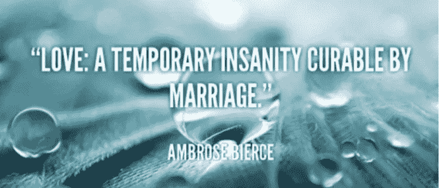
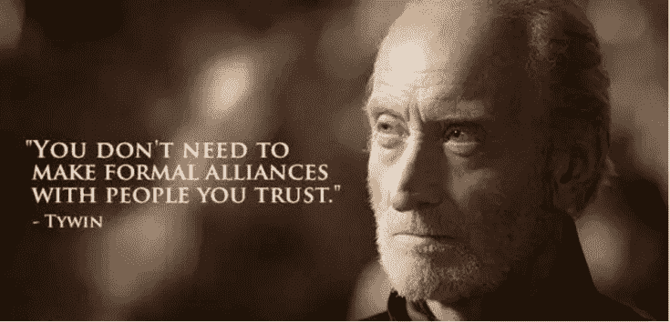
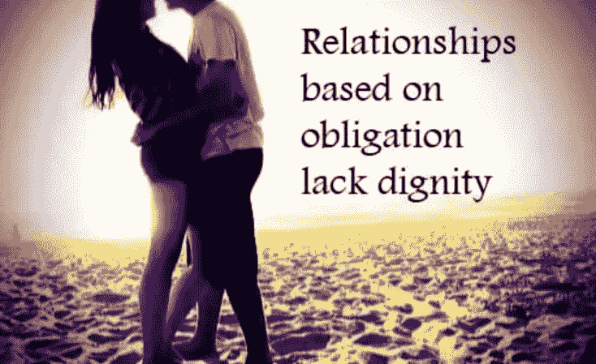
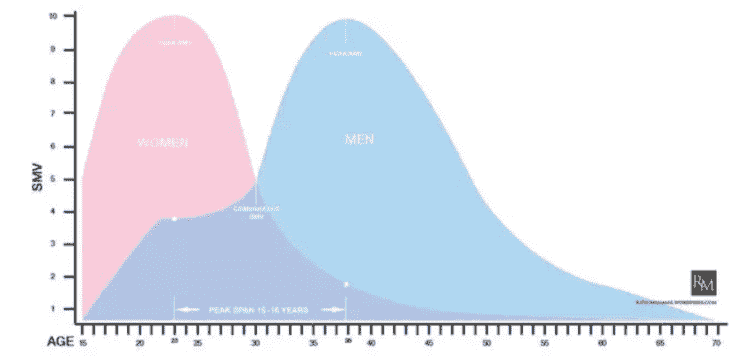

# 为什么不应该（过早）结婚

> 原文：[https://piaohanshenghuo.com/why_you_should_not_get_married_early/](https://piaohanshenghuo.com/why_you_should_not_get_married_early/)

*   摧毁你的性生活：

美国结婚并不离婚的夫妇中80%表示性生活不和谐，这80%中的60%表示基本没有性生活。 最主要的原因是生理上完全不可避免的“库里奇效应”(Coolidge Effect): Calvin Coolidge是美国第30届总统，一次他和夫人参观一个实验农场，第一夫人注意到了公鸡交配得很频繁，她问农夫：“公鸡一天交配几次？”农夫说：“十多次。”第一夫人说：“请把这件事告诉总统。”于是农夫告诉了总统，总统问：“每次都是同一只母鸡吗？”农夫说：“每次都是不同的母鸡。”总统说：“把这件事告诉第一夫人。” **Coolidge Effect已经在所有的哺乳动物身上被证明有效，所以如果你长期只有一个性伴侣，你们的性趣会越来越弱。** 结婚后你老婆是你唯一的性伴侣，她完全掌握你的性生活。如果她不想让你上，你做爱的唯一途径就是出轨或离婚。女人很擅长用性作为武器和筹码来控制你。20多岁是你性欲最旺盛的时期，为什么要早早限制住自己？你的基因决定了你想广泛播撒自己的种子，为什么要早早把自己套死在一小块田地上？

*   婚姻是对自由极大的束缚：

整个人类的历史都是人类在为自由作斗争的历史，我们经历了无数的战争，流了无数的血和汗，就为了可以拥有自由。但我们如今生活在一个你在两性关系中的自由度越少越少的社会。 单身是最自由的，但是社会可怜你。 炮友、一夜情也很自由，但是社会鄙视你，不被视为合理的两性关系。 两人刚开始约会，自由度降低，大部分人默认你不可以和其他人约会，社会认同。 两人成为正式男女朋友，说好只可以和对方约会，你们是双方的私有财产，自由度很低，社会很认同。 两人订婚，自由度更低，你的戒指可以被别人直接看到，帮助你避免被人调戏，社会更认同。 两人结婚，婚姻告诉你：“请把你最后的一点自由交出来，直到我们中的一方去世。”，自由度零，社会极其认同。 这里我想讲一个关于Tiger Woods(老虎伍兹)的故事：如果你居然连他都不知道，那我就简单介绍一下，他是美国著名高尔夫球手，长期排名世界第一，超有钱，是第一位赚得10亿美元的运动员，娶了一个瑞典模特当老婆，被爆和多名女人有外遇，被老婆拿着高尔夫球棒追打，开车撞树昏倒。“丑闻”发生后他付给了引发丑闻的小三一千万美元的封嘴费也没能封住她的嘴，多个女人接连骄傲地自爆和他发生过性关系。他承认结婚期间和120名女人有过性关系，包括花大价钱找顶级妓女。随后他事业一落千丈，受到各种批评，多家公司终止了和他的广告签约。他居然还进入了性瘾恢复中心，一度被强制终止参加比赛。 大家都很歧视他的行为，但我的观点和大多数人不一样，我觉得Tiger做错的唯一一件事就是结婚。**如果我是超级有钱有名的Tiger，能轻松地搞定各种顶级美女，我为什么要早早结婚把自己绑死？随便和各种美女做爱是所有男人梦寐以求的事情。**如果我想要孩子的话就随手拿出个几百万几千万，找个愿意和我生孩子养孩子但不结婚而且不在意我有别的女人的女人，愿意这么做的女人如果在我家门口排队面试，那队伍肯定一眼都望不到头。

*   婚姻是一场不合理的赌注：

结婚的时候，你和你的另一半打赌：从现在到我们任何一方去世，我们都不会和任何其他人做爱。拿什么做赌注？你们之间的关系。**赌输的代价随时间不断增长**（时间投资、情感投资、房产投资、孩子投资），**赌输的可能性也随时间变得越来越大。** 当我们年轻、没有体验过足够的异性时，我们往往不清楚自己是谁，自己到底想要什么。人会改变，很多你想要的东西一直都在变。**想一想你10年前想要的东西和现在想要的东西有多大的不同****？**你小的时候非常喜欢玩具，买个新的玩具可以高兴地玩一整天。现在即使给你全世界所有的玩具，也不会让你很快乐**。** 作为一个年轻的男人，你喜欢的女人类型也很容易改变。比如我本来对亚洲妞更感兴趣，但我现在对白妞和拉丁妞更感兴趣。如果我已经把一辈子绑定在了一个亚洲妞身上，那我现在岂不是非常痛苦？

*   婚姻摧毁爱情：

我们做事情的动机分为内在和外在因素。两个人走到一起的内在因素有：爱、吸引、性、渴望等等，外在因素有：你觉得婚姻可以带来的“安全感”、“他人的尊重”、“社会的认同”等。研究表明如果某人做某事只是因为内在因素（因为喜欢），但被施加于外在“奖励”因素，这个人会忽视内在因素，更注重于外在因素，而当外在因素被移除之后，起初的内在因素也将一去不复返，所剩无几。比如家长用金钱或玩具奖励孩子的好成绩只会起到适得其反的作用。 婚姻需要不断有外在因素来维持，如果失去外在因素，夫妻双方很容易失去吸引力。

*   婚姻是建立在不信任的基础上的合同：

我借给好朋友钱的时候是不开欠条的，开欠条就表示我不信任他。 

把性占有权写进合同会加大嫉妒心和占有欲。你经常会听到的对话会是：“你在哪？”，“和谁在一起呢？”，“和谁说话呢？”，“什么时候回家？”，“谁的头发！？”，甚至会被翻通信记录。 婚姻好比法律的手铐一样把两人绑在了一起，以避免另外一个人的离开，像任何其他的手铐一样，婚姻的手铐也有钥匙，不过唯一的钥匙是极其昂贵的离婚。

*   你将会失去很多机会：

你单身的时候可以参加各种、大量的活动，认识许多人，长很多见识，获得很多机会。 你不知道你的工作会把你带到哪里去，如果有去别的地方发展的好机会，但你的家庭却把你困住，你作何取舍？ 你没法随便来一趟说走就走的旅行，你不得不考虑另一半的时间安排，如果你们都有全职的工作，那么可以一起旅行的机会实在太少。

*   结不起婚：

对一个普通人来说，婚礼要花费大量的时间精力和金钱，有那么多的时间精力和金钱，为什么不投资在自己的事业上？ 孩子更是一个无底洞，同样需要花费大量的时间精力和金钱，而且你要负极大的责任，你能给孩子一个足够好的成长环境吗？你真的准备好了吗？ 离婚的时候你会损失很多钱，世界上大部分最有钱的女人都是因为离婚后拿了男方一半的财产。

*   你会容易失去努力上进的斗志:

你单身的时候往往容易激励自己变成更好的人好获得更好的另一半。但你结婚之后，你努不努力，后半辈子都得和同一个人在一起，你难免会变得懒惰。

*   婚姻不自然：

**世界上这么多种动物（约870万），只有人类结婚。1比8700000，婚姻惨败。**别跟我说你看过《人与自然》里某些鸟类一辈子就和另一只鸟在一起，那它们也不结婚，更不离婚。 我在之前的文章《[正确合理的性观念](https://mp.weixin.qq.com/s?__biz=MzIwNjgyMzMzOQ==&mid=2247483705&idx=1&sn=e0bc6ce3f90c5f58b5c92d23431cf6a1&chksm=971a8bfda06d02ebbe53e8c44b2bc30c41910b4c7334d12a61075343c3be68beb38658478ab0&scene=21#wechat_redirect)》中也有提到过人类和近亲灵长类们的性行为对比，证明了**人类完全就是性杂交的动物，而且是最淫荡的动物之一，一直都处于发情期。** 婚姻在人类历史上只有2000多年的时间，和整个20万年的人类历史相比，**只有1%**的长度，长度远不够让人类进化成真正的一夫一妻的动物。

*   结婚不管用：

如今离婚率（一年内离婚的人数除以结婚的人数）超高而且逐年上涨，欧美大多在50%以上，其中比利时达到了71%！中国为30%，大城市基本上可以接近40%，再婚后离婚的几率有60%以上。**如果一列火车的出轨率有40%，赶来救援的另一列火车又有60%的出轨率，你会愿意买火车票吗？** 离婚是你可以经历的最糟糕的事件之一，**离婚对人的打击程度不亚于失去一个亲人。** 如果你有孩子，你的孩子将会承受单亲家庭的痛苦。看到别的孩子和父母在一起，你的孩子会很失落，你的孩子会失去父亲或母亲的教育。 调查显示：美国有一半的婚姻都以离婚收场，另外的一半中，80%表示性生活不和谐，这80%中的60%表示基本没有性生活。 

如果你是苹果公司的CEO，你的手下告诉你，现在有一个产品的合格率如上图所示。你会认为一切正常吗？还是会马上收回并修复这个产品？ 我们需要收回并解决问题，我们需要不同的解决方案，我们需要更管用的解决方案！ 有一个网站叫“Ashley Madison”，专门为已婚人士隐秘地发展外遇，网站的口号是“Life is short, have an affair”（人生很短，来场外遇吧）。网站在2016年就有了4600万的注册用户，网站全球排名4404。可见其规模之大，人们对其需求之大。结婚是无法阻止人类想和超过一个人做爱的。

*   那么我们为什么还要结婚？

因为我们的社会文化一直都在教育我们应该结婚生子，这是我们人类“唯一合理”的繁衍后代的方式。我们很容易迫于社会和家长的压力及自己的无知而过早结婚。而且如果你只是一个普通人，又想要孩子，在当今社会很难找到愿意和你不结婚就生孩子、养孩子的人。 **如果你非要结婚，等到四十岁时再考虑结婚，你不但更有可能找到更好的另一半，还更可能给孩子一个更好的成长环境。** 请看下表，横轴为年龄，纵轴为性市场价值（Sexual Market Value），粉色为女性，蓝色为男性。 

男人平均在38岁达到最高性市场价值，如果你有健康生活习惯的话。你不但看起来很成熟、有吸引力，你还会有很多的阅历，更高的社会地位，更富有，更会泡妞。大家应该都知道男人可以接受地位等于或低于他们的女人，但女人基本只愿意接受地位等于或高于他们的男人。所以当你性市场价值达到顶峰的时候，你更可能找到一位非常优秀的女人并维持住你们的关系。 [研究](http://www.medicaldaily.com/men-mature-after-women-11-years-after-be-exact-british-study-reveals-246716)表明男人在43岁达到情感成熟，女人只要32岁。等情感成熟后再做出结婚的重大决定更容易成功，不容易后悔。 相比20出头，40岁时，你无论是在财力上，还是在成熟度上，还是在可以传授给下一代的知识上都会大幅度提高，可以给你的孩子更好的成长环境。 如果你已经早早地结婚了，我只能深深地表示同情并祝福你。

* * *

剽悍生活UL(微信公众号)帮你从**健康、两性关系、生活方式**三个方面全面提高自己，打造更理想的生活（尤其是性生活）。

官网：www.piaohanshenghuo.com

可以在官网的搜索框里直接搜索你感兴趣的内容。

剽悍生活的个人微信号：ycf3721，[一对一视频教学](https://www.piaohanshenghuo.com/1on1_coaching/)，或拉你进入剽悍生活泡妞讨论群，请注明加我的目的。

**长按下图扫码关注公众号**

