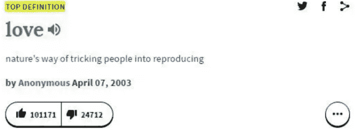
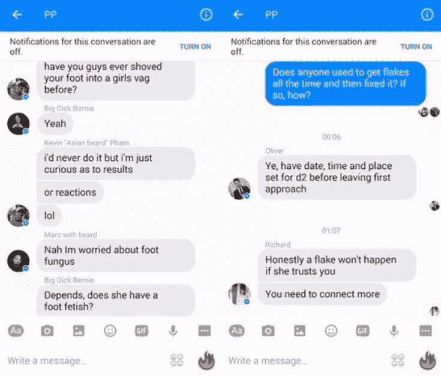

# 如何免费、高效、不无聊地自学英语

> 原文：[https://piaohanshenghuo.com/how_to_learn_english/](https://piaohanshenghuo.com/how_to_learn_english/)

我除了被迫花钱在学校上垃圾英语课程之外就没花钱上过英语课，而我现在可以轻松地在国外混，有时还会有人问我是不是美国人或者加拿大人，我经常可以要到陌生美女的电话号码，基本每周都可以推倒新的姑娘，可以看出来我的英语自学还是很成功的。今天我就来分享一下我的英语自学方法。

**一个好的老师教你学习方法，你需要自己完成学习的部分。**

**首先你要弄清楚**[为什么要学英语（点这里查看原因）](https://piaohanshenghuo.com/why_learn_english/)**，原因越多越充分，学习的动力就越大****。**

以下为几条重要的英语学习真理：

*   **万事开头难**。等你可以听懂大部分常用的英语之后，你可以看各种有趣的视频，纪录片，电影，电视剧，讲座，更可以搭讪美女，学习英语就真的不痛苦了，反而是一件很愉快的一举两得的事情。

*   **学真正的现实生活中的英语，而不是教科书上的英语。**比如英文图书、杂志、视频、电影、电视、广播、有声读物等等。
*   **学在你能力范围内的英语，如果你水平不够，听不懂大部分内容，就先学更简单的****。**比如你想通过看美剧这种享受的方式学英语，但是你脱离字幕完全看不懂，你该把剧留在以后水平高了再看。
*   **别硬学语法**，语法应该是中国的英语考试里考得最多的，大家上学的时候会花很多时间去学，但是中国人的英语还是说不好，因为当你张口说话的时候完全没有时间考虑语法。

**学词组、句子，而不是单个单词。**

*   **重质量而非数量，深度学习，重复、重复、再重复。**

*   阅读是写作的基础，听力是口语的基础。其中**听力是最重要的。**

*   别浪费你的时间在考4/6级、托福、雅思之类的考试上，能过就行，你的分数don’t mean shit, 你需要用英语来获取信息、交流，而不是考试。

*   **涉及到越多的感官，学习效果越好。**所以最好多和外国人混在一起，能看视频尽量看视频，**Youtube**是**最好的免费英语学习工具。**

*   学习英语就像学任何东西，**在于平时一点一滴的积累****，**有几秒钟的时间你也可以学习英语。

词汇：

首先我是极力反对死记硬背单词的，一是痛苦，二是效果非常不好。除非你是一个嘎嘎新的新手，一点儿词汇量都没有（推荐用**百词斩**背基础单词），否则请别死记硬背。你可以死记硬背应付考试，但是考完试之后你会忘得一干二净。应付考试绝对不应该是你学习英语的首要原因，否则你不可能学好英语。

最容易记住单词的方法就是**在不同的地方反复遇到同一个生词，查询含义并掌握用法。**你如果在不同的地方遇到同一个生词两次或更多次，你的大脑会告诉你“嗯…我和这个单词很有缘，它反复出现，应该很重要，我得记住它。”

所以大量的阅读是很重要的，大量的阅读不代表枯燥、无聊，你不需要像上学时一样做你完全不感兴趣的英文阅读题。阅读在于平时一点一滴的积累，首先你可以尽量不用百度，而是**用****Google英文搜索**，这样就被动地增加了你大量的英文阅读量。其次你可以选你感兴趣的东西阅读，比如我对泡妞感兴趣，我会读很多关于泡妞的文章，读的时候带着好奇心和疑问，一点儿都不枯燥。你还可以在听歌的时候记歌词。

**学单词不要单个学，要整个句子、短语、相关词语一起学。**这样不但可以额外学很多，而且它们之间都互相有联系，巩固记忆。**研究表明，学习短语比学习单词速度快4到5倍**，你的口语、语法会比只背单个单词好许多。

比如你学了一个新的单词job（工作）, 你顺便又学了短语good job（夸别人干得好），你又学了good job的用法，可以直接说Good job. 或者You did a good job.（你干得不错。）你还可以继续围绕job学习常用的短语，比如BJ(blow job(口交))，顾名思义，你又发现了hand job（手交）,foot job（足交），boob job（1.胸交 2.隆胸），甚至发现了rim job（舔肛）。PS: blow job的接收方必须是男，接收方是女的口交可以用head，head其实不分男女，学名是oral sex。有点儿说跑题了，反正你可以感觉出来，通过一个词，你可以延伸很广，学到很多新东西。

**背单词千万别按字母背，应该按读音背**。以英语为母语的人就是这么背单词的，不但简单，而且还能记住读音，**提高听力**。按读音背需要你对各个字母的发音规律有一定的理解，当你有一定的词汇量之后是很容易理解的。**按字母背就像背电话号码一样，完全没有意义**。

词典推荐：

**Lingoes**：这款软件是一个平台、载体，可以让你下载各种词典，你在查一个词的时候可以调用多个词典。推荐下载的词典有《柯林斯高阶英语词典》，这款词典用简单的英文十分恰当地解释你所查询的单词，尤其是对于动词的用法的理解非常有帮助。另外推荐《美国传统词典（双解）》，有汉语的详细解释。

**有道词典**：目前有道词典已经加入了《柯林斯英汉双解大词典》，非常方便。可以用**有道单词本**把生词记下来，以后复习。

**Urbandictionary**: 非常有用、有趣的在线俚语词典，由网友们提供词语解释，大家可以投票表决解释得是否准确，正规词典查不到的重口味的词在这里基本都能查到。

**Dictionary.com** : 英文的在线词典，内容又新又全，查词组的好地方。

**Google** : 上述词典都查不到就用Google

**Rap Genius** :查询说唱歌词的含义，如果你对Hip hop说唱很感兴趣，想听懂歌词的真正含义，那这个网站是必备的。顺便推荐下我最喜欢的rappers: Biggie Smalls, Gang Starr, Big L, Nas, Wu-Tang Clan, Flowsik.

写作：

写作阅读对我们来说问题相对较小，不过要想了解大量非正规的网络词汇和更正宗的表达方式，使用网络聊天工具是最好的办法。推荐使用Whatsapp, Facebook Messager和外国朋友沟通，加入兴趣小组，和大家一起讨论学习感兴趣的知识，你会学到大量简短实用的网络词汇。比如我加入了一个叫做“Pussy Patrol”的群，专门讨论泡妞。

听力和口语：

**你能听懂的内容永远会远大于你能表达的内容**。**听力是口语的前提和基础。**

首先你要**按照读音背单词**，只有知道单词的读音，你才能听懂。其次你要**直接理解**这个单词（不需要翻译成中文），因为你没有时间慢慢地把每个单词翻译成中文，就像别人和你说okay, bye这种简单的单词的时候，你不需要思考中文的含义，直接就能理解。**学英文的时候尽量别让中文参与进来**，试图直接理解单词的含义，让单词和图片相关联，千万别用拼音的方式记读音，因为两种语言的发音完全不同。

想要轻松听懂一个单词、词组并加以利用，你需要**深度学习**，要反复听并造句，重质量而非数量。深刻地记住了10个单词的含义和用法比记住了100个单词的肤浅的含义有用得多。

当你有一定听力基础之后就可以张嘴和**真正说英语的人**对话了（别和你的中国学习伙伴对话），至于**最好的免费练口语的方法**，我在“[为什么要学英语](https://piaohanshenghuo.com/why_learn_english/)”这篇文章中已经提到了。这里再补充两条：

1.使用网上聊天室和外国人聊天，比如Omegle，这个网站让你可以随机和陌生人聊天。

2.如果你在像上海一样国际化的大城市或任何说英语的人多的地方你都可以主动搭讪别人来聊天，比如我现在专门搭讪美女聊天，实在是一举两得、一石二鸟、一箭双雕，非常合适。刚开始我也非常紧张、害怕，但现在已经越来越容易了。如果你不敢，请看“[如何改善搭讪焦虑](https://piaohanshenghuo.com/how_to_fix_approach_anxiety/)”这篇文章。

我用过的最好的听力、口语的资料来自Effortless English，教的是**真正的英语**，**注重学习方法**，强烈推荐。EE的英语学习方式非常科学，不提倡阅读，注重听力，完全以听力为基础，有各种不同难度的听力内容，配有相应的听力原文加以对照。教你如何**自然地学语法****，**让你真正可以张口说英文。

听力资料还推荐ESL POD, 有APP可以下载，里边的内容都是真正的英语。

美剧推荐：Californication, Shameless, South Park, Hung, Breaking Bad,  Better Call Saul,  Undateable, Jerry Seinfeld. 注意千万别用中文字幕看剧，中文字幕不但错误百出，而且完全学不到英语，如果你不得不靠中文字幕，那你还不适合以学英语的名义看剧。

纪录片推荐：National Geographic和BBC是两大最好的纪录片来源，另外强烈推荐Anthony Bourdain的”Parts Unknow”和”No Reservation”，可以说是“舌尖上的世界”，这个老头周游世界，品尝当地美食，是一个很好的长见识、开眼界的纪录片。

可以学习泡妞的电视剧、电影：Californication, Undateable, Hung, Vicky Christina Barcelona, What Women Want, Swingers, The Pickup Artist, Keys to the VIP.

我最喜欢的、最强烈推荐的是**YouTube**（国内需要翻墙），比优酷好一万倍。上边有无数优秀的内容，各种有趣的短视频、MV、电影、电视剧、纪录片、演讲、免费课程，应有尽有，图、文、音并茂，无需下载，瞬间即可享用。**你基本可以学到大部分任何你想学的东西，直接搜索即可。**

Youtube频道推荐：

英语学习：

English Lessons with Adam – Learn English [engVid]（EngVid还有一大堆其他很好的老师）EnglishLessons4U – Learn English with Ronnie! [engVid]（很喜欢Ronnie的性格）A.J. Hoge(Effortless English的创办人A.J. Hoge的英语学习频道）Learn English with EnglishClass101.com（大量生动的英语学习视频）泡妞学习：David X（我最尊敬的泡妞大师）Based Zues（以动画的形式教你泡妞（超搞笑），发音特别好）Street Attraction（英国街头搭讪，day game）Good Looking Loser（很实际的建议）JMULV（推倒了上千个姑娘）Knowledge For Men（给男人的知识，对各种牛人的采访）Mens Room（对各种泡妞高手的采访）不推荐“最著名”的RSD，只不过是一个善于营销的公司。健身学习：ThenX（身体自重训练教程，主讲人又帅又屌）ATHLEAN-X(健身频道）Elliott Hulse（教你如何变得更强壮（生理和心理））AngryPicnic（街头恶作剧）MJ Demarco（畅销书”Millionaire Fastlane”作者，教你赚钱的知识）FightMediocrity和ImprovementPill (以动画的形式讲述各种自我提升的话题)GaryVee和Dan Lok（企业家教你、激励你如何创业赚钱）TED-ED（以动画的形式生动地讲述各种知识）TED（很多优秀的演讲，比如Christopher Ryan的关于性的演讲）Geography Now（生动地讲解世界各个国家，长知识）Mark Rober （机械工程师，为NASA工作9年，有很多非常屌的创造发明，比如每次都可以击中靶心的飞镖靶，发射扑克牌的枪，如何测量泳池里的尿含量，沙子泳池，世界最大的柠檬电池等等）MinuteEarth （动画生动形象地解释地球自然、科学、动物等等，很长知识）AsapSCIENCE （以动画的形式解释科学）The Infographics Show （以动画的形式讲各种东西）Jamie Oliver（教你料理）CaseyNeistat （1000万的订阅者，vlogger, filmmaker, 大量高质量的视频）比如：Bike Lanes by Casey Neistat搞笑频道：**Key & Peele** （我最喜欢的搞笑短剧，没有之一，去Youtube搜索“Manly Tears”，看一次，被逗抽一次）Ozzy Man Reviews（超搞笑的短视频评论）ThugLifeVideos（Thug Life一度是我最喜欢的搞笑视频系列）**Donnie Does**（我最喜欢的Youtuber之一，超搞笑，美国人在中国的搞笑视频（我见过他本人））Jaboody Dubs （加拿大小伙给各种广告恶搞配音，配得非常完美，超逗）Uncle Rob（纯爷们，超搞笑）Standup Comedy：Bill Burr, Louis CK, Joey Diaz, Patrice O’Neal, KT Tatara, Dave Chappelle, Jimmy O.Yang, Jimmy Zhang, Jim Jefferies, Russell Peters, Laugh Factory.我收集的搞笑视频合集：https://www.youtube.com/playlist?list=PLuxnu439hHu48axPeoMi-ZLQnaB7Yzig6**PowerfulJRE** （Joe Rogan的podcast，有1000多集，非常有营养的内容，尤其是他和Christopher Ryan的对话）

**Aboud**（Ex-con，曾经被判了坐牢140多年，多个奇迹让他可以重回自由，他分享很多真实、疯狂的监狱故事，是我今年发现的最喜欢的视频频道）。

另外你看黄片的时候是不是也可以学英语？别再用种子下载岛国的片儿了，用Pornhub或Redtube直接在线看，省时间又学英语。

P.S.: 我提到的很多资源在国内都需要番羽墙才能获得，[详细教程请见这篇教程（点这里）](https://piaohanshenghuo.com/recommends/fan/)。

结语：尽量把你自己放在一个完全英语的环境中，充分合理地利用一点一滴的时间，你可以用英语自言自语，思考。上下班的路上、做家务、做饭、吃饭时都可以听英文歌、英文有声读物或者英文podcast等等。用英语学习你感兴趣的东西，一举两得。

学习英语和健身一样，是个漫长的过程，长期坚持是关键。加油！

* * *

**连夜码字不易，如果本文对你有帮助，想免费表示支持，不妨多花几秒钟的时间，在公众号文章底部的广告上点一下，我就能有大概一块钱的收入。**

**当然也欢迎你分享本文，更欢迎你打赏，谢谢支持**。

**你的支持可以鼓励我创作出更多有价值的文章供你阅读。**

* * *

剽悍生活UL(微信公众号)分享关于**两性关系**、**自我提升**、**数字游民的生活方式**的原创内容，帮你过上更理想的生活（尤其是性生活）。

剽悍生活的个人微信号：ycf3721，[一对一视频教学](https://piaohanshenghuo.com/1on1_coaching/)，或拉你进入[剽悍生活泡妞讨论群](https://piaohanshenghuo.com/ul-group-chat/)，请注明加我的目的。

