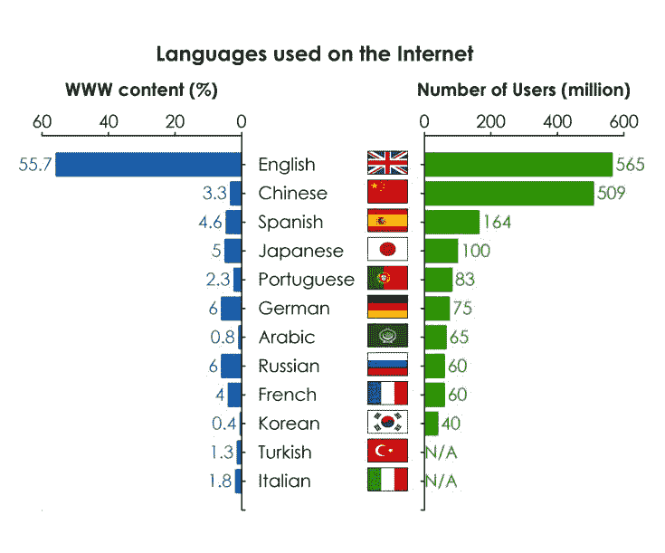

# 为什么要学英语 – 我的英语学习之路

> 原文：[https://piaohanshenghuo.com/why_learn_english/](https://piaohanshenghuo.com/why_learn_english/)

我除了被迫花钱在学校上垃圾英语课程之外就没花钱上过英语课，而我现在可以轻松地在国外混，有时还会有人问我是不是美国人或者加拿大人，我经常可以要到陌生美女的电话号码，基本每周都可以推倒新的美女（如果我愿意花时间的话），可以看出来我的英语自学还是很成功的。

其实我曾经很讨厌英语，英语也非常差。我英语变好的原因是因为我逐渐找到了很多掌握英语的好处，接下来，我们可以一起看看我的英语学习之路。

还记得第一次学英语是大概小学3年级的时候，小学英语还不是必修的学科，我妈给我报的课外班。我当时的感觉就是这是什么B玩意啊？学这个干什么？太无聊了。当时学英语的唯一原因就是我妈花钱让我去学了，为了孝顺，不浪费学费（但实际上真的浪费了）。

从初中开始英语成为了必修的课程，但老师始终没有告诉我为什么要学英语，我只知道背单词很无聊，背整段的课文更无聊而且没有用。但是我有开始喜欢一些英文歌，电影，我发现背歌词、跟着唱不但不无聊而且很容易记住。

我从高中开始英语成绩越来越好，最大的原因就是我越来越意识到了英语的重要性，也许是我所学的所有学科里未来唯一有用的学科。而且我也意识到了**学好任何东西的前提是找对学习的原因和动力****。**我完全没有找到数学、物理、化学、生物对我未来的意义，因为我根本不打算研究它们，知道最基础的东西就够了。政治更是最恶心的学科，完全没有用，浪费时间，残害生命。

但是我找到了很多学习英语的原因，除了考试成绩高，可以哄老师和家长开心之外，还有如下原因：

可以周游世界。

可以听懂英文歌。

可以找到更好的工作。

可以认识世界各地的朋友。

**可以有更多机会、更多选择**。

**可以更好地了解、享受这个世界**。

可以原汁原味地看好莱坞电影和各种好看的美剧。

可以**泡洋妞**（当时还没有意识到，但现在我意识到了这条的重要性）。

可以**和世界交流**，做一个“**地球人**”，而不是“中国人”，对于更好的人生至关重要。

可以读英文书、听英文讲座、上英文网站，**获取更多、更好的信息、长见识。全世界绝大部分的最新、最有用的信息都是以英语为载体。**

但是因为我对中国教育制度极度厌恶，加上课业的繁重，当时我并没有太多精力可以放在学习英语上，我的英语虽然有进步，但还是不够好。尤其是口语，因为考试不考，所以我也不练。

我第一次和外国人对话还是在去上海上大学的路上，坐飞机的时候。我看到一个中年华人穿着太阳队的T恤在过道里慢慢前行，我当时是NBA太阳队的铁杆粉丝，我就跟坐在我旁边的我妈说“看那人，穿着太阳队的T恤！我得问问他在哪买的。”我妈说，“说不定他坐在我们边上呢。”然后他果然就一屁股坐在我们旁边了，于是我马上就激动地告诉他我也是太阳队的球迷，你那T恤在哪买的。他用比较标准但不流利的中文说，“我不会说中文。”

我当时没敢马上就用英语和他对话，因为心里一点儿底都没有，从来没干过这件事，我又比较害羞。经过了一系列的思想斗争，我终于鼓足了勇气开始和他对话。他原来是加拿大人，而且来自太阳队队长Steve Nash的故乡Vancouver，虽然我口语很不好，但是他很有耐心，大概两个小时的旅程我们的对话就没停过，他给我看了许多照片，我长了很多见识。他给我留下了他的电子邮箱和MSN，我们就依依不舍地告别了。通过这次对话，我更加坚定了要学好英语的决心。

我开始了大学自习室的自习英语之路。我发现因为学校没教，我连音标都不会，有很多音都发不准。于是我从音标开始学起，自己上网找资料。我更注重学校不注重的口语和听力，背了很多歌词，以学英语的名义看了很多美剧、纪录片和电影，背了很多托福单词（后来才意识到没用，后悔），把手机的系统语言也换成了英语，利用一点一滴的时间学习英语。因为大学前两年的校区在农村，并没有什么和国外友人交流的机会。我们系里一共就有三国外国人，一个来自蒙古，一个来自尼泊尔，一个来自乌干达，虽然英语口语都比我好，但是都有口音，所以也没和他们练太多英语，大部分时间都是他们和我练汉语。

感谢万能的互联网，让我可以免费接触到大量高质量（质量大于等于《舌尖上的中国》）的英文纪录片和讲座，让我大开眼界，这些纪录片和讲座比我在大学里上的任何课程都好无数倍，既学知识又学英语，一举两得。

大三我开始搬入市区，开始可以遇到欧美的留学生了，一天中午我在大草坪上边散步边听英语，看到了一大群（10多个）白人留学生围坐成一圈，我鼓起勇气走上去说，“我正在练习英语听力，然后我看到了你们，我问自己为什么不和你们聊天，这样效果岂不是更好？”他们都很友好，接纳了我，我们很快成为了朋友，隔三差五都要一起出门吃饭、开趴、蹦迪。他们都是欧洲人，并非以英语为母语，但我能感觉出来他们的英语很好。

和他们混熟了，再加上我有在网上找到愿意做语言交换的美国人，通过美国人又认识了他的美国朋友圈，再加上后来我开始去一家超小的瑞典创业公司实习，纯英语环境，又认识了一些美国的同事和朋友。虽然身处中国，但我完全**沉浸在了英语的环境当中**，这应该是我英语口语提高地最快的阶段。不但学到了很多英语，也长了很多见识，在他们身上学到了很多东西。大学毕业的时候，我的英语应该已经比较可以拿得出手了，无论是日常交流还是听各种英文的有声读物都很轻松。

在中国交国外的朋友很容易，因为他们毕竟是在你的地盘上混，有个本地的朋友会有很多好处。你可以在很多地方帮到忙，我甚至还帮朋友拍了婚纱照。

学习英语让我可以来澳大利亚生活、旅行、赚钱，我曾经一个月赚了大概6000刀（3万多人民币）。我现在已经在澳大利亚生活一年多了，但并没有感觉英语进步非常大，只是更好地适应了澳洲的口音，更容易根据口音判断出一个人来自哪里，更会和姑娘聊天了。其实你**完全不需要花钱上课，或者出国，就可以把英语学好****。**有花大价钱请外教上一个小时课的时间，你可以和外国朋友一起吃饭、玩耍好几个小时。

我觉得在像上海这样的国际大城市，练英语口语最好的方式之一是：找到外国人会用的本地网站，比如Shanghai Expat, Enjoy Shanghai, 在相应的广告区找语言交换，最好只找英语为母语的人，再通过这个人的朋友圈认识更多的人，并经常和他们混在一起。

当然这还不是最好的办法，最好的办法应该是**找一个以英语为母语的炮友或男/女朋友**。这点对于长得还不错的女生或者长得难看但正好符合某人审美的女生来说比较容易，对于男生来说比较困难。以我当时的泡妞水平，能找到也算比较性运。当然，这需要你英语口语已经有一定基础，可以比较流畅地沟通。

如果你在小城市，趁着年轻，为什么不去大城市吃吃苦，涨涨见识？那里有更多的机会等着你。

**英语是你在确定人生目标前最应该花时间学习的东西之一。我通过英语这个媒介学到了太多无价的宝贵知识。**

我不敢想象如果我没有好好学习英语会多么惨，思想会多么闭塞，眼界会多么小。

[推荐我很喜欢的9个英文播客(podcast)（自我提升的最佳途径之一）](https://piaohanshenghuo.com/podcast-recommendations/)。

学习英语不仅是学习一门语言，更是学习一种文化。英语可以为你打开很多大门，给你的人生增加更多可能性。

暂时就写这么多，加油！

**连夜码字不易，如果本文对你有帮助，想免费表示支持，不妨多花几秒钟的时间，在公众号文章底部的广告上点一下，我就能有大概一块钱的收入。**

**当然也欢迎你分享本文，更欢迎你打赏，谢谢支持**。

**你的支持可以鼓励我创作出更多有价值的文章供你阅读。**

* * *

剽悍生活UL(微信公众号)分享关于**两性关系**、**自我提升**、**数字游民的生活方式**的原创内容，帮你过上更理想的生活（尤其是性生活）。

剽悍生活的个人微信号：ycf3721，[一对一视频教学](https://piaohanshenghuo.com/1on1_coaching/)，或拉你进入[剽悍生活微信讨论群](https://piaohanshenghuo.com/ul-wechat-group/)，请注明加我的目的。

