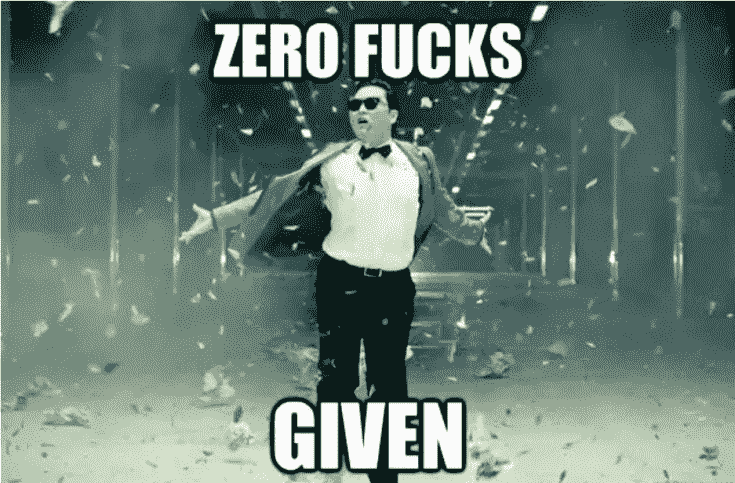

# 如何改善搭讪焦虑

> 原文：[https://piaohanshenghuo.com/how_to_fix_approach_anxiety/](https://piaohanshenghuo.com/how_to_fix_approach_anxiety/)

每个正常人都有搭讪焦虑(approach anxiety)，这是很正常的现象。

为什么我们有极大的搭讪焦虑：

*   基因遗传：生活在部落里的原始人如果错误地勾搭了一个另一个部落的陌生女子，很可能会被许多男人追杀。
*   社会文化：我们从小就被教育要小心陌生人，不要主动和陌生人说话。我们下意识地防备陌生人的搭讪，好像陌生人的搭讪是很不好的一件事。当我们想搭讪美女的时候，我们不但害怕她的想法，我们还害怕附近的人的想法。
*   不知道如何搭讪：当你对做某件事没有把握的时候，你很难不紧张、焦虑。比如你第一次骑自行车会很紧张，怕摔倒，当你完全掌握之后，你会很放松。
*   想太多：考虑的因素太多，怀疑自己，怕被拒绝。

如何改善搭讪焦虑：

我可以向你保证，**如果你从来没有搭讪过美女，如果你鼓足勇气，做出你的第一次搭讪，无论结果如何，你都会非常兴奋、很有成就感，因为你战胜了自己。**

*   直面搭讪焦虑：这是自然的、正常的、健康的焦虑，接受它，但一咬牙，硬着头皮，头脑空白也要上。
*   改善观念：
*   *   很多姑娘都希望被人欣赏，很多姑娘在出门前都花了很多时间打扮自己，希望有人可以欣赏她们。
*   *   这是一个数量的游戏，有人对你感兴趣，有人对你不感兴趣，你只需要通过搭讪找到和你来电的人。
    *   当姑娘拒绝你的时候，她拒绝的并不是你，因为她还不了解你。有无数的原因可以导致她拒绝你，比如她有男朋友，她从来不和陌生人说话，她心情不好，她没有时间，她刚被一个变态搭讪过等等……
*   练习的心态，不依赖于结果：反正你再也不会见到她，周围的人对你的看法更是无关紧要。**搭讪了她，你什么也失去不了，只能增加得到她的可能性，而且还很锻炼你的能力。**你让她知道你对她感兴趣，但是你可以随时离开。你不非得得到一个电话号码，拥抱，亲吻或推倒。
*   逼自己：如果你纠结了太久，始终没有搭讪。想象一支枪指着你的头，如果你在3秒内不搭讪，马上就会被爆头。如果有朋友和你一起，你可以赌钱，如果不搭讪就输钱。
*   **不想太多，马上搭讪**：你很可能会考虑特别多的因素，预测各种可能的情况，拼命地想一个特别优秀、恰当的开场白，等你准备好了，姑娘已经走远了。而且你考虑的时间越长，你就越焦虑，搭讪就越尴尬。大多数情况下开场白说什么其实并不是特别重要，请问你是否能回忆起和你最好的朋友所说的第一句话？重要的是你说话的语气，你是否能冷静地沟通，你是否能正常地说人话。
*   理性思考：请问你活了这么多年，能回忆起多少别人做过的特别丢人的事情？如果能回忆起来，你对这件事情有多么在乎？
*   多多搭讪：**搭讪得越多，你的焦虑就越小。**
*   David X的两条原则：**1.谁在乎她怎么想。2.你是这段关系中最重要的人。**如果遵守这两条原则，你会立刻认为你足够好，不想太多，马上自信地搭讪。
*   在开始练习搭讪前改善你的状态：运动，听积极的音乐，和朋友聊天，冷水澡，冥想，深呼吸，微笑。
*   如果直接搭讪对你压力实在太大，可以拆分成更小的步骤练习：比如，1.直视路过的美女。2.走到美女面前什么也不说就离开。3.对美女打招呼然后离开。4.向美女问路。等等… 另外，如果你觉得美女太吓人，你可以先拿你觉得不吓人的女生练习。

一些很好的练习：

在一个公共场所里观察你看到的女生，并在心里对她们的外表、举止作出评论。

直视每一个路过的人，ta不把视线移开你也不移开。如果美女同时也盯着你，你开始微笑，如果她也微笑了，那你必须搭讪。你可以说，“我很喜欢你的微笑，你对每一个路过的人都微笑吗？还是只对帅哥微笑？”

故意在公众场合“出丑”，比如躺在地上，做奇怪的动作，发出奇怪的声音等等。

回家的路上和自己打赌“不搭讪一个（或N个）美女，不许回家”，实在没有美女也可以和任何路人打招呼。

**当你开始不在乎别人的看法时，你就开始变酷了。**

剽悍生活UL(微信公众号)分享关于**两性关系**、**自我提升**、**数字游民的生活方式**的原创内容，帮你过上更理想的生活（尤其是性生活）。

剽悍生活的个人微信号：ycf3721，[一对一视频教学](https://piaohanshenghuo.com/1on1_coaching/)，或拉你进入[剽悍生活微信讨论群](https://piaohanshenghuo.com/ul-wechat-group/)，请注明加我的目的。

