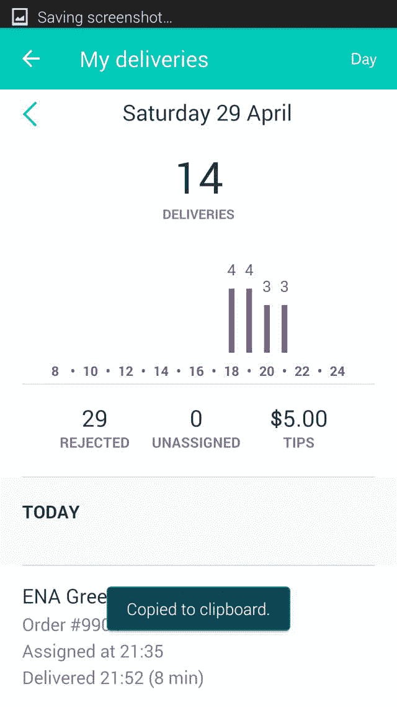
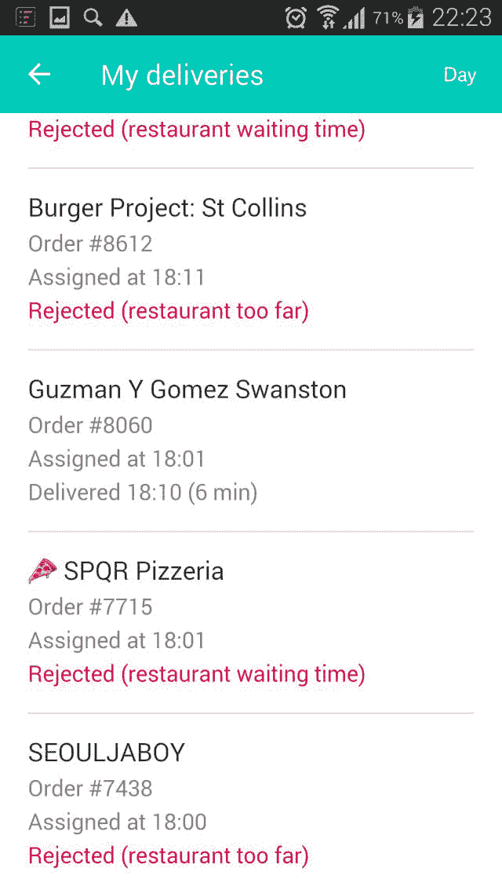

# 史上最全最专业的澳大利亚送外卖攻略

> 原文：[https://piaohanshenghuo.com/food_delivery_in_australia/](https://piaohanshenghuo.com/food_delivery_in_australia/)

首先说一下我为什么有资格写这篇文章，我来澳大利亚打工度假一年了，20年单车驾龄，从墨尔本到凯恩斯，东海岸大部分城市的主要路段我都有骑过。我在悉尼和墨尔本都送过几个月外卖。

目前市面上有3家主要的送外卖公司：Deliveroo, Foodora和Ubereats, 我都为他们工作过，大概一年前在悉尼时，我同时为Deliveroo和Foodora工作，当时的薪资是：Deliveroo 16刀每小时加2.5刀每单的提成，Foodora 14刀每小时加5刀每单的提成。 一个小时至少可以送2单，所以Deliveroo时薪大概21刀，Foodora时薪大概24刀。两者都需要提前申请工作时间，Foodora周末有午餐和晚餐的时段，平时只有晚餐的时段，而且很难申请，而且只要订单不多了，他们就开始踢你下线，你就没法继续赚钱了。反观Deliveroo, 虽然时薪相对低，但是可以申请到充足的工作时间，没人会踢你下线，而且可以不在申请的工作区域工作，经常可以什么都不做就赚钱，下雨天别人都不愿意干，你可以申请到11个小时的工作时间，然后慢慢地安全地送外卖，慢慢地赚时薪。

在悉尼时，我还冒险同时为Deliveroo和Foodora两家工作过，这意味着至少40刀的时薪（16+14+commission）。不过压力非常大，最怕南辕北辙的订单，这里先不讲。我目前在墨尔本，目前墨尔本的Deliveroo已经没有时薪，完全靠提成，9元一单。听说Foodora还是时薪加提成，不过提成好像降到了2.5刀每单，时薪也下降了，所以完全不推荐，而且Foodora的粉色看起来很难看。

再说一下Ubereats, 做广告的时候说每单10刀，外加每公里1.4刀，听起来很好，不过他们没提每单会扣除所谓的”Uber Fee”，扣掉后并没有Deliveroo的工资高，如果路途远的话，会赚更多，但你根本不希望送路途远的订单。Ubereats的优点是容易申请，不需要骑行测验，不需要像Deliveroo一样交200刀的押金，只需要交大概20刀的背包押金。如果你在墨尔本，我最推荐Deliveroo。墨尔本是澳大利亚最适合骑单车送外卖的城市，因为城市规划好，平地多，可以避免爬坡。本文拿Deliveroo举例，讲讲如何高效送外卖。

* * *

接下来我说一下为什么要送外卖：

1: 如果你像我一样专业，你会比一般工作时薪赚得多

2.锻炼身体又赚钱

3.大街小巷了如指掌

4.自由，想什么时候工作都可以，很容易安排时间，很容易作为第二份兼职

5.城市的风景一览无遗

6.可以顺便搭讪美女

缺点：危险（如果你不会骑车的话）

Deliveroo发展得很快，我刚开始工作的时候，可以送外卖的城市只有3个最大的城市，目前Deliveroo可以送外卖的城市有：悉尼，墨尔本，布里斯班，Perth, Canberra, Adelaide, Darwin, Hobart, Gold Coast, Newcastle.

如果你的城市可以选择每小时基础工资加提成，推荐选择这种，我原来在悉尼16元一小时，外加2.5刀每单的提成，经常可以边打篮球边赚钱，非常惬意，不需要着急，按一小时2单的话，轻松达到时薪21刀。现在我在墨尔本只可以选择9元一个快递，没有时薪，所以得玩命干。但如果你像我一样专业，在比较顺利的情况下晚上6点到9点每小时可以送4单（36刀），还有可能有小费。我个人最高纪录是82分钟7单加6刀小费（69刀），有图为证。

* * *

工作前的准备：

1.买车：去Gumtree买二手车，建议买200刀左右的单车，不建议买死飞，比较累，下坡也得登，建议买变速车。有的车会带头盔和锁，要问清楚，因为头盔加锁买的话至少要二三十刀。另外还需买前后车灯，一是晚上安全，二是法律规定，Kmart和Target就有卖，大概5刀。

2.修车工具： 背包里必备的工具：便携打气筒(portable pump, 最便宜的大概10刀，我在Rebel Sports买到的。自行车店一般都会比较贵，气筒不常用，也不需要质量特别好，所以便宜点儿就好）。补胎工具：tyre **lever**(撬胎棒，5刀） + Repair Kit/Puncture Repairs（5刀，一个小盒子，里边有补胎用的胶水(tube repair glue、橡胶打磨片(sand paper)、补胎片(tube repair patch），我建议再另背一个内胎(tube),以免胎漏得太严重，补不好）。 至于怎么补胎，请自己上Youtube看视频，基本你熟练了之后可以10分钟搞定，不需要取消订单，修好了接着送。

另外车骑时间长了链条需要润滑，最便宜最方便最好的办法就是买一瓶WD-40, 超市就有卖，大概6刀左右，用不完。

3.随身携带食物：我推荐香蕉和花生酱三明治，面包选择性价比最高的最健康的 “7 Seeds & Grains Sandwich Bread Loaf 800g” 保质期一天，放冰箱里至少可以一周，Coles有售，只要3刀，low GI碳水, 高纤维，高蛋白，花生酱要选Crunchy的，别选Smooth, 因为Crunchy的纤维含量高，纤维很重要。

做法：将2片面包片烤硬，中间放上花生酱，我个人还会加点黑胡椒提升口感和营养，放入密封袋中，一个密封袋可以放4片面包（2个三明治）。

50个密封袋大概不到2刀，超市都有卖的，注意大小要选18cm x 17cm，在Coles的全名为”Snap Seal Resealable Sandwich Bags 18cm x 17cm 50 pack”。

如果你像我一样只在晚上订单最多的时候工作（6点到9点），带1袋三明治加2根香蕉就够了。另外建议长期带一袋很健康很难吃但可以长时间保存的各大超市都有售的Weet-Bix，以防饥饿。

另外请下载**Hungry Jack**‘s APP,每12小时可以抽奖一次，有机会吃到免费的或者很便宜的汉堡，虽然是垃圾食品，但也有一定的营养，而且很好吃能量又很高，偶尔免费吃一个也还不错。骑行时补充足够的碳水化合物才能充满活力。

4.需要一个金属水杯，不建议塑料，因为有BPA，有害健康。尽量多喝水，很健康很重要。

5.我个人会带一个蓝牙音箱听音乐，可以给工作增加许多乐趣和动力。

6.申请工作需要一个**ABN**，申请地址如下：

https://abr.gov.au/For-Business,-Super-funds—Charities/Applying-for-an-ABN/Apply-for-an-ABN/

7.除了需要你自己准备的东西，还有公司提供给你的东西，当你申请Deliveroo的工作成功后，他们会给你一套装备，包括背包，防水外套，T恤，充电宝，还有一个最重要的可以把你手机固定在车把上的东西），他们会在你工资里扣除200刀的押金，辞职时可以全额返还。

* * *

Deliveroo APP如何运作：

打开APP, 在你想工作的区域登录，开始接单，如果你是最靠近餐厅的最佳人选，你会收到订单，这时你可以知道餐厅的名称和地址，你可以选择取消或者接受订单（过去你必须要等三分钟才能自动取消订单）。接受订单后，你需要去餐厅，到达餐厅后你需要在APP上选择已经到达，向工作人员出示订单号取餐后，你在APP上选择你已经取到了食物，接下来你就可以看到客户的地址，送到客户之后选择完成订单。

* * *

接下来我讲一下重点，如何提高效率，节省时间：

因为手机需要经常充电，所以没法一直放在车把上实时导航，看到目的地后第一时间找到最近的路口的两条街的名称，并记住街号，当你熟悉街道后基本可以做到不看手机直接找到目的地。

记住一条街哪个方向是单号哪个方向是双号，记住一条街哪个方向号变大，哪个方向号变小。

选择接受或者拒绝订单，这个需要一定的经验，一看餐厅离自己的远近，二看餐厅的做饭速度。Deliveroo的APP最近更新了一个可以大幅度提高效率的功能，你可以选择取消或者接受订单（过去你必须要等三分钟才能自动取消订单）。这意味着可以专门选择等待时间短的餐厅来节省大量时间。实践证明，过去在高峰期我要比较顺利才可以1小时送3单，现在我不需要依赖运气就可以完成一小时4单（36刀），有图为证。在晚上6点8点订单超多，我对各种不喜欢的餐厅各种拒绝，只接我喜欢的餐厅，每小时有4单，9点到10点订单来得不是特别猛烈，所以我在接单上没有特别挑剔，每小时3单。工作了将近4个小时，一共做了14单，倔强地拒绝了29单。认真阅读下文，可以找到墨尔本CBD餐厅的白名单和黑名单。

取餐之前：有一种说法是餐厅在你选择到达餐厅后才会开始做饭，其实大部分餐厅会提前做饭，不过为了保险起见，还是在接到订单之后马上选择已经到达餐厅，这样可以最大几率减小在餐厅等待的时间。

到达客户住处后的操作步骤很重要，可以有效节约很多时间，请注意学习： 一般CBD的客户都会住在公寓楼里，都会标注具体的门牌号，在门口有对讲机，你需要输入门牌号，输入门牌号的同时，在APP里选择给客户打电话，电话号码会弹出来，选发短信，把门牌号码写下来，并保存短信（并没有真正发送）。

这时对讲机基本会和你打个招呼或者连招呼也不打就把门打开了。接下来你需要把快递标记为已送完（因为你已经记下来客户的电话号码和门牌号，所以不怕找不到客户，另外你已经在对讲机和客户打了招呼，也不怕客户抱怨你还没送外卖就把外卖标记为送好了），因为你在APP上已经送好了这一单，所以在APP上你就可以开始接下一单了，如果是晚上的高峰期，你会在几秒内就接到下一单。

带着单车进楼，非常重要，别把单车锁外边，上锁解锁浪费时间，而且车放外边还不安全。大部分的楼都可以带单车进楼，如果你看到大厅有工作人员，最好安静地把车抗进去，这样会减少他们阻止你带车进楼的几率。如果被拦住，面带微笑，说Sorry, I didn’t know, I don’t live here, I’m delivering food, I’ll be back in 1 minute. Can you be really nice and let me in so I can save time, otherwise I have to waste time to lock my bike. 如果保安没示意让你进去，说其他任何你不可以进去的理由，别和他浪费时间，尽快把车锁在外边，再拨门口的对讲机让客户给你开门。

坐电梯到客户的楼层后随手按下楼的按钮。开门时确保你面带微笑，说什么随便你，最好能说出客户的名字，无论客户住得多远，多么能浪费你时间，你都要保持要热情、友好，这样才有更高的几率获得小费，不过获得小费的几率是非常小的。通常客户整个开门到关门的时间不会超过3秒，愿意给你小费的人提前都准备好了，只要你不是态度很恶劣，就会有小费。

另外一种情况，如果客户没有注明具体的门牌号，只有街道号，这时候客户通常会愿意下楼来取外卖，我会在在餐厅取好外卖之后编辑好短信 “Deliveroo arriving, are you coming down to pick up the food? Please reply if you saw the msg, thx.”, 等我离客户比较近，大概两三条街区的时候我会发这条短信给客户。这样可以保证你到客户楼下后不需要等很久，如果客户没有回短信确认，我会在合适的地方提前打电话和客户确认。

* * *

接下来讲一下很重要的**客服电话(1300335483)**，直接就可以打通，主要用于取消订单，非常重要。比如你想回家了，收到一个订单，你选择接收，在去餐厅之前就选择已经拿走了食物，这样你就可以提前看到客户住在哪里，如果比较顺路回家，你就继续送这个外卖。如果不顺路或比较远就可以打电话取消。

打电话时告诉客服订单号码，并说I’m ready to go home, I accidentally accepted this order, I didn’t pick up the food yet, I just chose that I already picked up the food on the app so I can know if the food is going to anywhere near my house, but it isn’t. So please unassign me, thanks. 一般客服都会帮你取消订单。

另外一种情况比较讨厌，就是取到食物后发现客户住得非常远，而且根据你的经验，你知道到客户那里之后很难在附近收到新的订单或者收到新的订单也需要往回跑很远，很不划算。这种情况最好的办法就是打客服电话，告诉他们你的订单号码，并撒个小谎，说 I got a problem with my chain, I need to put it back first, please unassign me. 有时候你会碰到同一个客服，有可能会质疑你怎么车链子总掉，你说 It’s a chronic problem, I haven’t figured out how to fix it once for all yet. 然后你把那个客服的名字和声音记下来，如果下次再是他/她接电话，你可以改变说法，比如你可以说 I got a flat/puncture. Please unassign me. 这样他们就会取消你的订单，但有时候他们会说 I’ll put you out of the service，这时你要告诉他们别那么做，因为这样你就暂时再也接不到新的订单了，你说 Don’t put me out of the service, I’ll log out of the system myself, and I’ll log in once I fix the problem, thanks. 这样你就可以继续无缝接收下一个订单了。

* * *

墨尔本攻略：

墨尔本CBD最好骑的路: Swanston Street (平又安全），Elizabeth Street (最平，相对安全），Flinder Street（平但不是特别安全，而且容易堵），SouthBank都很平，在CBD东西方向行驶尽量选择La Trobe St, 因为有自行车专用道，很安全。在CBD尽量骑我提到的几条路。

Spencer St 往西是 Docklands, 中间隔着铁路和大型运动场，坡很大，而且过去之后基本肯定还得往回走，往东走一样有很多坡路，所以尽量不要去。表面上只有两条路可以走，一个是La Trobe St, 一个是Collins St, Bourke St是不通的。其实有一条很好走的平路，在Flinder St 和 Spencer St路口向西走，左手边第二个路口 Siddeley St左转，上Jim Stynes Bridge 就可以去Docklands, 不但路平，又很安全，河边的风景还很好，强烈推荐。

另外请注意CBD有四条必经的单行道，其中三条都是由东向西，包括Flinders Lane, Little Collins St, Little Bourke St, 只有一条由西向东: Little Lonsdale.有时导航会让你在单行道反向行驶，所以不能只看导航。

City Road是你经常会去的一条路，在CBD千万不要选择走Swanston St, St Kilda Rd, 你会浪费很多时间，Walliam St(Queens Bridge)是你过河最好的选择。

最好的餐厅：

1.等待时间短的餐厅：

所有的甜甜圈，冰淇淋，寿司类已经准备好的食品都不需要等（比如Bistro Morgan, Donnut Time, Messina, Gochi)，Huxtaburger CBD, The Merrywell, Wagyu One, Criniti’s, ShanDong MaMa Mini

2.容易同时出2单的餐厅:

8 Bit, Poked, Oko Oko Jasper, Oporto Melbourne Central, Huxtaburger CBD, Guzman Y Gomez, Vapiano Flinders Lane

最不好的餐厅（等待时间长）：基本肯定会等很久的餐厅：Gradi, Chin Khao, Miss Chu, 这几个餐厅一般你至少得等10分钟，收到这些订单时最好别接，除非是晚上10点之后，不接就没活了。其他比较慢的餐厅有Nando’s, Sam Sam Korean Chicken(有时不需要等，有时需要等20多分钟). 基本所有的披萨店，东南亚餐厅，你基本都得等，Criniti’s – Southbank披萨店除外

* * *

悉尼攻略：

首先悉尼如果没有时薪的话，肯定没有墨尔本好，因为城市规划乱，基本没有平地，能在CBD就在CBD干，相对不需要跑远路。Glebe和Newtown已经合并成了 Inner West, 在这个区域工作经常需要长途跋涉，充满了斜坡的路，不推荐。

其他城市：我暂时都没有工作过，不过最好选择地势平坦的城市，比如Gold Coast

* * *

关于UberEats：

背包方面虽然Deliveroo的背包看起来很酷，但是没有口袋，不实用。这里推荐用UberEats的背包（很难看，但是很大，很实用，侧面有两个口袋，可以装音箱、水瓶、充电宝，食物，只需要10刀押金，去申请UberEats的工作，但是可以尽量最为Deliveroo工作，Ubereats订单少，钱给得也少）。这个背包同时也是你去超市购物时最好的购物袋。UberEats唯一的优点就是在餐厅的等待时间相对很短，另外晚上6点到9点会有1.1倍的提成，周末1.2倍，可以考虑在没有Deliveroo订单的时候为UberEats工作，多一条赚钱的路总比少一条好。

* * *

安全注意事项：

1.带安全帽，晚上开灯

2.离左手边停在路边的车保持一车门的距离，以免被车门撞倒

3.尽量骑有自行车道的路段

4.做任何横向移动之前先回头观望

5.在墨尔本的话需要注意电车轨道，跨过轨道时尽量确保车轮和轨道成90度，下雨天要尤其注意，很容易被轨道卡倒，很危险。

* * *

骑行的原则：

*   尽力避开坡路，宁可距离远一点，也不骑坡路，因为很累，不过很锻炼肌肉
*   避免大转弯（右转），因为左转即使是红灯，也可以很容易转
*   在确保完全安全的情况下破坏交通规则以节约时间
*   合理利用人行道

* * *

攻略暂时到此为止，如果你想申请，可以使用我的邀请码，这样申请**成功几率更大**（属于公司内部推荐），而且我还可以获得推荐的奖金，也算你对我的攻略所表达的感谢。申请工作的网址为：https://roo.it/HY69643，邀请码为：**69643HD** (申请工作的网页上会问你 “What is the unique referral code of the person who referred you?”, 这个地方填69643HD)。

UberEats的申请网址是：https://partners.uber.com/i/yh5355eam，邀请码是**HYSOND1UE**。

* * *

你用我的邀请码申请到工作后遇到了问题，或需要建议，都可以来找我咨询。

