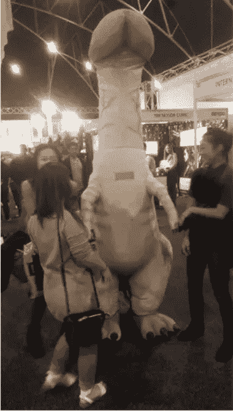

# 把妹基础2-外表

> 原文：[https://piaohanshenghuo.com/appearance/](https://piaohanshenghuo.com/appearance/)

**你的外表很重要，不是一般的重要！**

你想要开法拉利还是奇瑞QQ？为什么？因为法拉利长得帅！别跟我说跑得快，堵车照样歇菜。

别跟我说光看外表太肤浅了，你和你周围的人无时无刻不在通过外表对人和事做出判断，没有什么人关心你，愿意听你讲故事，解释你是什么样的人。人们通过你的外形、举止、语气已经提前对你做出了判断。

如果你对自己诚实一点，你用脚趾头想就可以明白女人更喜欢上帅哥，喜欢身材好的，和男人喜欢身材好的美女一样。人，尤其是女人，看你一眼就可以对你做出大致的判断。

如果她们看到一个瘦瘦的戴眼镜的貌似营养不良、书呆子似的小伙，穿着很邋遢的衣服外加拖鞋，无精打采，弯腰驼背，不敢直视她们。她们会认为这个小伙很不自信，生活没有条理，胆小怕事，十有八九是个怪人，一看就没女朋友。她们在他身上完全关联不到性，其实他很可能看了无数黄片，打了无数飞机。大部分的情况下，她们的判断都是对的。

她们又看到了一个小伙，这个小伙浑身肌肉，穿着干净整洁、搭配合理的衣服和鞋，昂首挺胸地走路，双眼直视她们，面带自信的微笑。她们会认为这个小伙充满了自信和活力，干净、帅气，很有出息，肯定很轻松就可以找到女朋友。大部分的情况下，她们的判断也都是对的。

如果你还不是特别相信外表的重要性，Youtube有个频道叫”FACEandLMS”(LMS表示Looks（外表）, Money（金钱）, Status（地位）三大“肤浅的”但是特别吸引女人的点)，整个频道一共7个视频，都在用各种实际的例子告诉你外表有多么重要。地址：https://www.youtube.com/user/FACEandLMS/videos

提到外形，不得不提一下把妹社区里的孔雀理论(peacocking), 就是把自己打扮得额外引人注意，比如穿很夸张的制服，带形状、颜色古怪特别的首饰、帽子，涂唇膏、指甲油，用手纸把自己缠起来等等常人不会做的事情。Peacocking有两点好处，一是可以给对你感兴趣的姑娘一个理由来主动和你说话，二是如果你对于成为公众焦点可以做到很淡定，你就会显得很酷。你不非得用，用不好还很可能起反作用。另外请把脸露出来，否则姑娘都不知道你到底长啥样，别学这头我在Sydney Sexpo上碰到的没脸的大屌兽。

 

你如果意识到了外表很重要，就赶紧开始着手从各种可控的方面改善你的外表。

如何改善外表：

*   健康饮食，[剽悍生活博客首页的搜索搜索“饮食”就可以查看详情](https://piaohanshenghuo.com/healthy_diet_basics/)。
*   科学锻炼身体，[剽悍生活博客首页的搜索搜索“锻炼”就可以查看详情](https://piaohanshenghuo.com/workout_basics/)。
*   弄一个很屌的头型，公众号回复什么也没有用，赶紧给我去找个靠谱的理发店。
*   下本钱买几件像样的衣服，别图便宜买一堆破烂儿回家。我本人就干过这种事情，在淘宝上乱七八糟买了一堆地摊儿货，结果还是没有能拿出手的衣服。好衣服好鞋几件就够了。
*   保证充足的睡眠，至少7小时，不超过9小时。
*   保持好个人卫生，每天洗澡，勤刷牙，饭后用牙线，保持指甲短、齐、没有泥。
*   展示出自信的姿体语言，抬头挺胸，自然放松，敢于直视姑娘双眼，微笑。

好了，差不多就这样，赶紧给我行动起来！

剽悍生活UL（博客/微信公众号)分享关于**两性关系**、**自我提升**、**数字游民的生活方式**的原创内容，帮你过上更理想的生活（尤其是性生活）。

剽悍生活的个人微信号：ycf3721，用于[一对一视频教学](https://piaohanshenghuo.com/1on1_coaching/)，或拉你进入[剽悍生活高级付费微信讨论群](https://piaohanshenghuo.com/ul-wechat-group/)，请注明加我的目的。

