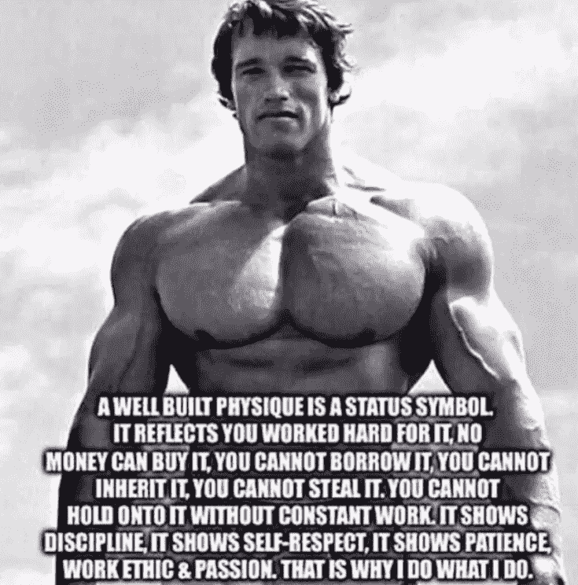

# 为什么要健身

> 原文：[https://piaohanshenghuo.com/why_workout/](https://piaohanshenghuo.com/why_workout/)

身体会跟你一辈子，身体是一切的大前提。健身是你确定人生目标之前最值得花时间去做的一件事，拥有更好的身体永远不是坏事，你永远不会后悔花在健身上的时间。

健身让你更**性感**（大部分人健身的首要原因），显著提升你的性市场价值(sexual market value)，你可能外表看起来只有5分，通过健身，你可以至少涨到7分（外形、自信、给人的安全感都会因为健身而大幅提升），大幅度提高对异性的吸引力，帮你更容易搞定心仪的对象。而且健身可以大幅度提高床上的战斗力，帮你留住心仪的对象。

健身让你可以享受更多的**美食**，消耗更多的热量意味着你可以摄入更多的热量。

健身让人对你更加尊重，尊重分两种：钦佩和恐惧，健身可以让你同时拥有这两种尊重（羡慕你的身材，害怕被你揍）。

健身让你更健康：**抗衰老**、排毒、**有助睡眠**、提高**免疫力、记忆力**和**创造力**、降血压、减低患癌、关节炎、老年痴呆、糖尿病的几率、预防骨折、提升发生意外时的生存能力。

健身让你更少生病，生病意味着耽误事，难受，不快乐，失去很多机会。看病又贵又痛苦又浪费时间。

健身让你更**自信**、更**自律**、更接近最好的自己。

健身让你可以更好地控制自己的身体和心理。

健身让你明白习惯的力量、点滴积累的力量。

健身给你更多**能量**，只要你不过度训练，健身后的你会更精神、工作效率更高。

健身给你更多**机会**，你可以有机会当健身教练、模特、演员甚至州长……

健身给你优越感，当你看到大部分人的身材都没你好的时候，优越感是不可避免的。

健身帮助你取得成功，健身需要不断地设立目标、克服困难、达成目标。这和取得其他任何成功的步骤是一样的。

健身可以启发你爱的人变得更健康，你和你爱的人可以活得更长、更独立，不需要别人照顾，你会更快乐。

健身显示出了你有能力照顾好自己，比较靠谱，这是能照顾好他人的前提，让身边的人更容易信任你。

健身让你的生活更容易，生活中的一切体力活都会变得更加容易。

健身让你更强大，健身需要经历无数的困难阻碍，不断挑战自己的极限，战胜它们不但让你身体更强大，内心也会更强大。

健身教你改变思维方式，学会苦中作乐。

如果你的生活一塌糊涂，健身给你一个极好的可以着手进步的点。

健身让你更**快乐**，健身过后心情更好、更**放松，**感觉如释重负，充满了**成就感**，尤其是当你完成了难度更高的动作之后，那种成就感再多的钱也买不来。健身可以很有趣，没有东西可以取代当你全身心地投入在你最喜欢的运动中时的那种快乐。

健身让你更加积极向上的，**健身在无数个你能意识到和意识不到的方面改善你的人生**。

最后奉上施瓦辛格的一段话：好身材是一个人身份的象征，显示出了你大量的付出，钱买不了，借不了，继承不了，偷不了，不持续地训练就保持不了。好身材显示出你的自律、自尊、耐心、职业道德和激情。这就是我为什么健身。

欢迎留言，给我更多健身的原因，我会补充更多。

剽悍生活UL(微信公众号)帮你从**健康、两性关系、生活方式**三个方面全面提高自己，打造更理想的生活（尤其是性生活）。

官网：www.piaohanshenghuo.com

**可以在官网的搜索框里直接搜索你感兴趣的内容**。

剽悍生活的个人微信号：ycf3721，[一对一视频教学](https://www.piaohanshenghuo.com/1on1_coaching/)，或拉你进入[剽悍生活泡妞讨论群](https://piaohanshenghuo.com/ul-group-chat/)，请注明加我的目的。

**长按下图扫码关注公众号**

