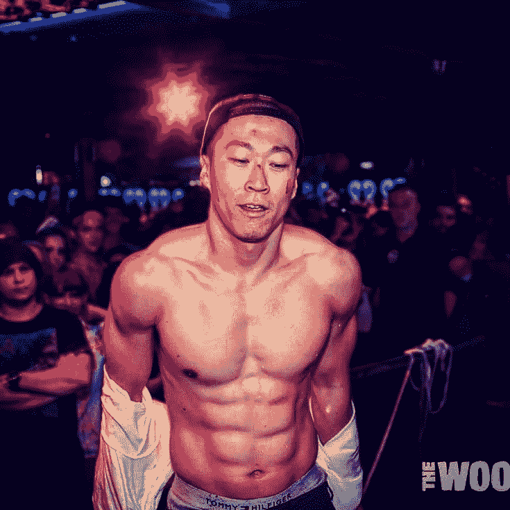

# 健康饮食基础篇，遵守本饮食指南，你会比99%的人都健康

> 原文：[https://piaohanshenghuo.com/healthy_diet_basics/](https://piaohanshenghuo.com/healthy_diet_basics/)

吃饭是你一辈子每天都要重复做的一件事，提高一点点，对你一辈子都有很大的帮助，所以非常重要！

我们先看一眼一位遵守本文饮食指南，不去健身房，不吃蛋白粉或任何药物，但经常运动的小伙儿的身材。OK, 如果你对这个身材很满意，不妨认真读一读本文。

 

市面上流行很多“专家”不同的饮食理论，大多数人都会被搞得晕头转向，不知道应该听谁好。那我们不妨先整理出大家基本一致认可的健康和不健康食物。想简单粗暴看结论，请直接看本文结尾。

*   **蔬菜水果**：富含各种维生素、矿物质、纤维素，所含的碳水化合物是复合碳水化合物（complex carbohydrates），在人体内缓慢地转换为葡萄糖，不至于过快而导致脂肪的堆积。相对蔬菜来说，水果的含糖量较高，如果你急需减肥，请尽量限制水果的摄入
*   **坚果和种子**：富含健康脂肪（不饱和脂肪(unsaturated fat)），纤维素、维生素，Omega 3 脂肪酸
*   **初榨橄榄油、椰子油**：最健康的脂肪之一
*   **水**：生命之源，身体最好的净化排毒工具，每天最好可以喝一加仑(约3.8升）的水，水会帮助肝将脂肪转化为能量消耗掉，可以喝茶或咖啡，咖啡每天不宜超过3杯
*   **各种天然调料**：葱、姜、蒜、辣椒、花椒、姜黄等等，各种香草如薄荷、迷迭香、欧芹等等。盐每天不易超过6克，因为各种食物里往往都有盐，所以做饭时应该尽量少加盐
*   **谷物和豆类**：总体来说很健康，虽然和很流行、很科学的Paleo Diet背道而驰，适量食用绝对利大于弊

科学的素食主义可以满足人体所需的一切营养，即使你是健身狂人。素食的好处实在太多，不过如果你实在喜欢吃肉的话，最好吃以下推荐的肉类：f

*   **鸡蛋**：营养非常丰富，不过每天最好不超过3个，蛋黄的胆固醇含量太高
*   **廋肉**：其实肉类和很多疾病都有联系，但如果非要吃肉的话，请尽量选择廋肉，吃吃草长大的牛羊的肉，能吃野生的尽量吃野生的，最健康的廋肉是鸡胸脯
*   **海鲜**：尽量避免大型鱼类，越大的鱼越会在体内积累越多的汞。不吃养殖鱼，养殖鱼体内有大量激素、毒素

上述所有的食物都有一个特点，那就是它们都是**全天然、无加工**的食物(**wholefoods**)。

公认的垃圾食品：

*   **酒精**：很容易喝进身体大量热量，从而导致肥胖。饮酒后排尿导致人体缺水。对肝脏伤害很大。增加患癌几率。喝多了口臭，男生小弟弟硬不起来，没有姑娘喜欢你。女生小妹妹变臭，没有小伙儿愿意舔你。酒醉容易出意外，间接伤害自己和他人
*   **糖**：糖是最精细的碳水化合物，除了快速提供热量外没有任何营养，是最容易让身体长胖的食物，还容易上瘾

**糖**和**酒精**是两大**最不健康**的食物。

*   **饮料**：可乐、汽水、茶饮料，含大量的糖，添加剂，防腐剂，对身体不好而且比水还贵
*   **油炸食品**：各种明显的油炸食品、膨化食品、薯片、甜甜圈（最不健康的食品之一，又油炸又精细碳水）、方便面，大量不健康的油脂，高热量，低营养
*   **洋快餐**：大部分肉都是经过加工的肉，里边有大量有害的化学成分，大部分披萨，汉堡，爆米花，高热量，低营养
*   **精细碳水化合物**：白面包、饼干、蛋糕、白面条，进入身体后迅速转换为糖分，如果没法及时消耗，就会堆积成脂肪

表面貌似还算健康，其实不健康的食品：

*   **果酱**：含糖量超高，每100克果酱往往含有超过60克的糖
*   **果汁**：营养成分很足，但是含糖量太高，少了水果里的纤维，很容易被人体迅速吸收，转换为脂肪
*   **果脯**：含糖量很高，还有防腐剂
*   **乳制品**：并没有你想象中的补钙效果，乳制品摄入量最高的北欧国家是骨折率最高的。所含的大部分营养无法被人体吸收。与许多慢性病和癌症都有关。牛奶确实能让小孩身体长得更大，但是会让脑子发育不好。之所以被大肆宣传为健康食品，是因为很多公司在背后可以赚大量的钱。
*   **大部分早餐麦片**：大部分麦片并非纯麦片，为了提升口味，含糖量很高
*   **功能饮料**：除非你进行极度剧烈的运动，否则只会适得其反。功能饮料往往含有大量糖分和咖啡因，完全不建议平时饮用
*   **“****无糖****”****食品**：这类标榜着无糖的食品里往往有其他人工增甜剂，有害健康
*   **“****低脂****/****无脂****”****食品**：食物内的脂肪往往意味着味道，去除脂意味着味道的流失。这类食品里往往有额外的人工香料和糖

 **最重要的原则**：

*   **尽量吃没有经过任何加工的食物(wholefoods)也就是我们祖先吃的食物，被加工得越多的食物往往越不健康**

**次要原则**：

*   买加工食物一定要看配料表和营养成分表，含糖太多的(每100g含大于10g的糖)、或含太多乱七八糟化学成分的食物不要买
*   日常饮食里，健康的碳水（蔬果、五谷杂粮）、蛋白（坚果、种子、豆、廋肉、海鲜）、健康脂肪（坚果、种子、牛油果、初榨橄榄油、椰子油），一样都不能少。热量的摄入比例：碳水化合物应该占大概50%，脂肪和蛋白质各大概25%
*   尽量吃各种不同的食物，不要过量吃任何一种食物。因为不同食物拥有不同的营养物质，吃的种类越多，营养越全面
*   关于蛋白质的摄入：每天70g~100g足够。如果你很拼命地锻炼肌肉，最多可以吃你体重按磅算的那么多克的蛋白质。比如我体重大概75kg,相当于165磅，所以我最多可以吃165g蛋白质。最少的蛋白质摄入量为你体重按千克算的0.8倍，比如我体重75kg，必须最少吃60g蛋白质
*   即使是基本上公认健康的食品也有很多说法反对它们，与其纠结于该不该吃公认的健康食品，我们更应该避免公认的垃圾食品

**连夜码字不易，如果本文对你有帮助，想免费表示支持，不妨多花几秒钟的时间，在公众号文章底部的广告上点一下，我就能有大概一块钱的收入。**

**当然也欢迎你分享本文，更欢迎你打赏，谢谢支持**。

**你的支持可以鼓励我创作出更多有价值的文章供你阅读。**

* * *

剽悍生活UL(博客/微信公众号)分享关于**两性关系**、**自我提升**、**数字游民的生活方式**的原创内容，帮你过上更理想的生活（尤其是性生活）。

官方博客：piaohanshenghuo.com

**可以在官网的搜索框里直接搜索你感兴趣的内容**。

付费内容有：[**一对一视频教学**](https://mp.weixin.qq.com/s?__biz=MzU5NDgxNjI2Nw==&mid=2247485005&idx=3&sn=90921756abbf4f2d3df570a34d4412c0&chksm=fe7a3a29c90db33fa3d31a082f139f3b0a13062b3d594469aad53918a4d84fce706e2e29a9d1&scene=21#wechat_redirect)，[**剽悍生活讨论群**](https://mp.weixin.qq.com/s?__biz=MzU5NDgxNjI2Nw==&mid=2247484865&idx=1&sn=77c36b4014d6c1948879043442f768cf&chksm=fe7a39a5c90db0b39ebff280e3b8b406d41d45b546e8bc22c977a3a9a56ff7256d53e8bf5793&scene=21#wechat_redirect)。

还有内容可以沉淀的剽悍生活读者论坛——[剽悍星球（点此看详情）](https://mp.weixin.qq.com/s?__biz=MzU5NDgxNjI2Nw==&mid=2247484958&idx=1&sn=6873fdf5968922b143e9fe93901ed8ce&chksm=fe7a3a7ac90db36ce1a6ba7f337d7d857342c1904c8605480ad2b5050a2eb9b519e36c09be6e&scene=21#wechat_redirect)。

