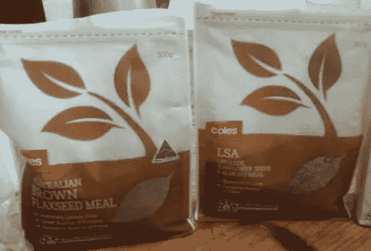
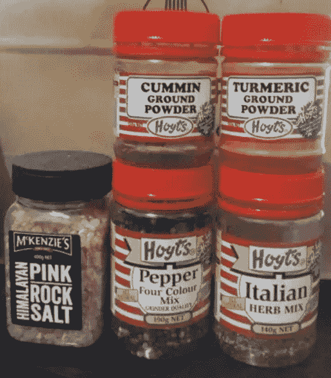

# 澳大利亚低成本高性价比健康食品大全

> 原文：[https://piaohanshenghuo.com/healthy_cheap_food_in_australia/](https://piaohanshenghuo.com/healthy_cheap_food_in_australia/)

一个小伙儿在澳大利亚一年期间吃的绝大部分食物都在本文中，他不去健身房，不用药，不抽烟，不喝酒，经常运动，结果他的身材可以达到下图这种效果，他的健康饮食也许值得你学习。

 

本攻略仅限于 Coles, Woolworths, Aldi三大超市，其中Aldi往往是最便宜的。**蔬菜水果方面建议去本地的大型蔬果市场，在他们下班的时候去扫荡，经常会有很大的折扣。**(**加黑加粗**为重点推荐)

*   燕麦 Oats：

这里一定要推荐性价比最高，超健康超便宜的**ROLLED OATS**, 一袋750k, 只要1.2刀，富含蛋白质、纤维素、复合碳水。必备食物。不推荐任何里边添加乱七八糟原料的燕麦，也许味道更好，但含糖量肯定很高。想知道怎么做超级营养又美味的燕麦粥，请在剽悍生活公众号回复“燕麦粥”。

* * *

*   麦片饼干 **Wheat Biscuits**:

可谓最健康又便宜的饼干，原料为全麦小麦，无防腐剂及有害添加剂，高蛋白，高纤维，干吃比较难吃。Aldi卖的最便宜，1.12kg只要大概3刀，可以吃很久。最有名的品牌是Weet-bix。最简单的吃法是和豆奶一起吃。可以长时间保存，建议用密封袋随身携带几块，以防饥饿。

* * *

*   蔬菜水果 Veggies & Fruits：

性价比最高的蔬菜水果：胡萝卜（特价$1/KG），Aldi的3公斤装橙子（$1.5/KG），南瓜（特价$1/KG），3公斤装土豆（特价$1.3/KG），洋葱（特价$1.5/KG）

除了性价比最高的蔬菜，最好只买打折的蔬菜水果，各种蔬菜水果超市都会不定期打折。以下为打折最便宜时的价格，仅供参考：

西兰花（$3/KG）、芹菜（$1/EA）、玉米（3 FOR $1）、地瓜（$2/KG）、苹果（$2/KG）、梨（$2/KG）、葡萄（$2/KG）、泥猴桃（$2/10）、牛油果（$1~2/EA）、香蕉（$1~2/KG）、桃（$2/KG）、菠萝（$2/EA）、百香果（$3/BAG）。

西方国家的超市里可以买到冷冻蔬菜，因为保存时间大幅度提高，所以价格相对更便宜，而且营养成分也不差。最便宜的冷冻蔬菜$1/KG,有西兰花和菜花中间的心、胡萝卜、芸豆，用热水解冻后可以直接加调料食用或者炒菜。

另外我会买冷冻蓝莓放入燕麦粥，蓝莓本身非常贵、非常有营养，冷冻蓝莓相对便宜（一盒400g不到4刀）。

* * *

*   大米 Rice：

Coles大概每个月会有一次半价的5公斤大米，原价14刀，特价7刀，建议买糙米**（brown rice）**，更健康，GI(血糖指数)低，纤维素、维生素和矿物质的含量都更高。

* * *

*   面包 Bread：

这里只推荐一款我个人最喜欢的性价比最高的”**7 Seeds & Grains Sandwich Bread Loaf 800g**” 保质期一天，放冰箱里至少可以一周，Coles有售，只要3刀，低GI, 高纤维，高蛋白。吃法：将2片面包片烤硬，中间放上花生酱，我个人还会加点胡椒提升口感和营养。非常方便，而且可以放入密封袋外出随身携带，避免去昂贵的餐厅就餐。

* * *

*   罐装食品 Canned Foods：

有钱的话还是应该避免罐装食品，罐装食品的包装大都含有BPA（对人体危害很大）），不过罐装食品价格低廉，食用方便，在此推荐两款我个人会吃的罐装食品。

1.混合豆类 **Mix Beans**：我比较喜欢Aldi的含5种豆类的那款，425g，只要75澳分，一罐吃下去，你会摄入大概25g的蛋白质，30g的纤维素，还会更加纯熟地掌握放屁的技能。

2.金枪鱼 Tuna：只选SPRINGWATER TUNA（Aldi有售），因为别的款里油太多，不健康。一罐425g，大概不到3刀，含有超过100g的蛋白质，脂肪含量超低，富含Omega 3，很健康。

请在食用罐装食品之前请把食物放在漏网（strainer）里反复用水冲洗，以冲走大量的盐分和其他有害物质。

* * *

*   坚果 Nuts：

推荐**SALTED MIXED NUTS,**375g, 3刀，内含花生、杏仁、腰果、榛子、巴西坚果（Brazil nut），富含健康脂肪、纤维、蛋白质。

* * *

*   食用油 Oil：

初榨橄榄油** Extra Virgin Olive Oil**：非常健康又便宜，一定要买，澳大利亚的橄榄油反而比国内便宜。

椰子油** Coconut Oil**：非常健康，浇在饭上好吃又健康。

* * *

*   海鲜 Seafood：

1.巴沙鱼 **Basa Fish**：最便宜的鱼，特价时只要$5.5/KG, 高蛋白，低脂肪，富含Omega3 脂肪酸，健康又便宜，强烈推荐，煎着很好吃。

2.海鲜大杂烩 **Marinara Mix**：平时$12/KG, 特价$10/KG, 内含各种海鲜：牡蛎(oyster)、虾(prawn)、三文鱼(salmon)、鱿鱼圈(squid rings)、贻贝(mussel)、巴沙鱼(basa fish)、扇贝(scallop)，营养丰富而全面。 

* * *

*   鸡蛋 Eggs：

能买得起free range就买free range，比普通的在笼子里的鸡蛋更有营养。

* * *

*   肉 Meat：

性价比最高的肉是鸡腿(drumstick)，$3.5/KG, 最健康的鸡胸(chicken breast)要$9/KG, 推荐买大包装的鸡腿，每个鸡腿捅几刀再用烤箱烤熟或水煮熟，放入密封袋在冰箱保存。

牛肉馅也比较便宜($7/kg))，而且非常好吃，但相对不健康，饱和脂肪太多，不建议长期食用，可以偶尔食用。

另外可以关注各种快过期，打特价的肉，尽量买没有经过加工的纯肉。

* * *

*   奶类 Milk：

不建议买牛奶，因为其实很不健康，想知道原因，请在公众号回复“牛奶”两字。推荐食用牛奶的替代品，用其他物质做成的奶，比如Soy Milk, Almond Milk, Coconut Milk, Oat Milk, Rice Milk等等。

这里推荐一款我最喜欢的性价比超高的有机加钙加维生素的豆奶，名为“**VITASOY CALCI PLUS**”,平时售价$3/L，打特价时只要2刀。使用的是非转基因的有机大豆，又加入了各种维生素和钙，味道好又健康，强烈推荐，Coles和Woolworths有售。

另外推荐Aldi的JUST ORGANIC SOY MILK, $1.7/L，有机豆奶，性价比很高。

* * *

*   种子 Seeds：

有点儿贵，但是非常健康，富含大量蛋白质、健康脂肪和超高的纤维素。可以放两勺在燕麦粥里，加入豆奶食用，推荐两款性价比最高的，都不到5刀一袋，Coles health food section有售： 

1\. LSA(LINSEEDS, SUNFLOWER SEEDS & ALMOND MEAL(350g))

2\. BROWN FLAXSEED MEAL(500g)

另外请不要浪费了你买的南瓜里的种子，很有营养！

* * *

*   香料 Spice:

原则是买最大罐装的，性价比最高。盐和胡椒要买完整颗粒的，要用的时候拿grinder磨。因为胡椒被磨之后会开始氧化，丧失味道，提前磨好的胡椒味道不好。盐磨过之后和舌头接触面积变大，提升味道。

1.盐 Salt：选择**HIMALAYAN PINK ROCK SALT**, 400g, 粉色的喜马拉雅山岩石上的天然盐，并非便宜，但是富含超过84种矿物质。价格大概5到6刀，可以用很久。也可以选择海盐，别买精加工的盐(TABLE SALT)，不健康。

2.胡椒 Pepper: 选择**Hoyts’s Pepper Four Colour Mix**, 190g, 内含黑白绿粉4种胡椒，比起单一的黑胡椒味道和营养更全面。大概5刀。

3.意大利香草混合 **Italian Herb Mix**: 选择Hoyt’s牌的，140g, 大概5刀。内含近10种香料，味道好，营养丰富，性价比高。

4.孜然 Cumin: 选择Hoyt’s CUMMIN GROUND POWDER, 130g, 大概4刀。

5.姜黄 Turmeric: 选择Hoyt’s TURMERIC GROUND POWDER, 140g，大概4刀。  

* * *

*   意大利面 Pasta：

要选择whole wheat 或 whole grain的意大利面，营养价值高，而且在体内转化为葡萄糖的速度慢，避免脂肪的生成。

* * *

*   营养补充剂 Supplements: 

不是特别有必要，但由于我们可能经常无法吃到很全面的营养，吃补充剂来补充不足的营养，这里推荐两款性价比最高的我本人使用的。

1.鱼油 Fish Oil: 富含Omega 3, Coles最便宜的一款名为Vitamore，10刀，300粒，可以吃很久。

2.维生素、矿物质片 Multivitamins & Minerals：Coles性价比最高的一款为”CENOVIS Multivitamins and Minerals(VALUE PACK)”, 200粒，大概13刀，可以吃很久。

以上就是这位小伙儿的高性价比健康饮食清单，赶快学起来吧。

敬请期待下一篇文章，**熬夜码字不易，别忘了通过点赞、分享、打赏等方法鼓励我更快地发表下一篇文章**。

**另外，还可以点击公众号文章底部的广告来支持我（每个成功的点击量可以帮我赚几毛钱）**。

**谢谢！**

* * *

剽悍生活UL（微信公众号)帮你从**健康、两性关系、生活方式**三个方面全面提高自己，打造理想的生活（尤其是性生活）。还可以带你看看真实的国外，长长见识。

剽悍生活的个人微信号：ycf3721，[一对一视频教学](https://piaohanshenghuo.com/1on1_coaching/)，或拉你进入[剽悍生活泡妞讨论群](https://piaohanshenghuo.com/ul-group-chat/)，请注明加我的目的。

