# 一个月, 3000公里，游遍北半个越南的摩托之旅（图多慎入，附摩托骑行攻略）

> 原文：[https://piaohanshenghuo.com/northern-vietnam-bike-tour/](https://piaohanshenghuo.com/northern-vietnam-bike-tour/)

我在泰国住了一年多，虽然很爽，但是有点儿腻了，是时候换个地方住了。经过一系列的调查，我决定先去越南，买一个摩托，到时候还可以去老挝和柬埔寨（必须得用越南的摩托才可以顺利出入这三个国家）。

#### 第一站：Hanoi（河内）

我在河内花了700美金买了一个Honda Blade，我对河内没什么好感，交通非常乱，建议绕西湖骑一圈，别的我就不具体介绍了。

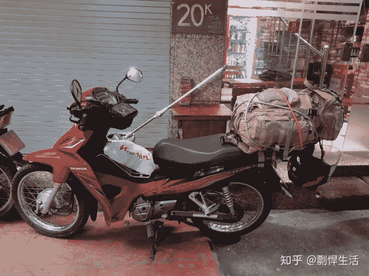

我的装备（别忘了给你的背包也买个雨衣）

推荐试试一道叫Bun Cha的菜，推荐去一个叫The Burrow的青旅所在的小巷吃，非常正宗又便宜，只要3万越南盾一碗（大概9块钱人民币），两碗就能吃得很饱。

另外，Old Quarter晚上可以泡妞，很热闹。我只出去打了一次猎，亲了一个美国妞。

另外，河内是一个大城市，网上约会软件上有很多姑娘可以约，不乏一些在这里生活的外国人。我就利用Bumble推倒了一位在这里教书的爱尔兰姑娘。

#### 第二站：Phu Yen（途径Mai Chau）

我的目的地是河内西北部的Sapa，但是不想直走，想多体验一下越南北部的山区，于是绕道先去河内西南部的Mai Chau。

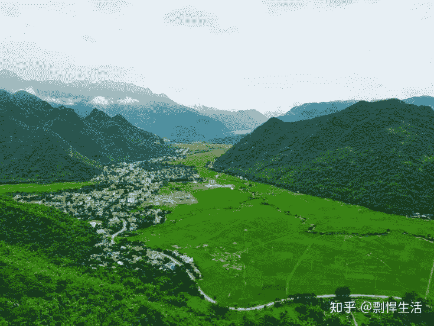

Thung Khe Pass很漂亮

第一天我一路推进到了Phu Yen, Phu Yen是一个很安静的小镇，我没见到任何一个游客，镇上有家Pizza店，味道很好，名字我忘记了。

**不建议晚上开车，很危险，出现问题了还没有开门的店**。我都是每天白天骑车推进，傍晚在附近找住宿，吃饭、工作。

**建议走****QL****开头的公路（路况较好），避免****DT****开头的公路（路况有可能非常差）**。

#### 第三站：CO LA，途径Khau Phạ Pass

原计划在一天内从Phu Yen开到SAPA，但起床较晚，天黑的时候还离SAPA有一段距离，于是我就近在CO LA落脚。

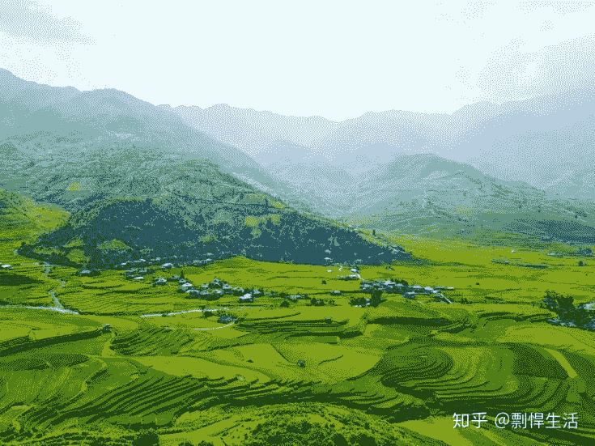

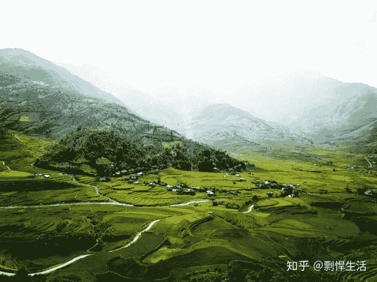

Khau Phạ Pass的景色

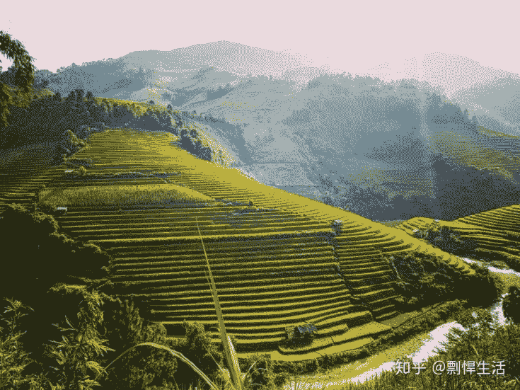

Mam Xoi Viewpoint附近的美景

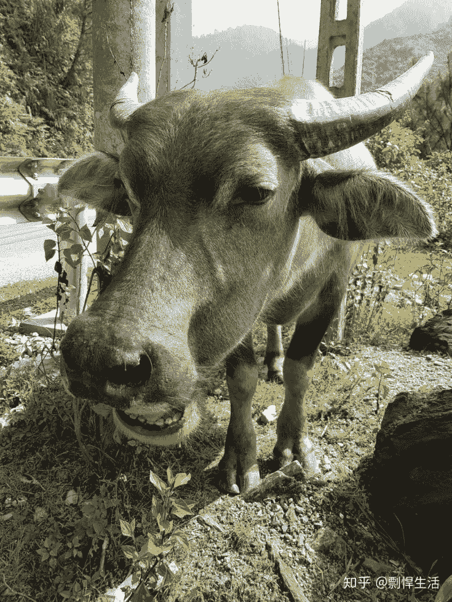

路上还有很多水牛

我听信了一个叫Vietnam Coracle的博客的推荐，决定第二天先去看看一个叫Sin Ho的小镇，再去SAPA，结果感觉很上当。

路上景色还行，但是最后路况非常糟糕，坑坑洼洼的路要开将近一个小时，走的时候我打算走另一条路，结果另一条路因为山体滑坡完全被堵，我还得原路返回……浪费了我很多时间，都没时间在天黑前开到SAPA了，不过在回CO LA的路上看到了美丽的山区日落。

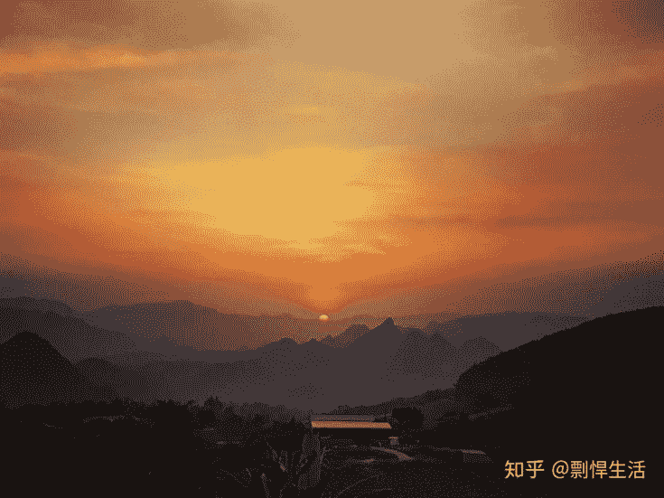

在Lai Chau的日落

#### 第四站：SAPA（沙巴）

在我到SAPA之前，基本看不到任何其他的外国人，SAPA是我到达的第一个旅游重镇。整个镇建在了山腰上，有时赶上下雾，能见度基本只有20米。

我住的青旅窗外的景色

越南最高的山（Fansipan）就在这里，但我没去，因为爬山大概要两天的时间，坐缆车上去又太简单了。这里基本每个景点都要收钱，我感觉骗钱的旅游气息太严重了，我并没有久留。

夜生活不集中，没发现适合泡妞的地点。Sapa Park里有可以锻炼身体的单杠、双杠。

#### 第五站：Vinh Quang（途经Lai Cai）

这时我已经骑行1000公里了，是时候对我的摩托进行一下护理了，于是我去附近的在中国边境的城市Lai Cai的本田摩托车店（在谷歌地图上搜”Honda Head”），换了下机油，紧了下刹车，给轮胎打气等等。

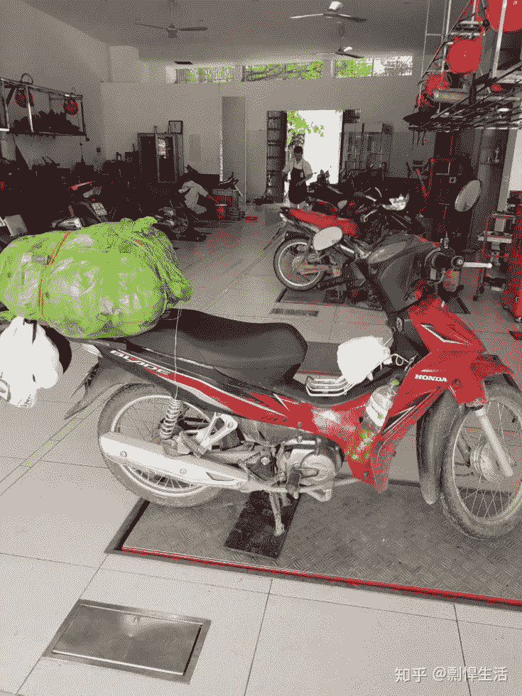

每1000公里换一次机油，保证摩托车的健康。

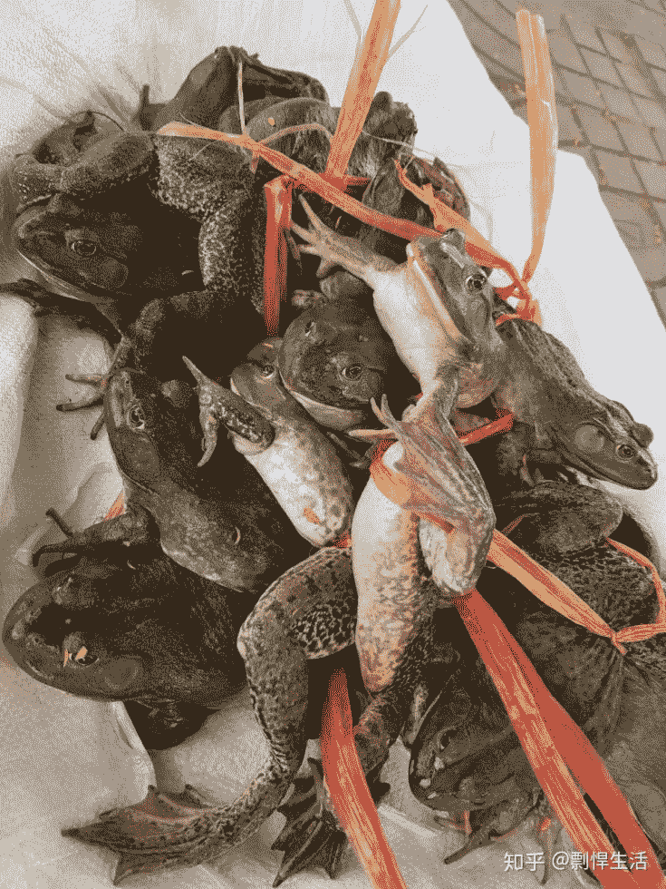

还在路边看到了卖青蛙的小摊……

今天的落脚地Vinh Quang是个鸟不拉屎的小镇，我打算从Lai Cai沿着中越边境的山区线骑行到Ha Giang，听说风景很好，在天黑的时候只推进到了Vinh Quang。

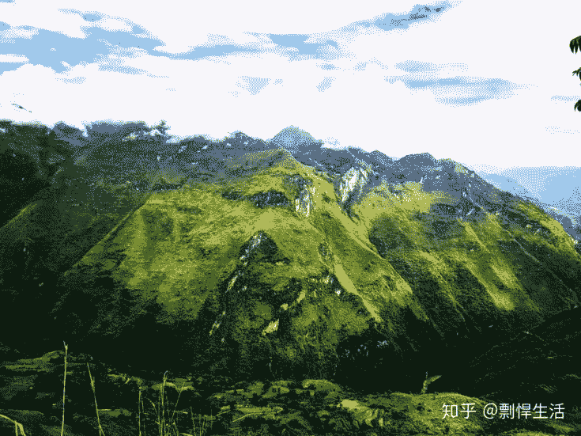

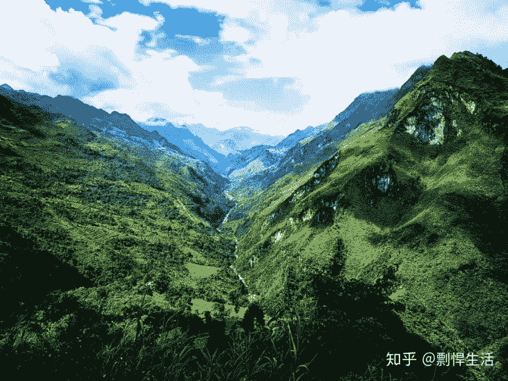

途中的美景

#### 第六站：Ha Giang（河江）

从Vinh Quang到Ha Giang很近，今天的骑行任务很轻松。Ha Giang又是一个旅游重镇，离中国只有20公里，明朝的时候还是属于中国的。

近年来越来越多的西方游客都喜欢骑摩托车完成”Ha Giang Loop”（从Ha Giang出发，在Ha Giang结束的一个大圈（Google Maps上QL4C和QL34两段路构成的那个大圈））。

我下午在Ha Giang落脚后，旅店老板推荐我去西北方的瀑布看看，我没找到瀑布，但找到了一大群水牛，还有这个诡异的锯齿山。

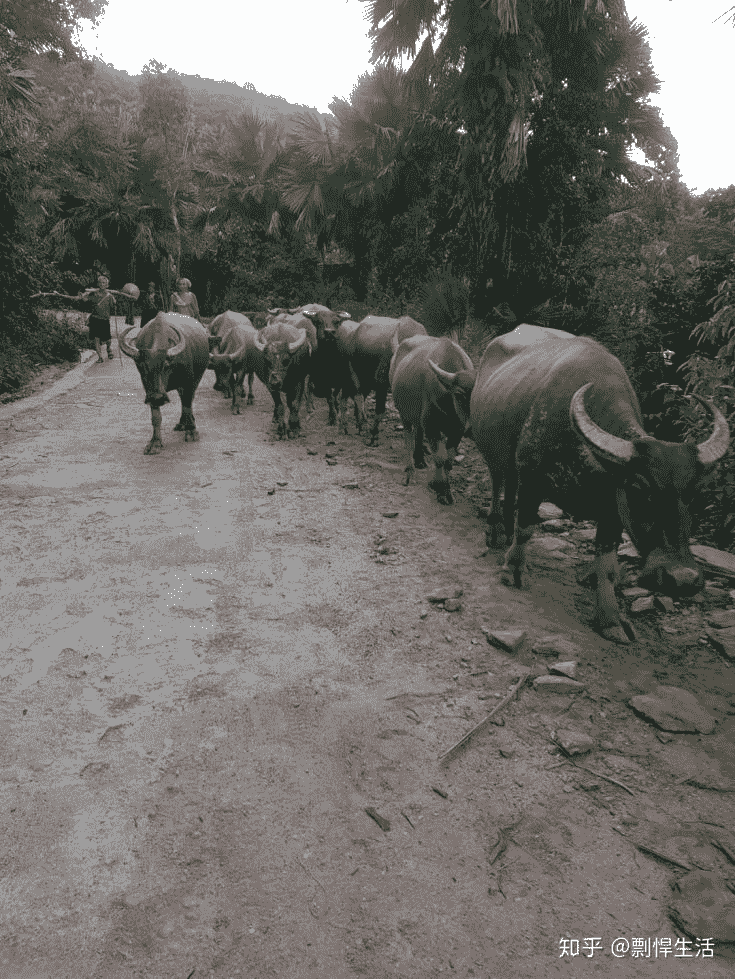

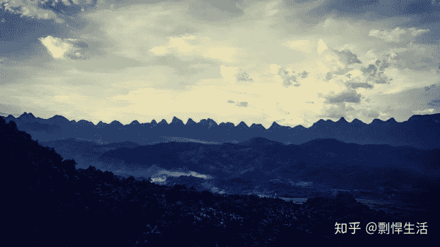

#### 第七站：Dong Van（Ha Giang Loop中的一个小镇）

由于我已经看了太多的越南北部山区美景，已经产生了一定的免疫力，于是我并不打算完成一整圈的Ha Giang Loop，而是只走靠近中国边境的上半圈，途中车胎漏气了两次，严重影响了我的进程。最后落脚在一个叫Dong Van的小镇，这里没什么值得看的。

**如果你的摩托车胎在越南被扎破了，别慌，基本有人住的地方就有修摩托车的店，只需要在大街上寻找****”Xe May”****的标志即可，换个内胎一般需要****7****万越南盾**。

#### 第八站：Cao Bang

今天推进了很多，完成了Ha Giang Loop，车胎又一次漏气，应该是外胎老化的原因，于是我把内胎外胎全换了，之后就再也没有无故漏气的情况了。

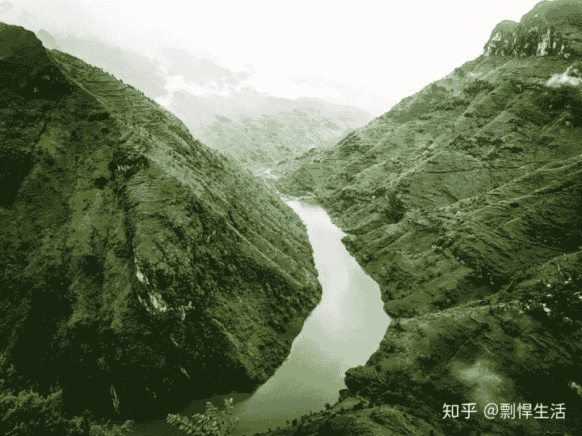

Ha Giang Loop上最著名的景点：Mã Pí Lèng Pass

我并没有选择路况更好的QL34路，而是为了去Đèo Mẻ Pja（一个路况奇特的地区）选择了路况不好的小路。

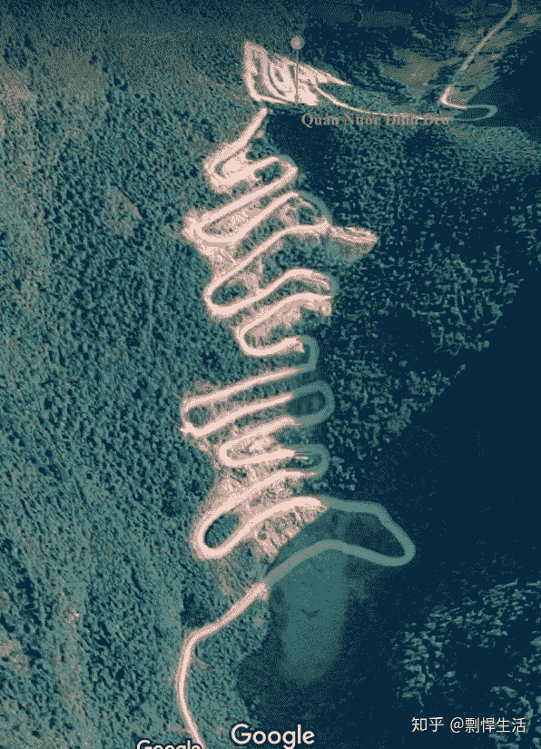

这是我在Google上找到的一张图，我并没有找到可以拍出这个地势的地点，不过我亲自骑过了这段诡异的路。

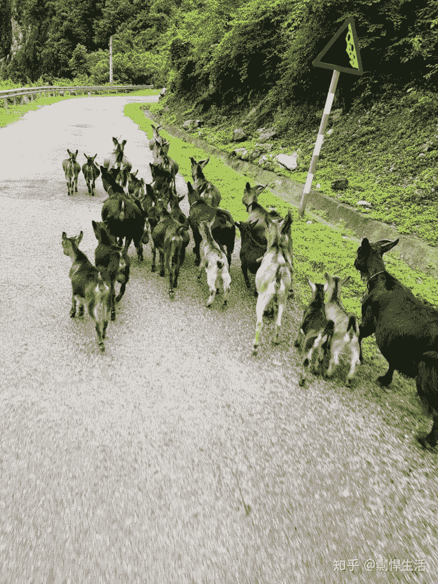

还遇到了一群山羊，很好吃的样子。

#### 第九站：Lang Son（途径Thác Bản Giốc）

Cao Bang好像没什么可看的，在这里过夜之后，我第二天启程去中越边境的瀑布Thác Bản Giốc（越南最宽的瀑布，中国叫德天瀑布）。一边是越南游客，一边是中国游客。

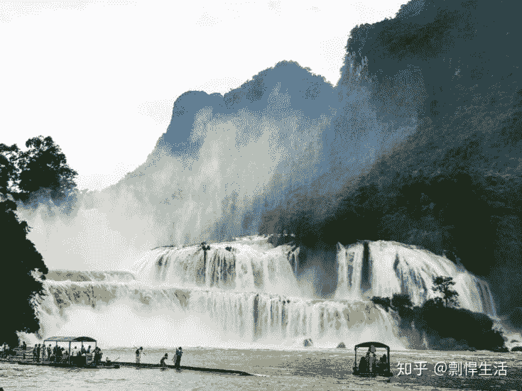

站在越南这边的瀑布景色

看完瀑布之后，下一个目的地是Halong Bay，不过当天肯定赶不到，我最终推进到了一个叫Lang Son的离中国很近的城市。我为了抄近路，没有走QL路，而是走了DT路，非常后悔，经历了一大段我这辈子走过的最泥泞的路……**尽量走****QL****路，宁可绕远**！

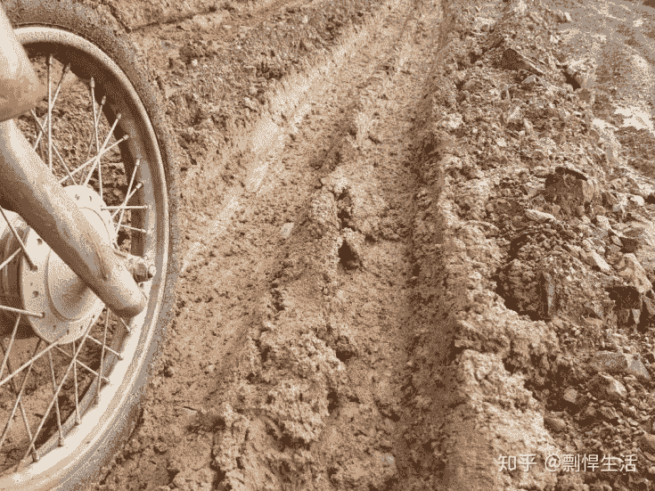

DT路的路况很可能非常糟糕

#### 第十站：Halong Bay（下龙湾）

从Lang Son到Halong Bay的路况很好。推荐入住Fancy Hostel，地点方便、安静，又有便宜干净的单间。

Halong Bay被评为世界新七大自然奇观之一，但实际上我感觉也没那么新奇。强烈推荐去Poem Mountain的山顶，可以俯瞰整个城市以及部分海岛。Peom Mountain需要经过民宅的后院才可以进入。

据我所知有两个民宅可以经过，收当地人1万越南盾，收游客至少5万，我刚开始被要了10万，地主看到我惊讶的表情后降到了5万，我没去她家。在附近打听到本地人只要交1万后，去另外一家花了2万上的山。

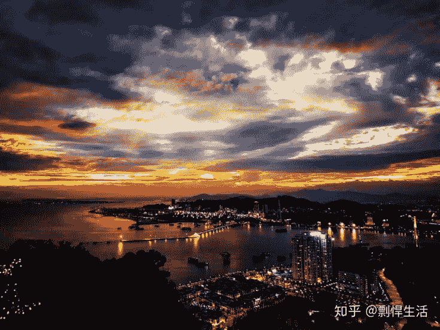

Peom Mountain日落后的美景

#### 第十一站：Dao Cat Ba

Cat Ba是Halong Bay附近的一个大岛，可以乘摆渡带着摩托车一起过去。这个岛让我很失望，景色一点儿都不美，里边有一个Cat Ba National Park，往返爬山花了我大概40分钟，可以到岛上的最高点。

这里唯一的优点就是有一定数量的洋妞，晚上有可以泡妞的地方。我第一天晚上亲了一个以色列妞一个法国妞，但都没法带回家，第二天晚上啥也没有。推荐的两个泡妞地点分别是Oasis Bar和The Good Bar。

#### 第十二站：Ninh Binh（宁平）

从Halong Bay到Ninh Binh的路况还可以，但是完全没有景色可言，路上满是风沙。

Ninh Binh被称为陆地上的Halong Bay，这里也有很多山水。建议住在Tam Coc区域，市内没有什么可看的。

我跳过了地标之一的Hang Mua，因为我感觉人太多了，非常影响体验，还要交门票钱。

不过强烈推荐Trang An的Ecotourism Trang An Boat Tour（直接在谷歌地图上就能搜得到）。20万越南盾（大概60块钱人民币），可以在一个4人小船（外加一个船夫（一般是中年妇女））上游览两三个小时。

一共有三条线路，我选了第一条，最长的一条线路。这三条路线都会经过一些山洞、古庙之类的地方，整个过程都被山水环绕着。

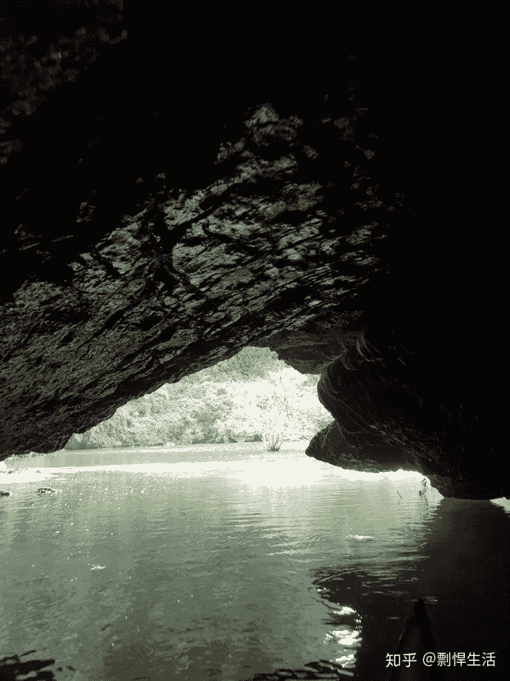

划船经过了很多山洞

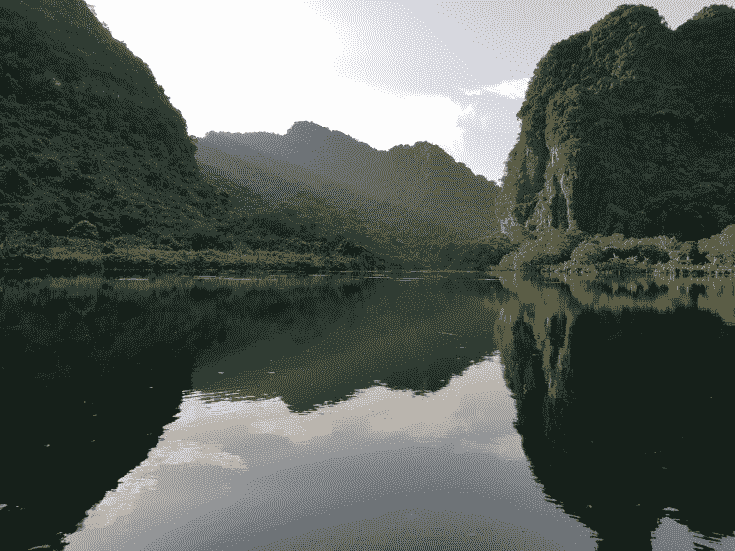

船上的湖光山色

#### 第十三站：Phong Nha

从Ninh Binh到Phong Nha的途中也没有什么美景，大部分都是尘土飞扬的马路，骑一天摩托下来皮肤上会形成一层黑泥。

Phong Nha最有名的是它的洞穴，目前世界上发现的最大的洞穴(Son Doong)就在这里，不过去那里需要提前预约，而且要交3000美金，是一次长达10天的没有网络信号的徒步洞穴探险，不适合离不开网络又不愿意花3000美金的我。

我选择去了Paradise Cave，这在当地算是一个“不大的”洞穴，但已经是我去过的最大的洞穴了，游客可以独自步行的部分就够你往返走一个小时的了（可以组团进一步洞穴探险好几天）。洞穴里像开了空调一样，来到洞口的时候顿时觉得浑身凉爽，和外边的气温形成了明显的反差。

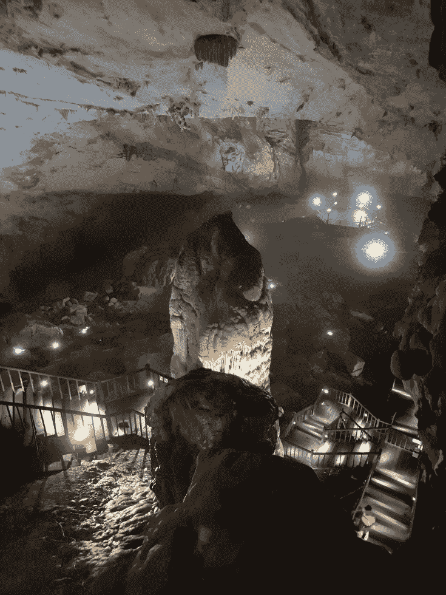

洞内有各种形态各异的钟乳石，图一为入口，这只是冰山一角

我并没有在这里泡妞，不过想泡妞的话建议你去Easy Tiger Hostel，晚上人好像都聚集在那里，我来的时候是淡季，人不多。

另外推荐去The Duck Stop看一看，开这个地方的人很有商业头脑，养了100多只鸭子，拿和鸭子拍照片做噱头，吸引了一大堆游客，10万越南盾（30元人民币）可以喂鸭子并和鸭子合影，15万越南盾还可以额外骑水牛并拍照。还给你一张成本可以基本忽略的煎饼，你还可以选一瓶饮料、水或啤酒。我选择了最便宜但最健康的水。

他们居然还用“童工”，有好几个想练习英语的小学还没毕业的小孩儿负责招呼游客，完全免费为这个地方“工作”。目测这个地方一天赚几千人民币很轻松。

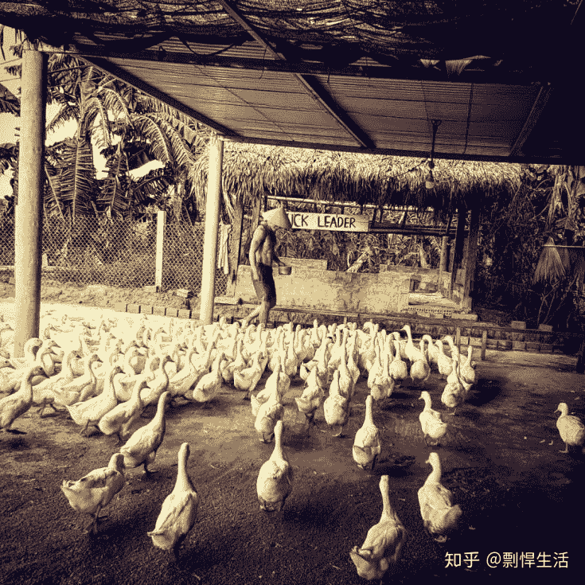

如果你有关注剽悍生活公众号，相信你已经看到了这张“鸭王”照片了

#### 第十四站：Hue（顺化）

我再一次听从Vietnam Chronicle这个博客的推荐，选择了博主认为“最美的”骑行路线之一——Ho Chi Minh Road，从Phong Nha一路骑到Hue，结果感觉又上当了。

没有他说得那么美，路况大部分还可以，后来有一段非常泥泞，大部分路都荒无人烟，有时骑车半小时都碰不到一辆车……加油站也很少，我的油差点儿就烧光了，我提心吊胆地骑了很久，并不推荐这个路线。

Hue曾经是越南的首都，这里有个类似故宫的地方，不过我不感兴趣又不想交钱就没去。推荐去废弃的水上乐园，免费去，那里有一条很酷的龙，你可以爬到龙的嘴里。

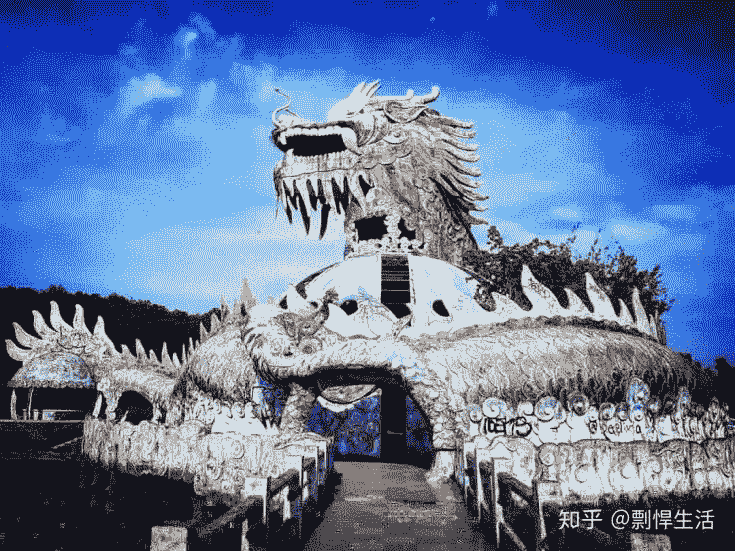

晚上泡妞推荐去Brown Eyes Bar，外国游客会聚集在这里，我在这里一人成功应对两个西班牙姑娘，最后推倒了其中一位。

我还在这里吃到了最便宜的Bahn Mi（越南法棍三明治），只要1万越南盾（大概3块钱）一个，就在“Tủ nu trang”（谷歌地图搜）这个路口，这里还有很多便宜的路边摊。

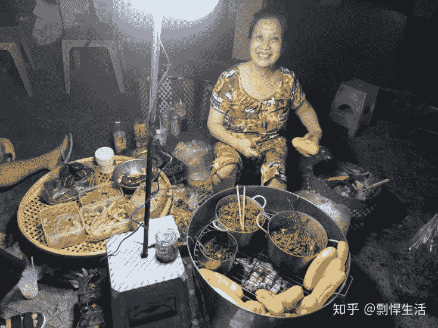

摆摊的微笑的大妈，我一口气吃了4个Bahn Mi

#### 第十五站：Da Nang（岘港）

去Da Nang的路上途径景色优美的Hai Van Pass，不巧下雨、下雾，没拍到满意的美景。

推荐去Linh Ung Pagoda，很有良心的、很少见的完全免费，停车场都免费，有一个巨型的白色观音像，还有好几个庙。沿着这条盘山路可以一路骑到山顶，看到整个城市。

另外一个地标式的景点是至今还都没去，那就是Golden Bridge，两只大手拖着的一座桥。距离市中心有将近2小时的车程，而且门票要70万越南盾（200多元人民币）。

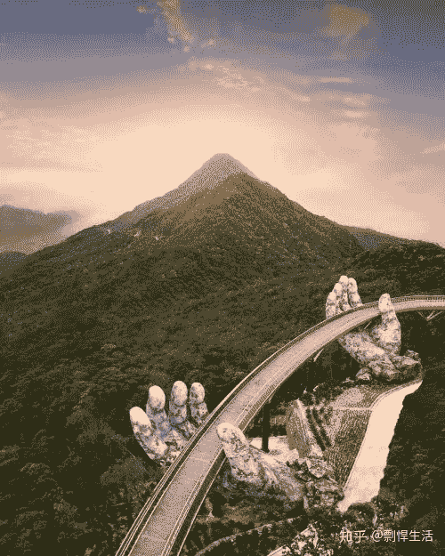

网上有这种很酷的图片

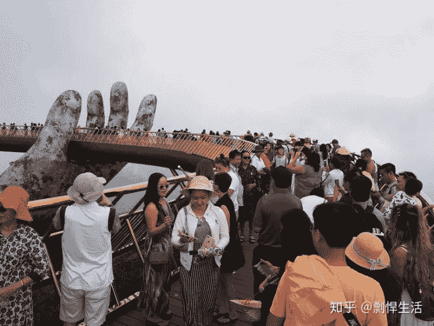

 但实际上人满为患

感觉这里更像是个骗钱的地方(tourist trap)，所以我还没去。

推荐去Dragon Bridge，完全免费，周末两天晚上9点准时有神龙喷火、喷水的表演。

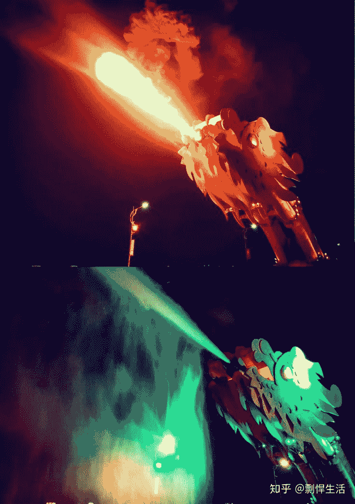

Dragon Bridge

另外推荐去Marble Mountain，门票4万越南盾，山不高，但有不少景点，不错。

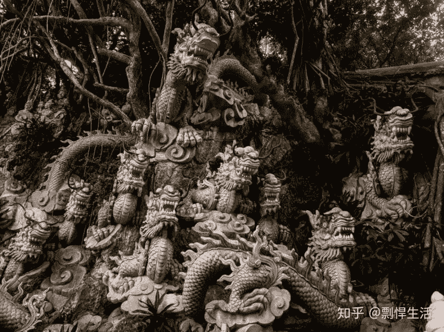

Marble Mountain上的龙

全市我最喜欢的地方要数在沙滩边上的户外健身场地（在The Holiday Beach Club附近），单杠双杠一应俱全，吹着海风锻炼身体非常惬意，还可以搭讪路过的美女。

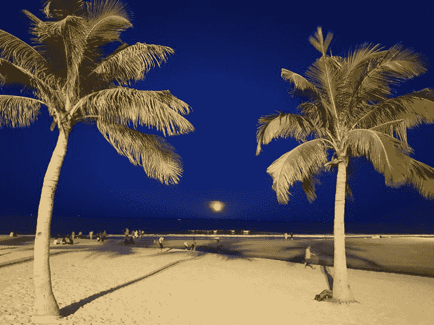

面前是椰子树和沙滩，背后是单杠、双杠

#### 终点站：Hoi An

我本来打算把Da Nang作为本次旅行的终点，但到Da Nang后发现我很讨厌这里的交通，太乱太忙。而且晚上没有一个美女集中的适合泡妞的地点，于是我决定移居到Hoi An（会安）。

Hoi An是一个旅游气息超浓的小镇，基本所有旅行越南全境的游客都会来这里，是我目前在越南看到的洋妞密度最高的地方，而且还有大概50多个在这里留学的挪威姑娘。

之后我会写[一篇具体的Hoi An泡妞攻略](https://piaohanshenghuo.com/hoi-an-night-life-guide/)。

推荐去一个叫Banh Mi Phuong的餐厅，Anthony Bourdain在他的旅行片”No Reservations”（强烈推荐观看）里光顾了这家店，这家店从此就火起来了。2.5万越南盾一个的Banh My，基本每次都得排队，很新鲜、很好吃。

关于在户外锻炼身体，推荐去“An Hoi Sculpture Garden”附近，这里有单杠、双杠，就在河边。

推荐去An Bang Beach，人最多的沙滩，最有可能搭讪到美女的沙滩。

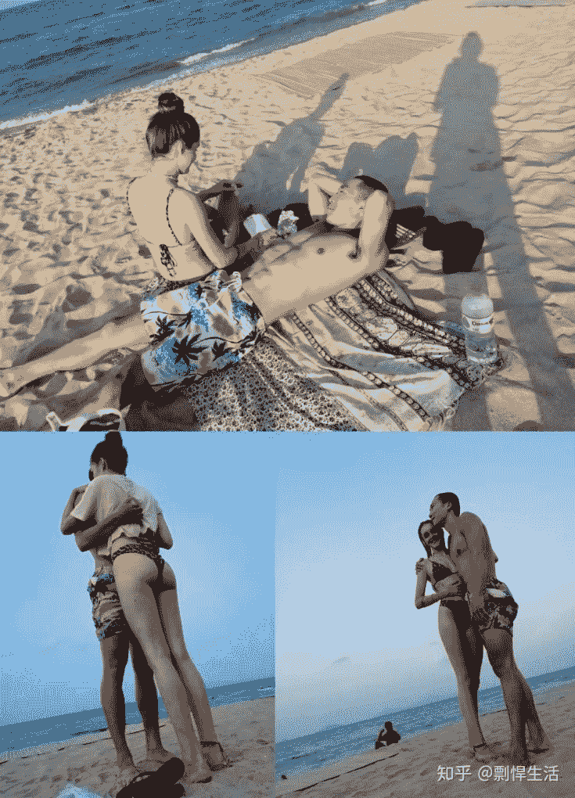

 沙滩上美好的回忆

本文到此为止。

连夜码字不易，如果本文对你有帮助，想免费表示支持**，不妨多花几秒钟的时间，在公众号文章底部的广告上点一下，我就能有大概一块钱的收入。**

当然也欢迎你分享本文，更欢迎你打赏，谢谢支持。

你的支持可以鼓励我创作出更多有价值的文章供你阅读。

* * *

剽悍生活UL(微信公众号)帮你从**健康、两性关系、生活方式**三个方面全面提高自己，打造理想的生活（尤其是性生活）。

官网：www.piaohanshenghuo.com

**长按下图扫码关注**

