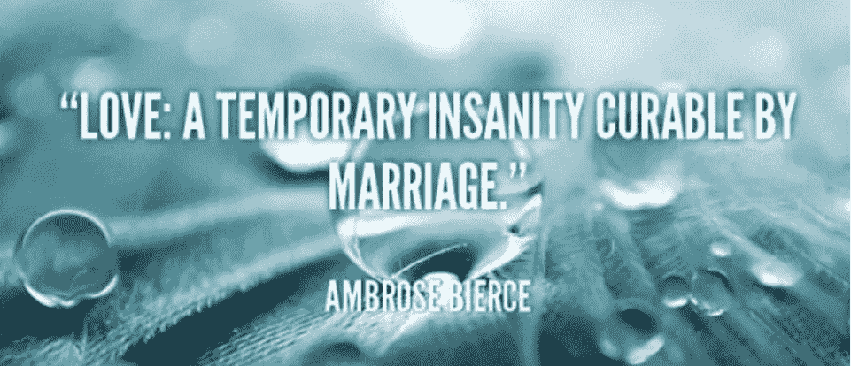
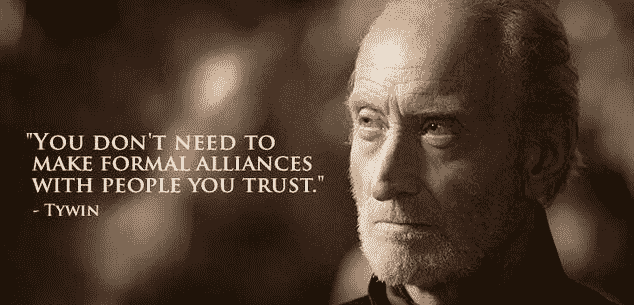
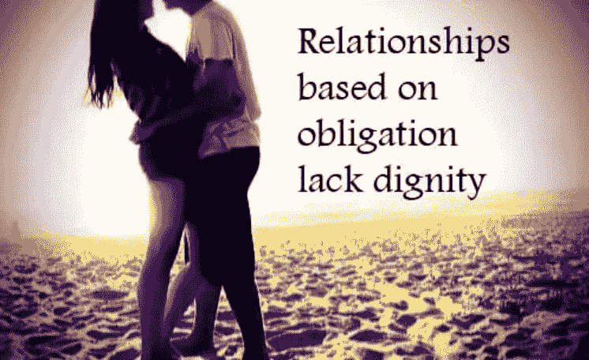
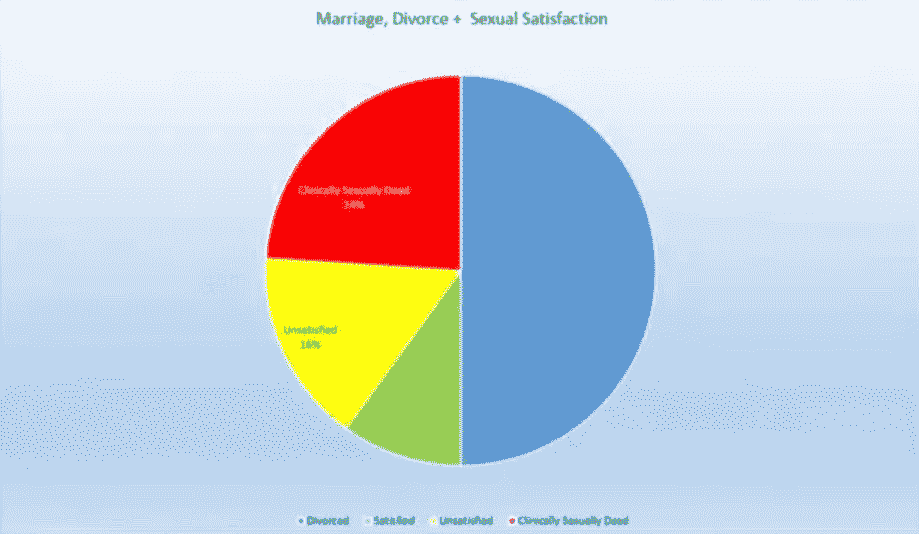
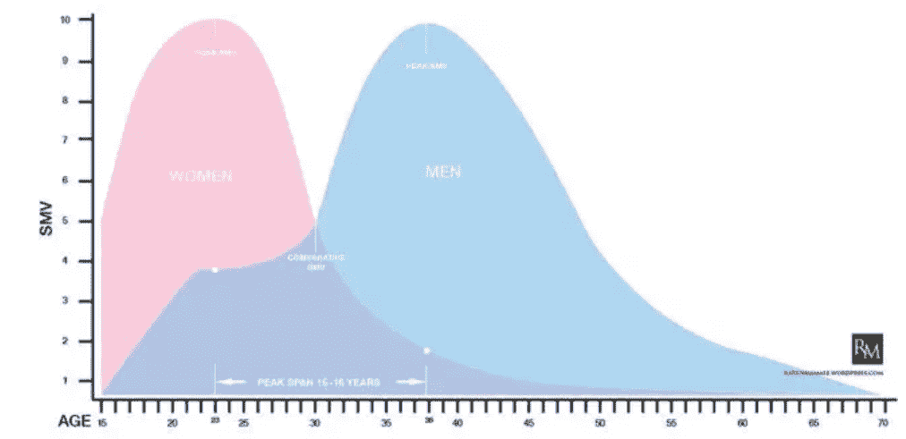

# 我在知乎上的高赞回答“为什么现在越来越多的男人不想结婚了？”

> 原文：[https://piaohanshenghuo.com/why-less-and-less-men-want-to-get-married/](https://piaohanshenghuo.com/why-less-and-less-men-want-to-get-married/)

（本答案前半部分其实是我去年写的《[为什么不应（过早）结婚](https://piaohanshenghuo.com/why_you_should_not_get_married_early/)》，后半部分加了很多干货，没看过的可以去看看）

原因很多，听我一一道来。

*   摧毁你的性生活：

美国结婚并不离婚的夫妇中80%表示性生活不和谐，这80%中的60%表示基本没有性生活。

最主要的原因是生理上完全不可避免的“库里奇效应”(Coolidge Effect): Calvin Coolidge是美国第30届总统，一次他和夫人参观一个实验农场，第一夫人注意到了公鸡交配得很频繁，她问农夫：“公鸡一天交配几次？”农夫说：“十多次。”第一夫人说：“请把这件事告诉总统。”于是农夫告诉了总统，总统问：“每次都是同一只母鸡吗？”农夫说：“每次都是不同的母鸡。”总统说：“把这件事告诉第一夫人。”

Coolidge Effect已经在所有的哺乳动物身上被证明有效，所以如果你长期只有一个性伴侣，你们的性趣会越来越弱。

结婚后你老婆是你唯一的性伴侣，她完全掌握你的性生活。如果她不想让你上，你做爱的唯一途径就是出轨或离婚。女人很擅长用性作为武器和筹码来控制你。20多岁是你性欲最旺盛的时期，为什么要早早限制住自己？你的基因决定了你想广泛播撒自己的种子，为什么要早早把自己套死在一小块田地上？

*   婚姻是对自由极大的束缚：

整个人类的历史都是人类在为自由作斗争的历史，我们经历了无数的战争，流了无数的血和汗，就为了可以拥有自由。但我们如今生活在一个在两性关系中的自由度越少越少的社会。

单身是最自由的，但是社会可怜你。

炮友、一夜情也很自由，但是社会鄙视你，不被视为合理的两性关系。

两人刚开始约会，自由度降低，大部分人默认你不可以和其他人约会，社会认同。

两人成为正式男女朋友，说好只可以和对方约会，你们是双方的私有财产，自由度很低，社会很认同。

两人订婚，自由度更低，你的戒指可以被别人直接看到，帮助你避免被人调戏，社会更认同。

两人结婚，婚姻告诉你：“请把你最后的一点自由交出来，直到我们中的一方去世。”，自由度零，社会极其认同。

这里我想讲一个关于Tiger Woods(老虎伍兹)的故事：如果你居然连他都不知道，那我就简单介绍一下，他是美国著名高尔夫球手，长期排名世界第一，超有钱，是第一位赚得10亿美元的运动员，娶了一个瑞典模特当老婆，被爆和多名女人有外遇，被老婆拿着高尔夫球棒追打，开车撞树昏倒。“丑闻”发生后他付给了引发丑闻的小三一千万美元的封嘴费也没能封住她的嘴，多个女人接连骄傲地自爆和他发生过性关系。他承认结婚期间和120名女人有过性关系，包括花大价钱找顶级妓女。随后他事业一落千丈，受到各种批评，多家公司终止了和他的广告签约。他居然还进入了性瘾恢复中心，一度被强制终止参加比赛。

大家都很歧视他的行为，但我的观点和大多数人不一样，我觉得Tiger做错的唯一一件事就是结婚。如果我是超级有钱有名的Tiger，能轻松地搞定各种顶级美女，我为什么要早早结婚把自己绑死？随便和各种美女做爱是所有男人梦寐以求的事情。如果我想要孩子的话就随手拿出个几百万几千万，找个愿意和我生孩子养孩子但不结婚而且不在意我有别的女人的女人，愿意这么做的女人如果在我家门口排队面试，那队伍肯定一眼都望不到头。

*   婚姻是一场不合理的赌注：

结婚的时候，你和你的另一半打赌：从现在到我们任何一方去世，我们都不会和任何其他人做爱。拿什么做赌注？你们之间的关系。赌输的代价随时间不断增长（时间投资、情感投资、房产投资、孩子投资），赌输的可能性也随时间变得越来越大。

当我们年轻、没有体验过足够的异性时，我们往往不清楚自己是谁，自己到底想要什么。人会改变，很多你想要的东西一直都在变。想一想你10年前想要的东西和现在想要的东西有多大的不同？你小的时候非常喜欢玩具，买个新玩具你能高兴地玩一整天，现在即使给你全世界所有的玩具，也不会让你很快乐。

作为一个年轻的男人，你喜欢的女人类型也很容易改变。比如我本来对亚洲妞更感兴趣，但我现在对白妞和拉丁妞更感兴趣。如果我已经把一辈子绑定在了一个亚洲妞身上，那我现在岂不是非常痛苦？

*   婚姻摧毁爱情：

我们做事情的动机分为内在和外在因素。两个人走到一起的内在因素有：爱、吸引、性、渴望等等，外在因素有：你觉得婚姻可以带来的“安全感”、“他人的尊重”、“社会的认同”等。研究表明如果某人做某事只是因为内在因素（因为喜欢），但被施加于外在“奖励”因素，这个人会忽视内在因素，更注重于外在因素，而当外在因素被移除之后，起初的内在因素也将一去不复返，所剩无几。比如家长用金钱或玩具奖励孩子的好成绩只会起到适得其反的作用。

婚姻需要不断有外在因素来维持，如果失去外在因素，夫妻双方很容易失去吸引力。

*   婚姻是建立在不信任的基础上的合同：

我借给好朋友钱的时候是不开欠条的，开欠条就表示我不信任他。

把性占有权写进合同会加大嫉妒心和占有欲。你经常会听到的对话会是：“你在哪？”，“和谁在一起呢？”，“和谁说话呢？”，“什么时候回家？”，“谁的头发！？”，甚至会被翻通信记录。

婚姻好比法律的手铐一样把两人绑在了一起，以避免另外一个人的离开，像任何其他的手铐一样，婚姻的手铐也有钥匙，不过唯一的钥匙是极其昂贵的离婚。

*   你将会失去很多机会：

你单身的时候可以参加各种、大量的活动，认识许多人，长很多见识，获得很多机会。

你不知道你的工作会把你带到哪里去，如果有去别的地方发展的好机会，但你的家庭却把你困住，你作何取舍？

你没法随便来一趟说走就走的旅行，你不得不考虑另一半的时间安排，如果你们都有全职的工作，那么可以一起旅行的机会实在太少。

*   结不起婚：

对一个普通人来说，婚礼要花费大量的时间精力和金钱，有那么多的时间精力和金钱，为什么不投资在自己的事业上？

孩子更是一个无底洞，同样需要花费大量的时间精力和金钱，而且你要负极大的责任，你能给孩子一个足够好的成长环境吗？你真的准备好了吗？

*   你会容易失去努力上进的斗志:

你单身的时候往往容易激励自己变成更好的人好获得更好的另一半。但你结婚之后，你努不努力，后半辈子都得和同一个人在一起，你难免会变得懒惰。

*   婚姻不自然：

世界上这么多种动物（约870万），只有人类结婚。1比8700000，婚姻惨败。别跟我说你看过《人与自然》里某些鸟类一辈子就和另一只鸟在一起，那它们也不结婚，更不离婚。

我在之前的文章《[正确合理的性观念](https://piaohanshenghuo.com/the_right_perspectives_of_sex/)》中也有提到过人类和近亲灵长类们的性行为对比，证明了人类完全就是性杂交的动物，而且是最淫荡的动物之一，一直都处于发情期。

婚姻在人类历史上只有2000多年的时间，和整个20万年的人类历史相比，只有1%的长度，长度远不够让人类进化成真正的一夫一妻的动物。

*   结婚不管用：

如今离婚率（一年内离婚的人数除以结婚的人数）超高而且逐年上涨，欧美大多在50%以上，其中葡萄牙达到了71%！中国为30%，大城市基本上可以接近40%，再婚后离婚的几率有60%以上。

Wikipedia上各国的离婚率列表：https://en.wikipedia.org/wiki/Coolidge_effect/

，你可以发现：一个国家越发达，离婚率往往也越高。所以那些说结婚是人类文明“进步”的结果的人，你怎么解释这个？

如果一列火车的出轨率有40%，赶来救援的另一列火车又有60%的出轨率，你会愿意买火车票吗？

离婚是你可以经历的最糟糕的事件之一，离婚对人的打击程度不亚于失去一个亲人。

如果你有孩子，你的孩子将会承受单亲家庭的痛苦。看到别的孩子和父母在一起，你的孩子会很失落，你的孩子会失去父亲或母亲的教育。

调查显示：美国有一半的婚姻都以离婚收场，另外的一半中，80%表示性生活不和谐，这80%中的60%表示基本没有性生活。

如果你是苹果公司的CEO，你的手下告诉你，现在有一个产品的合格率如上图所示。你会认为一切正常吗？还是会马上收回并修复这个产品？

我们需要收回并解决问题，我们需要不同的解决方案，我们需要更管用的解决方案！

有一个网站叫“Ashley Madison”，专门为已婚人士隐秘地发展外遇，网站的口号是“Life is short, have an affair”（人生很短，来场外遇吧）。网站在2016年就有了4600万的注册用户，网站全球排名4404。可见其规模之大，人们对其需求之大。结婚是无法阻止人类想和超过一个人做爱的。

*   那么我们为什么还要结婚？

因为我们的社会文化一直都在教育我们应该结婚生子，这是我们人类“唯一合理”的繁衍后代的方式。我们很容易迫于社会和家长的压力及自己的无知而过早结婚。而且如果你只是一个普通人，又想要孩子，在当今社会很难找到愿意和你不结婚就生孩子、养孩子的人。

如果你非要结婚，等到四十岁时再考虑结婚，你不但更有可能找到更好的另一半，还更可能给孩子一个更好的成长环境。

请看下表，横轴为年龄，纵轴为性市场价值（Sexual Market Value），粉色为女性，蓝色为男性。

男人平均在38岁达到最高性市场价值，如果你有健康生活习惯的话。你不但看起来很成熟、有吸引力，你还会有很多的阅历，更高的社会地位，更富有，更会泡妞。大家应该都知道男人可以接受地位等于或低于他们的女人，但女人基本只愿意接受地位等于或高于他们的男人。所以当你性市场价值达到顶峰的时候，你更可能找到一位非常优秀的女人并维持住你们的关系。

研究表明男人在43岁达到情感成熟，女人只要32岁。等情感成熟后再做出结婚的重大决定更容易成功，不容易后悔。

相比20出头，40岁时，你无论是在财力上，还是在成熟度上，还是在可以传授给下一代的知识上都会大幅度提高，可以给你的孩子更好的成长环境。

上述大部分为《[为什么不应该（过早）结婚](https://mp.weixin.qq.com/s?__biz=MzIwNjgyMzMzOQ==&mid=2247483828&idx=1&sn=9b2c4eac438ecdde9144f6e244b9d237&chksm=971a8b70a06d0266ac0e5f7571afb4aa9fcec3519738d927617cb44afc48f4af0e660a417451&scene=21#wechat_redirect)》这篇文章的内容，下方我又补充了很多。

———————————————————–
介于本答案比较受欢迎，我再进行一些补充：

———————————————————–

人类是惟一的永远处于发情期的动物，其他动物只有在发情期才想交配，人类始终都想交配。性交会让交配双方忽视周围的危险，对于生存并没有益处，但人类还是不停地做，说明做爱的好处很大。

我们的性交次数和生孩子次数的比例是1000:1，这个比例在动物世界中奇高，我们的近亲大猩猩的比例只有大概10:1。很明显，我们性交的目的远不止是生孩子，更多的是for fun（享乐）, 亲密关系的建立、欲望的释放。这种性交不只为了生孩子的行为只存在于少数智商很高的动物当中，比如海豚、黑猩猩等。 

为什么单纯为了爽而性交会被认为是道德败坏？这完全是你从小到大被教育的结果。两个成年人，没人强迫，同时同意一起度过一段两人都会非常享受的美好时光。和其他人一毛钱关系都没有。完全没有伤害到任何人，哦，不对，万一被一些人知道了，会伤害到他们没人可上的羡慕嫉妒恨之心。

著名心理学家弗洛伊德（Freud）说过：“人类的动力来自于对性爱和传宗接代的需要。”

另外，我可以向你保证，无论你有多么深爱一个人，你还是会想上其他人。如果你爱一个人，你想让那个人快乐，而和其他人性交会让那个人快乐，你为什么不让ta更快乐？和别人性交不代表ta不爱你了。

婚姻的产生，很大程度上是为了男人确保孩子是自己的后代。但现在去医院一检查就知道了。

大部分人觉得嫉妒是天生的，其实不然。就像大多数人看到很多可以吃的虫子都觉得恶心，自然地抵触，不想吃一样。在很多文化中，如果每个人都吃这种虫子，他们就不会觉得恶心。听说过“第一个吃螃蟹的人”吧？仔细想一想，螃蟹看起来也挺吓人的，你之所以愿意吃，一点儿不觉得恶心，是因为螃蟹被我们的社会广泛接受，是公认的美食。

同理，嫉妒是我们后天才发展出来的情绪，因为我们从小到大就被灌输这样的观念，因为我们把自己的另一半当做自己的财产，害怕失去，其他人都不能碰。

想一想，你把对失去一个人的害怕去除掉后，嫉妒还剩下了什么？

我并没有反对一夫一妻的制度，我只是客观地指出一夫一妻制度的问题，我尊重你一夫一妻的选择。如今的社会，一夫一妻还是主流，好处也有很多。但选择一夫一妻的人，需要尊重选择不同的人，选择和你不同，不代表就道德败坏了。就像你可以选择做一个素食者，好处可以有很多，但你不能说肉就不香了。

既然提到食物，我顺便打个比方，我做的牛排很好吃，全世界数一数二，你非常喜欢。但是我非要和你签个合同，需要你保证你这辈子只允许吃我的牛排，完全免费，但是不许吃任何其他食物。你可能刚开始的几天还感觉不错，一两周后就开始希望你可以吃其他的食物，一两个月后你就腻得不行，很后悔当初签了这个合同。

有人说不结婚就不负责任了，其实结不结婚和负不负责根本没关系。亲密关系的责任是自发的。结婚不代表你就会对你的子女和伴侣负责，同样，不结婚你也可以对子女和伴侣很负责。反正我知道，我不会轻易要孩子，如果要的话，一定会非常负责。孩子是自己生命的延续。

其实中国就有非一夫一妻的制度，只不过大部分人都不知道罢了。

你可以查一查摩梭人的走婚制度，一般孩子的父亲是谁都不知道，孩子是由母亲的家庭抚养长大的。

亚马逊有一个叫“Canela”的部落，这里的人相信女人怀孕期间可以收集不同男子的精子，从而让自己的后代拥有相应的品质。如果这个女人想让自己的孩子聪明，她会去上聪明的男人；想让自己的孩子个子高，她会去上个子高的男人；想让自己的孩子身体健壮，她会去上健壮的男子……

感兴趣的可以自己去搜索，这里有英国独立报的报道：“[Amazon tribes believe a child can have more than one father](https://www.independent.co.uk/news/amazon-tribes-believe-a-child-can-have-more-than-one-father-1075873.html)”

现在的很多穆斯林国家男人还是可以娶很多老婆的，在他们的社会里，大家认为很正常，被大家普遍接受。这是我最近推倒的一个摩洛哥的姑娘亲口告诉我的，她妈14岁时就生她了，这在她的国家的上一代人里都非常普遍。可见，结婚、生育的两性观念和一个人的生活环境、文化有很大的关联。一个在你这里完全不合理的事，放在另一个地方很可能很合理。

有一些人自己的性生活很不和谐，甚至不存在，不想着改善，还要操心别人得不得艾滋病，这里给你科普一下性病的知识，请看这里：《[性病的真相](https://piaohanshenghuo.com/the-truth-of-std/) 》。

如果你想对人类的sexuality有更好的理解，推荐听这两个Ted Talk（不会上Youtube的，可以参考我官网里的教程）：

<iframe class="youtube-player" width="735" height="414" src="https://www.youtube.com/embed/LJhklPJz9U8?version=3&amp;rel=1&amp;showsearch=0&amp;showinfo=1&amp;iv_load_policy=1&amp;fs=1&amp;hl=zh-CN&amp;autohide=2&amp;start=5&amp;wmode=transparent" allowfullscreen="true" style="border:0;" sandbox="allow-scripts allow-same-origin allow-popups allow-presentation"></iframe><iframe class="youtube-player" width="735" height="414" src="https://www.youtube.com/embed/54uG_6dtMoU?version=3&amp;rel=1&amp;showsearch=0&amp;showinfo=1&amp;iv_load_policy=1&amp;fs=1&amp;hl=zh-CN&amp;autohide=2&amp;wmode=transparent" allowfullscreen="true" style="border:0;" sandbox="allow-scripts allow-same-origin allow-popups allow-presentation"></iframe>

推荐读物：”Sex at Dawn”。

在评论里有太多人都太看重钱和长相在两性吸引中的重要性，而忽略了其他很多因素。钱和长相固然重要，但并不是没了它们就完全没希望了。我认识很多长得不好看的穷人照样泡了很多妞，我本身就很穷，也不算很帅，但我睡遍了除了南极洲外所有洲的姑娘。究竟有哪些因素决定你在两性市场中的价值？可以阅读文章《[把妹基础4-两性市场](https://piaohanshenghuo.com/sexual_marketplace/)》

在我泡到的大部分姑娘里，我没有花过一分钱，有时候我会花25泰铢（5块钱人民币）买个smoothie和姑娘喝。最重要的是沟通，很多姑娘都不在乎你有没有钱，尤其是你年轻的时候。

评论里居然有很多人认为不一夫一妻就不道德了，我完全不认为不一夫一妻就不道德了，更不认为喜欢和很多人做爱就不道德了。如果你表面假装承诺姑娘一夫一妻，实际背后还在和别的姑娘有关系，那当然不道德。我所说的非一夫一妻是建立在诚实的基础上的，我从来不提倡撒谎。

居然还有人要我把文中的“做爱”两字都改成“交配“。你的朋友的数量有没有超过一个？你如果有能力喜欢超过一个朋友，为什么不能喜欢超过一个吸引你的异性？你不能同时和超过两个人产生很好的共鸣？“女朋友”、“男朋友”只不过是一个你可以来做爱的朋友，说到底还是朋友。你能说你和你的朋友都只是因为肉体的吸引才成为朋友的吗？

关于性，心理的作用绝对大于生理。否则大家都去自慰就好了，方便省心，而且你最了解自己的身体。做爱的双方需要同时很喜欢对方才能有高质量的性爱，所以我从来不会花钱去买性，因为妓女只不过是为了赚钱，完成她的工作。精神层面的沟通很重，我不提倡一夫一妻，不代表我只注重肉体。

有些人反复强调：人类有别于动物，只有人类统治世界之类的，人类有多么高级。你太看得起人类了，人类也是动物世界里的一员，你的精神和你的肉体是密切相关的。我们和其他任何动物都一样，我们在这个世界上必须要做的事情只有3个：进食、睡觉、交配。别以为你智商比其他动物高，你就多牛B了，你照样逃不开你动物的本能。性是推动社会发展最大的动力。

居然还要人拿有一些一夫一妻的动物来说话……首先，很多动物表面上一夫一妻，背后还是有外遇。比如企鹅是大家公认的一夫一妻动物，大家看动物世界时看到企鹅夫妇辛苦地合力养育小企鹅，下海打鱼，自己不舍得吃，回来把食物都吐给企鹅宝宝。动物世界没告诉你的是，企鹅一辈子会有很多伴侣，他们是每个繁殖季节一夫一妻，下个一繁殖季节人家就换伴侣了。很多鸟也是表面上一夫一妻，半夜睡觉时偷摸飞到其他鸟那里亲热。

而且即使有很多一夫一妻的动物，也和人类一点儿关系都没有，我们和chimpanzee（黑猩猩）和bonobo（倭黑猩猩）是最相近的动物（相近程度高于印度象相对于非洲象），它们绝对不是一夫一妻，bonobo除了妈妈和孩子不性交外，其他都可以。人类的睾丸很大，说明我们是存在“精子竞争”的，不同雄性的精子在雌性体互相残杀、决一高下。龟头的形状也是为了在阴道内形成真空，把之前阴道内的精子抽出来。

我们的近亲黑猩猩的睾丸就非常大（鸡蛋那么大），发情期的黑猩猩基本愿意和任何异性交配，所以黑猩猩的睾丸发育得很大，提高精子数，提高自己繁育后代的几率。

相反，大猩猩的睾丸非常小（花生那么小），因为大猩猩不需要担心精子竞争，一个族群的老大霸占一堆雌性，不让别人碰。

详情请看这篇文章：[“Why do Male Chimpanzees have Bigger Testicles compared to Humans and Gorillas also have Tiny Ones?”](https://zippyfacts.com/why-do-male-chimpanzees-have-bigger-testicles-compared-to-humans-and-gorillas-also-have-tiny-ones/)

有人问我有外国女朋友是什么感受，可以看我的这个知乎回答：《[有一个外国女友是种怎样的体验？](https://mp.weixin.qq.com/s?__biz=MzIwNjgyMzMzOQ==&mid=2247484568&idx=1&sn=b4bc12763587a615c4a8a7679b41eb31&chksm=971a8e5ca06d074a5b9c4793537cc74678d4952ec425f40eb6c9992a78958afba465a94bdbfa&scene=21#wechat_redirect)》

如果本文对你有帮助，想免费表示支持，不妨多花几秒钟的时间，**在公众号文章底部的广告上点一下，我就能有大概一块钱的收入。当然也欢迎你分享本文给你朋友，谢谢支持**。

* * *

剽悍生活UL(微信公众号)帮你从**健康、两性关系、生活方式**三个方面全面提高自己，打造理想的生活（尤其是性生活）。

官网：www.piaohanshenghuo.com

可以在官网的搜索框里直接搜索你感兴趣的内容。

剽悍生活的个人微信号：ycf3721，[一对一视频教学](https://www.piaohanshenghuo.com/1on1_coaching/)，或拉你进入剽悍生活泡妞讨论群，请注明加我的目的。

**长按下图扫码关注公众号**

