# 我在普吉岛住两个月后的感想、总结及攻略（包括景点、泡妞地点推荐，普吉岛自由行攻略）

> 原文：[https://piaohanshenghuo.com/phuket-guide/](https://piaohanshenghuo.com/phuket-guide/)

我原计划去甲米（Krabi）住两个月，后来因为听说普吉岛的夜生活很好，很热闹，我就改成去普吉岛了，结果普吉岛的夜生活很让我失望。一会儿再讲普吉岛的夜生活。先整体以我的经历介绍一下普吉岛。

普吉岛是泰国最大的岛，也是物价最高的岛（之一），我去年去过泰国第二大岛苏梅岛，价格会便宜一些。普吉岛交通相对比较险恶，不建议新手来这里骑摩托。这里最多的外国人要属中国人和俄罗斯人（还有些乌克兰人），其次要属说阿拉伯语的中东、北非人。

高度商业化，在最热闹的Patong地区，很少能看到本地居民，大部分都是在那里赚钱的本地人。大部分本区居民生活在东边的Phuket Town，Phuket Town物价更低，问题是那边没有沙滩，而且离最热闹的西海岸有至少20分钟的车程。

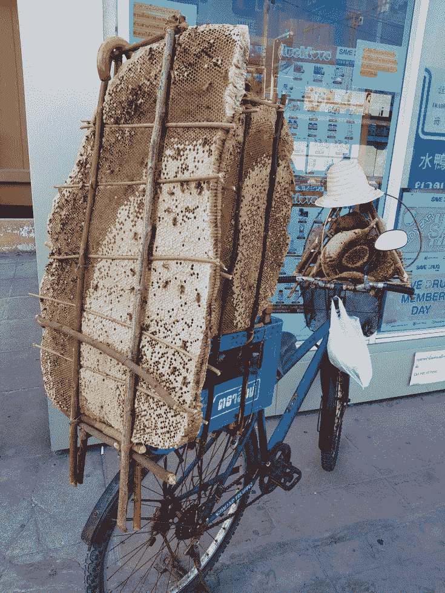

蜜蜂的家被搬到了自行车后座

除了Patong，其他热门区域有Karon Beach, Kata Beach, Kamala Beach, Surin Beach, Bangtao Beach，都在西海岸，Patong在正中间。

住宿：

在权衡了**价格、生活便利度、泡妞便利度等**因素后，我决定住在**Patong**地区。**用骑摩托到处转，看到合适的公寓就去打听价格的方式（另外推荐使用renthub网站搜索公寓），**货比三家（实际都不止30家）后，终于入住了这个叫Baan Phureenut的公寓，强烈推荐，性价比很高，位置很方便，5分钟就可以骑摩托到Patong Beach，门口就有一家大型食品超市。

房租10000泰铢一个月，包含wifi和每三天一次的房间清洁（打扫房间，换被单、毛巾等）。另外每月需要交100泰铢的水费，以及8泰铢一度的电（也就200泰铢左右，我平时不用空调，除非带姑娘回家）。

夜生活：

普吉岛夜生活的人确实有很多，但是平均质量比较低，男女比例失调（排除working girls），偶尔碰到美女往往还是不会说英语的俄罗斯姑娘。

普吉岛夜生活集中在Patong地区的Bangla Road，一条几百米长的路上到处都是酒吧和夜店，基本都可以免费入场。没什么见识的人很可能被场面惊呆，颇为壮观。

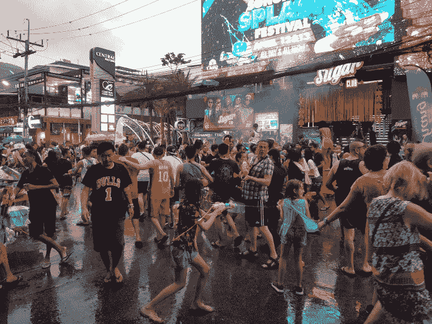

Bangla Road 泼水节的盛况

人虽多，但是美女并不多，而且满条街到处都是想赚你钱的人，人妖、妓女、举广告牌的，卖烟和大麻的，卖玩具的，卖萌的……基本每走几步就有人“搭讪”你，让人比较反感。所以，很多时候，当我搭讪姑娘的时候，姑娘更有可能会自动不理我，即使我拼命解释我并不想卖她任何东西。

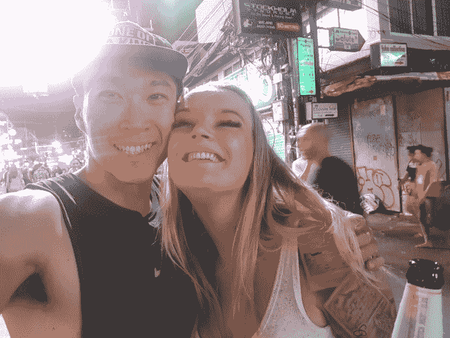

在这条路上找到个和你聊得来的姑娘并不容易

Bangla Road最为出名的夜店为**Illuzion**，全世界排名第48名，可以容纳几千人，灯光、音响各种设备品质一流，而且**免费入场**。问题是男女比例失调，而且俄罗斯姑娘太多，她们绝大部分还不说英语。普吉岛夜场的一大问题是没有专门的抽烟地点，到处都可以抽烟，所以往往到处乌烟瘴气，对健康不好。而且还有很多要花很多钱才能去的卡座，那部分美女也没法搭讪。总之不是一个泡妞的好地方。

从Illuzion的二楼可以直接去同属他家的另一个夜店Empire。

另外推荐**Sugar**，是一个hip hop club，我很喜欢hip hop，所以比较喜欢去这里。在他家可以直接去另一个叫Seduction的夜店。

更推荐的是Patong Beach，就在Bangla Road的最西端，可以搭讪坐在沙滩上的美女，而且没有嘈杂的音乐和其他各种人的干扰。我在这里取得的成功比Bangla Road更多。

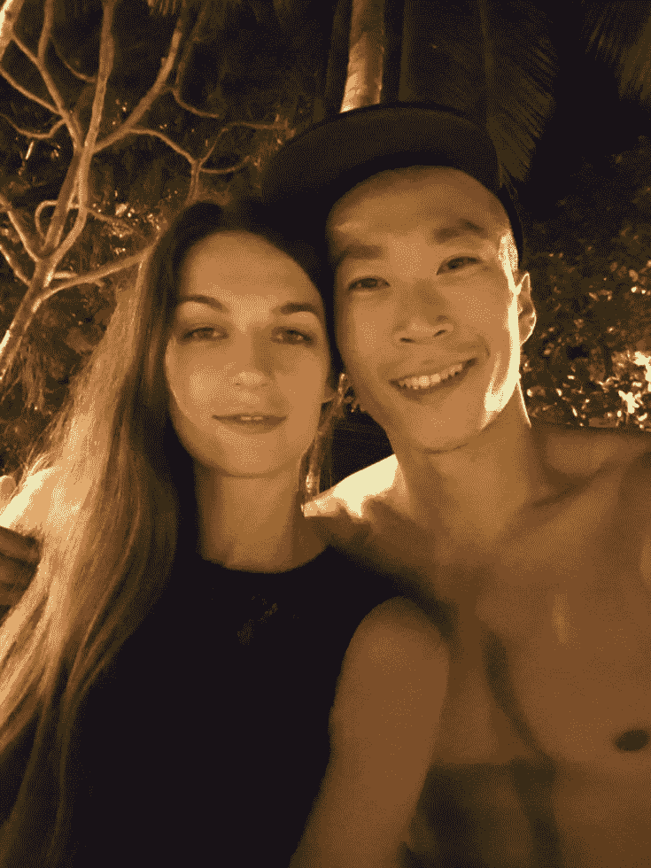

对于英语说得不好的姑娘，一定要好好利用Google Translate和身体语言。

开销：

整个3月份大概花了22200泰铢，其中10000用于住宿，其余大部分用于食物。食物明显要比清迈贵，清迈大部分路边摊都是三四十泰铢起，普吉是六十泰铢起。Patong地区没有找到特别划算的水果店，建议去Makro超市买水果，能便宜一点儿。

4月份到24号离开普吉岛一共大概花了19000泰铢，除了吃和住之外，还有很多次按摩。

可以看到，在普吉岛完全可以把支出控制在每月5000人民币以下。

按摩店推荐（正规、无色情）：

Sabai Sabai Massage，在Patong地区，150泰铢每小时。我刚来普吉岛的时候都没打算按摩，因为物价明显更高，我以为不可能会有像清迈一样150泰铢每小时的按摩店。后来一个和我一起锻炼身体的俄罗斯导游小伙儿向我推荐了这家店，不但150泰铢每小时，还满10送1。我一个月去了22次。推荐技师：Lucky, Noy。

建议不要在高峰时期（晚6点到10点）去按摩，一个是有可能得排队，更重要的是黑心老板命令按摩技师只按45分钟（有一次我的技师告诉我的，说她下次把时间补给我，我不想让她为难，就同意了）。因为她家顾客非常多，大部分都是旅游的，所以不怕流失顾客。

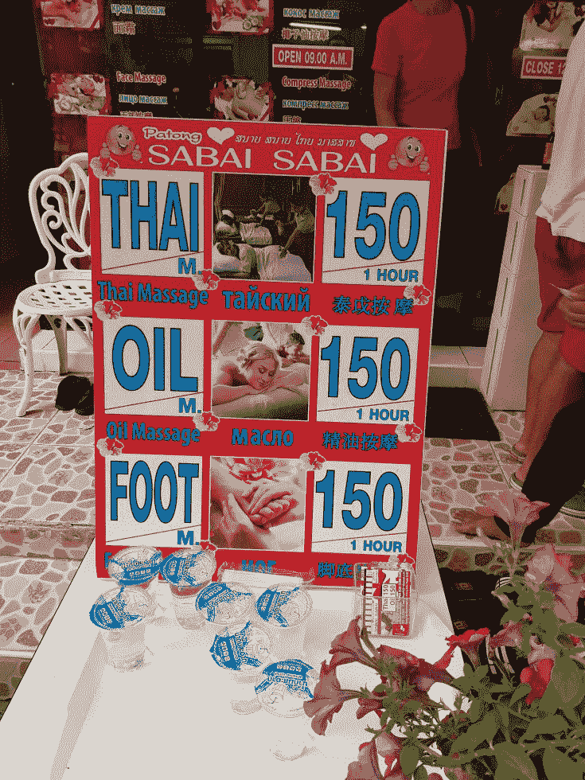

可以看出俄罗斯游客很多，按摩的招牌上边都有俄语。

餐厅推荐：

Doo Dee Thai Food，正规餐厅，价格和街边摊基本一样，食物选择也多，推荐。

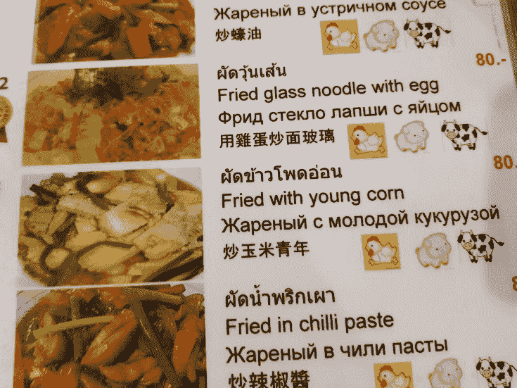

你还可以吃到“炒玉米青年”。

其他海边酒吧/夜店推荐：

Catch Beach Club, KUDO Beach Club和**Café Del Mar**（最有名）。

上述地点都很贵，以Catch为例，最便宜的是水，60泰铢，第二便宜的是啤酒，100多泰铢，一杯菠萝汁都要200多泰铢（五十人民币），还不包含服务费，其他酒类都更贵，一般300泰铢起。所以除非你很有钱，否则不建议来这里消费，美女确实有不少。

虽然是酒吧/夜店，但由于在海边，**这些地方白天也开业，你完全可以白天在沙滩上坐等美女来海边的时候再搭讪。**

推荐景点：

Karon Beach, Kata Beach：比人太多的Patong Beach要强，离得也不远。

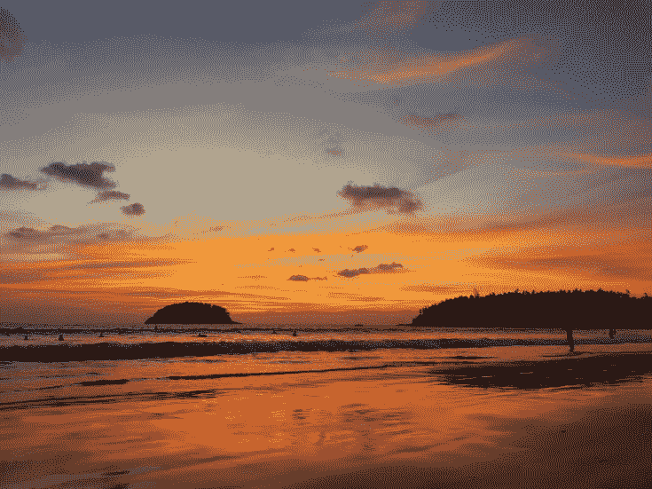

Kata Beach的日落

Kamala Beach：著名的Cafe Mel Mar也在这里，方便泡妞。

Surin Beach：在普吉岛住了两年的意大利姑娘最喜欢的沙滩。

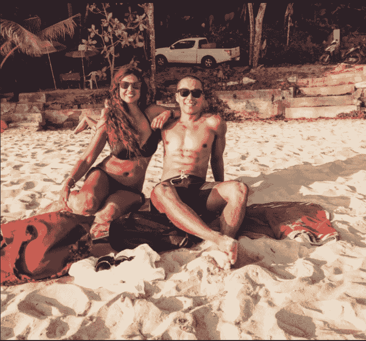

Bangtao Beach：很长，人较少，更安静一些。

Monkey Hill & Rang Hill: 两座小山离得不远，上边都有猴儿，Monkey Hill上游客更多，Rang Hill更清静一点儿，个人更喜欢Rang Hill，不过Monkey Hill上有健身器材，这点很好。建议去之前买点儿花生或毛嗑喂猴儿玩。

Big Buddha：山顶的大佛，但我在Chiang Rai（清莱）看到的大佛大概是这个的3倍高。

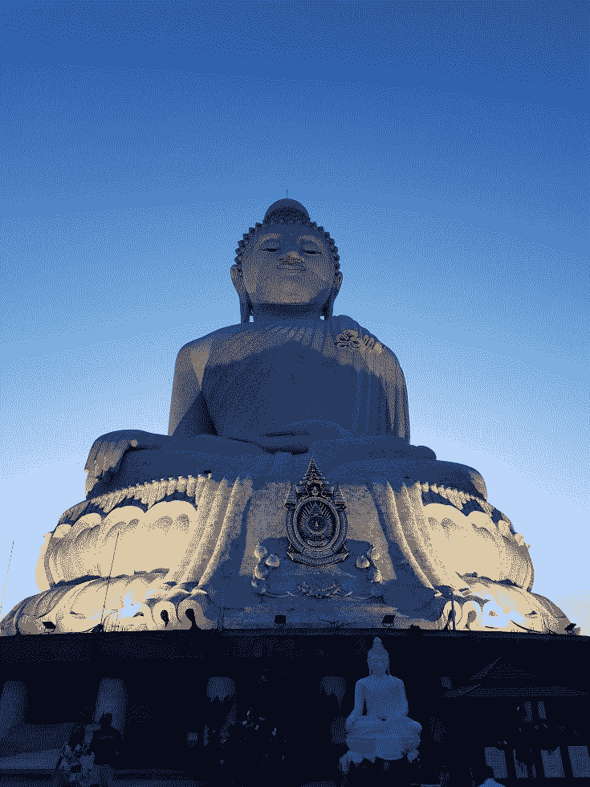

普吉的大佛

清莱的大佛

其他景点（直接在Google Maps搜索就能找到）：

Karon View Point, Black Rock Viewpoint, Ao Sane Beach, Windmill Viewpoint, Promthep Cape, Kao Khad Views Tower, Bang Wad Dam, Nai Yang Beach – Airport Viewpoint, Banana Beach, Freedom Beach.

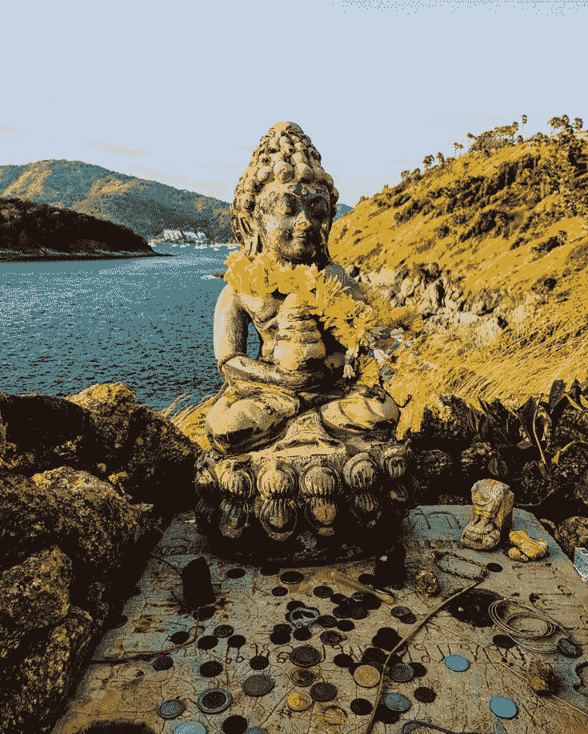

Promthep Cape的小佛儿

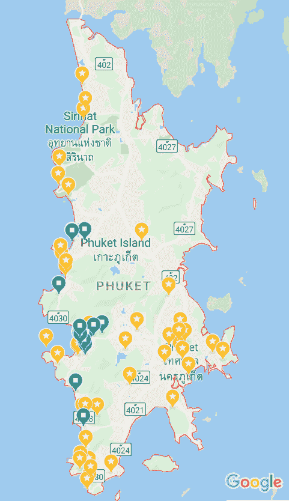

星标处基本都有值得一看的景点

锻炼身体地点：

1\. Patong Beach北边的儿童乐园：我的主要锻炼身体地点，我在《[我很喜欢的一种健身（生活）方式](https://www.piaohanshenghuo.com/i-like-to-work-out-this-way/)》这篇文章中也有提到过。

2\. Kata Beach Community Park：环境很好，不过没有单杠。

Fun facts：

我推倒了好几个俄罗斯姑娘，其中一个姑娘的爷爷和普京是好朋友。

我搜集到了两个不好搜集的北非国旗：突尼斯、摩洛哥。

我推倒了一个住在中国的乌克兰模特，感觉她完全被国内的男生惯坏了，虽然还很漂亮，但是已经开始有慢慢变胖的趋势了，抽烟又喝酒。第一次见面，我们一口气在沙滩上聊了破纪录的7个小时。第二天终于推倒，虽然长得性感，但在床上一动不动，还不吱声，让我很失望。还好意思问我“你就这两下子？”（我之前有吹过自己床上功夫很好），性是相互的，必须双方都投入才行。女人光漂亮是完全不够的。（乌克兰姑娘很少有第一次见面就和你上床的）

她的一个漂亮的乌克兰闺蜜被一个中国中年油腻的中国ZF官员包养，这个中年大叔非常有钱，拥有一家航空公司，对她管得很严，居然要求她出门穿得严严实实的。人家明明就是为了你的钱，你能管得住她去喜欢年轻的帅气小伙儿吗？

我通过Tinder认识了一个澳大利亚的富婆，见过一次面，跟她和她的god daughter在泳池边聊了聊天，没有什么进展。后来我又在Tinder上认识了一个非常性感的澳大利亚姑娘，约好了见面，她说她要去Catch Beach Club和她朋友的朋友见面。我和她去了Catch，见到了她朋友的朋友，结果她朋友的朋友的朋友（澳大利亚富婆）碰巧也在那里，场面略为尴尬。所以能单独约姑娘出来一定要单独约出来。

我在Bangla Road上碰巧遇到了《[剽悍故事No.4](https://www.piaohanshenghuo.com/how-i-lost-a-hottie/)》的女主角，不过没搞定，可惜。

我利用Tinder推倒的姑娘和搭讪推倒的姑娘的比例为1:1，平时都是搭讪推倒的更多，但因为我意识到了普吉岛搭讪的成功率很低，我决定花更多时间在工作和通过Tinder认识姑娘上。[Tinder攻略可以看这](https://www.piaohanshenghuo.com/tinder_guide/)。

总的来说，普吉岛并不是一个泡妞的好地方（如果你不说俄语的话），如果你喜欢海边，又想泡妞，推荐皮皮岛（Koh Phiphi），苏梅岛（Koh Samui），帕岸岛（Koh Phangan）。

普吉岛很大，想把景点都看够，需要至少一星期的时间。旺季在11月到2月之间，其次是3月、4月，5月开始就经常下雨了。旺季物价更高。

大概就写这么多，有问题请留言。

如果本文对你有帮助，想免费表示支持，不妨多花几秒钟的时间，**在公众号文章底部的广告上点一下，我就能有大概一块钱的收入，谢谢支持**。

* * *

剽悍生活UL(微信公众号)帮你从**健康、两性关系、生活方式**三个方面全面提高自己，打造理想的生活（尤其是性生活）。

官网：www.piaohanshenghuo.com

**长按下图扫码关注**

