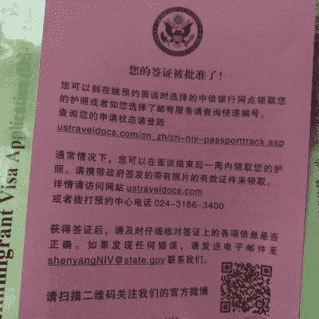

# 最新美国10年旅游签证的作用及申请攻略

> 原文：[https://piaohanshenghuo.com/us-tourism-visa/](https://piaohanshenghuo.com/us-tourism-visa/)

<audio src="https://www.piaohanshenghuo.com/wp-content/uploads/2019/05/brian-mcknight-sings-national-anthem-at-warriors-vs-rockets-game-3.mp3" controls="controls"></audio>

泰国的签证过期了，我被迫回国，泰国大使馆五一劳动节放假到5月5日。我索性先申请了一个美国十年旅游签证。

我4月27日在网上申请美国10年旅游签证，约到最早的5月3日面签，并在5月3日面试当场得到了签证批准，面试官告诉我再等3,4天，签证和护照就会邮寄到我家，我在5月6日收到了护照。**从申请到最后拿到签证一共花了****9****天**，仅供参考。

[这个网站](https://travel.state.gov/content/travel/en/us-visas/visa-information-resources/wait-times.html)可以查询你要去的美国使馆的面签等待时间，[这个网站](http://www.ustraveldocs.com/cn_zh/cn-niv-passporttrack.asp)可以追踪你的护照（面签通过后需要等待护照寄回家）。

我目前对去美国生活、旅行的兴趣暂时不大，因为生活成本较高。但美国十年旅游签证还有另一个很大的作用：**去很多国家都可以免签，尤其是美洲的其他国家，详情请见文末**，所以含金量很高。

“十年签证”不等于“可以在美国待10年”，只是免去了续签的麻烦，可以多次入境，持签证的游客每次逗留时间都是有限制的(移民官会根据访问目的给予足够的逗留时间)，**每次最长停留半年**。

每次到达期限必须出境后再返回美国境内，而下次入境时海关也有可能将限期缩短。如果过期居留超过180天，可被判3年内禁止入境美国。如果过期居留超过1年，则可被判10年内禁止入境。

如果你护照到期了，更换了新的护照，**去美国时要带上旧护照(含十年有效美国签证页)**也照样可以正常入境。

#### 申请步骤：

**具体要求可能会变，以官方要求为准，**[官网地址](http://www.ustraveldocs.com/cn_zh/cn-niv-typeb1b2.asp#%E6%94%AF%E6%8C%81%E6%80%A7%E6%96%87%E4%BB%B6)**。本文写于****2019****年****5****月份，仅供参考。**

官网原文：

##### 第1步

完成[非移民签证电子申请表(DS-160)](http://www.ustraveldocs.com/cn_zh/cn-niv-ds160info.asp)。

##### 第2步

缴纳签证申请[费](http://www.ustraveldocs.com/cn_zh/cn-niv-visafeeinfo.asp)。

##### 第3步

在[本页面](https://cgifederal.secure.force.com/?language=Chinese%20(Simplified)&country=China)预约面谈。要预约面谈，需提供以下三条信息：

*   护照号码
*   签证申请缴费收据上的编号（如需查询该编号，请点击[此处](http://www.ustraveldocs.com/cn_zh/cn-niv-paymentinfo.asp)。）
*   DS-160确认页上的十(10)位条形码编号

##### 第4步

请按照约定的时间到[美国大使馆或总领事馆](http://www.ustraveldocs.com/cn_zh/cn-loc-post.asp)进行面谈。请随身携带一份预约单打印件、DS-160确认页打印件、一张最近六个月内的近照以及所有新旧护照。如缺少上述任何材料，申请将不予受理。

**申请材料：**

官网原文：

如需申请商务/旅游签证，应[**缴纳****160****美元申请费**](http://www.ustraveldocs.com/cn_zh/cn-niv-paymentinfo.asp)并提交下列材料：

*   非移民签证电子申请表(**DS-160**)。如需有关DS-160的更多信息，请访问[**DS-160****网页**](http://www.ustraveldocs.com/cn_zh/cn-niv-ds160info.asp)。
*   前往美国旅行的**有效护照**，**有效期**需超出在美预定停留期**至少六个月**（享受豁免的[**特殊协议国**](https://www.cbp.gov/document/bulletins/six-month-club-update)除外）。如果护照中包含的人数多于一人，则每个签证申请人都需要提交单独的申请。
*   **一张**在最近六个月内拍摄的**2****英寸****x2****英寸**（5.1厘米x5.1厘米）**照片**。有关照片格式的说明，请参见[**此网页**](http://www.ustraveldocs.com/cn_zh/cn-niv-photoinfo.asp)。
*   除上述材料以外，您还应出示**面谈预约信**，证明您已从[**这一服务渠道**](http://www.ustraveldocs.com/cn_zh/cn-niv-appointmentschedule.asp)预约面谈。您还可以向签证官提供其他支持性文件。

简单地说，需要满足下方5个要求：

1.  **160****美元签证申请费。**
2.  **DS-160****申请表。**
3.  **有效期至少****6****个月的护照。**
4.  **一张两寸照片。**
5.  **面谈预约信。**

**上述为必须提供的材料。**

**美国签证面试重面谈，轻材料，诚实地向面试官证明你没有移民的意图就行。**

**支持性文件：**

**不需要都提供，别弄虚作假就行。我只准备了银行存款（最近****3****个月就行），结果面试官根本没看。**

官网原文：

*   当前收入证明、纳税单、房产证或企业产权证、资产证明。
*   行程表和/或其他有关旅行计划的说明。
*   申请人所在单位的介绍信，详细说明申请人的职位、工资、入职时间、是否获准休假、赴美参加商务活动的目的（如有）等。
*   犯罪/法庭记录（无论在何地被捕或定罪，即使已服完刑期或被赦免也不例外）。

**当场面签：**

全程大概两三分钟，仅供参考。根据我的回忆，大概内容如下：

我刚上来对面试官说了一句“Morning, how are you doing?”他问我说英语不（估计他有碰到只会上来用英语打招呼的），我说我说英语，于是我们全程都在说英语。不会英语或英语不好也不用担心，面试官都会说中文，**关键是你提供的信息属实，表明你没有移民意向**。

他问我去哪，为啥去，什么时候去，去多久。我说我去LA，有个好朋友在那里，我们好几年没见面了。这是我申请签证的原因之一，另一个很重要的原因是有了美国签证之后，我可以免签去很多国家，尤其是南美和东欧。我作为一个digital nomad，很想在未来在南美和东欧生活一段时间。我还不确定什么时候去，去多久，大概一年以后，大概一个月。

他又问我的工作历史，我如实回答。问我现在做什么，我也如实回答，我在网上为自己工作（我没有带任何证明材料）。他问我目前的收入，我说收入并不稳定，不过我之前在澳大利亚打工度假两年，有一些存款，我有存款单。我正要掏出来证明，他示意我不需要了。

他安静地大概敲了10秒到20秒键盘，然后告诉我签证申请通过了。我高兴地说谢谢并离开了现场。

当场拿到这个粉纸条就说明你直接通过了。

**持美签新增免签国家**（不含不需要美签就免签的国家）列表及可停留时间：

北美（North America）：

墨西哥（Mexico）：180天。

中美（Central America）：

伯利兹（Belize）：30天。

哥斯达黎加（Costa Rica）：30天。

洪都拉斯（Honduras）：30天。

巴拿马（Panama）：30天。

加勒比（Caribbean）：

多米尼加（Dominican Republic）：90天。

百慕大（Bermuda）：90天。

南美（South America）：

秘鲁（Peru）：180天。

阿根廷（Argentina）：90天。

智利（Chile）：90天。

乌拉圭（Uruguay）：90天。

哥伦比亚（Colombia）：90天。

东欧（Eastern Europe）：

格鲁吉亚（Georgia）：90天。

阿尔巴尼亚（Albania）：90天。

黑山（Montenegro）：30天。

亚洲（Asia）：

菲律宾（Philippines）：7天。

韩国（South Korea）：30天。

新加坡（Singapore）：96小时。

阿曼（Oman）：30天。

参考资料：

《[对中国公民实施免签、落地签的国家（地区）](https://baike.baidu.com/item/%E5%AF%B9%E4%B8%AD%E5%9B%BD%E5%85%AC%E6%B0%91%E5%AE%9E%E6%96%BD%E5%85%8D%E7%AD%BE%E3%80%81%E8%90%BD%E5%9C%B0%E7%AD%BE%E7%9A%84%E5%9B%BD%E5%AE%B6%EF%BC%88%E5%9C%B0%E5%8C%BA%EF%BC%89/14920079?fr=aladdin)》

“[How to travel 37 countries VISA-FREE with US visa](https://www.visatraveler.com/blog/travel-20-countries-visa-free-with-us-visa/)”

大概就是这样，还有什么问题，欢迎留言，我会不断补充。

* * *

剽悍生活UL(微信公众号)帮你从**健康、两性关系、生活方式**三个方面全面提高自己，打造理想的生活（尤其是性生活）。

官网：www.piaohanshenghuo.com

**长按下图扫码关注**

