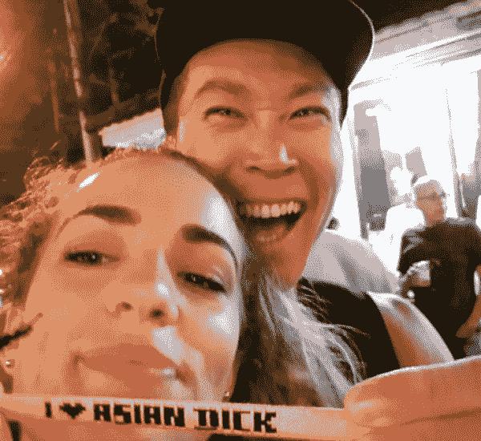

# 有一个外国女友是种怎样的体验？（知乎被邀问题回答）

> 原文：[https://piaohanshenghuo.com/how-it-feels-to-have-a-foreign-girl-friend/](https://piaohanshenghuo.com/how-it-feels-to-have-a-foreign-girl-friend/)

我还是比较有资格回答“有一个外国女友是种怎么样的体验”的，因为我上过除了南极洲之外所有洲的姑娘。

**我不按国家来判断一个人，因为哪里都有不同的人。但我们都知道平均来说，某个国家或种族确实更容易有某个品质。**比如黑人的屌普遍更大，但黑人小伙儿也有屌小的，亚洲小伙也有屌大的。 平均来说，我绝对更喜欢白妞、拉丁妞和中东妞。我不但生理上更被她们吸引（整体来说，她们身体更容易有曲线，胸和屁股更大，**巴西妞的屁股是相对来说最好的**），而且在思想观念上也更被她们吸引，她们整体更酷，更会玩，更见多识广，更开放、床上功夫更好。

相对来说，**她们结婚更晚**（中东结婚普遍很早，有个姑娘在约会时告诉我她妈14岁时就生她了），**有些甚至压根就不想结婚，也不想要孩子**（欧美的人口增长很慢，有些地方甚至人口负增长，完全没有计划生育，像北欧的一些国家，生孩子国家都给钱，人家照样不爱生）。

有很多party girls在她们的黄金时期（[性市场价值](https://www.piaohanshenghuo.com/sexual_marketplace/)最高的时期，18~25岁）大量地party，喝酒、抽烟、吸毒，没几年她们的美貌就不在了。这是有很多外国姑娘年纪轻轻就看起来很老的最大原因。

**Going out****（去酒吧、夜店）是基本上每个人都会做的事情**，不像国内你爸妈告诉你去那里的人大部分都不是好人，在欧美去夜场是再正常不过的事情了。她们大部分都喜欢在夜店跳舞，她们的社交能力、情商比中国姑娘相对更高，内向的姑娘相对更少。抽点儿大麻对很多人来说都是很正常的事情。

大部分发达国家的女权主义比较盛行，**讲究男女平等**，女人赚自己的钱，提自己的包。**你真的不需要有钱才能泡妞**，尤其是在旅行的姑娘，她知道和你没有未来，在一起的时候玩得开心就好了。我就很穷，但我照样推倒了很多姑娘。

**大部分发达的欧美国家（北美、西欧，澳洲）的女生在约会时都会主动付自己那一半的钱**，有的甚至在你表示要请客的时候坚持付她的那份。**中东、南美、东欧的姑娘更加传统，很多女生会默认男生掏钱**。你在约会的时候大可大方并好奇地问姑娘：“你们国家在约会的时候谁掏钱？”

**大部分姑娘都使用社交媒体**，Instagram是最流行的APP，大部分姑娘也有Facebook，不过Facebook越来越不流行了，年轻姑娘很可能还有Snapchat，想要姑娘联系方式还可以考虑要她的WhatsApp，大部分人都有。如果你想在国内泡洋妞，上述APP都能帮到你。**不过上述****APP****没有一个能在国内正常使用的，还不会上的可以参考****[这个教程](https://www.piaohanshenghuo.com/how-to-use-vpn-to-pass-great-fire-wall/)**。

饮食方面，你可能会遇到一些vegan姑娘，完全素食。我就有过这样的女朋友，对我来说完全没问题，我本来就吃很多蔬菜。在中国出门吃饭可能会麻烦一点儿，基本顿顿吃清淡版的麻辣烫、火锅。

**欧美姑娘相对更开放、床上功夫更好**，更容易在认识姑娘的当晚就推倒她，有些姑娘还会舔你的屁眼儿，有些双性恋的姑娘还会带另一个姑娘上你的床。

在欧美的约会文化里，一般来说，两个人上了床并不代表两人正式建立了男女朋友关系，通常还得再约会、再上几次床，而且在正式建立认真严肃的一夫一妻式的男女朋友关系之前，你们还可以见其他异性。

当然还有姑娘愿意和你保持进进出出超友谊的炮友关系。

不幸的是，**大部分外国姑娘对亚洲小伙儿的印象都不好，有很多人认为亚洲小伙儿的屌都很小，而且不够酷。小部分对亚洲小伙儿持中立态度。极小部分有****yellow fever****（她们最喜欢亚洲小伙），这绝对是稀有物种**。前一阵我就碰到了一位有韩国男友的姑娘，她向我展示了她的手环，我非常喜欢，特意拍照留念。

所以你需要[搭讪](https://www.piaohanshenghuo.com/how_to_fix_approach_anxiety/)很多姑娘，被拒绝很多次，但是不要灰心，和你的内在无关，你无法控制自己的种族。

我上了很多姑娘，我有出过轨吗？没有，因为**我从来不承诺一夫一妻（****monogamy****）**，我还不打算要孩子，更不想结婚，我还想上更多美女，我为什么要栓死在一棵树上？ 你想结婚，把自己锁死，是你的事，我不管。我不想结婚，想上更多姑娘，是我的事，我的决定。

没有好与坏，对与错，你能确定你的决定是你真正想要的就好。关键是我们想要的东西往往会随着时间改变（想想你5年前想要的东西和现在都一样吗？你小时非常喜欢玩玩具，现在把全世界的玩具给你，你都不会很快乐）。结婚后，想要的东西变了，你只有离婚或者不愉快地维持。我只是说一下我的观点，你结婚，我祝你幸福，而且想要的东西不会变。

**我真心地感谢和祝福每一个和我共同度过美好时光的姑娘**，我和她们中的很多人还保持着联系，是好朋友。

绝大部分男人如果能真正诚实的话，都希望像皇上一样臣妾成群，而且我们的基因就决定了我们希望上更多更性感的美女。还有很多不希望像皇上一样臣妾成群的，也是因为他们不相信自己可以轻松搞定美女，他们懒，嫌麻烦，舒适感对他们来说比快感和成就感更重要。请问如果你可以轻松搞定美女的话，你真的希望一辈子就上一个女人吗？

一夫一妻制是人类为了社会的稳定人工制造出来的，并不符合我们的本能。关于我对婚姻的观点，可以阅读我的文章《[为什么不应该（过早）结婚](https://www.piaohanshenghuo.com/why_you_should_not_get_married_early/)》。

**想泡洋妞需要至少先**[**学好英语**](https://www.piaohanshenghuo.com/how_to_learn_english/)，除非她们特别想学中文，这样的洋妞你得慢慢找。

* * *

剽悍生活UL(微信公众号)帮你从健康、两性关系、生活方式三个方面全面提高自己，打造理想的生活（尤其是性生活）。

官网：www.piaohanshenghuo.com

**长按下图扫码关注**

