# 从清迈到普吉岛的超过1500公里的摩托车之旅

> 原文：[https://piaohanshenghuo.com/trip-from-chiang-mai-to-phuket/](https://piaohanshenghuo.com/trip-from-chiang-mai-to-phuket/)

从二月份开始，清迈的空气开始变得很糟糕，我感觉自己仿佛回到了中国的雾霾之中。原因是每年的二到四月份是泰国北部的burning season。农民烧掉庄稼，为来年做准备。

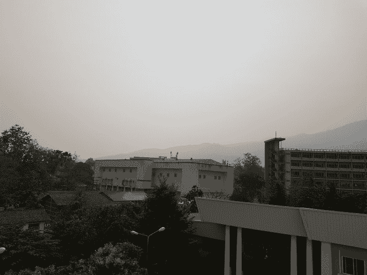

我在清迈时窗外的景象

看不见蓝天，感觉每次呼吸都有害健康，再加上我已经在清迈待8个月了，有点儿想念大海，于是我决定南下。

刚开始我决定骑摩托去Krabi（甲米），因为我还没去过，我在清迈搭讪过的很多美女都告诉我她们的下一个目的地是Krabi。后来我听朋友说普吉岛的夜生活会好很多，而且普吉岛比甲米大很多，于是我决定改去普吉岛。

整个旅程花了我5天时间，包括在华欣多待的一整天。

第一站是一个叫Kamphaeng Phet的地方，我完全没有打算停在那里，就打算一直开到天黑，然后再找个地方落脚。这个地方晚上有一条大街布满了各种霓虹灯，我所能找到的最便宜的旅馆叫“Mommy’s House Hotel”，250泰铢一晚，还不错，很安静。

Kamphaeng Phet主干道上的霓虹灯

睡醒后我继续赶路，下一个目的地是我计划要去的一个叫Lop Buri的被猴子入侵的城市。市中心到处是古庙遗迹和猴子。由于旅途疲惫，我没有对比旅店，而是直接找了一家便宜的在市中心的旅店——[NooM Guesthouse](https://www.booking.com/hotel/th/noom-guesthouse.en.html?aid=1740152&no_rooms=1&group_adults=1)。最便宜的房间250泰铢，很简单但干净的房间，地理位置非常好，但靠路边，并不安静，但我带上耳塞后一觉就睡过去了。

市内随处可见的猴子，一点儿都不怕人

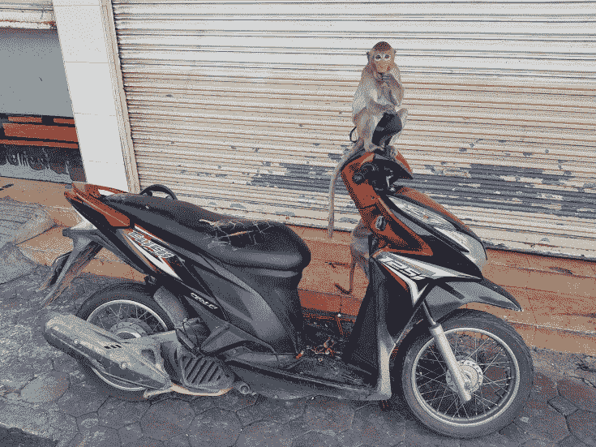

爬到我车上，偷我东西的猴

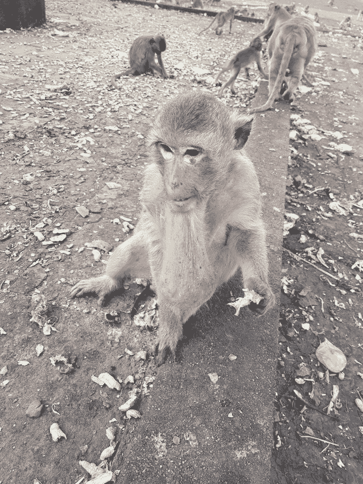

下巴上长蛋的猴

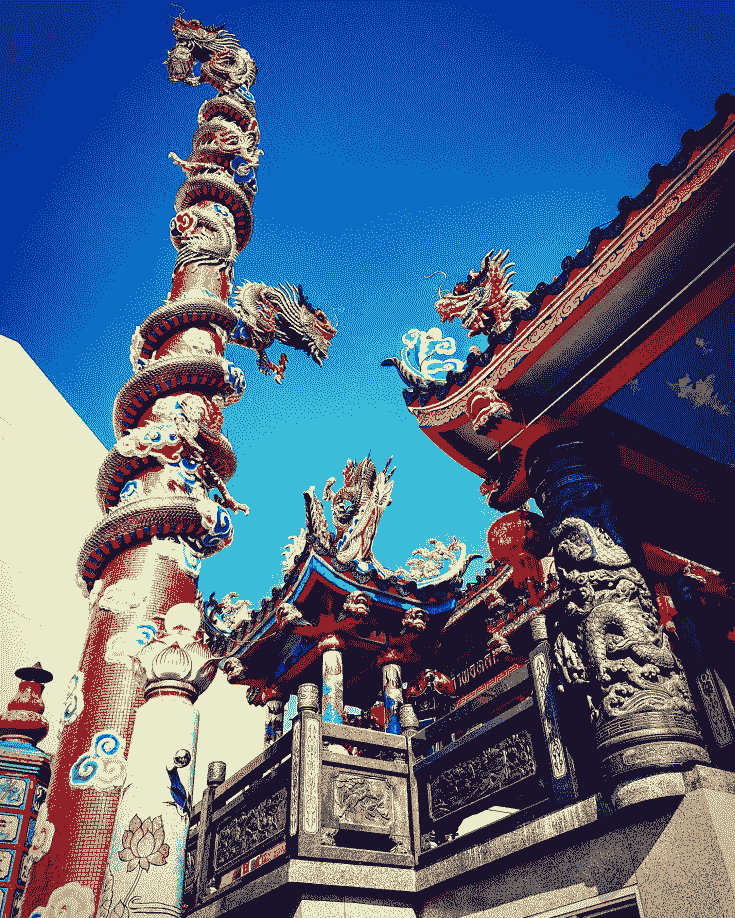

中国风的寺庙

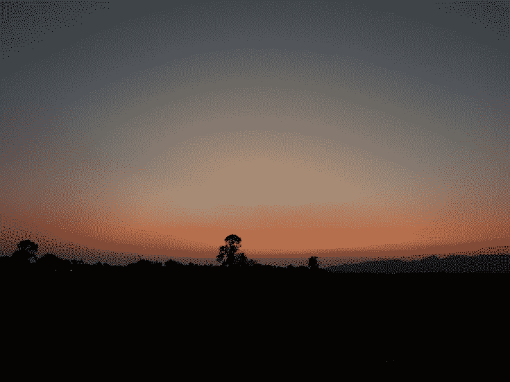

南下到这里，雾霾已经好了很多，不过天还是有点儿灰

第二天，我前往下一个目的地——华欣（Hua Hin），4年前第一次来泰国时去过的地方。这次我在这里多待了一整天，重拾一下记忆。这里的夜生活很糟糕，你会遇到很多欧美的老头老太太，很少碰到年轻的美女，我在夜生活区走一圈就得有一大群泰国姑娘、人妖打算在我身上赚钱，我一一谢绝。转了两圈，一无所获，我就洗洗睡了，两天晚上都是如此。

不过我重游了我最喜欢的猴山（Wat Khao Takiap），我要是猴，也会愿意住在这里，每天不愁吃喝，悠闲地生活在海边的大山上。这里的猴明显比Lop Buri的猴要健康。

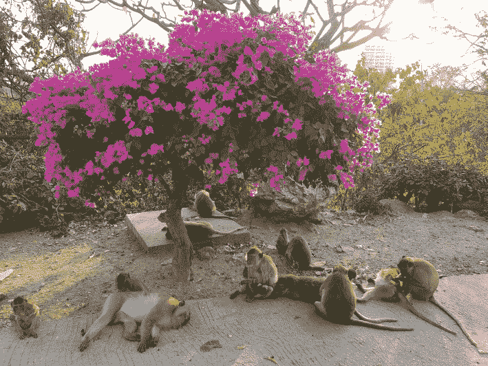

猴山上悠闲的猴和狗

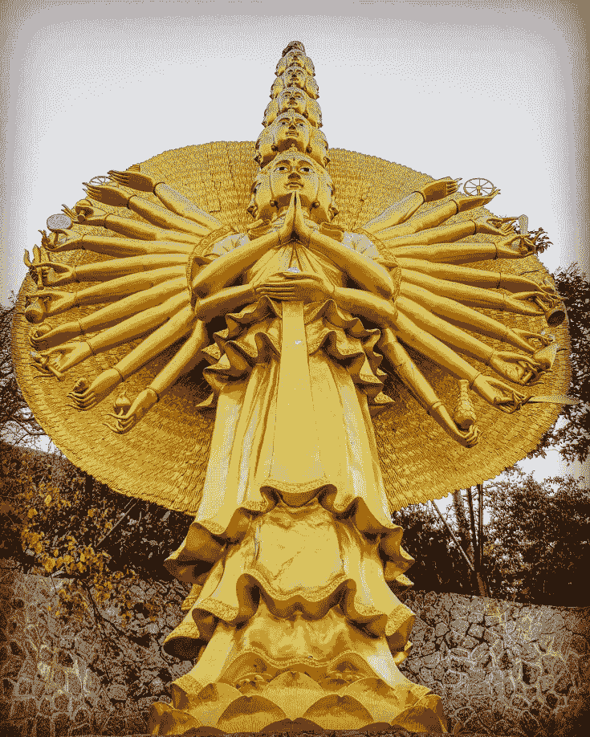

24只手、16个脑袋的怪胎

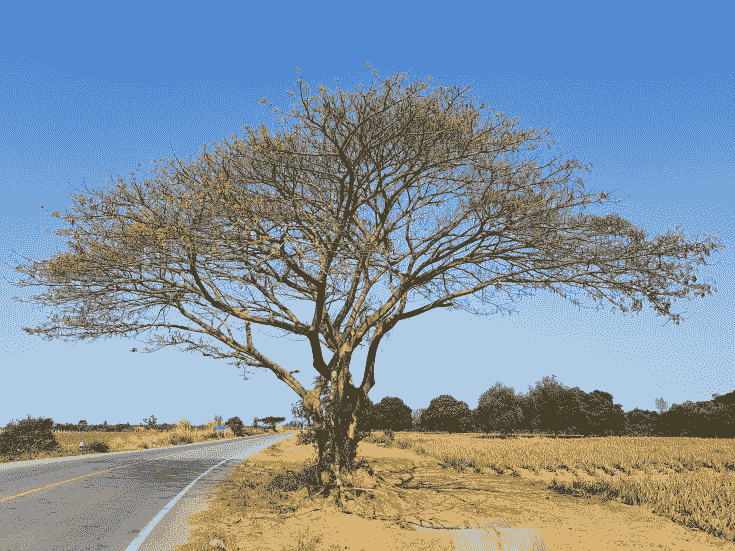

华欣的天已经比较蓝了

华欣的物价比较高，旅馆明显更贵，我找到的最便宜的一家都要350泰铢。我入住的是Toto House，我对房间很满意，离市中心有2公里的距离，对于有摩托的我来说非常方便，离海边只有几百米，房间非常安静、干净，推荐。

在华欣多待了一天后，我继续南下，前往下一个目的地——Surat Thani，是从陆地去苏梅岛的主要港口。市中心很小，有个比较热闹的夜市。

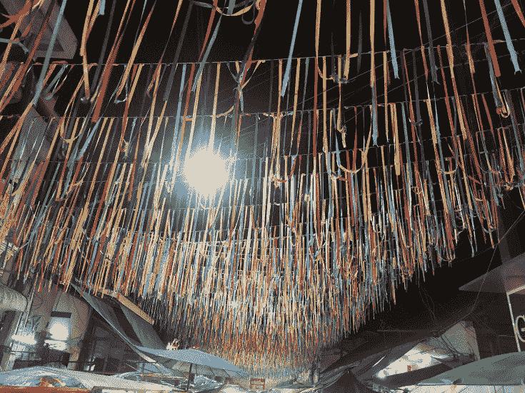

夜市上方的装饰物

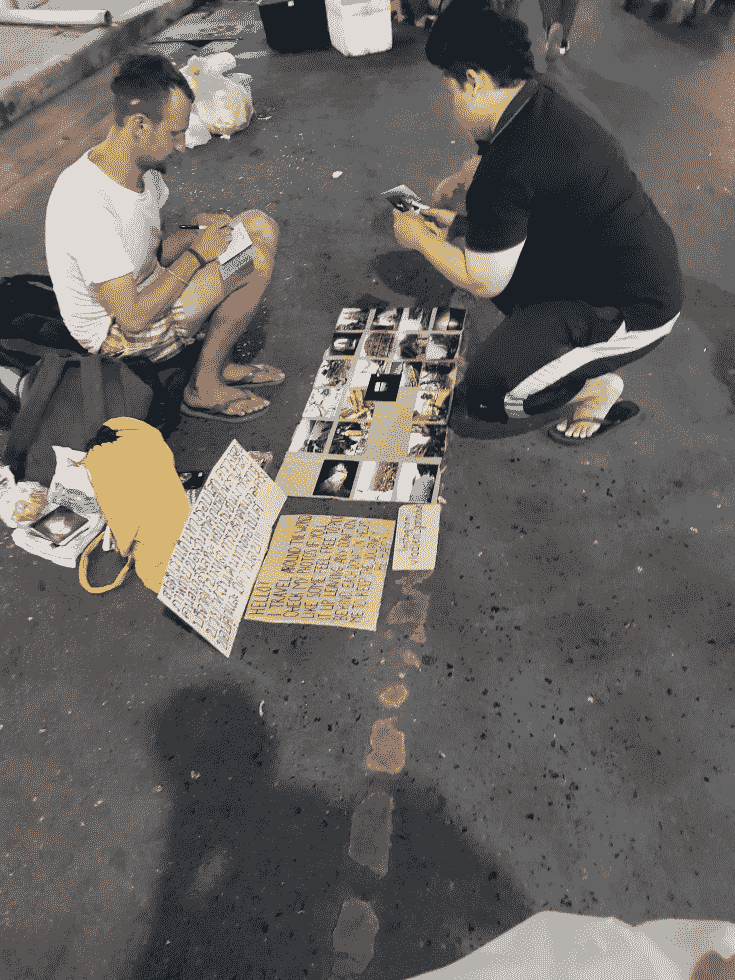

一个乌克兰小伙儿在摆摊卖他拍的明信片，他让顾客自愿选择付款金额，生意不错，不一会儿就卖掉了大概100泰铢。

如果你像我一样喜欢锻炼身体，强烈建议你去市中心附近、河中心的一个小岛——Ko Lamphu Public Park。

住宿方面我推荐My Place，单人的风扇房只需要220泰铢，宽敞又干净，性价比很高。

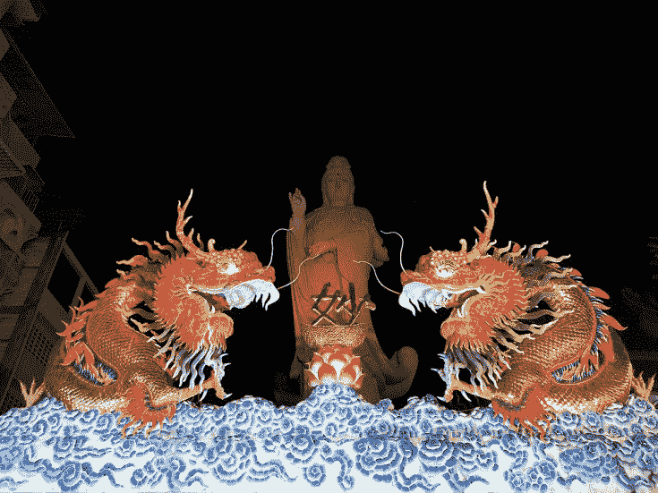

路过一个中国风的寺庙

第二天我驱车去终点站——普吉岛。此行并非一帆风顺，首先我在某个路口走错了方向，浪费了至少半个小时的路程。在回到走错方向的路口时我的后轮内胎又爆了，好在路口车多，我速度慢，而且路口又有个小市场，有不少人。通过好心的当地居民，我很快就找到了修车的地方，半个小时后我继续上路。

补胎花了180泰铢，比在清迈时的120泰铢贵了不少，但即使他要双倍的价格我也不得不掏钱。

我终于在傍晚时分到达了终点站普吉岛，普吉岛应该是全泰国最贵的地方，目前正值旺季，基本所有东西的物价都至少是清迈的1.5倍（清迈的路边摊一般都是40泰铢一道菜，普吉岛一般都是60泰铢起，80也很正常。性价比比较高的是路边的烧烤摊，50泰铢可以买一个大号鸡腿）。

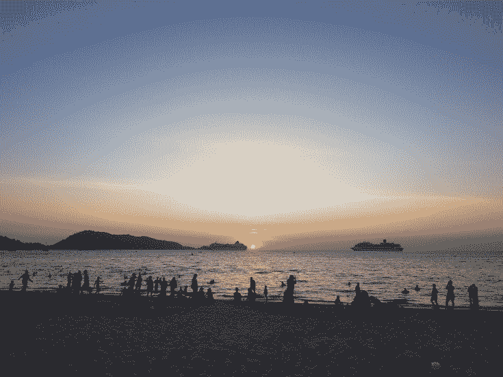

Patong Beach的日落

这次为期5天的从北到南的旅行，我一共花费了4944泰铢，合人民币1000多一点儿。摩托车的油钱1377泰铢，住宿1790泰铢，省下的基本都是食物的开销。

在找到合适的长期住宿前，我暂住在一个超便宜的[青旅（Kamala Studio Apartments By PSA）](https://www.booking.com/hotel/th/kamala-studio-apartments-by-psa.en.html?aid=1740152&no_rooms=1&group_adults=1)中，每天只要76泰铢，性价比超高。地理条件也很好，离最热闹的Patong Beach只有10分钟的车程，离Kamala Beach只有3分钟的车程。20人共住一个房间，好久没有住过宿舍了，其实环境还不错，带上眼罩和耳塞，完全不影响睡眠。

经过几天的探索和对比后，我找到了比较满意的住宿，我将在这里住2个月，每月的房租是一万泰铢，比我在清迈的房间贵了一倍多。不过我的新家位置不错，离最热闹的Patong Beach不到10分钟的车程。干净、美观又安静，希望可以帮我推倒更多美女。

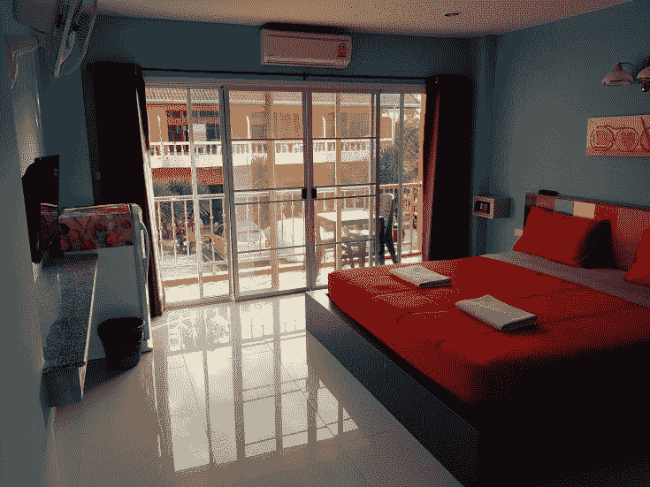

我在普吉岛的家

普吉岛的夜生活集中在Bangla Road，一条几百米长的路上到处都是酒吧和夜店。其中最为出名的夜店为Illuzion，全世界排名第48名，可以容纳几千人，灯光、音响各种设备品质一流，而且免费入场。问题是俄罗斯姑娘太多，她们绝大部分还不说英语。

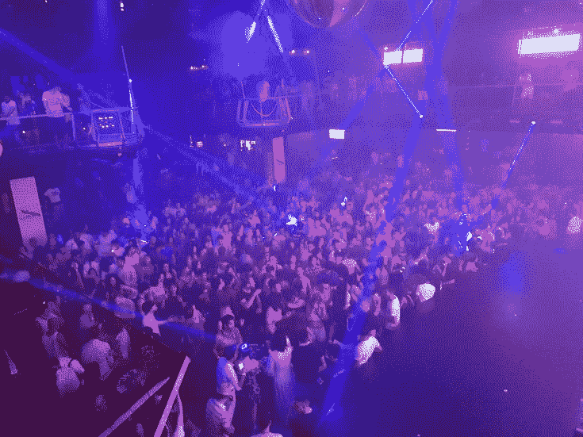

人满为患的Illuzion

如果你像我一样喜欢Hip Hop，推荐去新开的夜店Sugar Club，同样免费入场，氛围、音乐都不错。

当然，我更喜欢在大街上、沙滩上搭讪，音乐声没夜店里大，更容易对话。

无论是通过面对面的搭讪还是通过Tinder，我发现普吉岛的洋妞除了俄罗斯的特别多以外（俄罗斯人来泰国基本就去两个地方：普吉岛和芭提雅），第二多的就是北欧的，北欧的姑娘普遍都说英语，这点让我很庆幸。

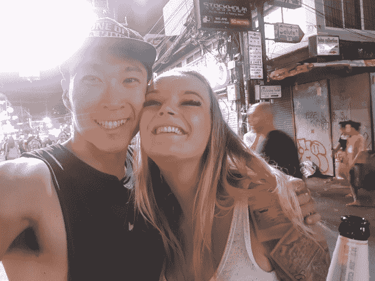

搭讪瑞典美女

目前我只在普吉岛待了一周，还算新人，不敢妄下过多结论。我会在日后和大家分享更多生活在这里的心得。

* * *

剽悍生活(Unbeaten Lifestyle)帮你从**健康、两性关系、生活方式**三个方面全面提高自己，打造理想的生活（尤其是性生活）。

剽悍生活的个人微信号：ycf3721，一对一视频教学，或拉你进入剽悍生活泡妞讨论群，请注明加我的目的。

**长按下图扫码关注公众号**

