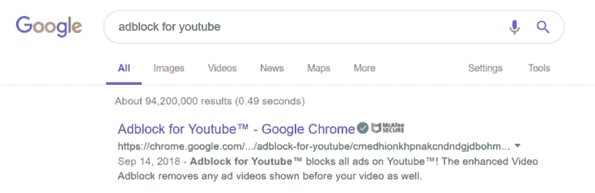
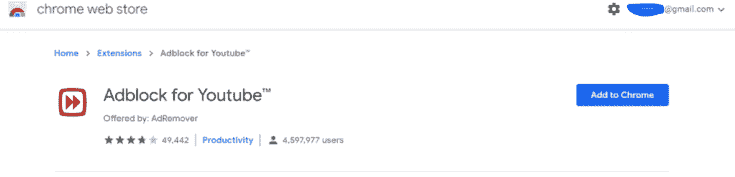

# 如何免费直接跳过Youtube的广告

> 原文：[https://piaohanshenghuo.com/how-to-block-youtube-ads-for-free/](https://piaohanshenghuo.com/how-to-block-youtube-ads-for-free/)

我曾说过，Youtube是我最喜欢的网站之一，有无数精彩的视频，你可以在上边免费学习各种技能。

如果你像我一样是一个Youtube的重度用户，你难免会遇到很多讨厌的广告，虽然Youtube很人性化地设置了4秒后可以跳过广告的选项，但4秒也是时间，谁不想节约出更多宝贵的时间？

如果你在电脑上用Chrome浏览器看Youtube视频，其实可以简单地用一个免费的插件屏蔽所有Youtube的广告，节约你宝贵的时间。

步骤很简单，

第一步：

Google “adblock foryoutube”，并点击第一个搜索结果，进入Google Chrome store。

第二步：

点击“Add to Chrome”，添加插件到Chrome浏览器。

第三步：

去Youtube愉快地看无广告的视频。

就是这么简单，不客气。

至于我是如何在国内访问Youtube和Google的，可以看[这里](https://www.piaohanshenghuo.com/how-to-use-vpn-to-pass-great-fire-wall/)。

* * *

剽悍生活UL(微信公众号)分享关于**两性关系**、**自我提升**、**数字游民的生活方式**的原创内容，帮你过上更理想的生活（尤其是性生活）。

剽悍生活的个人微信号：ycf3721，[一对一视频教学](https://piaohanshenghuo.com/1on1_coaching/)，或拉你进入[剽悍生活泡妞讨论群](https://piaohanshenghuo.com/ul-group-chat/)，请注明加我的目的。

