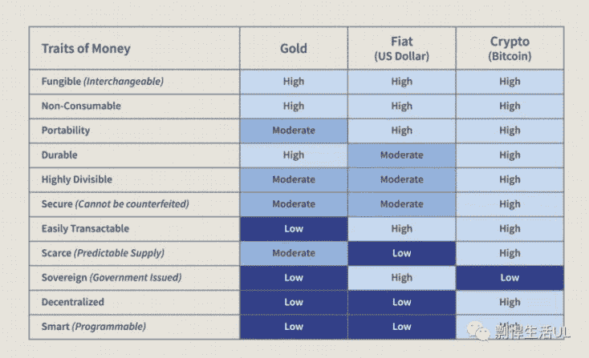
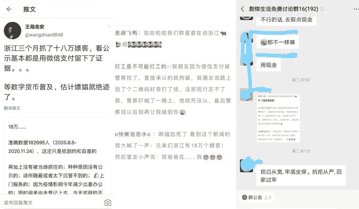
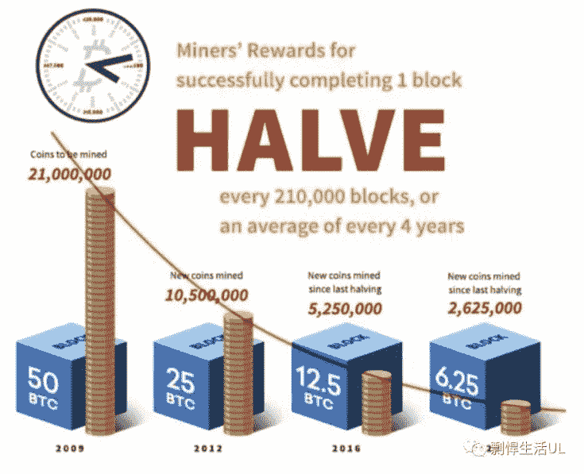
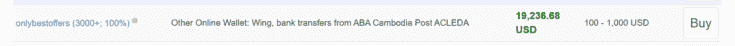

# 为什么我认为比特币很有价值（以及中国公民如何购买比特币）

> 原文：[https://piaohanshenghuo.com/why-bitcoin-is-so-valuable/](https://piaohanshenghuo.com/why-bitcoin-is-so-valuable/)

我觉得现在每个人都应该了解这个比特币伟大的发明，非常有必要写一篇关于比特币的文章，希望能帮到我的读者们。

可以简单地把比特币理解为一个不依赖于任何权威机构的、非常安全的、世界通用的、不会通货膨胀的电子货币。

今年我大部分时间都困在柬埔寨的暹粒(Siem Reap)，我经常去公园锻炼身体，在公园里碰到了一个美国人，聊了两句后发现他居然还会说中文，原来他在台湾生活了很多年，搞音乐，还和五月天合作过，还和某女明星约会过。他已经40多岁了，当着我的面泡走了一个也经常去公园的一个本地的19岁的柬埔寨美女（虽然我对亚洲姑娘普遍不感兴趣，我可以确定她绝对是公园里最漂亮的美女）。

我们聊着聊着，他就提到了他最感兴趣的东西，那就是cryptocurrency（加密货币），他已经研究了10多年了，滔滔不绝地给我讲了一大堆。他有几句话让我印象深刻，比如他说fiat currency（法定货币）随着时间的推移，最终的价值会无尽地趋近于0。还说美国所有的百万富翁都没法每人持有1一枚比特币。还有一些内容是不方便在局域网内讨论的。

其实这之前我已经对加密货币，尤其是BTC有一定了解了，也投资了一定的BTC（2019年才开始投资，最便宜都要3万多人民币一枚，可惜当时没投资多少，后来又在8万多人民币的时候投资了一点）。但通过和他的对话，我对加密货币变得更有兴趣和信心，我也加大了对BTC的投资（当时已经9K美金左右一个了）。

回到今天的正题，来讲一下我为什么认为比特币非常有价值，我们来看一下比特币的优势：

 

通过上图可见，比特币在各个方面都碾压传统的货币（黄金和政府发行的法定货币）

其中最重要的是：比特币不被任何权威机构控制，是真正的人民的货币。

现在各国ZF都在耍流氓一样地凭空印钱，比如，过去的美国政府还非常靠谱，印钱是基于黄金储备的，但现在也开始随便印钱了。通货膨胀会越来越严重，普通的4%的基金理财很难跑赢通货膨胀。

很多国家（比如委内瑞拉、津巴布韦、土耳其、阿根廷等）的货币都严重贬值，利用比特币可以很好地对抗这种疯狂的通货膨胀。

比特币给你更多自由和隐私。

比特币是真正的全世界通用的货币，不需要昂贵的换汇费，而且非常方便。我在不同国家生活，换汇都不划算，会被收取各种手续费，随着比特币的普及，这些问题都会迎刃而解。

再举个例子，我国有一个每年只能汇5万美金的不合理的规定，当年我的好朋友移民美国的时候是利用七大姑八大姨各种亲戚的5万美金的汇款份额才把大量资产汇出去的，非常麻烦。有了比特币之后，你想汇多少汇多少，想管你都管不了。

如果你喜欢自由，就该投资比特币之类的不归任何“权威”管的加密货币。

如果你没有投资点儿比特币之类的自由之币，等让DCEP这种中央集权的流氓数字货币真正普及起来之后你就一点儿隐私都没有了，看下图：

为什么长期持有比特币不会贬值，只会升值？

因为比特币非常稀有，最多只有2100万枚，还有很多有人忘记了密钥的永远找不回来的比特币，目前世界上已经有大概1850万枚比特币了，只剩下200多万枚待开采的比特币了。

而且每4年比特币的矿工的回报都会减半，每次回报减半后不久，比特币的价格都会大幅上涨（2020年5月份减半的，当时一枚比特币在9000美元左右，现在到了年底，价格已经翻了好几倍了）。

 

加密货币的概念已经越来越普及了，也得到了越来越多的人的认可。其中最著名、发展最完善、最靠谱的就是比特币，所以**我认为投资并长期持有比特币是稳赚不赔的**。

**黄金的市场总值大概是10万亿美元(10 trillion)，目前比特币的市场总值只有5千亿美元(500 billion)，单价在27K美元左右，而我认为比特币的市场总值超过黄金是早晚的事，这意味着比特币的价格可能还会翻20倍。**

作为中国公民，购买比特币等加密货币的渠道并不多，而且国家也有打压（你懂的），很多相关站点都被墙了。

三大渠道分别是[O](https://piaohanshenghuo.com/recommends/okex/)[KEX](https://piaohanshenghuo.com/recommends/okex/), [B](https://piaohanshenghuo.com/recommends/binance/)[inance](https://piaohanshenghuo.com/recommends/binance/), [Huobi](https://piaohanshenghuo.com/recommends/huobi/)，基本都大同小异，都支持银联卡、支付宝、微信支付，目前好像只有OKEX有没被墙的站点（其他站点都[需要连接互联网](https://piaohanshenghuo.com/ke-xue-shang-wang/)才能访问），OKEX上还有一大堆新手的奖励，比如：首次购买200元及以上的数字货币，您可获得价值20元比特币奖励。完成新手福利中的交易任务，可获得价值350元的比特币奖励。

[这有OKEX的优惠注册地址](https://piaohanshenghuo.com/recommends/okex/)，**[这有一个以O](https://piaohanshenghuo.com/how-to-buy-btc/)****[KEX](https://piaohanshenghuo.com/how-to-buy-btc/)**[**为例的很具体的购买比特币的教程（结尾****还有每日免费领取少量比特币的方法）**](https://piaohanshenghuo.com/how-to-buy-btc/)，其实很简单，其他平台也基本都一样。

另外还推荐一个站点——[Local](https://piaohanshenghuo.com/recommends/localbitcoins/)[Bitcoin](https://piaohanshenghuo.com/recommends/localbitcoins/)[s](https://piaohanshenghuo.com/recommends/localbitcoins/)（同样被墙），这个网站的好处就是顾名思义，你可以在世界上任何国家做交易，如果你有其他国家的银行卡，想用里边的钱投资的话，用这个网站就可以。比如我有一个柬埔寨ABA银行的银行卡，我就可以在这个网站上当地卖比特币同时又接受ABA银行转账的人（如下图）。甚至还可以和其他用户在线下用现金交易。

 

另外，**建议买个h****ardware wallet**（冷钱包），这是比特币等加密货币最保险的存储方式。建议在上述推荐的购币平台买完比特币等加密货币之后就转入冷钱包，这样最保险。冷钱包有两大品牌，在网上都能定（全球可邮寄），一个是[**L****edger**（这有官网）](https://piaohanshenghuo.com/recommends/ledger/)，另一个是[T](https://piaohanshenghuo.com/recommends/trezor/)[rezor（这有官网）](https://piaohanshenghuo.com/recommends/trezor/)，都很靠谱。我选的是[Ledger Nano S](https://shop.ledger.com/products/ledger-nano-s?r=c22ae06717e7)，因为我感觉Ledger的外形更好看。

关于比特币的基础知识，建议你[连上互联网](https://piaohanshenghuo.com/ke-xue-shang-wang/)之后，上Youtube搜一搜，有很多，不需要了解太多，知道原理，知道为什么很有价值就好了。

另外，推荐投资一定量的全球第二大加密货币ETH(Ethereum（以太坊）)，ETH也有真正的价值，而且是和比特币不同的价值，我个人认为ETH在短期内的成长空间很大，和2018年的峰值相比还差很多。

 

另外，不建议投资其他乱七八糟的加密货币（有成千上万种），其中绝大部分都会随着时间的推移被淘汰，变得一文不值，

显然，我并不是什么加密货币专家，只不过是在这里分享一下我的心得，行不行动完全看你自己。

在我之前写的文章《[推荐我很喜欢的](https://mp.weixin.qq.com/s?__biz=MzU5NDgxNjI2Nw==&mid=2247484833&idx=1&sn=c9f9ea2922eeeefe5e0684eb1b3fb2fe&chksm=fe7a39c5c90db0d3e6b015276fe66a76ca0425f2e673779941a9c89475709d8a6792bed7bf7f&token=691893057&lang=zh_CN&scene=21#wechat_redirect)[9个播客(podcast)（自我提升的最佳途径之一）](https://mp.weixin.qq.com/s?__biz=MzU5NDgxNjI2Nw==&mid=2247484833&idx=1&sn=c9f9ea2922eeeefe5e0684eb1b3fb2fe&chksm=fe7a39c5c90db0d3e6b015276fe66a76ca0425f2e673779941a9c89475709d8a6792bed7bf7f&token=691893057&lang=zh_CN&scene=21#wechat_redirect)》里也有推荐过大家去了解一下比特币（BTC），英文够好的可以去听我在上边推荐的关于比特币的内容，不然的话Youtube上用中文搜也能找到很多相关内容。

P.S.:本文内有一些affiliate links，你点击注册并购买之后，我会得到一点点佣金。不过你该花多少钱还是照样花多少钱。而且部分链接，只有通过我的链接注册后才有优惠。用我的链接是我们双赢，不用我的链接是你单赢（还可能赢得少），反正你自己看着办吧。

敬请期待下一篇文章，连夜码字不易，**别忘了通过点赞、分享、打赏、**点页面右下角的“在看”和“点赞”等方式以示支持**，鼓励我更快地发表下一篇文章。**谢谢！****

* * *

剽悍生活UL(博客/微信公众号)分享关于**两性关系**、**自我提升**、**数字游民的生活方式**的原创内容，帮你过上更理想的生活（尤其是性生活）。

官方博客：piaohanshenghuo.com

**可以在官网的搜索框里直接搜索你感兴趣的内容**。

剽悍生活的个人微信号：ycf3721，[**一对一视频教学**](https://mp.weixin.qq.com/s?__biz=MzU5NDgxNjI2Nw==&mid=2247485005&idx=3&sn=90921756abbf4f2d3df570a34d4412c0&chksm=fe7a3a29c90db33fa3d31a082f139f3b0a13062b3d594469aad53918a4d84fce706e2e29a9d1&scene=21#wechat_redirect)，或拉你进入[**剽悍生活讨论群**](https://mp.weixin.qq.com/s?__biz=MzU5NDgxNjI2Nw==&mid=2247484865&idx=1&sn=77c36b4014d6c1948879043442f768cf&chksm=fe7a39a5c90db0b39ebff280e3b8b406d41d45b546e8bc22c977a3a9a56ff7256d53e8bf5793&scene=21#wechat_redirect)，**加我微信时请注明目的**。

另外目前还有内容可以沉淀的剽悍生活读者论坛——[剽悍星球（点此看详情）](https://mp.weixin.qq.com/s?__biz=MzU5NDgxNjI2Nw==&mid=2247484958&idx=1&sn=6873fdf5968922b143e9fe93901ed8ce&chksm=fe7a3a7ac90db36ce1a6ba7f337d7d857342c1904c8605480ad2b5050a2eb9b519e36c09be6e&scene=21#wechat_redirect)。

