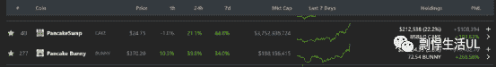
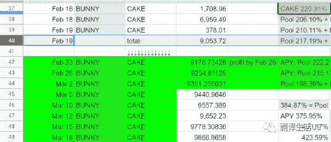
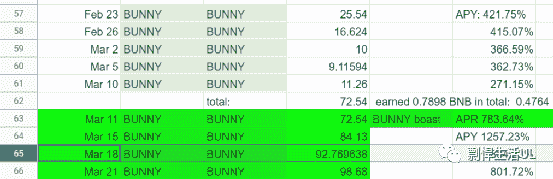
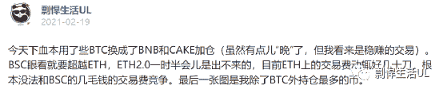
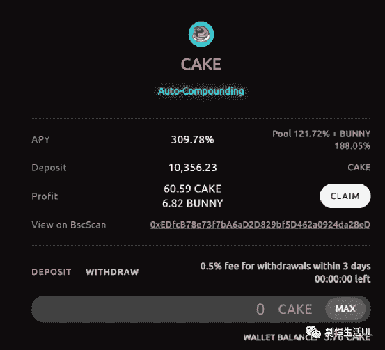
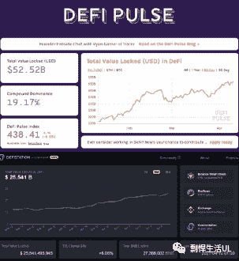
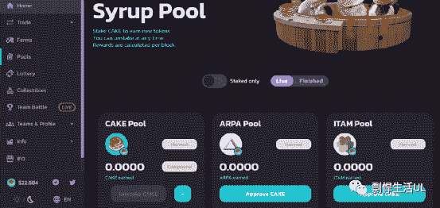
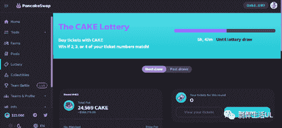
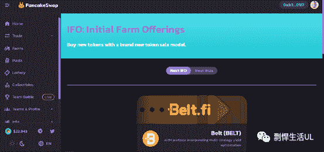

# 我是如何利用crypto（加密货币）每天躺赚1815美元（超过1万人民币）的

> 原文：[https://piaohanshenghuo.com/how-i-make-1815-passive-income-with-crypto-daily/](https://piaohanshenghuo.com/how-i-make-1815-passive-income-with-crypto-daily/)

Disclaimer: 我只是分享我的经历和做法，我“幸运地”地赚到了钱。并没有怂恿你去做一样的事情，输不起千万乱来。Always DYOR(do your own research)，自己调查，自己决定，别乱跟风。

背景音乐：

<audio class="wp-audio-shortcode" id="audio-3367-1" preload="none" style="width: 100%;" controls="controls"><source type="audio/mpeg" src="https://piaohanshenghuo.com/wp-content/uploads/2021/04/Fuck-Bitches-Get-Money-Remix.mp3?_=1">[https://piaohanshenghuo.com/wp-content/uploads/2021/04/Fuck-Bitches-Get-Money-Remix.mp3](https://piaohanshenghuo.com/wp-content/uploads/2021/04/Fuck-Bitches-Get-Money-Remix.mp3)</audio>

从2月19日到3日18日，我一个月一共赚了813.145个$CAKE，92.769638个$BUNNY。

这些我都没卖，如果按照目前的价格卖了的话，一个$CAKE大概24.75美元，一个$BUNNY大概370.2美元，总计54468美元，平均每天1815美元。

如下图：

 

 

 

通过上图可以看到，2月16日时，我只有1708个CAKE(2块多美元买的)，之后我“下血本”加了仓（买了7000多个，大概14.5美元买的），看我2月19日发的公众号信息（如下图）也能看到。

 

我具体是如何“躺赚”的呢？

其实很简单，只需要利用一个我在昨天的文章中提到的平台——Pancake Bunny，如下图：

 

你可以把你的$CAKE存在这里，目前有大概321%的年化收益率，我每3天会收获一次$BUNNY，并把$BUNNY存在这个平台上。存$BUNNY有两个选项，你既可以选择把BUNNY当利息，也可以选择把WBNB当利息（如上图）。

目前把WBNB当利息的利率更高，我选择存在那里。

这个诱人的利率正在慢慢下降，目前我大概3天赚了60.59个$CAKE+6.82个$BUNNY(如下图)，大概一共4000美元，平均每天1333美元，比之前的1815美元低了一些。

 

为什么我我很看好$CAKE? 因为Pancakeswap是BSC上最大、最成功的AMM（Automated market maker），AMM其实很好理解，就是一个“没人管”的交易所，连上你的钱包就可以用，不需要注册，不需要KYC。

ETH上最大的AMM是Uniswap，$UNI目前的市场总额是158亿美元（排名第8），$CAKE只有34亿美元（排名第41），差了大概5倍。$CAKE还有很大的成长空间。

而Pancakeswap的交易量已经远超Uniswap了，ETH的油费太贵，目前在Uniswap上一次交易要30多美元（这还是便宜的时候，拥堵的时候要上百美元，而且还可能要等很久（几分钟到几小时），油钱低了交易还有可能失败，失败后油费照扣），而在Pancakeswap上只需要几十美分就够，便宜了大概100倍，交易几秒钟就能完成。

从实用性上来讲，Uniswap完败，普通用户根本用不起，而ETH 2.0（解决油费高的问题）今年基本都没法完成。大众自然会更喜欢用Pancakeswap，这是市场的自然规律。

由于变态的油费，ETH的DEFI的TVL(total value locked)增长缓慢，目前有525亿美元（近3个月只涨了2.4倍），BSC的DEFI的TVL增长飞速，目前已经250亿美元了（近3个月翻了37倍！）。如下图：

 

$CAKE的优势还不止这些，这个币的功能还有很多。据我所知，$UNI这个币只有一个governance的功能，基本你只能用这个币投票，帮Uniswap做决定。而$CAKE显然也可以用来投票，但远不止这些。

像上文提到的，你可以把$CAKE存到Pancake Bunny上，可以享受一个非常高的利率。$UNI也可以，但是利率低很多。

而且Pancakeswap本身也是一个农场(yield farm)，存入你的$CAKE，可以赚取上百种不同的加密货币，还可以存入你的LP token（这个功能像AUTOFARM之类的农场往往更好）。如下图：

 

你还可以买彩票，如下图。每天都会开奖，目前有50万美元的奖金池，上次奖金总额有200万美元。这个彩票的一大好处就是，可以减少$CAKE的供给量，因为奖金池的奖金都来自于购买彩票的人，这里有20%会被烧掉。除此之外，Pancakeswap每周还会烧掉一定的$CAKE。大家应该都知道，需求高，供给少，都会导致价格上涨。

 

Pancake还有IFO的功能（如下图），基本上是一个高质量的新币的发布平台，上边发布的新币的表现普遍都很好，基本上只要你能买到，就能赚到，往往是好几倍的赚。想参加IFO，你必须得提供CAKE-BNB的LP。IFO里的​$CAKE也会被烧。​

 

$CAKE的功能还不止这些，比如，还涉及目前很火的NFT等。总之，一个币的功能往往越多越好。

而$BUNNY作为最好的$CAKE农场，显然也会表现很不错，目前用$BUNNY可以赚取大概400%年利率的WBNB，而BNB目前利率最高的农场也就40%左右，就凭这一点，我就感觉$BUNNY很有发展，所以目前也没卖。

基本就写这么多，**crypto风险很大，投资需谨慎。**我很可能是错的，建议你自己去好好做调查，再决定要不要投入任何你辛苦赚来的血汗钱。

Pancakeswap的官方介绍信息：

https://docs.pancakeswap.finance/

Pancake Bunny的官方介绍信息：

https://pancakebunny-finance.readthedocs.io/en/main/

**如果有的网站进不去的话，是因为你在国内…… 剽悍生活官网上第一篇文章就有解决方案**。 

希望能帮到大家。

敬请期待下一篇文章，连夜码字不易，**别忘了通过点赞、分享、打赏、点页面右下角的“在看”和“点赞”等方式以示支持，鼓励我更快地发表下一篇文章。谢谢！**

* * *

剽悍生活UL(博客/微信公众号)分享关于**两性关系**、**自我提升**、**数字游民的生活方式**的原创内容，帮你过上更理想的生活（尤其是性生活）。

官方博客：piaohanshenghuo.com

**可以在官网的搜索框里直接搜索你感兴趣的内容**。

剽悍生活的个人微信号：ycf3721，[**一对一视频教学**](https://mp.weixin.qq.com/s?__biz=MzU5NDgxNjI2Nw==&mid=2247485005&idx=3&sn=90921756abbf4f2d3df570a34d4412c0&chksm=fe7a3a29c90db33fa3d31a082f139f3b0a13062b3d594469aad53918a4d84fce706e2e29a9d1&scene=21#wechat_redirect)，或拉你进入[**剽悍生活讨论群**](https://mp.weixin.qq.com/s?__biz=MzU5NDgxNjI2Nw==&mid=2247484865&idx=1&sn=77c36b4014d6c1948879043442f768cf&chksm=fe7a39a5c90db0b39ebff280e3b8b406d41d45b546e8bc22c977a3a9a56ff7256d53e8bf5793&scene=21#wechat_redirect)，**加我微信时请注明目的**。

另外目前还有内容可以沉淀的剽悍生活读者论坛——[剽悍星球（点此看详情）](https://mp.weixin.qq.com/s?__biz=MzU5NDgxNjI2Nw==&mid=2247484958&idx=1&sn=6873fdf5968922b143e9fe93901ed8ce&chksm=fe7a3a7ac90db36ce1a6ba7f337d7d857342c1904c8605480ad2b5050a2eb9b519e36c09be6e&scene=21#wechat_redirect)。

