# 如何用你的比特币等加密货币赚被动收入

> 原文：[https://piaohanshenghuo.com/how-to-make-passive-income-on-your-btc/](https://piaohanshenghuo.com/how-to-make-passive-income-on-your-btc/)

剽(piao2)客们大家好，好久没更新文章了，今年我一直在研究crypto。经常有人问关于在网上赚钱的问题，今天我就来和大家分享一下利用比特币等加密货币赚取被动收入的各种办法。

<audio class="wp-audio-shortcode" id="audio-3322-1" preload="none" style="width: 100%;" controls="controls"><source type="audio/mpeg" src="https://piaohanshenghuo.com/wp-content/uploads/2021/04/BITCOIN-PUMP-IT-UP.mp3?_=1">[https://piaohanshenghuo.com/wp-content/uploads/2021/04/BITCOIN-PUMP-IT-UP.mp3](https://piaohanshenghuo.com/wp-content/uploads/2021/04/BITCOIN-PUMP-IT-UP.mp3)</audio>

下述方法的利率从小到大，安全系数从高到低。

1.最安全的方法：**利用[Binance](https://piaohanshenghuo.com/recommends/binance/)等有声望的大平台的“余额宝”功能**，如下图。

 

可以看到，比特币的年利率是1.2%，没有任何手续费，随时可以取款。

[火币](https://piaohanshenghuo.com/recommends/huobi/)上也有，利率是1.29%，略高一丁点儿，另外偶尔还有定期存储的“限时挖矿”，名额有限，很快就满。如下图：

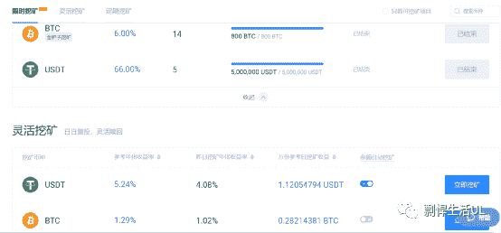

 

2.**利用Binance的“liquidity swap****”功能**，提供liquidity，可以实现大概7%的年利率（如下图）。

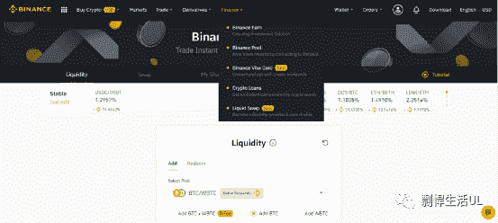

 

由于你提供的pair是BTC/WBTC，这两个币的价值基本一样，所以大可不必担心”impermanent loss”。

上述方法的安全系数都很高，因为这些大平台即使被黑客黑了，也会赔偿用户的资金，不赔的话这个平台的声望就废了，损失更大。

3.接下来，我再来介绍一下安全系数略低的方法（**D****EFI**(decentralized finance)），不过利率更高，都高于10%，我本人也是用了好几个月了，目前还没有任何问题。

需要注意的是：所有的DEFI项目都有”smart contract”有漏洞的风险，即使已经被审计过了也不能排除被黑客黑的风险，被黑后是没人赔你钱的。

所以，赔不起的钱，别放里边。

推荐一个叫”Defistation”的网站，是一个BSC上的DEFI项目的排名网站，排名前10的项目都挺靠谱的。

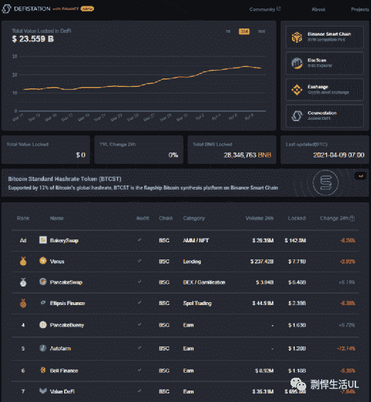

 

目前已经有235多亿美元的资金被放在了BSC的DEIF项目上了，如果非常危险的话，不可能有那么多的资金。

我用的都是BSC上的DEFI项目，因为ETH的油费实在太高了。在ETH上随便操作一下都得好几十美元，我之前卖一个叫$BADGER的币，一顿操作下来，一共花了大概200美元的手续费……

反观BSC(Binance Smart Chain)，费用便宜很多，一般的操作只需要几十美分就可以搞定。

想用BSC，你得先有个钱包，我用的是最受欢迎的开源钱包——Metamask，支持常见的浏览器，如下图：

 

Metamask钱包设置BSC网络的具体教程：

https://docs.binance.org/smart-chain/wallet/metamask.html

简单地说，就是点击Metamask右上角的”Network”，再点”Custom RPC”，再输入下方的信息就可以了。

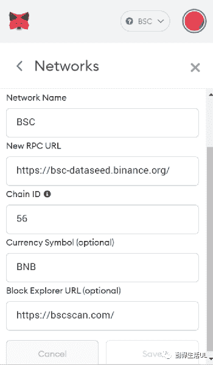

 

另外，Metamask是支持连接冷钱包的，Ledger和Trezor都支持，强烈推荐链接冷钱包，这样即使黑客黑了你的Metamask，也照样偷不走你的资金，可以确保资金的安全。

之后就可以利用BSC上的DEFI项目赚取被动收入了。

这里推荐的可以利用比特币赚取被动收入的平台有：Beefy, Autofarm, ACryptoS, Pancake Bunny, Value Defi, Hyper Finance, Elephant Money.

除了最后一个平台外，其他都很相似，也都很靠谱，由于利率有波动，可以随时转移，选择你认为最合适的。

Beefy Finance

网址：https://app.beefy.finance/

官方的具体介绍：https://docs.beefy.finance/beefyfinance/

目前BTC的年利率是13.54%（每天0.03%），存款免费，取款收取0.1%的手续费，所以如果你存了不到3天就取出来是赔钱的。

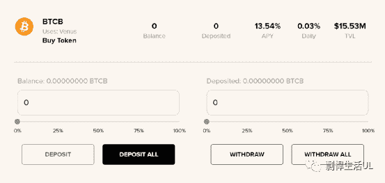

 

Autofarm

网址: https://autofarm.network/

官方的具体介绍：https://autofarm.gitbook.io/autofarm-network/

目前的BTC总年利率是22.4%（13.7% BTC + 8.7% AUTO），$AUTO是这个平台的币，你可以定期收获(harvest) AUTO，可以直接用Pancake Swap换成你想要的币，也可以用AUTO和BNB配对，提供liquidity，赚取利润，目前APR为170%左右，不过需要你手动收获你的AUTO，存入BTC的手续费为0.1%，如下图：

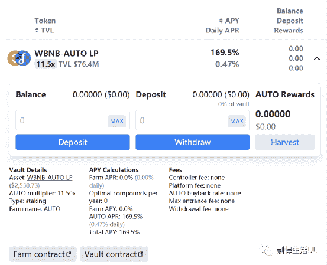

 

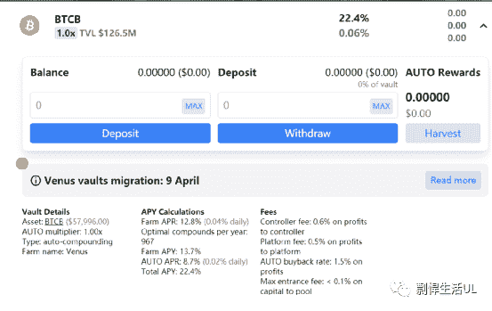

 

另外，你还可以去Beefy的AUTO-BNB农场，自动“利滚利”(auto compound)，目前APY大概500%左右。

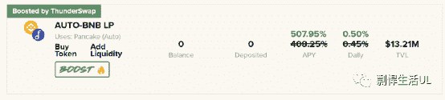

 

这里讲一下APR和APY的区别，APR是Annual Percentage Rate，是你借款时需要付的年利率。APY是Annual Percentage Yield，是利滚利后的年利率（具体多少和你滚了多少次有关）。

这有个APR和APY的计算器：https://www.aprtoapy.com/

如下图：

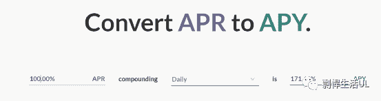

 

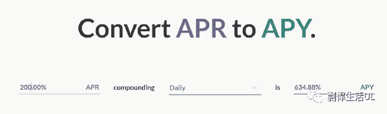

 

可以看到，如果APR是·100%，如果每天都把利润重新存入的话，最终的利滚利后的年利率（APY）是171.46%，如果APR 是200%，APY则是634.88%。可见利滚利的力量是非常强大的。

ACryptoS(Advanced Crypto Strategies)

网址：https://app.acryptos.com/

官方的具体介绍：https://docs.acryptos.com/

目前BTC的总年利率为23.6% (13.7% BTC + 8.7% ACS)，$ACS是这个平台的币，你可以定期收获(harvest)ACS (有0.03 ACS的费用)，可以直接用Pancake Swap把ACS换成你想要的币，也可以存ACS赚取利润（目前年利率447%，需要注意，取出ACS时需要交10%的手续费）。

也可以用ACS和BNB配对，提供liquidity，赚取利润，目前APR为441%，不过需要你手动收获你的ACS，如下图：

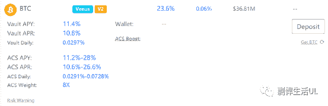

 

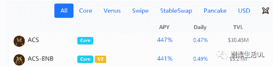

 

Pancake Bunny

网站：https://pancakebunny.finance/farm/BTCB

官方的具体介绍：https://pancakebunny.finance/farm

Pancake Bunny是最好的用$CAKE赚取被动收入的平台（日后我会讲），最近推出了更多的“农场”，包括BTC的。目前总年利率为23.44%(9.44% BTC + 14% BUNNY)，存超过3天后可以免费取出，否则要交0.5%的手续费。

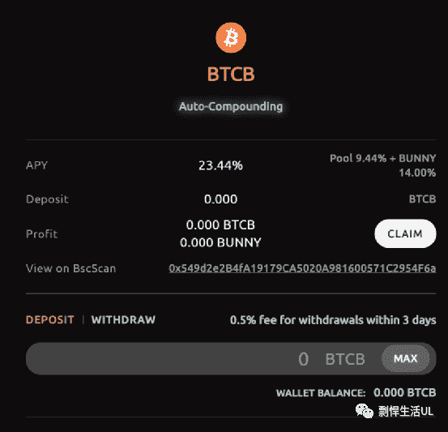

 

Value Defi

网址：https://bsc.valuedefi.io/#/vsafe

官方的具体介绍：https://docs.valuedefi.io/

Value Defi上有一个新的BTC的策略，有点儿”too good to be true”，实在太高了，我没试过。不过我试过一个利率相近的BNB的策略，当时上边写200%多，结果和我在Beefy上40%的利率的策略的实际利润基本相同。所以我并不是很信任这个项目上写的利率。不过这个项目的团队是靠谱的，不怕跑路。

 

Hyper Finance

网址：https://hyfi.pro/#/

官方的具体介绍：https://cndocs.hyfi.pro/

这是一个新的靠谱项目，刚开始的利率很高，现在已经低了很多，目前总年利率是37.48%（3.05% BTC + 34.43% HYFI），HYFI是这个平台的币，获得的HYFI需要2周后才能卖，否则你会损失50%。

 

Elephant Money

网址：https://elephant.money/

官方的具体介绍：https://elephant.money/media/elephant-wp.pdf

这是Bankroll Flow（Tron上的运行了2年多的项目，靠谱）的一个项目，年利率最高，目前为70%左右。这个项目的利率之所以很高，是因为它独特的算法。想加入项目，你必须得交10%的手续费，退出的时候你也必须得交10%的手续费，所以该项目只适合长期投资（至少3个月）。

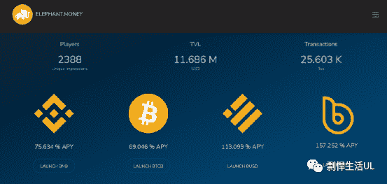

 

本文仅以BTC为例，讲了一下怎么用crypto赚取被动收入，BTC是利率最低的crypto之一，其实有很多利率高得多的靠谱项目，我日后还会再补充。

希望能帮到大家。

敬请期待下一篇文章，连夜码字不易，**别忘了通过点赞、分享、打赏、点页面右下角的“在看”和“点赞”等方式以示支持，鼓励我更快地发表下一篇文章。谢谢！**

* * *

剽悍生活UL(博客/微信公众号)分享关于**两性关系**、**自我提升**、**数字游民的生活方式**的原创内容，帮你过上更理想的生活（尤其是性生活）。

官方博客：piaohanshenghuo.com

**可以在官网的搜索框里直接搜索你感兴趣的内容**。

剽悍生活的个人微信号：ycf3721，[**一对一视频教学**](https://mp.weixin.qq.com/s?__biz=MzU5NDgxNjI2Nw==&mid=2247485005&idx=3&sn=90921756abbf4f2d3df570a34d4412c0&chksm=fe7a3a29c90db33fa3d31a082f139f3b0a13062b3d594469aad53918a4d84fce706e2e29a9d1&scene=21#wechat_redirect)，或拉你进入[**剽悍生活讨论群**](https://mp.weixin.qq.com/s?__biz=MzU5NDgxNjI2Nw==&mid=2247484865&idx=1&sn=77c36b4014d6c1948879043442f768cf&chksm=fe7a39a5c90db0b39ebff280e3b8b406d41d45b546e8bc22c977a3a9a56ff7256d53e8bf5793&scene=21#wechat_redirect)，**加我微信时请注明目的**。

另外目前还有内容可以沉淀的剽悍生活读者论坛——[剽悍星球（点此看详情）](https://mp.weixin.qq.com/s?__biz=MzU5NDgxNjI2Nw==&mid=2247484958&idx=1&sn=6873fdf5968922b143e9fe93901ed8ce&chksm=fe7a3a7ac90db36ce1a6ba7f337d7d857342c1904c8605480ad2b5050a2eb9b519e36c09be6e&scene=21#wechat_redirect)。

