# 塞尔维亚首都Belgrade（贝尔格莱德）生活攻略、物价、以及我对塞尔维亚的印象

> 原文：[https://piaohanshenghuo.com/belgrade-guide/](https://piaohanshenghuo.com/belgrade-guide/)

<section>一眨眼，我已经在塞尔维亚首都贝尔格莱德生活了4个月了，每个月的生活费在1000美元左右，少的时候应该合不到6000人民币。</section>

由于疫情政策的限制，大部分商店很早就关门了，我刚来的时候，酒吧、夜店半夜1点关门，大概2周后，改成了晚上10点，又逐步变成9PM, 8PM, 6PM…… 目前是晚上8点关门。所以夜生活基本为0，接触美女的最好的方式是网上约会（Tinder）和线下搭讪，相关阅读《[剽悍故事No.12 来塞尔维亚后的第一波艳遇](https://piaohanshenghuo.com/ul-story-12/)》。

今年从1日到22日我基本成天在家工作，总共只花了大概23000 RSD（大概1500人民币（不含房租）,包含每次姑娘来我家，我都主动给她1000 RSD的打车钱，感谢她赶过来，节省我的时间），我基本都在家工作，自己做饭，而且从以前的一天两顿饭改成了一天一顿饭，省钱更省时间。

其中房租是大头，每个月都要将近500欧（房租400+各种费用），我租的地方稍微偏贵一点儿。我感觉350到400欧就能租到一个还不错的公寓。

关于租房的具体做法请读我写的《[塞尔维亚租房攻略](https://piaohanshenghuo.com/how-to-rent-an-apartment-in-serbia/)》。

另一个大头是食物，我绝大部分时间都是在家自己做，塞尔维亚有两大超市，一个是MAXI，一个是IDEA，都差不多，超市的物价如下（下文的rsd是指塞尔维亚的货币dinar，1美元约等于100 rsd，1人民币约等于15 rsd，rsd和日元的汇率很接近）：

可以直接去超市的网站上看到实时的价格（网站没有英文版，不过可以直接用Chrome浏览器的右键翻译功能一键翻译）。

https://www.maxi.rs/online/Vocje-i-povrcje/c/03?pageNumber=0

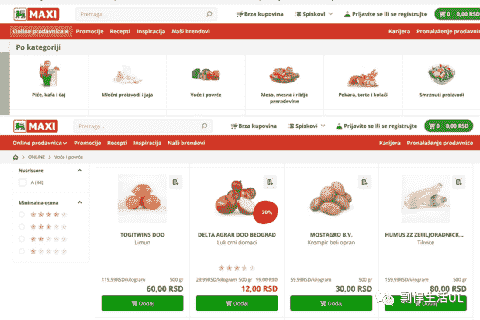

 

超市里的蔬果都是自己称，自己贴价签，蔬果上有对应的号码，在秤上输入相应的号码就可以自动打印出对应的价签了。不会弄也没事，直接找身边的美女帮忙，即使你会弄也可以装作不会弄，以此当借口搭讪。

很多蔬果的种类和价格都和季节密切相关，冬天往往会贵很多。

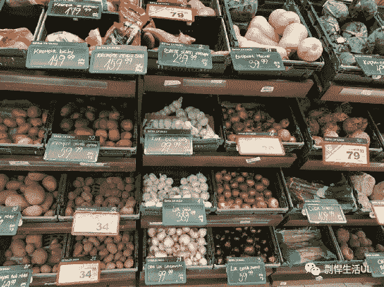

 

比如我最常买的西蓝花已经从9月份的120 rsd/kg涨到了现在2倍的价格。菜花也从90 rsd/kg涨到了150 rsd/kg。zucchini从60rsd/kg翻了近3倍到160 rsd/kg。茄子也从100出头涨到了200 rsd/kg。

一盒400g的蘑菇要120 rsd。

胡萝卜、南瓜、甜菜(beet)都在40 rsd/kg左右。

白洋葱大概30 rsd/kg，紫洋葱价格翻倍。葱125rsd/kg，姜大概600 rsd/kg，蒜390 rsd/kg。

葡萄110到140 rsd/kg（冬天没了），西瓜40 rsd/kg（冬天没了，有的时候质量很好），橙子80 rsd/kg, 橘子 120 rsd/kg，柠檬经常特价 50 rsd/500g一袋，石榴69到89 rsd一个（有段时间质量特别好，贼甜），猕猴桃140 rsd/kg。

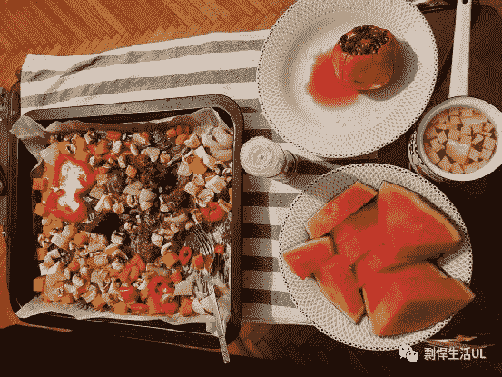

 

塞尔维亚的地瓜(240 rsd/kg)可以比土豆（特价的时候20 rsd/kg）贵10倍！因为听说塞尔维亚自己不产地瓜，只产土豆。

在超市里能找到一些长相奇特的蔬菜：

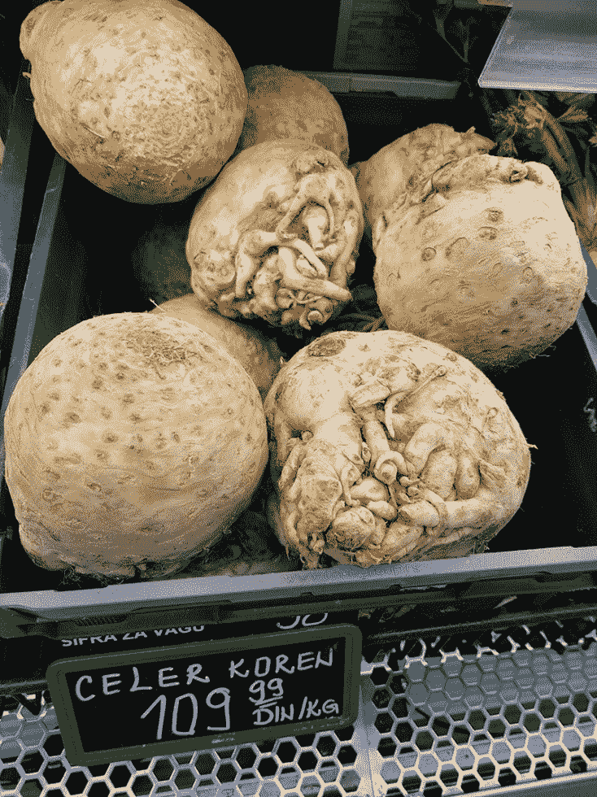

 

塞尔维亚盛产树莓(raspberry)，世界第二大的产量，大概200 rsd一盒(100g)。

塞尔维亚的肉相对比较便宜，我最喜欢的一款牛肉（Juneca Podplecka MK）特价的时候要700 rsd/kg，不打特价的时候是760 rsd/kg，大概50人民币一公斤。

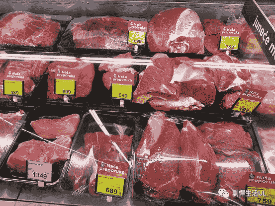

 

我最喜欢的猪肉是”Sveza neobradj.slanina Delh.”，每公斤410 rsd/kg，大概27人民币一公斤。

这两款肉直接放烤箱里烤就非常香。

塞尔维亚人很喜欢吃肉，超市里有各种香肠，下图只是冰山一角，但因为我认为香肠不健康，所以一个也没买。

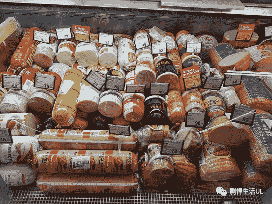

 

塞尔维亚的坚果相对比较便宜，经常能看到专门卖坚果、巧克力、饼干等零食的店（通常比超市里便宜）。我非常喜欢。

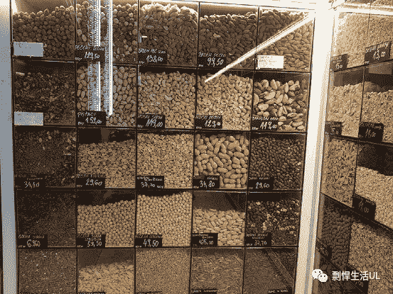

 

上图中的价格是每100克的价格。

杏仁：700 rsd/kg

榛子：870 rsd/kg

核桃：900 rsd/kg

腰果：1190 rsd/kg

塞尔维亚的酒，尤其是红酒很便宜，我都见过打特价的200 rsd一瓶的红酒，300多rsd（大概20块钱人民币）一瓶的红酒也有一大堆。

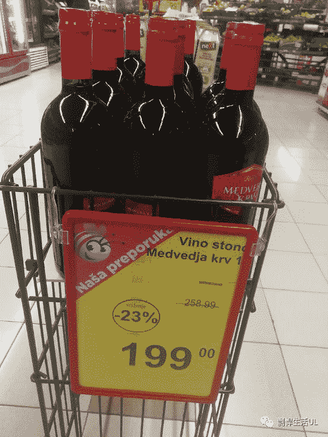

 

路边的快餐店很便宜，一大片披萨一般只要80到90 rsd，3片基本就能吃饱了。

下图为我最喜欢的路边小店” Prilog”(Google Maps一搜就能找到了）的价格表，其中我最喜欢的“塞尔维亚汉堡”（Pljeskavica）只要260 rsd，一个基本就能吃饱了。

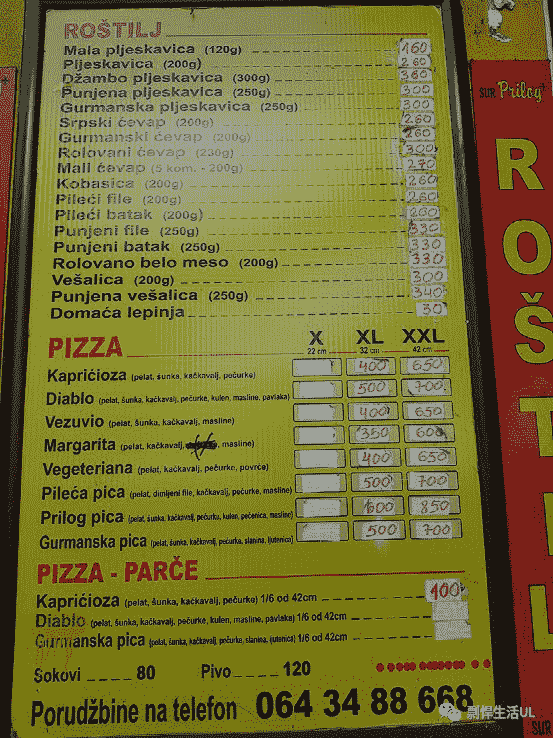

 

打车的话，最好的选择是一个叫CarGo的APP，需要绑定银行卡，常见的VISA和MASTER都可以。

公交车收费很诡异，我只是去机场的时候坐过一次，Google Maps告诉我需要坐两个公交车，一共89 rsd。不过我上了第一个公交车后司机就告诉我要150 rsd（相当于10块钱人民币，这对于公交车来说实在是够贵的了），等我上了第二个公交车司机又告诉我不需要交钱。我在第二个公交车上顺便搭讪了一下面前的美女，她告诉她公交车基本都免费坐，司机往往不在乎。

我平时都是骑自行车去各种地方，我是在网上（kupuemprodajem.com）花7000 rsd买了一个二手自行车。

Sim卡的话，除非你要办1年的卡，否则最多1个月。我最推荐VIP的一个月的卡，只要300 RSD，有100条短信或100分钟的通话时间（如果你发了20条短信，就剩80分钟的通话时间）。有1GB的流量，还包括10GB的Facebook, Whatsapp的专用流量，我大部分时间都有WIFI用，所以1GB的流量足够了。

我刚开始用的是Telenor的15天的卡，要500 RSD。不过有价值5000 RSD的境内通话、短信额度，以及10GB的流量，而且信号更好，不过我感觉没有必要。如果你来短期旅游的话，可能更适合用这个卡。

我在塞尔维亚也见到了一些很酷的建筑：

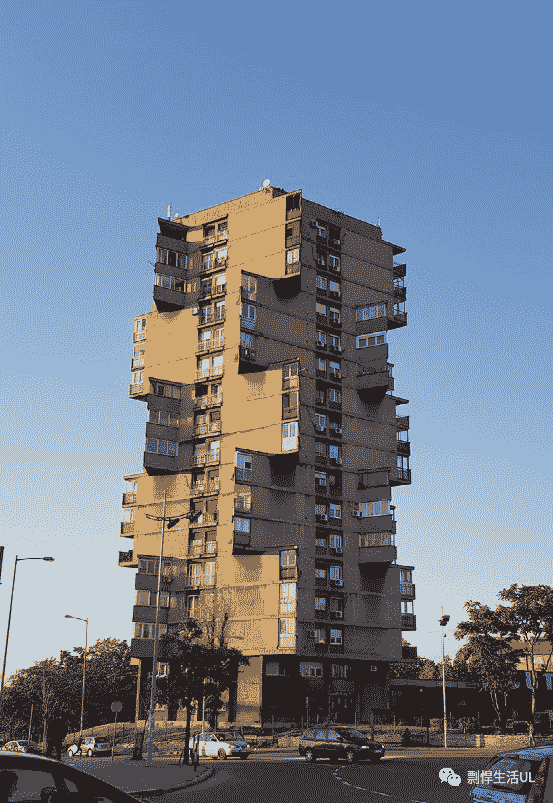

 

我最喜欢的路边小餐馆”Prilog”对面的建筑。

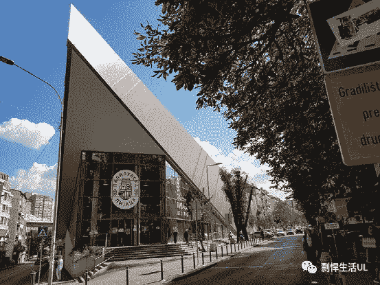

 

塞尔维亚还有很多教堂，下图为我最喜欢的公园（Tašmajdan）里的St. Mark Orthodox Church，另外建议看一眼Saint Sava，是Balkan（巴尔干）国家内最大的教堂。

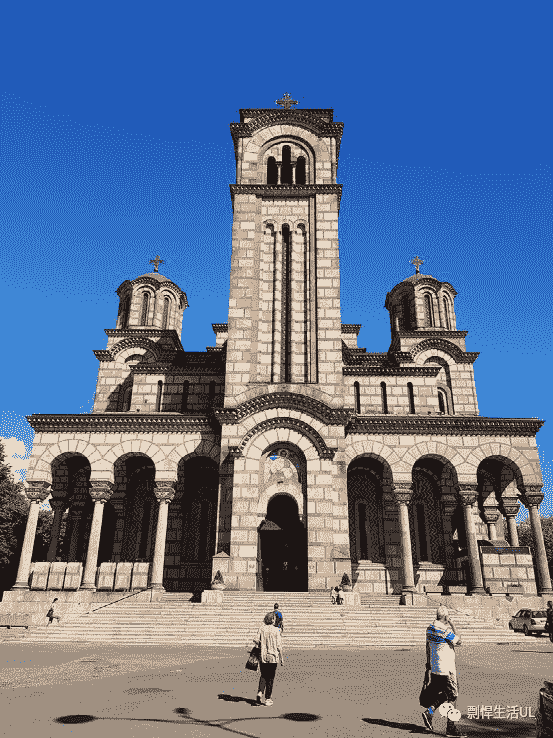

 

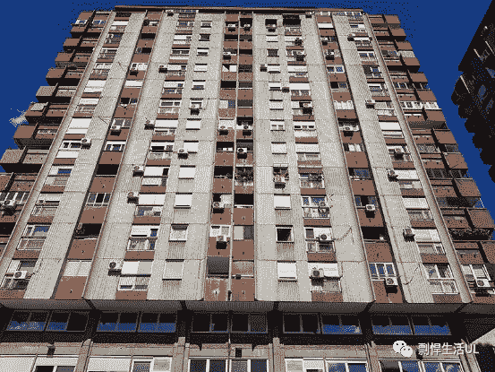

 

很多建筑上还有涂鸦，比如下图（晴天和阴天的对比）：

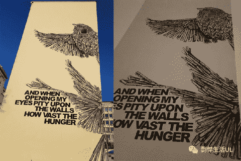

 

市中心比较集中，是一条叫“Knez mihailova”的步行街，人流量较大，很适合搭讪美女。

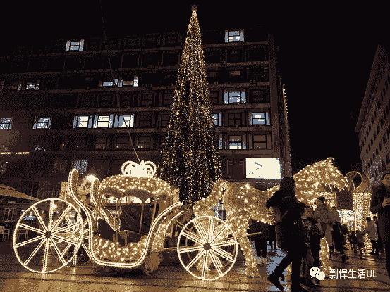

 

我在这里还碰到了一个蹬三轮儿的同行。

另外，河边也不错，很适合骑自行车、跑步，目前河边正在建一个叫”Belgrade Waterfront”的商业区。

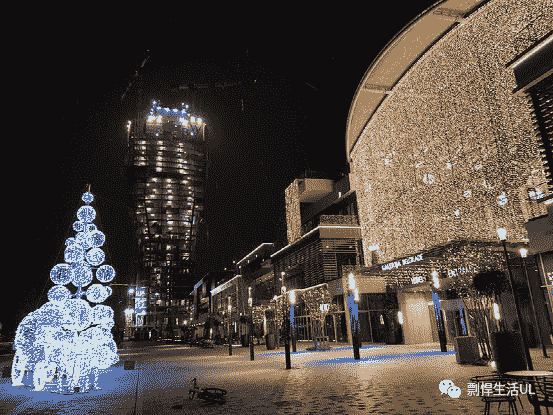

 

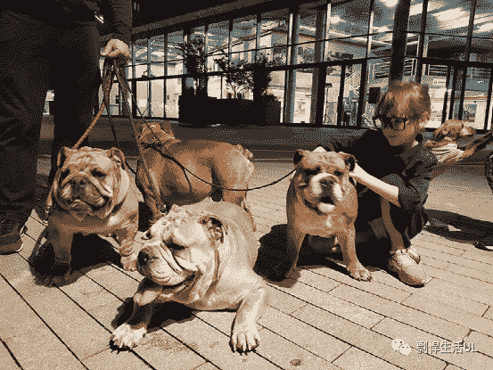

 

河边还有可以免费健身的地方（Google Maps搜”street workout belgrade”），另一个我非常喜欢的地方是”Tasmajdan Park”。

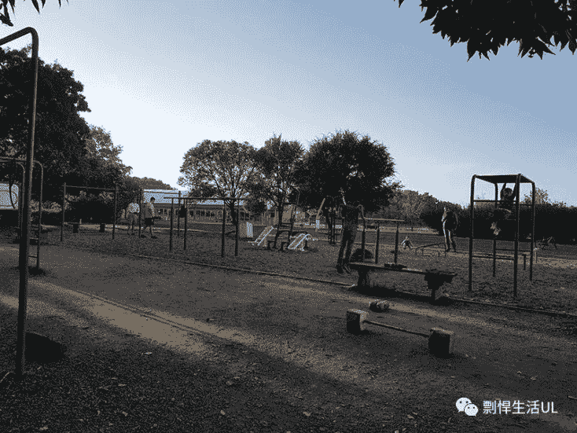

塞尔维亚路边有很多赌球的店，基本每个街区都有，显然很有市场，人们在里边赌球、抽烟、喝酒。在塞尔维亚抽烟的人非常多，在室内抽烟也是非常常见的，在大部分餐厅、咖啡店里都可以抽烟。

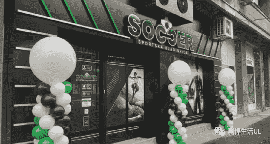

 

疫情期间的塞尔维亚的冬天稍微有些无聊，不过我并不介意，因为更有助于我专注于工作，为未来打下更坚实的基础。夏天应该会非常好，我很期待夏天再回来。

相关阅读：

《[如何无限期住在塞尔维亚（塞尔维亚签证）》](https://piaohanshenghuo.com/serbia-visa/)

《[我第一次在塞尔维亚差点儿被抢了……](https://piaohanshenghuo.com/i-almost-got-robbed-in-serbia/)》

《[剽悍访谈No.2：会说中文的塞尔维亚美女在和我上床后接受的采访](https://piaohanshenghuo.com/ul-talk-2/)》

敬请期待下一篇文章，连夜码字不易，**别忘了通过点赞、分享、打赏、**点页面右下角的“在看”和“点赞”等方式以示支持**，鼓励我更快地发表下一篇文章。**谢谢！****

* * *

剽悍生活UL(博客/微信公众号)分享关于**两性关系**、**自我提升**、**数字游民的生活方式**的原创内容，帮你过上更理想的生活（尤其是性生活）。

**可以在官网的搜索框里直接搜索你感兴趣的内容**。

剽悍生活的个人微信号：ycf3721，[**一对一视频教学**](https://mp.weixin.qq.com/s?__biz=MzU5NDgxNjI2Nw==&mid=2247485005&idx=3&sn=90921756abbf4f2d3df570a34d4412c0&chksm=fe7a3a29c90db33fa3d31a082f139f3b0a13062b3d594469aad53918a4d84fce706e2e29a9d1&scene=21#wechat_redirect)，或拉你进入[**剽悍生活讨论群**](https://mp.weixin.qq.com/s?__biz=MzU5NDgxNjI2Nw==&mid=2247484865&idx=1&sn=77c36b4014d6c1948879043442f768cf&chksm=fe7a39a5c90db0b39ebff280e3b8b406d41d45b546e8bc22c977a3a9a56ff7256d53e8bf5793&scene=21#wechat_redirect)，**加我微信时请注明目的**。

另外目前还有内容可以沉淀的剽悍生活读者论坛——[剽悍星球（点此看详情）](https://mp.weixin.qq.com/s?__biz=MzU5NDgxNjI2Nw==&mid=2247484958&idx=1&sn=6873fdf5968922b143e9fe93901ed8ce&chksm=fe7a3a7ac90db36ce1a6ba7f337d7d857342c1904c8605480ad2b5050a2eb9b519e36c09be6e&scene=21#wechat_redirect)。

