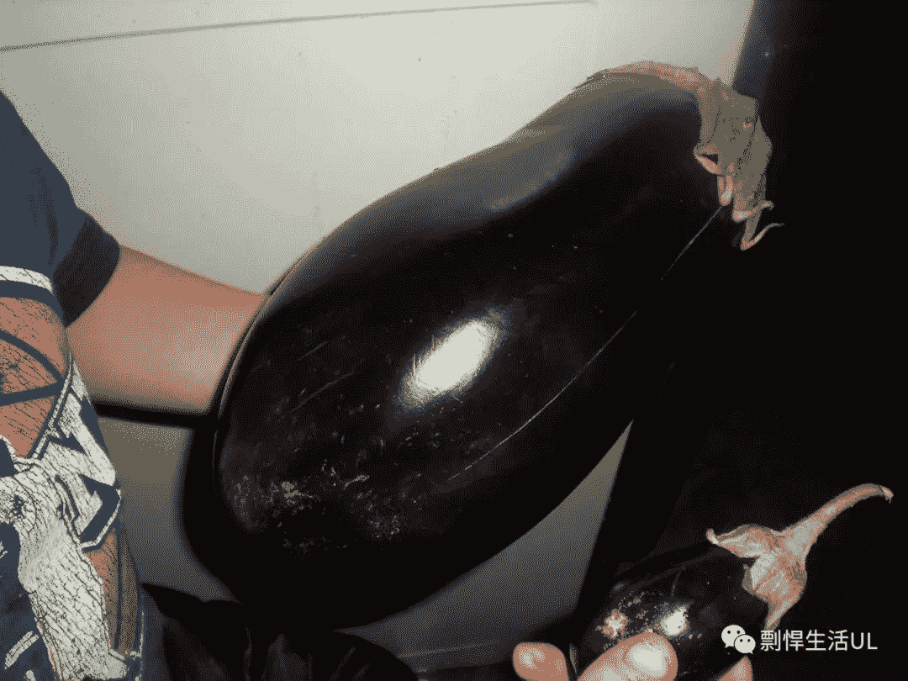
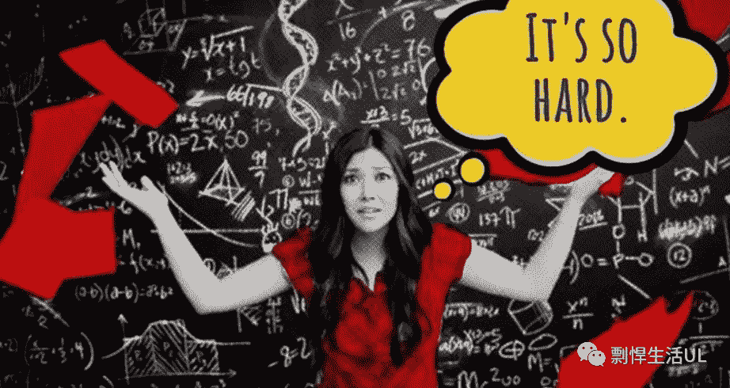
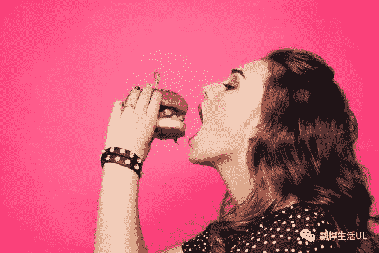
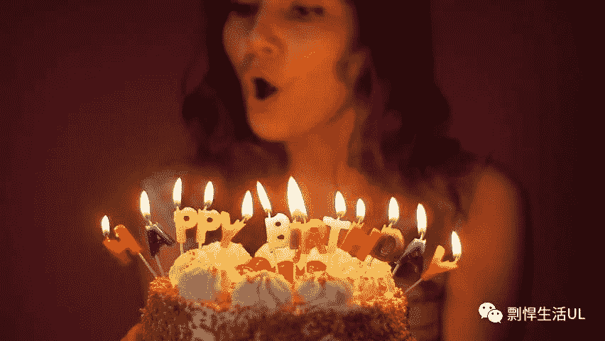

# 如何避免只聊天气之类的被发好人卡的话题？介绍一个“万能”笑话

> 原文：[https://piaohanshenghuo.com/thats-what-she-said/](https://piaohanshenghuo.com/thats-what-she-said/)

之前有个找我一对一视频教学的住在加拿大的同学说他和姑娘聊天时总是喜欢聊一些普通朋友会聊的东西，不知道如何拉进关系，不知道如何自然地聊更亲密的、和性相关的话题。

我说调情这种东西得讲究分寸，一时半会可能很难掌握好分寸。最简单的办法就是“有分寸”地讲“黄笑话”，因为把姑娘逗乐的时候她的“防卫”是最低的，这时如果笑话又和性有关，可以有效“拉近”你们的关系。

我介绍了一个很实用的笑话，这个笑话就是“That’s what she said.”，我没想到这位同学在加拿大住了那么久都不知道这个笑话。基本所有北美的人、乃至全世界英语水平够高的人都知道这个笑话。

这个笑话起源于美剧“The Office”，基本上任何和性沾边的话，都可以接一句”That’s what she said”，接下来我就具体举一些具体例子，具体讲解一下。

比如：

有个东西特别大，姑娘说”That’s so big!”（好大啊），你就可以接一句”That’s what she said”.（她也这么说（暗指她在说一只屌很大））。

 

再比如：

姑娘遇到了一个难题，抱怨道”That’s so hard”（好难啊），你接”That’s what she said”，曲解她的意思为“屌很硬（hard既有难的意思，也有硬的意思）”

 

再比如：

你们在吃饭，她让你喂她，她说”Put it in my mouth”（放我嘴里），你接”That’s what she said”（你曲解她的意思为“把屌放到她嘴里”）

 

再比如：

你在和姑娘喝酒，姑娘让你帮她把酒杯续满，说”Fill m up”，这时你接”That’s what she said”，暗指“她想让你用屌把她的pussy塞满。”

 

再比如：

你在和姑娘吃饭，食物很大，她很难一口吃下去，于是她说”I can’t hardly fit it in my mouth”（我很难把它放到嘴里），这时你接”That’s what she said”，暗指“她很难把大屌放到她的嘴里”。

 

再比如：

姑娘吹生日蜡烛，说“I’ll blow all of them at once”（我要把它们一起吹灭），这时你接”That’s what she said”，暗指“她会同时blow很多只屌”（blow有吹的意思，但也有“口”的意思（blow job））。

 

再比如：

姑娘需要敷个面膜，她说”I need a facial”，你接”That’s what she said”

因为”facial”可以指：

 

但同时还可以指：

 

我再列举几个可以接”That’s what she said”的情况，就不具体解释了，相信你已经明白了。

“Pull it out slowly”（慢慢拔出来）

“I can’t take this anymore.”（我受不了了）

“It won’t fit.” （尺寸不对）

“That hurts!” （好疼）

“Be careful”（小心点儿）

“Do you have protections?” （你有防护措施吗？）

总之，有非常多的情况都可以用上，要多用你的大脑，找到合适的地方来使用这个笑话。

最后，我又想出来了一个中文适用的情况：你和姑娘在野外打鱼。姑娘看到了一只鱼，于是向你喊“快插啊！”，这时你说“That’s what she said……”

 

敬请期待下一篇文章，连夜码字不易，**别忘了通过点赞、分享、打赏、点页面右下角的“在看”和“点赞”等方式以示支持，鼓励我更快地发表下一篇文章。谢谢！**

* * *

剽悍生活UL(博客/微信公众号)分享关于**两性关系**、**自我提升**、**数字游民的生活方式**的原创内容，帮你过上更理想的生活（尤其是性生活）。

官方博客：piaohanshenghuo.com

**可以在官网的搜索框里直接搜索你感兴趣的内容**。

付费内容有：[**一对一视频教学**](https://mp.weixin.qq.com/s?__biz=MzU5NDgxNjI2Nw==&mid=2247485005&idx=3&sn=90921756abbf4f2d3df570a34d4412c0&chksm=fe7a3a29c90db33fa3d31a082f139f3b0a13062b3d594469aad53918a4d84fce706e2e29a9d1&scene=21#wechat_redirect)，[**剽悍生活讨论群**](https://mp.weixin.qq.com/s?__biz=MzU5NDgxNjI2Nw==&mid=2247484865&idx=1&sn=77c36b4014d6c1948879043442f768cf&chksm=fe7a39a5c90db0b39ebff280e3b8b406d41d45b546e8bc22c977a3a9a56ff7256d53e8bf5793&scene=21#wechat_redirect)。

还有内容可以沉淀的剽悍生活读者论坛——[剽悍星球（点此看详情）](https://mp.weixin.qq.com/s?__biz=MzU5NDgxNjI2Nw==&mid=2247484958&idx=1&sn=6873fdf5968922b143e9fe93901ed8ce&chksm=fe7a3a7ac90db36ce1a6ba7f337d7d857342c1904c8605480ad2b5050a2eb9b519e36c09be6e&scene=21#wechat_redirect)。

