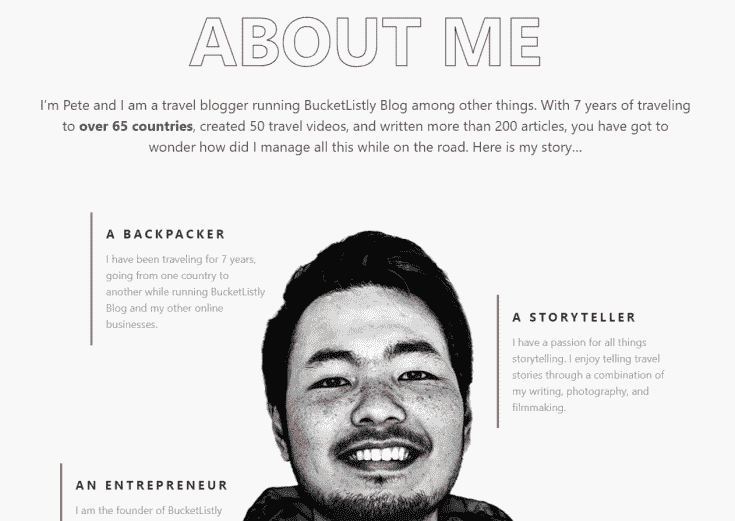
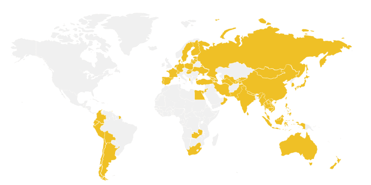
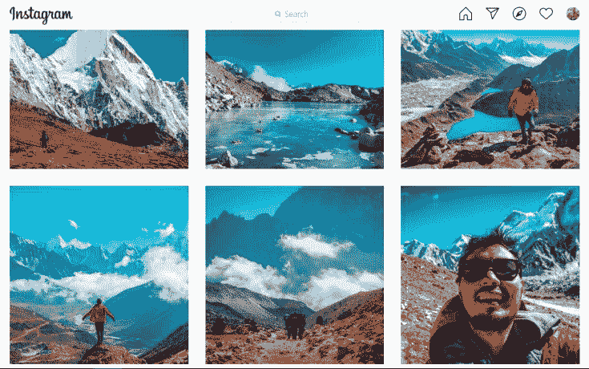

# 介绍一个数字游民的榜样，激励你一下

> 原文：[https://piaohanshenghuo.com/chase-your-dreams/](https://piaohanshenghuo.com/chase-your-dreams/)

我这两天在为我的Albania（阿尔巴尼亚）之旅做调查，因为我最多只能在塞尔维亚待3个月，需要做一个border run才能继续待在塞尔维亚（详情可以看我写的《[如何无限期住在塞尔维亚（塞尔维亚签证）](https://piaohanshenghuo.com/serbia-visa/)》）。目前阿尔巴尼亚也没有任何入境的限制，而且就在塞尔维亚隔壁，往返很方便，顺便可以旅游。

我在谷歌上搜索”things to do in Tirana（阿尔巴尼亚首都），找到了一大堆相关的博客的文章，其中一个博客最突出，写得最认真、最具体、最优秀，照片也拍得最好，视频也非常优秀。我在关闭了其他相形失色的博客页面后，还是留在了这个博客上，想再看看这个博客的其他内容。

结果这个博客让我大开眼界，这个博客叫[Bucketlistly](https://www.bucketlistly.blog/)(bucket list是遗愿清单的意思，有个同名电影)。这个博客上有1万多张可以供人免费使用的高品质旅行照片，我注意到了博主Pete是一位亚裔的小伙儿，我刚开始还以为他是一个英美之类的发达国家长大的家境很好的亚裔，因为他的文章写得非常好，我都感觉不出来英语是他的第二语言，又去了那么多国家，应该得花不少钱。但通过我对这个博客的进一步了解，我才意识到他原来是一个出身普通的泰国人。

我简单介绍一下Pete：他在过去的7年内游历了65个国家，写了200多篇文章，发了50多个视频，和无数的照片。泰国曼谷出生，称自己“足够幸运”从小学了足够的英语，并在大学学了计算机科学专业。毕业之后成为了一名程序员，每月只有600美元的工资（大概4千块人民币）。这样的生活持续了3年，他受够了，开始成为了自由职业者，做”UI Design”（用户界面设计），并开始边工作边周游世界。

他的博客做得很漂亮，下图为他去过的国家：

靠它的设计和代码知识，他通过远程工作在全世界旅行了5年，之后他把更多精力放在了他的博客上。目前由于疫情在泰国到处游荡。

他不但靠自己的努力把英语学得很好，摄影技术也很高。

感受一下他的视频（[Youtube需要连接互联网才能看](https://piaohanshenghuo.com/ke-xue-shang-wang/)）：

<iframe class="youtube-player" width="735" height="414" src="https://www.youtube.com/embed/AiAAi27r1Cw?version=3&amp;rel=1&amp;showsearch=0&amp;showinfo=1&amp;iv_load_policy=1&amp;fs=1&amp;hl=zh-CN&amp;autohide=2&amp;wmode=transparent" allowfullscreen="true" style="border:0;" sandbox="allow-scripts allow-same-origin allow-popups allow-presentation"></iframe>

下方是他的Instagram，感兴趣的同学也可以去关注一下。

我想通过对他简单的介绍让大家意识到**你完全可以靠自己的努力改变自己的命运（尤其是在互联网时代，到处都是机会）**。泰国被很多中国人认为是更落后、更穷的国家，但人家照样靠自己的努力，在一步步实现自己的梦想。

所以，**请不要找借口了**。珍惜你的时间，看看你每天都把时间浪费在什么上了，争取花更多的时间为了你的梦想而努力，有目标地活着，这样你的生命才更有意义，老了之后回头来看你的一生才会觉得没有白活。

敬请期待下一篇文章，**熬夜码字不易，如果本文对你有帮助，想免费表示支持，不妨多花几秒钟的时间，在微信公众号文章底部的广告上点一下，我就能有大概一块钱的收入。**

**当然也欢迎你分享本文，更欢迎你打赏，谢谢支持**。

**你的支持可以鼓励我创作出更多有价值的文章供你阅读。**

* * *

剽悍生活UL(博客/微信公众号)分享关于**两性关系**、**自我提升**、**数字游民的生活方式**的原创内容，帮你过上更理想的生活（尤其是性生活）。

剽悍生活的个人微信号：ycf3721，用于[一对一视频教学](https://piaohanshenghuo.com/1on1_coaching/)，或拉你进入[剽悍生活高级付费微信讨论群](https://piaohanshenghuo.com/ul-wechat-group/)，请注明加我的目的。

