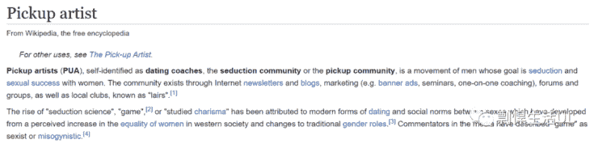
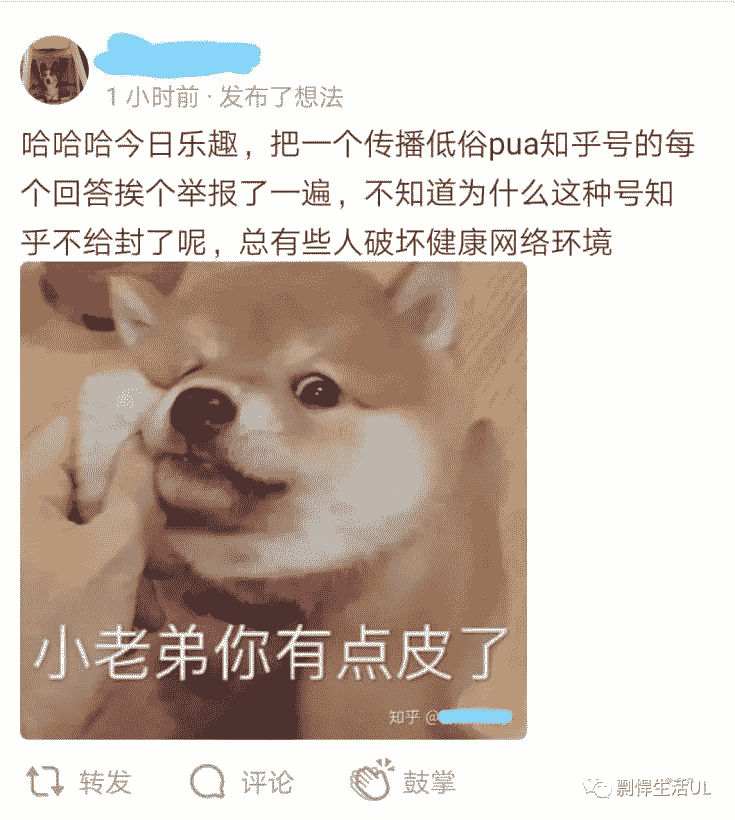

# 国内无知大众对于PUA的误解，请大家不要再以讹传讹了

> 原文：[https://piaohanshenghuo.com/the-pua-myth/](https://piaohanshenghuo.com/the-pua-myth/)

我已经看过了无数次“谁被PUA了，谁被职场PUA了”这种弱智言论，大家都在以讹传讹。PUA是个名词，别再名词动用了，又不是在写诗。 

绝大部分中国人根本就不知道PUA到底是什么，今天我就来写一篇文章，普及一下正确的知识。

我们来看一下PUA在Wikipedia上的定义：

PUA全称是pickupartist，可以理解为泡妞、把妹、搭讪艺术家。显然吸引女人是门学问，也是种艺术。

PUA的概念是通过互联网传开的，刚开始是一群想让自己对异性更有吸引力的男人聚集在一起讨论相关问题，他们所在的论坛被称为“seduction/pickup community”（把妹社区），其中的牛人、把这个东西当做事业做的人才会被称为PUA。而且现在很多外国的相关从业人士都不屑称自己为PUA，都叫自己“约会教练”（dating coach），因为国外的PUA里也有一粒屎坏了一锅粥的情况，但远比不上中国这么严重。

我记得我刚开始接触这个社区是2009年，当时我追了一个姑娘7年，以失败告终，非常失落。我无意中在网上接触到了把妹社区，记得当时有个“泡学网”（现在早就被封了），感觉真是相见恨晚，如痴如醉地读了不下百万字的内容，感觉如获至宝。至少我不再那么痛苦了，我理解到了我的不足和做错的地方，并努力开始提升自己。

**我在接触“泡妞知识”之前才是真正的受害者**，受媒体、社会、文化、甚至流行音乐的洗脑之害，对我追求的女生做的全是费力不讨好的事情，让自己很痛苦。

**我认为学习泡妞（吸引女人）是每个男人的必修课，既然应试教育肯定不会教，你的家长也很可能不会，就一定要找到合适的地方去学。**你问一个10岁的小男孩怎么追求班上的班花是在问他的泡妞意见，你爸跟你讲他当年是怎么把你妈弄到手的是在讲他的泡妞经历。

**你可以用不同的词语包装，但本质上都是一样的**，**异性恋的男人都希望自己能更擅长吸引美女（自然规律）**，**而想提高自己是完全没错的**。

很多东西从国外传到中国之后就都变味了，PUA这个词也一样，有少部分坏人利用“泡妞知识”骗财骗色，甚至我还听说有诱导女人自杀的这种行为，这些人自然非常可恨，应该得到应有的惩罚。但不应该一棒子把整个行业都给打死了，还到处乱扣帽子、以讹传讹。否则中国擅长跪舔的挫男只会越来越多。

我很怀疑是不是某个自称PUA的坏人把某个高层领导的千金给“伤害”了，才起了这样的轩然大波，把所有沾边的内容都赶尽杀绝。

**就像用刀可以杀人，但用刀同样可以切菜、做饭一样，你不能因为有人用刀杀人就禁止每个人用刀**。

大部分学习“泡妞知识”的男人都是苦于自己连一个女人都找不到，能找到一个女朋友安心过日子就很高兴了。或者像我一样，我不向我的女人承诺一对一的专属关系，我并没有欺骗任何女人。

**只要中国男人还有睾丸，性取向还是直的，就始终会有想提升自己对异性吸引力的需求**。这本身是一个很积极向上的需求，整个社会的进展其实都围绕着性。很多男人很努力工作就是为了能“出人头地”，好找到自己能“配得上”的美女。

现在PUA这个词在国内以讹传讹得这么严重（大部分人都认为PUA是害人的骗子），拜托大家别动不动就PUA这，PUA那的乱贴标签，很害人。最好还能更正他人对PUA这个词的理解（比如把这篇文章分享给他们）。

**我从来没让大家用欺骗的方式去伤害女人，我一直都是鼓励大家一定要不断地在各个方法提高自己，多实践**。我用自己的实际行动和真实经历来鼓励大家，告诉大家你可以通过自己的努力来过上更理想的生活，很多东西并非遥不可及。

我泡到的妞都是自愿和我发生关系的，而且普遍都非常高兴，我们一起分享了美好的时光，**双赢，没有任何受害者**。

所以我不应该作为“被打击的对象“，然而，我基本每天都会在知乎上被恶意举报，今天还被某个知乎管理员滥用职权，把我200多个回答和100多个文章全给一口气删了，我真服了……

那些恶意举报的人，你们应该去找那些真正在伤害人的人去使劲举报，而不是因为别人写的东西你不喜欢就恶意举报，即使是局域网也需要有不同的声音，我又没聊政治。争取别再做下图这种SB了，还以此为荣、为乐。

与其PUA，我更愿意称自己为一个很可能比你水平高的泡妞爱好者，我喜欢分享自己的经验和心得，很多人都通过我的分享而受益了，我对他们的人生产生了积极的影响。

你不喜欢可以不关注，拜托别浪费你“宝贵的时间”在恶意举报和你想法不同的人身上，继续看你的新闻联播吧。

**连夜码字不易，如果本文对你有帮助，想免费表示支持，不妨多花几秒钟的时间，[在公众号文章](https://mp.weixin.qq.com/s?__biz=MzIwNjgyMzMzOQ==&mid=2247484835&idx=1&sn=df3412880df74ae6e6eadada92d8235d&chksm=971a8f67a06d0671d5407ce95f334246aaed525179b6425bc756a087e2d99914a211fedc543b&token=474145557&lang=zh_CN#rd)底部的广告上点一下，我就能有大概一块钱的收入。**

**当然也欢迎你分享本文，更欢迎你打赏，谢谢支持**。

**你的支持可以鼓励我创作出更多有价值的文章供你阅读。**

* * *

剽悍生活UL(微信公众号)分享关于**两性关系**、**自我提升**、**数字游民的生活方式**的原创内容，帮你过上更理想的生活（尤其是性生活）。

剽悍生活的个人微信号：ycf3721，[一对一视频教学](https://piaohanshenghuo.com/1on1_coaching/)，或拉你进入[剽悍生活泡妞讨论群](https://piaohanshenghuo.com/ul-wechat-group/)，请注明加我的目的。

