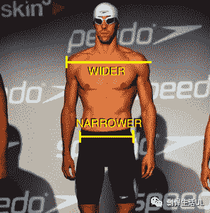
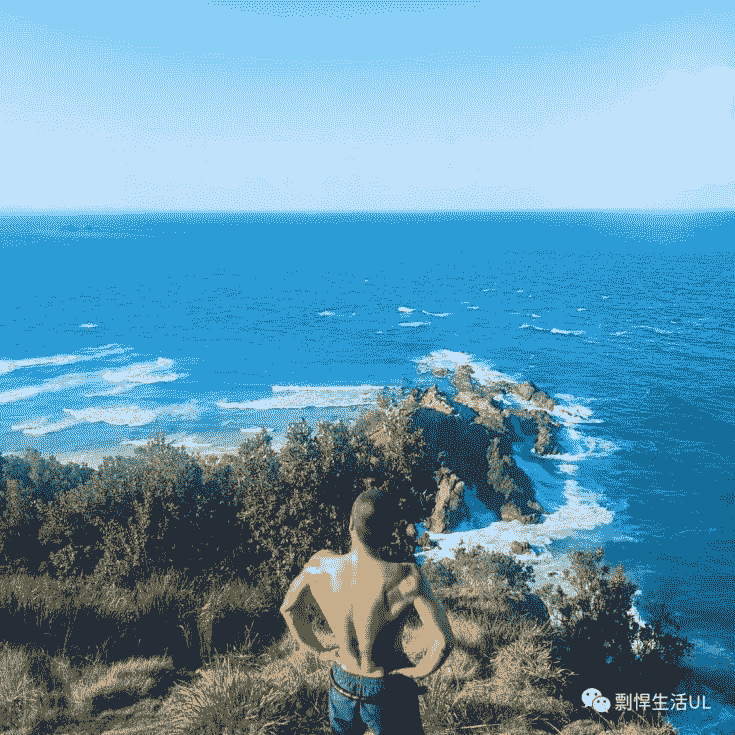
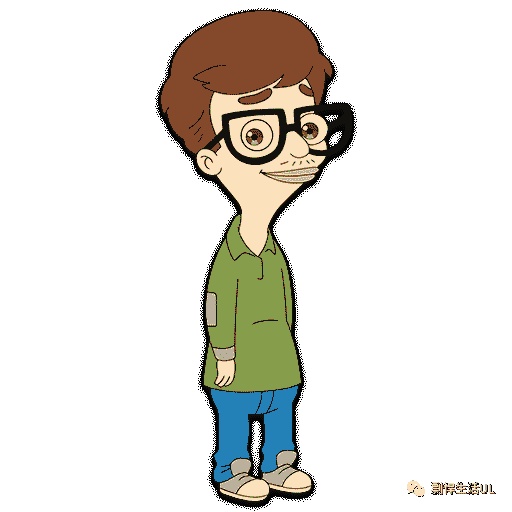
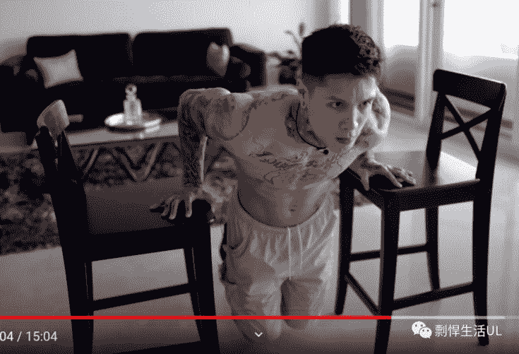
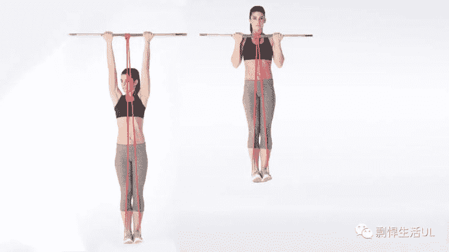

# 比身高更重要的一个吸引美女的外貌特征——V-taper

> 原文：[https://piaohanshenghuo.com/v-taper/](https://piaohanshenghuo.com/v-taper/)

<section>（背景音乐）

<audio src="https://piaohanshenghuo.com/wp-content/uploads/2020/11/Gang-Starr-Put-Up-Or-Shut-Up-HD-256-kbps.mp3" controls="controls" data-mce-fragment="1"></audio>

</section>

我已经受够了很多人抱怨自己无法改变的身高，今天来介绍一下比身高更重要的，而且**完全可以通过自己的努力实现的**外貌特征——V-taper。

V-taper顾名思义是像字母“V”一样的倒三角身材，**这是男人最有吸引力的身材**，你不需要有巨大的肌肉块，最重要的是你的身材是**倒三角**的。**肩宽，腰窄**，黄金比例大概是1.6比1。

游泳运动员的身材就足够了，但是你不非得游泳，有更有效率的运动方法来实现（下文会写）。

我当年在Byron Bay拍的照片：

我们再来看一下反面教材，女人最不喜欢的身材之一 —— 梨型身材（正三角）。

**肩窄，还有肚子，如果再加上胳膊细就更惨了**。这是最没有吸引力的身材之一，一定要避免。

有没有听女人说过她们想要有一个可以依靠的肩膀？**这个可以依靠的肩膀应该是宽的**。

那怎么练出宽肩、窄腰呢？其实只要两个动作就足够了。

第一个动作是 **“dip”（臂屈伸）**，最常见的做法是在双杠上做，但其实你在家找两个凳子就可以做，如下图：

我当年在三轮车之间做的dips，当时做得不够标准，手臂应该弯曲至少90度才标准，不过请注意我把腿抬高了，这样可以显著增加难度。

<video controls="controls" width="600" height="300" data-mce-fragment="1"><source src="https://piaohanshenghuo.com/wp-content/uploads/2020/11/workout-on-the-pedicab.mp4" type="video/mp4"></video>

第二个动作是**”pull up”（引体向上）**，可以在你家附近找个单杠或类似单杠的东西练，可以在家里安装一个单杠（网上就能买到）。

如果你连一个引体向上都做不了，可以考虑买一个阻力带（resistance band）来帮助自己：

其实还有一个一举两得的动作，如下：

<video class="wp-video-shortcode" id="video-2863-1" width="640" height="360" preload="metadata" controls="controls"><source type="video/mp4" src="https://piaohanshenghuo.com/wp-content/uploads/2020/11/20200910_211001_1.mp4?_=1">[https://piaohanshenghuo.com/wp-content/uploads/2020/11/20200910_211001_1.mp4](https://piaohanshenghuo.com/wp-content/uploads/2020/11/20200910_211001_1.mp4)</video>

上方视频中我刚开始做的动作叫“双力臂”（muscle up），相当于引体向上和臂屈伸的结合升级版，你需要至少能做10个有爆发力的引体向上才能考虑练习这个动作。

 关于身体自重训练（calisthenics）方面，推荐几个Youtube频道，比如：ThenX, Bar Starzz, Calisthenicmovement, Austin Dunham, Tao Physique等。

我不想再看到有抱怨身高的人了，**抱怨身高之前，先问问自己有倒三角（V-taper）的身材吗？没有的话就闭嘴，赶紧去练**！

暂时就写这么多，加油！

**连夜码字不易，如果本文对你有帮助，想免费表示支持，不妨多花几秒钟的时间，在公众号文章底部的广告上点一下，我就能有大概一块钱的收入。**

**当然也欢迎你分享本文，更欢迎你打赏，谢谢支持**。

**你的支持可以鼓励我创作出更多有价值的文章供你阅读。**

* * *

剽悍生活UL(微信公众号)分享关于**两性关系**、**自我提升**、**数字游民的生活方式**的原创内容，帮你过上更理想的生活（尤其是性生活）。

剽悍生活的个人微信号：ycf3721，[一对一视频教学](https://piaohanshenghuo.com/1on1_coaching/)，或拉你进入[剽悍生活微信讨论群](https://piaohanshenghuo.com/ul-wechat-group/)，请注明加我的目的。

