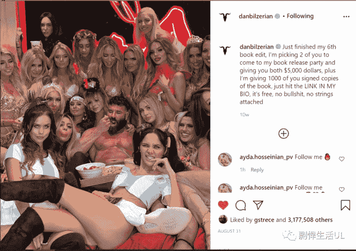

# 回答知乎问题“什么样的男生注定单身”，并提供我的解决方案

> 原文：[https://piaohanshenghuo.com/how-not-to-stay-single-for/](https://piaohanshenghuo.com/how-not-to-stay-single-for/)

自己条件不好（纯屌丝，性市场价值和情商双低），不但不从自己身上找原因、采取行动提升自己，偏偏喜欢怪别人的男生，这样的男生注定、活该单身。

**我打个比方**，这类人好比一个卖香肠的公司，自己的香肠质量差，又不会营销，卖不出去，不努力提高自己的香肠质量、打通更多的销售渠道。偏偏天天浪费时间在抱怨消费者上（消费者爱买什么买什么，是人家的自由）。更有甚者，居然还怪进口香肠，人家的香肠明明比自己的大，还不承认，说那是他们专挑大个儿的香肠拍广告，那你有本事你也挑大的拍广告啊？看看到底谁的大？

所以，如果你不想当这种可悲的男生（想和他们不一样），都能从哪些方面提高自己？

再插一句：**其实一点儿不提高自己也可以找到女朋友**，找女朋友是一个数学问题，**只要你接触了足够多的女生，早晚能碰到喜欢你的人**。不过如果你本身价值很低，成功的几率太低了，而且也不容易把​女朋友留住。​所以建议你提高自己的价值，好处很多。

我们来看看都有哪些地方可以​、值得提高：​

1.外表：

你的外表很重要。你想要开法拉利还是奇瑞QQ？为什么？因为法拉利长得帅！别跟我说跑得快，堵车照样歇菜。别跟我说光看外表太肤浅了，人们通过你的外形、举止、语气已经提前对你做出了判断。

如果你对自己诚实一点，你用脚趾头想就可以明白女人更喜欢上帅哥，喜欢身材好的，和男人喜欢身材好的美女一样。人，尤其是女人，看你一眼就可以对你做出大致的判断。

如果她们看到一个瘦瘦的戴眼镜的貌似营养不良、书呆子似的小伙，穿着很邋遢的衣服外加拖鞋，无精打采，弯腰驼背，不敢直视她们。她们会认为这个小伙很不自信，生活没有条理，胆小怕事，十有八九是个怪人，一看就没女朋友。她们在他身上完全关联不到性，其实他很可能看了无数黄片，打了无数飞机。大部分的情况下，她们的判断都是对的。

她们又看到了一个小伙，这个小伙浑身肌肉，穿着干净整洁、搭配合理的衣服和鞋，昂首挺胸地走路，双眼直视她们，面带自信的微笑。她们会认为这个小伙充满了自信和活力，干净、帅气，很有出息，肯定很轻松就可以找到女朋友。大部分的情况下，她们的判断也都是对的。

如果你还不是特别相信外表的重要性，Youtube有个频道叫”FACEandLMS”(LMS表示Looks（外表）, Money（金钱）, Status（地位）三大“肤浅的”但是特别吸引女人的点)，整个频道都在用各种实际的例子告诉你外表有多么重要。

提到外形，不得不提一下把妹社区里的孔雀理论(peacocking), 就是把自己打扮得额外引人注意，比如穿很夸张的制服，带形状、颜色古怪特别的首饰、帽子，涂唇膏、指甲油，用手纸把自己缠起来等等常人不会做的事情。

Peacocking有两点好处，一是可以给对你感兴趣的姑娘一个理由来主动和你说话，二是如果你对于成为公众焦点可以做到很淡定，你就会显得很酷。你不非得用，用不好还很可能起反作用。另外请把脸露出来，否则姑娘都不知道你到底长啥样，别学这头我在Sydney Sexpo上碰到的没脸的大屌兽。

 

你如果意识到了外表很重要，就赶紧开始着手从各种可控的方面改善你的外表。

具体如何改善外表：

·健康饮食，剽悍生活博客上有相关的内容。

·保证充足的睡眠，至少7小时，不超过9小时。

·科学锻炼身体，剽悍生活博客上有相关的内容。

·弄一个很屌的头型或帽子，找个靠谱的理发店。

·展示出自信的姿体语言，抬头挺胸，自然放松，敢于直视姑娘双眼，微笑。

·保持好个人卫生，每天洗澡，勤刷牙，饭后用牙线，保持指甲短、齐、没有泥。

·下本钱买几件像样的衣服，别图便宜买一堆破烂儿回家。我本人就干过这种事情，在淘宝上乱七八糟买了一堆地摊儿货，结果还是没有能拿出手的衣服。好衣服好鞋几件就够了。

需要注意的是，外表对于男人来说并不是最重要的。女人没有男人那么“肤浅”，女人更在乎男人的“内在”。男人的外表往往是一个“门槛”，你必须得越过了这个“门槛”才能入女人的法眼。当然，你的外表越好的话，“进门”之后的障碍往往也越少。

2\. 金钱和地位：

金钱和地位往往是相辅相成的，把金钱和地位诠释得最好的人之一就是Dan Bilzerin，全世界最有名的“花花公子”。他说“金钱吸引女人，但地位比金钱对美女的吸引力大10倍”。

 

推荐大家看一下他在Joe Rogan Experience和London Real上接受的采访。

他强调了“life set up”（人生设计）的重要性，他说他从来不主动撩美女，都是美女主动在Instagram（他Instagram上有3000多万粉丝）上给他发DM，让美女主动追求你的感觉更好。

BTW, 他还能打破个子矮不招女人喜欢的刻板印象，他只有1米74。

关于身高问题，请参考我写的《[身高对把妹的影响](https://piaohanshenghuo.com/does-height-matter/)》

显然，普通人无法在短时间提升自己的金钱和社会地位。那我们可以做什么呢？

我们可以努力打造一个高价值的“朋友圈”（国外用Instagram），别乱发一下非常low的东西。

不过不建议用很多国内那些骗人把妹机构的“展示面”的那些不符合你真实情况的照片。因为这不但是非常low的骗人行为，而且见面之后就很快就露馅了。你的“展示面”把自己吹上天了，见面的话，你好意思不带女生去高消费场所吗？你好意思不花血本租豪车吗？你好意思不住五星级酒店吗？你好意思把姑娘带回你的“寒舍”吗？

作为一个年轻人，你是可以“理直气壮”地没钱的，但是你必须“人穷志不穷”，必须展现出你很上进、有野心（而且我建议你不光是展现出来，本身你就应该这样）。如果你本身很穷，又让女生感觉出你不上进，那你就废了。

大家需要注意，虽然我强调了金钱的重要性，但金钱绝对不是最重要的（除非是拜金女，这种女人喜欢的只是你的钱，而不是你这个人）。你最起码要有超过平均水平的收入，丰衣足食，这样你就可以进入大部分女生的法眼了。

而且金钱只是对于长期关系非常重要，因为女人天生非常在意自己的后代，要确保后代有就够充足的资源。不过如果你只追求短期关系，比如一夜情、炮友，那金钱就真的不重要了。最重要的是你的外表，你的男人味（言行举止、语气语调、自如应对她的“刁难”等等）（关于阳刚之气，可以读我写的《[剽悍生活UL：把妹基础3-阳刚之气](https://piaohanshenghuo.com/masculinity/)》）。

关于普通人能在地位上的提升，除了可以像上文中说的打造一个高价值的朋友圈之外，还有一个很实用的途径，那就是做你擅长的事情，并通过这件事认识美女。

比如你是一位健身教练，相对于你的女学员来说，你的地位就很高，而且你们还有共同的兴趣爱好。

我在澳大利亚的时候就认识了一个潜水教练，他跟我说当潜水教练泡妞可容易了，她们都听他的。

都是一样的道理，想办法让你的兴趣爱好、擅长的东西帮你泡妞，一举两得。

即使你认为自己现在什么也不擅长，我都能帮你找到一个你“擅长”的，那就是中文。你可以找一个想学中文的洋妞。

任何人都可以通过自己的努力，擅长做某件事。

说完了外在条件（泡妞的基础，基础不打牢了，楼很难盖高），接下来我再简单说一下如何提高你的“内在”。

我们可以简单把“内在”分为你的思想和泡妞技巧。

思想方便需要你通过书本和实践慢慢积累，比如可以在点赞之后再参考我写的《[泡妞的心态之“默认吸引力](https://piaohanshenghuo.com/assume-attraction/)》，《[有助于泡妞的心态之“我就好色，咋地？](https://piaohanshenghuo.com/killer-instinct/)》，《[有助泡妞的心态之“充足的心态](https://piaohanshenghuo.com/abundance-mindset/)》，《[有助泡妞的重要心态之“我在升值，你在贬值](https://piaohanshenghuo.com/my-value-is-increasing-but-your-value-is-decreasing/)》。

泡妞技巧的话，其实像骑自行车一样，你不能光靠书本学习，最重要的是实践，不断摔倒再爬起来才能进步。很多人都是看了一大堆乱七八糟的理论，因为怕丢人而不去实践，结果学得走火入魔，有的原地踏步，有的反而退步了。

你以为理论学多了你就不会丢人了？实际上刚开始你肯定会犯很多错，丢很多人，但who他妈cares? 这是你成长的最佳途径，如果你对丢人的恐惧大于对泡妞的渴望的话，你就继续在家撸管吧。

大家都知道女人喜欢“自信”的男人，而想正真自信地面对美女的唯一途径就是要习惯和美女相处，否则即使你再有钱有势，读了一万本关于泡妞的书，你也照样得紧张，显得没有魅力。

那具体都有哪些接触美女、实践的方式呢？

接触美女基本上有4个途径：day game, night game, online game, social circle.

Day game是指在日常生活中搭讪你所遇见的任何吸引你的姑娘，可以在任何场所：购物中心、音乐节、菜市场、超市、马路上等等。我一般都会比较直接，告诉她们我为什么要和她们说话。或者通过当下的情景打开话题，但我很快会让她知道她有吸引到我。我不喜欢拐弯抹角地问路之类的bullshit。别想着等完美的时机，往往你等一等就没时机了。

不建议到处溜达几小时就为了搭讪美女，这样效率不高，建议你在日常生活中顺便搭讪，这样一举两得。

Night game是指晚上在夜店、酒吧等场所搭讪姑娘。是我最喜欢的也成功率最高的途径，原因有几点：

1.绝大部分姑娘都打扮好了等着遇到合适的人，其中不乏很多当晚就DTF(down to f*ck)的姑娘，也许她在等的不是你，但她在等某个人，你不搭讪她怎么会知道？

2.姑娘体内的酒精帮助你降低难度，又给了姑娘一个和你上床的借口（我喝多了，他乘人之危）。

3.夜场的美女密度高，寻找美女的时间成本低，效率高。

很多人对夜场有偏见，像我们父母那一辈的人告诉我们只有坏孩子才去夜场。不过在欧美基本所有人都去，亚洲也普及得很快。夜场是很正常的社交场所，你可以遇到素质很高的姑娘。刚去夜场时你可能会感到很害怕、很不自在，这是很正常的，关键在于坚持和调整心态，慢慢建立起自信和强大的内心。

去夜场不非得等和朋友一起去，你可能会害怕自己去像傻子一样，但自己去更锻炼人，我就大部分时间都是自己出门打猎，灵活又机动。

另外去夜场不一定要花钱，像我就基本从来不喝酒，省钱、健康、又不会降低记忆力（有助于反思当晚的得失），我顶多在个别夜店花个入场费、给明显有戏的姑娘买杯酒。

大多数人是以玩儿的心态去的，你要偏重学习的心态，花点儿钱就当交学费了也是值得的。

具体可以参考我写的《[在夜店酒吧如何泡妞？](https://piaohanshenghuo.com/night-game/)》

Online game指网上约会，国际流行的主要有Tinder和Bumble，如果你在国外的大城市，还可以尝试POF, OK CUPID, Hapend, Hinge, Seeking Arrangement，国内是陌陌和探探（Tinder中国剽窃版），另外在国内的比较国际化的大城市也可以尝试使用上述国外约会软件，说不定你所在的城市有一定的用户基础。

不推荐花过多时间在网上约会上，除非你的照片特别出众。即使那样，你也在和成百上千的人争抢一个姑娘的注意力。如果你看过一个漂亮姑娘的手机约会软件，你就知道了。你发一个消息，最有可能的发生的就是石沉大海，第二有可能发生的是要等很久很久才得到回复。我建议不要花几个小时用在和一个姑娘发文字信息上，真的不划算。建议在收到回复的瞬间立刻给姑娘打电话，争取把她约出来。

相关文章，《[剽悍故事No.11：真实故事证明网上约会远不如线下搭讪（含网上聊天记录）](https://piaohanshenghuo.com/ul-story-11/)》

Social circle指社交圈子，朋友的朋友，通过和朋友的聚会认识。我个人不用这种方法，因为我不喜欢花很多时间在乱七八糟的聚会上。而且如果在一个姑娘身上搞砸了的话，会造成不必要的尴尬，会波及到整个朋友圈子。

不过这是一个最常见的、普遍的男女朋友认识的方式。通过朋友的朋友，姑娘无形之中对你多了一层信任，还可以让朋友帮忙说好话。

而且我建议多参加一些设计活动，至少可以提高你的社交能力和情商。

在实践的基础上再学习必要的理论才是正确的学习方式，理论实在太多。网上的资料五花八门，鱼龙混杂，大部分都是经不起实践考验的。

David X说过一句话”Opinions are like assholes, everybody got one.”（观点就像屁眼儿一样，每个人都有。）把妹建议有很多，就像饮食计划一样，如果你谁都听，都试的话，效果肯定不好。先抓住一个你认为合理的、喜欢的（比如我的），真正地去实践。记住，一定要去实践，我就很后悔当初学了一堆乱七八糟的理论而没有实践，结果实际的泡妞水平基本一点儿都没有提高，直到我开始行动。泡妞不是开卷考试，需要你实时的机智应答，只有不断实践、反省、纠正错误才能不断进步。

大概就是这样，加油！

敬请期待下一篇文章，**熬夜码字不易，别忘了通过点赞、分享、打赏等方法鼓励我更快地发表下一篇文章**。

**另外，还可以点击公众号文章底部的广告来支持我（每个成功的点击量可以帮我赚几毛钱）**。

**谢谢！**

* * *

剽悍生活UL(微信公众号)分享关于**两性关系**、**自我提升**、**数字游民的生活方式**的原创内容，帮你过上更理想的生活（尤其是性生活）。

剽悍生活的个人微信号：ycf3721，[一对一视频教学](https://piaohanshenghuo.com/1on1_coaching/)，或拉你进入[剽悍生活微信讨论群](https://piaohanshenghuo.com/ul-group-chat/)，请注明加我的目的。

