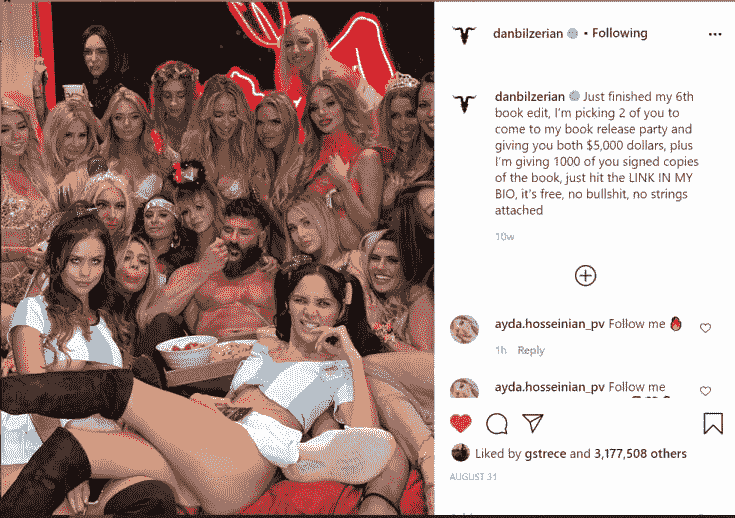
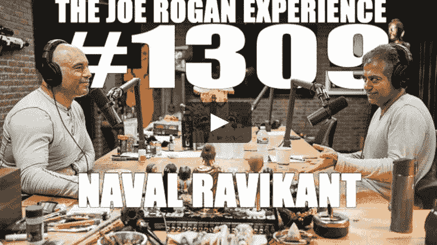

# 推荐我很喜欢的9个播客(podcast)（自我提升的最佳途径之一）

> 原文：[https://piaohanshenghuo.com/podcast-recommendations/](https://piaohanshenghuo.com/podcast-recommendations/)

Podcast（播客）是我最喜欢的获取信息、知识、智慧的渠道，因为非常方便，可以边听边做其他事情，比如可以做饭、健身、骑车、跑步、坐车等等，或者睡前听，听困了再睡。

如果你英文水平够高的话（[这有我写的免费、高效学习英语的方法](https://piaohanshenghuo.com/how_to_learn_english/)），这篇文章将会是我写的对你帮助最大的一篇文章，没有之一，因为这上边有价值的内容太多了！**可以免费和很多世界上最牛的人学习，实在太划算了！**

**如果你真的按我推荐的东西去认真学习了，这篇文章收你一万块钱都不过分，但是我完全免费地分享给大家。**

接下来我就来具体介绍一下我很喜欢的一些podcasts.

1.JRE(The Joe Rogan Experience)，视频播客地址（[想上但不会上Youtube的同学可以读这篇教程](https://fanguoweiqiang.com/fq/)）：

https://www.youtube.com/user/PowerfulJRE

（自我提升的最佳途径之一）")

JRE是世界上最火的podcast之一，也是我最喜欢的podcast之一，已经有超过10年的历史了，非常高产，目前已经有1500多集了。在Youtube上超过1000万的关注者，现在每集都有几百万、甚至几千万的浏览量。Spotify花了一亿美元签约JoeRogan，可见此podcast非常屌！

不但此podcast非常屌，播主Joe Rogan本人也非常屌，一生成就无数：BJJ（巴西柔术）黑带、截拳道高手、UFC解说、真人秀”Fear Factor”主持人，单口相声演员、全世界最火的podcast主持人等等。其中任何一项成就都够别人活一辈子的了。

他是大麻、sensory deprivation tank, MMA的拥护者，因为他巨大的影响力，上述行业都被他带动起来了。

Joe Rogan甚至差点主持了2020年美国总统大选的辩论！Trump已经同意了，但是Biden脑残，没法参加。

JRE上最多的嘉宾是MMA（综合格斗）界和单口相声界（stand up comedy）的，很多这两个界的最牛的人都当过嘉宾。

比如在MMA界特别牛的有Jon Jones（可能是MMA界历史上最强的人）, George St. Pierre（MMA界的世界冠军）, Demetrious Johnson（MMA界的世界冠军），Eddie Bravo（BJJ大师，有自己的BJJ道馆，亲手给了JoeRogan黑带）, Dana White（UFC的老板）。

单口相声界特别牛的有：Russell Peters（我感觉他是在中国最有名的英文单口相声演员），Bill Burr, Joey Diaz, Ari Shaffir, Bobby Lee(韩裔美国人), Jim Norton, Russell Brand, Theo Von, Tom Segura, Bert Kreischer, Bryan Callen.

当然，其他各界的牛人也非常多。很多在中国都耳熟能详的人物都做过客，比如：Elon Musk（特斯拉的老板，在JRE节目上还抽过大麻，做客过2次），Kanye West（著名rapper，是非常有名的Kim Kardashian（金·卡戴珊（在Pornhub上也能找到她））的老公），Lance Armstrong（连续7次环法自行车大赛冠军）。

我非常喜欢的在JRE上嘉宾有：

Joey Diaz：a.k.a. Mad Flavor，和Joe Rogan是非常好的朋友，多次出现在JRE上，同样是讲相声的，我非常喜欢他说话的风格，他有无数个真实又有趣的故事，比如给一个妓女的假发点着了的故事。他也有自己的Podcast，下文会具体介绍。

（自我提升的最佳途径之一）")

Christopher Ryan：畅销书”Sex at Dawn”的作者，对人类的sexuality有非常好的理解，周游世界，充满阅历和智慧。我曾经也推荐过他的Ted Talk（在Youtube里边搜他的名字加上”ted talk”就能找到）。

他也有自己的Podcast，下文会具体介绍。

（自我提升的最佳途径之一）")

David Choe：韩裔美国人，画家，涂鸦大师，多次免费搭便车（hitch hike）游遍美国，去过美国的每一个洲，有各种疯狂、有趣的人生经历。

（自我提升的最佳途径之一）")

曾经在中国北京开过画展，从北京一路免费搭车到澳门，还记录了下来，给VICE拍成了纪录片“Thumbs Up”。这有Youtube上的观看地址：

https://www.youtube.com/watch?v=HQ7GRWWgOGM

还有他分别横穿、纵跨美国的纪录片，都是”Thumbs Up”系列的。

David Choe因为给Facebook早期的办公室的墙壁涂鸦，再接受报酬的时候没选择现金，而是选择了股份，现在他手里的Facebook的股票值几亿美元。

David Choe非常风骚，我毫不怀疑，即使他没钱，也不缺女人，一看就很擅长泡妞。

**Dan Bilzerian**：全球最有名的花花公子，Instagram上有3200多万粉丝！身边美女无数，他表明：金钱可以吸引美女，但是名气和地位比金钱对美女的吸引力强10倍。

（自我提升的最佳途径之一）")

 

**Anthony Bourdain**：世界名厨，有很多人梦寐以求的工作——“周游世界、尝遍美食并顺便靠此赚钱”，有两款周游世界的美食节目，分别是”Parts Unknown”和”No Reservation”（还有在中国的美食经历），可惜他已经在法国自杀了。

（自我提升的最佳途径之一）")

**Jocko Willink**：美国海豹部队（Navy SEALs）退役海军少校，BJJ黑带，很猛，充满阳刚之气，有自己的podcast，下文会具体介绍。

（自我提升的最佳途径之一）")

上图左边是Jocko Willink, 右边是Divid Goggins.

**David Goggins**：同样是美国海豹部队的退役成员，非常励志，耐力惊人，经常参加变态长的长跑（历时几天的几百英里的长跑）。

**Henry Rollins**：穷小子出身，变身著名歌手。人始终都非常朴实、实惠，我很喜欢。

（自我提升的最佳途径之一）")

**C.T. Fletcher**：健身界的名人，3次世界卧推冠军，换了个女人的心脏（有家族遗传的心脏病）。

（自我提升的最佳途径之一）")

**Alex Jones**：Conspiracy Theory（阴谋论）界的名人，他的Twitter, Facebook, Instagram, Youtube等账号都被封了，在JRE上有很多惊人的言论。

（自我提升的最佳途径之一）")

**Andreas Antonopoulos**：比特币专家，曾经每天除了吃饭就是研究比特币好几个月，我本人就非常支持并相信比特币，推荐你也听一听。

（自我提升的最佳途径之一）")

**Naval Ravikant：**印度裔美国人，著名企业家、天使投资者，是一个充满了智慧的人。对赚钱、创业非常有见解。教大家怎么不靠“运气”变得富有。

最后再推荐一个Bryan Callen在JRE上讲述的他的真实的疯狂的性经历（orgy）的故事，Youtube搜“Bryan Callen Attends an Orgy”

2.Tangentially Speaking：做客过刚介绍过的JRE的Christopher Ryan的podcast，远没有JRE有名，不过我很喜欢，地址：

https://chrisryanphd.com/category/tangentially-speaking/

（自我提升的最佳途径之一）")

Christopher Ryan：畅销书”Sex at Dawn”的作者，对人类的sexuality有非常好的理解，周游世界，充满阅历和智慧。我曾经也推荐过他的Ted Talk（在Youtube里边搜他加上”ted talk”就能找到）。

他的podcast的嘉宾没法也没有JRE那么屌，不过也有很多有趣的，很多都是和“性”、“旅行“有关的。

有趣的是，第一集既然是他和Neil Strauss的对话，Neil Strauss是著名畅销书”The Game“（把妹达人）的作者，曾经和Mystery（迷男）学习把妹，又把这件事写成了一本书，没读过的同学很建议去读一下。

（自我提升的最佳途径之一）")

我最喜欢的是他的ROMA(Ranting out of my ass)和TOMA(Talking out of my ass)系列，里边有他丰富的人生故事和见解。

3.Church of What’s happening now：做客过刚介绍过的JRE的Joey Diaz的podcast

（自我提升的最佳途径之一）")

Joey Diaz：a.k.a. Mad Flavor，和Joe Rogan是非常好的朋友，多次出现在JRE上，是个讲相声的。我非常喜欢他说话的风格，纯爷们儿，他有无数个真实又有趣的故事，比如：给一个妓女的假发点着了的故事；他在校车上放屁，把女同学给熏哭了的故事；一个美女和他说如果他能猜对她内裤的颜色就让他上她的故事等等……

他本身的人生经历也很励志，单亲妈妈带大的，还没成年妈妈就去世了，他常年吸毒，偷东西，进监狱，但最后终于在喜剧界站稳了脚。

Joey Diaz作为相声界的一员，做客的嘉宾也大多都是相声界的人，其中我最喜欢的嘉宾是Kate Quigley，不但因为她是个美女，更是因为她非常实在，分享了非常多的她真实的性经历，从女性的角度提供了很多实用信息。

（自我提升的最佳途径之一）")

4.London Real：播客地址（Youtube上也有，但是不全）：

https://londonreal.tv/

播主是BrianRose，节目上有很多重量级的人物。

（自我提升的最佳途径之一）")

推荐看上文推荐过了的全世界最有名的“花花公子”Dan Bilzerian的访谈。

（自我提升的最佳途径之一）")

推荐看华裔泰国人MantakChia(气功大师)谈论如何实现男性的多重高潮(multiple orgams)

推荐看上文推荐过了Andreas Antonopoulos（比特币专家）的访谈。

**5.Jocko Podcast**，视频播客地址：

https://www.youtube.com/channel/UCkqcY4CAuBFNFho6JgygCnA

（自我提升的最佳途径之一）")

播主JockoWillink：美国海豹部队（Navy SEALs）退役海军少校，BJJ黑带，很猛，充满阳刚之气，曾经去伊拉克带队打仗。

非常励志，建议你看一下这个2分钟的短片感受一下：

https://www.youtube.com/watch?v=IdTMDpizis8

他每天雷打不动地早上4点半起床，发个手表的Instagram图片。

（自我提升的最佳途径之一）")

他的名言：Discipline equals freedom（自律等于自由）。

他的podcast有很多关于战争、军队、锻炼（自我提升）类的内容。

6.The Black Phillip Show，在Youtube上的地址：

https://www.youtube.com/watch?v=LPq7CyHqQ2I&list=PLh8oUx_ONafXHhcA45m43A7eNGf9vIrpX

（自我提升的最佳途径之一）")

播主是Pareice O’Neal，是我最喜欢的单口相声演员，超搞笑，可惜已经因为糖尿病去世了，太可惜了。他对泡妞有非常独特、给力的见解。

比如他在一个相声中提到：女人对自己的pussy的感觉相当于男人对自己的时间的感觉，如果男人以强迫的手段进入女人的pussy，那是强奸。如果一个男人在和一个女人打电话，男的要挂了，女的偏要继续聊天的话，女人就是在强奸男人的时间。

他还说过男人偷腥(cheat)是悄悄地在女人背后为自己寻找一些快乐，这样我们的女人才不会受伤，我们是为了我们的女人的快乐而偷腥，否则我们才懒得费尽周折，偷偷摸摸地找女人呢，我们更愿意直接把另一个女人带到家里，当着自己女人的面……

推荐这个播放列表，他谈论关于女人的话题(Patrice O’Neal talks women on O&A)：

https://www.youtube.com/playlist?list=PLh8oUx_ONafUCgyKmVMYJAL3JiqX41Zxr

这是一个他的相声的视频列表：

https://www.youtube.com/playlist?list=PLh8oUx_ONafUTRamHFbeOXmfGTj4U22hc

**7.The Tim Ferriss Show**，地址：

https://tim.blog/podcast/

（自我提升的最佳途径之一）")

播主是Tim Ferriss，著名的畅销书”4 hour work week”（ 我敢向你保证，他绝对不是每周只工作4个小时，40小时都不止）的作者，我并不是很喜欢他的podcast的风格，不过由于关注他的人很多，所以有很多牛人都有做客他的podcast，比如：

Jamie Foxx, Arnold Schwarzenegger（施瓦辛格），Tony Robbins.

另外，我很喜欢Mr. Money Mustache，很喜欢他的理财观念。

**8.Rollo Tomasi**, 播主Rollow Tomasi的同名播客，Youtube上的视频播客地址：

https://www.youtube.com/c/RolloTomassi/videos

（自我提升的最佳途径之一）")

Rollo Tomasi是Hypergamy（女人想上嫁，男人向下娶）理论的始祖，男性RedPill, Manosphere社区的重要人物，畅销书“The Rational Male”的作者。

建议你看一下这个Youtube上的短视频”Hypergamy doesn’t care”，基本上在说明“女人不在意你对她的付出，而在意你的价值”，视频地址：

https://www.youtube.com/watch?v=mC149YY2G-I&feature=emb_title

他的podcast中有很多男性社区的牛人和知识，比如他还采访了一个男性的色.情电影明星Stirling Cooper讲国外合法的色.情电影业是什么样的。

9.(last but not least) ABOUD，Youtube地址：

https://www.youtube.com/c/ABOUD1/videos

（自我提升的最佳途径之一）")

Aboud并不是一个真正意义上的”podcast”，只是一个人面对镜头分享他的故事，而且他完全不靠此而盈利，只是为了帮助更多的人，他的一些言论“充满了争议”，自然也不受Youtube的算法的推荐，所以只有一万多个粉丝，不过他的内容非常有价值。

Aboud是个ex-con，曾经被判坐牢140多年，多个奇迹让他可以重回自由。他是个充满了阳刚之气、诚实、正直、强壮的纯爷们儿，纯纯的alpha male。他分享了很多真实、疯狂的监狱内外的故事，是我最喜欢的Youtube频道之一。

他是个虔诚的基督徒，有个幸福的家庭，还有至少一个额外的女朋友（和他老婆都认识）。虽然“没读过什么书”，但他却比绝大部分人都清醒、聪明，很多观点都很犀利、独到。

强烈推荐他的内容，部分他分享的疯狂故事包括：

他的犯罪经历；监狱里的各种打架、谋杀、越狱的故事；他是怎么在监狱里锻炼身体的；他是怎么在监狱里制作武器的；他是怎么利用监狱的厕所和上下楼监狱里的人传递物品的；他是怎么手工制酒并把全监狱的人都灌醉了的；他是怎么在监狱里给一个人纹纹身的；他是怎么救了好几个人的命的；他是怎么做自己的律师、赢了好几个官司的；他是怎么救了一个差点儿就被一个醉汉强奸了的少女的……

太多了，我就不具体写了，总之非常精彩，强烈推荐。

（自我提升的最佳途径之一）")

P.S.：[想上但不会上Youtube的同学可以读这篇教程](https://fanguoweiqiang.com/fq/)。

**连夜码字不易，如果本文对你有帮助，想免费表示支持，不妨多花几秒钟的时间，在公众号文章底部的广告上点一下，我就能有大概一块钱的收入。**

**当然也欢迎你分享本文，更欢迎你打赏，谢谢支持**。

**你的支持可以鼓励我创作出更多有价值的文章供你阅读。**

* * *

剽悍生活UL(微信公众号)分享关于**两性关系**、**自我提升**、**数字游民的生活方式**的原创内容，帮你过上更理想的生活（尤其是性生活）。

剽悍生活的个人微信号：ycf3721，[一对一视频教学](https://piaohanshenghuo.com/1on1_coaching/)，或拉你进入[剽悍生活泡妞讨论群](https://piaohanshenghuo.com/ul-group-chat/)，请注明加我的目的。

