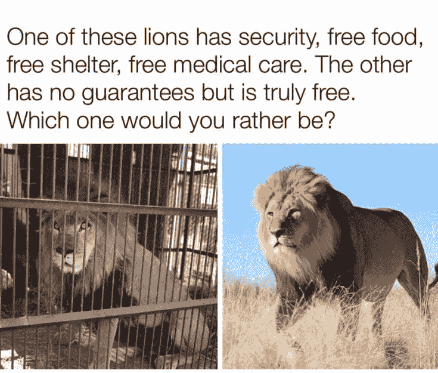

# 为什么应该（在网上）为自己工作（过“剽悍生活”的关键）（数字游民）

> 原文：[https://piaohanshenghuo.com/why-you-should-work-for-yourselfonline/](https://piaohanshenghuo.com/why-you-should-work-for-yourselfonline/)

本文虽然貌似和很多剽悍生活读者关心的“泡妞”无关，但这篇文章对于过上“剽悍生活”至关重要，所以还请想过“剽悍生活”的同学认真阅读。

​建议边听下方的背景音乐边读：​

<audio class="wp-audio-shortcode" id="audio-2647-1" preload="none" style="width: 100%;" controls="controls"><source type="audio/mpeg" src="https://piaohanshenghuo.com/wp-content/uploads/2020/10/Work-GangStarr.mp3?_=1">[https://piaohanshenghuo.com/wp-content/uploads/2020/10/Work-GangStarr.mp3](https://piaohanshenghuo.com/wp-content/uploads/2020/10/Work-GangStarr.mp3)</audio>

我们先来看一下为什么要为自己工作：

*   **为别人工作赚得少**：

为其他人工作，其他人会把自己的利益放在第一位（而不是你的利益），老板会尽量减少开支，以最低的成本留住人力资源。

我可以打一个非常鲜明的比方，比如你是一家保安公司的保安，每天被安排工作在一家夜店，每天赚300块钱。你的老板可以在你工作的时候在夜店里随便泡妞，并收夜店500块钱的保安费，他给你300块钱，自己边泡妞边被动赚200块钱。你只能在那里傻站着。

绝大部分工作都可以自己单干，为自己工作，你可以获得100%的利润，雇别人为你工作，你可以躺赚。

**为自己工作，才能真的变得富有。为别人工作，只能让别人变得富有**（除非你是一个创业公司的早期成员，分到了不少股份）。

*   **节约时间（时间是我们最宝贵的有限资源）：**

**不需要每天把时间浪费在拥挤的交通上**，很多人每天都会浪费至少2个小时宝贵的时间在上下班的交通上。

**不需要浪费时间在无用的会议上**，如果你上过班，回忆一下你浪费了多少时间在你毫不关心的会议上？也许你还得正襟危坐，假装you give a shit. 我在世界500强的美国公司工作过，还是要浪费很多时间在无用的会议上，如果你在国企的话，肯定更惨。

**不需要参加弱智的“年会”，不需要浪费排练弱智节目给领导们看**。

**不用即使已经完成了工作，也要等下班的时间到了才能下班**。

*   **自由灵活、可以完全掌握自己的时间**：

与其被闹钟叫醒，睡眠不足，头昏脑涨地度过一天，**你可以睡到自然醒**。

可以灵活地和美女约会，可以在晚上和美女尽情缠绵，不用担心第二天必须早起。

**可以随时随地为自己放假。而不是一年只有那屈指可数的几天假期，还要忍受其他同时都在放假的人群**。

*   **你会更成熟、更自律**：虽然可以睡到自然醒，但你的收入和成功完全取决于你自己的努力，不能像为别人工作时一样装模作样、勉强合格就行。你自然会变得更自律、更努力。

*   **更安全**：和很多人的想法正好相反，为自己工作反而是更安全的做法。为别人工作，你随时有可能被辞退，你被培训的技能很可能只适合这一个或几个公司，你的选择范围很窄，你的价值很有限。而为自己工作，你所积累的技能很全面、多样化，还很可能发展出多种收入。你会被迫培养出各种符合市场真正需求的实用技能，提供真正的价值，这样你始终都可以赚钱。

*   **为别人工作，你的工作成果很难积累**：比如我一年前写的一篇文章，今天照样在为我工作，一直都会给我带来更多的关注者，更多的关注者也就意味着有更多的钱赚。而你在一年前给老板写的一个报告早就石沉大海了，以后再也用不上了。

*   **有无限可能**：为别人工作，很容易遇到天花板，为自己工作，有无限可能，sky is the limit。

*   **不需要看老板的脸色**：活得更有尊严，事情都是自己做决定。

*   **不需要担心办公室政治**：不需要勾心斗角，不需要每天和你不喜欢的人相处。

*   **不需要穿难受又难看的制服**：我每天在家工作，不需要穿得人模狗样儿，怎么舒服怎么穿就好，热的话就啥也不穿（我曾因此被蚊子叮了JJ）。

*   可以随时做非工作的事情，还完全不用感到愧疚：而在为别人工作的时候你做任何非工作相关的事情都要提心吊胆，随时注意老板和同事的动向。

*   更有成就感：为自己工作，工作的成果完全是自己的，非常有成就感。做自己的老板，自我介绍时也有面子。

在网上为自己工作不但有上述所有的为自己工作的好处，还多出了一点最大的好处：

*   **可以几乎在任何地点工作**。

就光凭这一点，就值得我决定在网上为自己工作，因为这实在是太重要了，给了我极大的自由。

这意味着你可以在沙滩上工作、在任何环境优美的咖啡店工作、在任何美景前工作（只要有网络就行），**而不是每天都得去你早就去腻了的办公室**。

这给了我低成本周游世界很大的可能性，比如我在泰国的生活成本远低于在上海的生活成本，但是生活质量却高了很多。

在你郁闷地堵在上班的路上的同时，我可能已经游历了一个景点。

因为可以在几乎任何地点工作，**你也有了更多和自己爱的人相处的时间（家人、恋人、朋友）**。

*   而且，**网上的流量和一个传统的实体生意的流量相比多了无数的可能**：

比如你开一家餐厅，你的餐厅的坐位是有限的，门口经过的路人是有限的，即使你多了订餐的选项，你的产出也有限，你的食材不但有成本还有会过期的问题。

而在网上，**如果你卖一个可以无成本复制的电子产品的话，你的利润是无限的**（这也是为什么比尔盖茨那么有钱的原因，因为他的微软操作系统每卖出一套都是纯利润），而且在你睡觉的时候都可以正常卖出你的产品。

*   好处实在太多了，再比如：**你可以做真正的自己！**自己在家工作时可以随便听自己喜欢的音乐，可以随时随便放屁，不用憋着，甚至还可以随时撸管（[虽然我不建议撸管](https://piaohanshenghuo.com/why_nofap/)）。

把以上所有的优点加在一起的价值实在太大了，比如你每年付给我10万块钱，只要求我必须每天早上7点起床，我都不愿意，我希望有我自己自由的时间安排。比如你每年付给我10万块钱，让我每天在拥挤的交通里浪费时间，我也不愿意。

所以**选择在网上为自己工作本身就非常有价值，即使你还暂时没有赚到钱，其实你已经赚到了，因为你不需要做那些你不想做的事情**。**做不想做的事情是不快乐的源泉，而人活着都想快乐**。

别跟我说不可能每个人都为自己工作，当然不是每个人都能了，也不是每个人都读“剽悍生活”，也不是每个人都愿意扫厕所。**你可以选择你的未来，只要你付出真正的努力**。这个世界有无数种为自己工作的生财之道，你需要不断探索，迟早都能发现适合你的。

我敢向你保证：**只要你真的把心思放在这上边，智商正常的话，你肯定是饿不死的，而且还很有可能赚得比为别人工作多的多**。

一定要有一个[充足的心态(abundance mindset)](https://piaohanshenghuo.com/abundance-mindset/)。

我在两年多前刚开始我的在网上为自己工作之旅的时候也毫无头绪，但是我坚信：**我不是弱智，如果别人能做到，我也一定可以**。

果然，我实现了我的一个又一个目标，真的过上了越来越理想的剽悍生活。

那要如何开始在网上为自己工作？

如何你已经攒了足够的钱的话（在没有收入的情况下够你花个两三年的，在泰国清迈这种低成本的地方，一年5万元就能活得很好），你可以直接辞职，开始全身心投入到在网上为自己工作这件事来。

如果还没攒够钱，就先边工作攒钱边做调查（完全可以考虑像我一样去澳大利亚打工度假，赚钱又多又涨见识），慢慢开启自己在网上创业之旅。**只把钱花在必要的地方：住宿和食物以及对自己的教育**。

**赚钱的道理很简单，那就是：解决问题，你能解决的问题越多、越大就越赚钱，在不在网上都一样**。**而这个世界上有无数个问题需要被解决。**

如果你有某项特殊技能，你可以出售这项技能，也可以出售利用这项技能创造出的产品。即使你没有某项特殊技能，也可以通过出售其他人的产品来赚钱。总之，只要你勤劳、肯动脑、肯吃苦，肯定饿不死。

**一定要多多利用互联网做调查，多用谷歌。**

千万别买那些什么保证“多少天赚多少钱”的骗人的网络课程，如果真的赚钱的话，人家为什么愿意要更多竞争对手呢？

**在网上赚钱你很可能需要有一个自己的网站**，国内的网络环境有多和谐大家也不是不知道，有一个自己的网站，才能保证自己的内容不被删除。大家有目共睹，我的内容在国内各大平台都被各种恶意举报、删除、阉割，而我自己的博客始终都有我写的原版的内容。

拥有一个自己的网站其实很简单，并不需要复杂的编程知识，利用免费的Wordpress，你可以轻松地搭建一个属于自己的博客，就像当年的QQ空间一样简单。

唯一需要花钱的地方就是域名和服务器，而且并不贵。

域名的话我推荐Namecheap，靠谱又便宜，这是我的推荐链接（你不用我的链接也要花一样的钱，用我的链接还能支持到我，自己看着办吧）：namecheap.pxf.io/kAMqv

服务器的话我推荐[Bluehost](https://www.bluehost.com/track/hyson/)，我刚开始就用的Bluehost，Bluehost是个靠谱的国际大品牌，简单实用，还有24小时都在线的客服。这是我的推荐链接（你不用我的链接也要花一样的钱，用我的链接还能支持到我）：https://www.bluehost.com/track/hyson/

我正好给你举了一个很好的在网上赚钱的例子，我免费为你提供了价值，又向你推荐了我用过的靠谱的东西，解决了你的问题，我也会得到佣金。皆大欢喜。

即使你不会英语，国内也有很多类似的东西，比如已经存在了多年的淘宝客。**赚钱的机会真的无处不在，关键是你得擦亮自己的眼睛、花时间和精力去研究、并付出真正的行动**。

**​上图中一只狮子有安全、安稳的环境、免费的食物​、免费的住宿、免费的医疗，另一只狮子“什么保障都没有“，但是完全自由，你愿意做哪一只？**

暂时就写这么多，加油！

**连夜码字不易，如果本文对你有帮助，想免费表示支持，不妨多花几秒钟的时间，在公众号文章底部的广告上点一下，我就能有大概一块钱的收入。**

**当然也欢迎你分享本文，更欢迎你打赏，谢谢支持**。

**你的支持可以鼓励我创作出更多有价值的文章供你阅读。**

* * *

剽悍生活UL(微信公众号)分享关于**两性关系**、**自我提升**、**数字游民的生活方式**的原创内容，帮你过上更理想的生活（尤其是性生活）。

剽悍生活的个人微信号：ycf3721，[一对一视频教学](https://piaohanshenghuo.com/1on1_coaching/)，或拉你进入[剽悍生活泡妞讨论群](https://piaohanshenghuo.com/ul-group-chat/)，请注明加我的目的。

