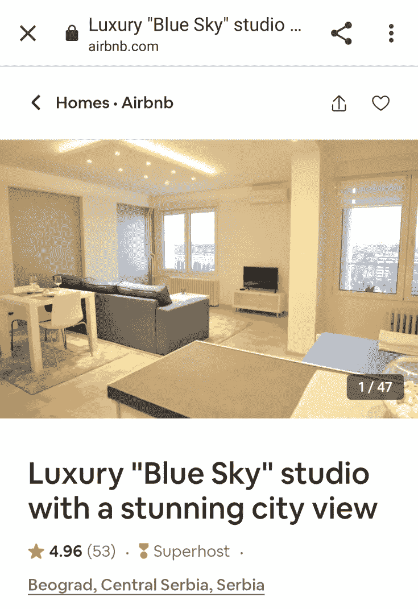
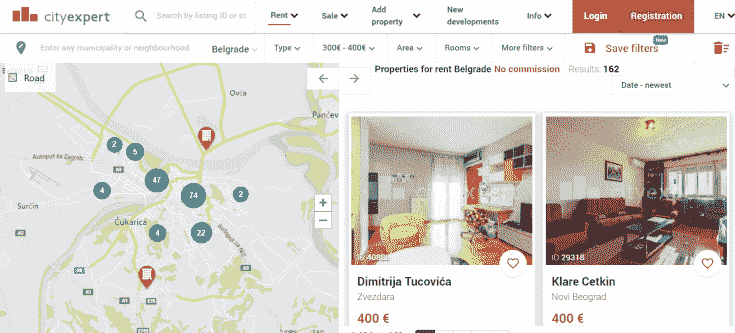
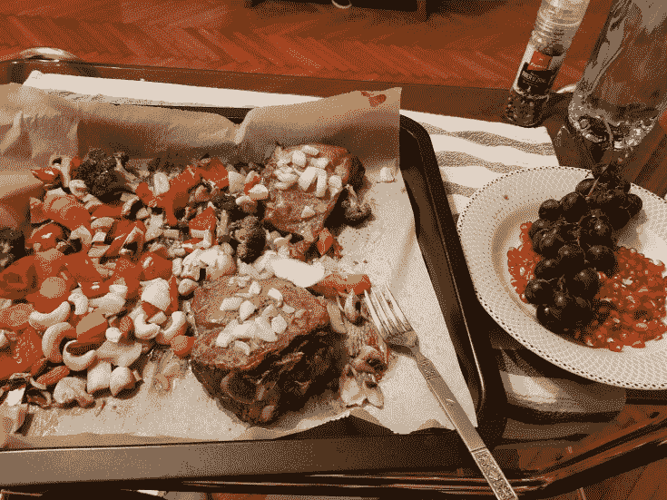

# 塞尔维亚租房攻略

> 原文：[https://piaohanshenghuo.com/how-to-rent-an-apartment-in-serbia/](https://piaohanshenghuo.com/how-to-rent-an-apartment-in-serbia/)

首先，有一个坏消息，那就是塞尔维亚短期租房并不方便。一般租房网站上的房子都是3个月起租的。

想找一个月之类的短期租房信息，建议使用Airbnb（爱彼迎），[这有一个优惠注册链接](https://piaohanshenghuo.com/recommends/airbnb/)，第一次注册的用户可以享受40美金的优惠。

Airbnb肯定会比下方推荐的租房网站要稍微贵一点儿，不过优点是灵活、方便，而且水电费等各种杂费都包含在内了。

下图为一个我的美国朋友订了一个月的一个豪华装修的单间，一个月大概750美元，仅供参考。

Facebook groups里偶尔也可能会有租房信息，不过信息并不多。

现在正式来讲最常用的用来租房的网站，一共有两个，一个是City Expert，另一个是Halooglasi。

先介绍一下City Expert（[网址点这](https://cityexpert.rs/)）。

优点有：

有全英文的界面，界面很好看，用起来也方便，有各种过滤选项（比如选择指定的价格区间、房间数、楼层数，暖气类型等等）。

缺点有：

没法直接联系房主，City Expert作为一个中介，在网站上并没有房主的联系方式，而是需要申请在指定的时间段看房，房主同意了之后，你才会收到一封电子邮件，上边有房主的联系方式。

一般租期至少6个月，也有少数3个月的。

虽然City Expert不收租客中介费，但是收房主中介费，羊毛出在羊身上，你懂的。

用法：

选择你喜欢的区域（可以直接在地图上选择），输入你能接受的价格范围，想要的楼层、暖气、房间数等等即可。

再介绍一下Halooglasi（[网址点这](https://www.halooglasi.com/nekretnine/izdavanje-stanova/beograd-stari-grad?cena_d_to=500&cena_d_unit=4&oglasivac_nekretnine_id_l=387237)）。

优点有：

**可以直接联系房主**（这样不但方便还可以避免中介费）。

上边房源更多，更有可能找到租期更短的房源。

缺点有：

界面难看，不支持英文（不过可以**用比如Chrome浏览器的翻译整个网站的功能**），有些房主不说英语。

总的来说，**我觉得****Halooglasi****更适合租房**，虽然我最后是在City Expert上找到的房子。

**关于“****heating****”（暖气）**：

塞尔维亚作为一个“寒冷的”欧洲国家，在冬天是非常有必要有暖气的。**个人建议选择有****”electric heating”****（电暖气）的房子**。

我目前住的地方是”central heating”（中央暖气），其实就是通热水的暖气片，缺点很多。每年10月15日才开通，今天是10月23日，暖气一直都不热，只有人体的温度，而最冷的一天已经低于10摄氏度了。我向房主抱怨，房主说刚开始不热属于正常……

Central heating每天只有早上7点到晚上10点开通，完全不合理，应该是晚上更冷，更需要暖气才对。

而且”central heating”即使是在像夏天一样很热的季节也要交钱，而且还挺贵的。我住的地方一个月就要大概7000 dinar（合人民币大概500元）。

总之，我目前对central heating非常不满意。推荐你用电暖气，这样非常灵活，需要的时候才用，只需要额外花电费。

关于租金：

通常需要一个月房租的押金。

一般一个像样的单间（studio）要300到400欧元一个月，（200到300欧一个月也能租到，只不过装修不够好罢了）。我租的一个很大的比较“豪华”的有卧室、客厅、厨房的房子要400欧元一个月，加上各种费用，一个月合500欧元左右。

有点儿小贵，其实我自己一个人完全不需要这么好的住处，但考虑到方便约姑娘来我家（我还幸运地住在警察局旁边，给姑娘更多的安全感），这个投资是值得的。

下图为我租的房子的图片，仅供参考。

推荐的居住区域有：

Stari Grad, Dorcol, Vracar, Savamala. 个人最喜欢的地方是Tasmajdan Park，这里有非常好的健身器材（完全免费），优美的环境，位置也很中心。

另外，租的房子最好有烤箱，我基本每天都在用烤箱做饭，很健康、方便。

基本就是这样，还有疑问可以留言，我好补充。

敬请期待下一篇文章，**熬夜码字不易，别忘了通过点赞、分享、打赏等方法鼓励我更快地发表下一篇文章**。

**另外，还可以点击公众号文章底部的广告来支持我（每个成功的点击量可以帮我赚几毛钱）**。

**谢谢！**

* * *

剽悍生活UL(微信公众号)分享关于**两性关系**、**自我提升**、**数字游民的生活方式**的原创内容，帮你过上更理想的生活（尤其是性生活）。

剽悍生活的个人微信号：ycf3721，[一对一视频教学](https://piaohanshenghuo.com/1on1_coaching/)，或拉你进入[剽悍生活泡妞讨论群](https://piaohanshenghuo.com/ul-wechat-group/)，请注明加我的目的。

