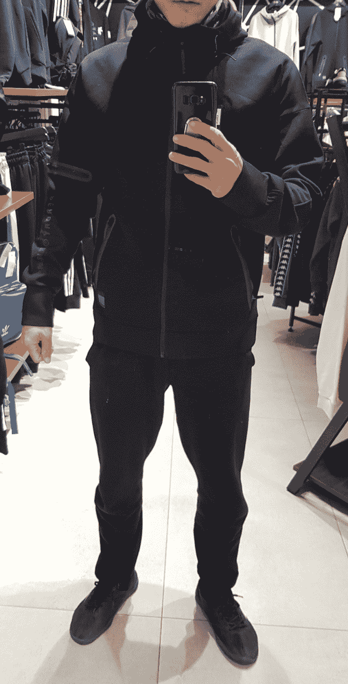

# 我第一次在塞尔维亚差点儿被抢了……

> 原文：[https://piaohanshenghuo.com/i-almost-got-robbed-in-serbia/](https://piaohanshenghuo.com/i-almost-got-robbed-in-serbia/)

一转眼我已经来塞尔维亚快一个月了，一直感觉非常安全，还有人说即使是一个美女半夜穿超短裙回家也不怕。不过今天第一次有了一个差点被抢的经历。

<audio class="wp-audio-shortcode" id="audio-2565-1" preload="none" style="width: 100%;" controls="controls"><source type="audio/mpeg" src="https://piaohanshenghuo.com/wp-content/uploads/2020/10/Mobb-Deep-Shook-Ones-Pt.-II-Official-Video-256-kbps.mp3?_=1">[https://piaohanshenghuo.com/wp-content/uploads/2020/10/Mobb-Deep-Shook-Ones-Pt.-II-Official-Video-256-kbps.mp3](https://piaohanshenghuo.com/wp-content/uploads/2020/10/Mobb-Deep-Shook-Ones-Pt.-II-Official-Video-256-kbps.mp3)</audio>

由于我已经在东南亚住了2年多了，没备什么长袖的衣服，塞尔维亚气温已经变低，于是今天我去Sara River这条河西边的贝尔格莱德（Belgrade）最大的商场Ušće去买件衣服。

我饿了，先在商场里吃了一个墨西哥餐，鸡肉的burrito(390 dinar)，额外加了guacamole(120 dinar)，一共510 dinar，合人民币35块（塞尔维亚物价不高）。

我看中了一件SuperDry的外套（标签一看，不出意料是”Made in China”）并买了下来，有点儿小贵（9000 dinar），但个人感觉非常好看，而且袖子上的“**冒險魂**”三个字很打动我。之后又顺便搭讪了一个美女，她要赶公车，我成功地要到了联系方式。

之后去楼下的IDEA超市买了点儿吃的，称葡萄的时候（塞尔维亚的超市的水果蔬菜都是自己称）遇到了点儿问题，正好路过俩美女，我又顺便搭讪了一下，不过失败了。

购物结束后我把超市的购物袋系在了背包上，开始骑车回家，家在Sara River的东边，得经过一座叫“Branko’s Bridge”的桥，这座桥的两边有窄窄的人行/自行车道，大概2米宽。桥上风比较大，所以我戴上了外套上配的帽子（听力受到了一点点影响）。

我慢悠悠地骑车经过了5个年轻小伙儿（大概顶多20岁出头，感觉不像是本地人），大概5秒之后我感觉到身后有微微的跑步声，好像还有背包的拉链滑动的声音，我还借助灯光微微地看到了一个模糊的影子好像在和我的影子一起移动。我赶紧停下并回头，果然，原来是这5个小B崽子当中的其中一个在我后面边跑边拉开我的背包。我瞪着他，他也瞪着我，还恶狠狠地说一些我听不懂的话，这时后边的其他4个小B崽子也赶上来了。我一点儿没怂，和他们对峙了两三秒的时候。好在他们直接走了，不然的话我肯定打不过5个人。

我赶紧检查了一下背包，最大的那一层的拉链已经被打开了整整一半，好在里边不但没有值钱的东西（只有一副手套，和一些刚在超市买的吃的），也没丢什么东西。我估计我再晚回头一两秒就得开始丢东西了。就在背包最大的那一层的隔壁有个小拉链，里边有好几千dinar（合人民币好几百块钱）还安安静静地躺在里边。真的好险！

事后我还在脑子里意淫了一下我直接被电影里的李小龙、成龙、Tony Jaa, Michael Jai White……附体，直接依次把这5个小B崽子挨个扔到桥下的河里的情景。

但实际上我直接默默地骑车回家了。

希望通过这个故事让大家**出门在外多加小心，即使一个地方以安全著称，也不能掉以轻心**。

另外，我有一个“好习惯”：我喜欢**穿有拉链的衣服和裤子**，我从来信不过开发式裤兜。今天如果不是我穿着有拉锁的裤子，我裤兜里的手机都很可能被偷了。

敬请期待下一篇文章，**熬夜码字不易，别忘了通过点赞、分享、打赏等方法鼓励我更快地发表下一篇文章**。

**另外，还可以点击公众号文章底部的广告来支持我（每个成功的点击量可以帮我赚几毛钱）**。

**谢谢！**

剽悍生活UL(微信公众号)分享关于**两性关系**、**自我提升**、**数字游民的生活方式**的原创内容，帮你过上更理想的生活（尤其是性生活）。

剽悍生活的个人微信号：ycf3721，[一对一视频教学](https://piaohanshenghuo.com/1on1_coaching/)，或拉你进入[剽悍生活泡妞讨论群](https://piaohanshenghuo.com/ul-wechat-group/)，请注明加我的目的。

* * *