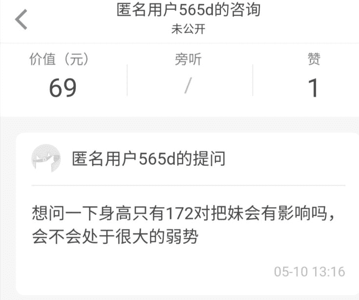

# 身高对把妹的影响

> 原文：[https://piaohanshenghuo.com/does-height-matter/](https://piaohanshenghuo.com/does-height-matter/)

一位知友在知乎上向我付费咨询“身高对把妹的影响”，现在公布一下我的回答，希望能帮助到很在意自己身高的人。

身高172会对把妹有影响，但是影响不是很大，<wbr>尤其是在中国男人的平均身高在175左右的情况下，<wbr>172只能说是在身高方面没有优势。

大部分女生都在乎身高，<wbr>身高是女生在外表这一方面里非常在乎的一项，这是事实。<wbr>但这不代表所有的女生都一样。

而且幸运的是女人没有男人那么“肤浅”，那么在乎你的外表。

**男人的内在比外表重要的多，你的言行举止才是最重要的。**

**而且如果你真的不在乎身高，姑娘往往也不会很在乎**。

有很多很有魅力的名人都不高，但都不缺女人。

比如和一群女人住在一起的Dan Bilzerian只有1米74，他睡了几千个女人。

公认很有魅力的男影星Tom Cruise和Al Pacino都只有1米7。

172的身高意味着你和另一个身高180的其他和你一模一样的人<wbr>相比泡妞成功率会低一点。他可能搭讪50次才会成功一次，<wbr>你可能搭讪100次才会成功一次，但你还是可以成功。

比如我专门泡洋妞，<wbr>我也清楚地知道大部分洋妞都不是很喜欢亚洲男人，<wbr>但我还是推倒了3位数的洋妞。

因为我**接受无法改变的因素，同时提高可以改变的因素**，<wbr>不自暴自弃，自怨自艾，不找借口。而是付出更大的努力，这样成功时反而更有成就感。

加油！

敬请期待下一篇文章，**熬夜码字不易，别忘了通过点赞、分享、打赏等方法鼓励我更快地发表下一篇文章**。

**另外，还可以点击公众号文章底部的广告来支持我（每个成功的点击量可以帮我赚几毛钱）**。

**谢谢！**

* * *

剽悍生活UL(微信公众号)分享关于**两性关系**、**自我提升**、**数字游民的生活方式**的原创内容，帮你过上更理想的生活（尤其是性生活）。

剽悍生活的个人微信号：ycf3721，[一对一视频教学](https://piaohanshenghuo.com/1on1_coaching/)，或拉你进入[剽悍生活泡妞讨论群](https://piaohanshenghuo.com/ul-wechat-group/)，请注明加我的目的。

