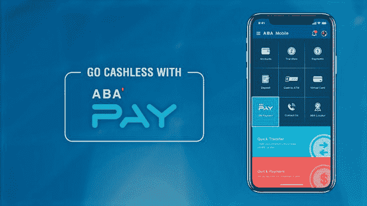

# 如何开通柬埔寨的美元银行账户

> 原文：[https://piaohanshenghuo.com/how-to-get-a-bank-account-in-cambodia/](https://piaohanshenghuo.com/how-to-get-a-bank-account-in-cambodia/)

在柬埔寨最适合外国人的银行就是ABA了，是一个和加拿大合资的很国际化的一个银行，银行的工作人员基本都说还不错的英语，ATM遍布柬埔寨，很方便。可以开通VISA, MASTER或银联3种银行卡，建议你开通国际通用的VISA或MASTER卡。

这个银行有一个很好用英文界面的APP，可以轻松转账，付款，把钱存入定期账户（目前一年的利息只有3.5%，我当初赶上活动，搞到了4.75%的利息）。

回到正题，看看开通银行账号需要**护照**和**能证明你居民身份的材料**。

这个能证明你居民身份的材料可以如下3个材料中的一种：

1.  [至少半年的多次往返签证](https://piaohanshenghuo.com/cambodia-eg-visa/)
2.  至少半年的租房合同
3.  和柬埔寨公司的劳务合同

问题是有的ABA的工作人员脑残，还以为这3个材料都需要，其实只需要[**一个至少****6****个月多次往返的****EG****签证就够了**](https://piaohanshenghuo.com/cambodia-eg-visa/)。

我去的第一个ABA银行分行就碰到了这样的脑残，干说不听，于是我去几百米外的另一个。这个工作人员刚开始也脑残，直到我指出他们白纸黑字写的合同，她才同意。然后她居然还问我具体的工作是什么之类的脑残问题，我开银行账户，往里面存钱，帮你们赚钱，你管我做什么工作的干什么！？

总之，你很可能会遇到脑残的工作人员，别直接放弃了，坚持自己的权利，实在不行再换个工作人员或者分行。

另外，国际汇款推荐你用[Transferwise（这有篇我写的具体的介绍）](https://piaohanshenghuo.com/best_way_to_transfer_money_internationally/)。

**熬夜码字不易，欢迎以打赏、分享、转发、点页面右下角的“在看”和“点赞”等方式以示支持。**

**另外，还可以点击公众号文章底部的广告来支持我（每个成功的点击量可以帮我赚几毛钱）**。

**谢谢！**

* * *

剽悍生活UL(微信公众号)分享关于**两性关系**、**自我提升**、**数字游民的生活方式**的原创内容，帮你过上更理想的生活（尤其是性生活）。

剽悍生活的个人微信号：ycf3721，[一对一视频教学](https://piaohanshenghuo.com/1on1_coaching/)，或拉你进入[剽悍生活泡妞讨论群](https://piaohanshenghuo.com/ul-wechat-group/)，请注明加我的目的。

